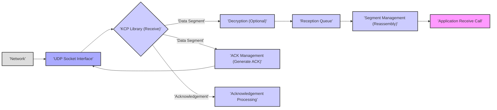

# Project Design Document: KCP - A Fast and Reliable ARQ Protocol

**Version:** 1.1
**Date:** October 26, 2023
**Author:** AI Software Architect

## 1. Introduction

This document provides an enhanced design overview of the KCP (Fast and Reliable ARQ Protocol) library, as found in the GitHub repository [https://github.com/skywind3000/kcp](https://github.com/skywind3000/kcp). This document aims to provide a more detailed and refined understanding of the library's architecture, components, and data flow, specifically tailored for subsequent threat modeling activities. The information herein will help identify potential vulnerabilities and attack vectors within the KCP library.

## 2. Goals and Scope

The primary goal of this document is to clearly and comprehensively articulate the design of the KCP library to facilitate effective threat modeling. The scope of this document includes:

*   A detailed overview of the KCP library's functionality and its position within a network stack.
*   In-depth identification of key components, their responsibilities, and potential security implications.
*   A precise description of the data flow within the library, highlighting critical stages.
*   An expanded initial identification of potential security considerations, providing concrete examples.

This document focuses specifically on the KCP library itself and does not cover the security of applications that integrate and utilize it. The security of the application layer is considered out of scope for this document.

## 3. High-Level Overview

KCP is a reliable User Datagram Protocol (UDP)-based communication protocol designed for scenarios demanding high-throughput and low-latency, even under challenging network conditions. It implements an Automatic Repeat-reQuest (ARQ) mechanism on top of UDP to provide reliable, in-order delivery of data, addressing the inherent unreliability of UDP. Key features include:

*   **Reliable, Ordered Delivery:** Guarantees that data packets arrive at the destination correctly and in the order they were sent.
*   **Adaptive Congestion Control:** Dynamically adjusts the sending rate based on observed network congestion to prevent network overload.
*   **Sophisticated Flow Control:** Manages the amount of data sent to prevent the receiver from being overwhelmed.
*   **Rapid Retransmission:** Employs mechanisms to quickly detect and retransmit lost packets, minimizing latency.
*   **Pluggable Encryption Support:** Offers an interface for integrating custom encryption algorithms to secure the data stream.

## 4. System Architecture

The KCP library operates as an intermediary layer between the application and the underlying UDP socket. It encapsulates the complexities of reliable data transmission over an unreliable transport.

```mermaid
graph LR
    A["'Application'"] --> B["'KCP Library'"];
    B --> C["'UDP Socket'"];
    C --> D["'Network'"];
    D --> E["'UDP Socket'"];
    E --> F["'KCP Library'"];
    F --> G["'Application'"];

    style A fill:#f9f,stroke:#333,stroke-width:2px
    style G fill:#f9f,stroke:#333,stroke-width:2px
    style B fill:#ccf,stroke:#333,stroke-width:2px
    style F fill:#ccf,stroke:#333,stroke-width:2px
    style C fill:#aaf,stroke:#333,stroke-width:2px
    style E fill:#aaf,stroke:#333,stroke-width:2px
    style D fill:#ddd,stroke:#333,stroke-width:2px
```

**Key Components and their Security Relevance:**

*   **Application Programming Interface (API):**
    *   Provides functions for applications to interact with KCP (e.g., `ikcp_create`, `ikcp_send`, `ikcp_recv`).
    *   *Security Relevance:* Improper use of the API by the application (e.g., incorrect buffer sizes, failure to handle errors) can introduce vulnerabilities.
*   **Segment Management:**
    *   Responsible for dividing application data into smaller segments for transmission and reassembling received segments.
    *   Adds KCP headers containing sequence numbers, acknowledgement numbers, and other control information.
    *   *Security Relevance:* Vulnerabilities in segmentation or reassembly logic could lead to buffer overflows or denial-of-service conditions if manipulated packets are processed.
*   **Transmission Queue (Send Buffer):**
    *   Stores segments that are ready to be sent but are awaiting their turn based on congestion and flow control.
    *   *Security Relevance:*  If the queue is not properly managed, it could be susceptible to resource exhaustion attacks.
*   **Reception Queue (Receive Buffer):**
    *   Temporarily holds received segments that may be out of order, awaiting reassembly.
    *   *Security Relevance:*  Improper handling of the reception queue could lead to buffer overflows if an attacker sends a large number of out-of-order packets.
*   **Acknowledgement (ACK) and Negative Acknowledgement (NAK) Management:**
    *   Generates and processes ACK packets to confirm successful segment delivery.
    *   May also handle NAKs to request retransmission of lost segments.
    *   *Security Relevance:*  ACK and NAK mechanisms are crucial for reliability but can be targets for spoofing attacks to disrupt communication or cause unnecessary retransmissions.
*   **Retransmission Timer:**
    *   Monitors the time elapsed since a segment was sent and triggers retransmission if an ACK is not received within a certain period.
    *   *Security Relevance:*  Manipulating timers or delaying ACKs could be used to trigger excessive retransmissions, leading to denial of service.
*   **Congestion Control Module:**
    *   Implements algorithms (e.g., AIMD - Additive Increase/Multiplicative Decrease) to adjust the sending rate based on network feedback (e.g., packet loss).
    *   *Security Relevance:*  Sophisticated attackers might try to exploit the congestion control algorithm to unfairly gain bandwidth or cause other connections to suffer.
*   **Flow Control Module:**
    *   Manages the receiver's available buffer space and informs the sender to prevent buffer overflows at the receiver.
    *   *Security Relevance:*  Bypassing or manipulating flow control mechanisms could lead to buffer overflows at the receiving end.
*   **Window Management (Send and Receive Windows):**
    *   Defines the number of segments that can be sent without waiting for acknowledgements (send window) and the number of segments the receiver is prepared to accept (receive window).
    *   *Security Relevance:*  Incorrect window sizes or manipulation of window information could lead to performance issues or denial of service.
*   **Encryption/Decryption Interface (Optional):**
    *   Provides a hook for integrating external encryption and decryption algorithms.
    *   *Security Relevance:* The security of the data depends entirely on the strength and correct implementation of the plugged-in encryption algorithm. If no encryption is used, data is transmitted in the clear.
*   **UDP Socket Interface:**
    *   Handles the interaction with the underlying UDP socket for sending and receiving raw UDP packets.
    *   *Security Relevance:*  While KCP abstracts away some UDP complexities, vulnerabilities in the underlying UDP implementation or network stack could still affect KCP's security.

## 5. Data Flow (Detailed)

The following details the data flow for sending and receiving data using the KCP library, highlighting potential security checkpoints.

**Sending Data Flow:**

1. **Application Initiates Send:** The application calls a KCP send function with the data to be sent.
2. **Segmentation:** The **Segment Management** component divides the application data into KCP segments. Each segment is assigned a unique sequence number.
    *   *Security Checkpoint:* Potential for buffer overflows if the data size exceeds segment limits or if header construction is flawed.
3. **Encryption (Optional):** If configured, the segment payload is encrypted using the plugged-in encryption algorithm.
    *   *Security Checkpoint:* Security depends on the strength of the encryption algorithm and its implementation.
4. **Transmission Queueing:** The segmented and potentially encrypted data is placed into the **Transmission Queue**.
5. **Congestion and Flow Control Check:** The **Congestion Control** and **Flow Control** modules determine if the network and receiver are ready to accept more data.
6. **Segment Transmission:** Segments are dequeued from the **Transmission Queue** and sent via the **UDP Socket Interface**.
    *   *Security Checkpoint:*  No inherent security mechanisms at this stage; relies on underlying network security or encryption.

```mermaid
graph LR
    A["'Application Send Call'"] --> B["'Segment Management (Segmentation)'"];
    B --> C["'Encryption (Optional)'"];
    C --> D["'Transmission Queue'"];
    D --> E["'Congestion & Flow Control Check'"];
    E --> F["'UDP Socket Interface'"];
    F --> G["'Network'"];

    style A fill:#f9f,stroke:#333,stroke-width:2px
    style B fill:#ccf,stroke:#333,stroke-width:2px
    style C fill:#ccf,stroke:#333,stroke-width:2px
    style D fill:#ccf,stroke:#333,stroke-width:2px
    style E fill:#ccf,stroke:#333,stroke-width:2px
    style F fill:#aaf,stroke:#333,stroke-width:2px
    style G fill:#ddd,stroke:#333,stroke-width:2px
```

**Receiving Data Flow:**

1. **UDP Packet Reception:** The **UDP Socket Interface** receives a UDP packet from the network.
2. **KCP Packet Identification:** The KCP library identifies if the packet is a KCP data segment or an acknowledgement.
3. **Decryption (Optional):** If encryption was used, the segment payload is decrypted.
    *   *Security Checkpoint:* Requires the correct decryption key; otherwise, data remains unreadable.
4. **Reception Queueing:** Data segments are placed in the **Reception Queue**. Out-of-order segments are held until preceding segments arrive.
    *   *Security Checkpoint:* Potential for buffer overflows if an attacker floods the receiver with out-of-order packets.
5. **Acknowledgement Generation:** The **Acknowledgement (ACK) Management** component generates an ACK packet for successfully received segments.
6. **Acknowledgement Transmission:** ACK packets are sent back to the sender via the **UDP Socket Interface**.
    *   *Security Checkpoint:* ACK packets themselves can be spoofed.
7. **Reassembly:** The **Segment Management** component reassembles the segments in the **Reception Queue** based on their sequence numbers.
8. **Data Delivery:** The reassembled data is delivered to the application through a KCP receive call.

## 6. Key Data Structures

*   **`ikcpcb` (KCP Control Block):**
    *   The primary data structure holding the state of a KCP connection instance.
    *   Contains connection identifiers (`conv`), Maximum Transmission Unit (`mtu`), update interval, window sizes, queue pointers, and congestion control parameters.
    *   *Security Relevance:* Corruption of this structure could lead to unpredictable behavior or denial of service.
*   **`Segment` (or `IKCPSEG`):**
    *   Represents a single KCP data packet.
    *   Includes fields for sequence number (`sn`), acknowledgement number (`ack`), timestamp (`ts`), window size advertisement (`wnd`), and the data payload.
    *   *Security Relevance:*  The integrity of these fields is crucial for reliable delivery. Manipulation could lead to various attacks.

## 7. Security Considerations (Expanded)

This section expands on potential security considerations, providing more specific examples of threats:

*   **Lack of Inherent Encryption (Data Confidentiality):**
    *   **Threat:** Without configured encryption, network eavesdroppers can intercept and read the transmitted data.
    *   **Example:** Sensitive game data or real-time communication content being exposed.
*   **Replay Attacks (Data Integrity and Availability):**
    *   **Threat:** Attackers capture and resend valid data segments to cause unintended actions or data duplication.
    *   **Example:** Replaying a "purchase item" command in a game or re-triggering a critical action in a control system. Mitigation strategies include using timestamps and sequence numbers, but their implementation needs careful scrutiny.
*   **Denial of Service (Availability):**
    *   **Flooding Attacks:**
        *   **Threat:** Overwhelming the receiver with a large volume of KCP packets, consuming resources and preventing legitimate traffic from being processed.
        *   **Example:** Sending a massive number of connection requests or data packets to exhaust server resources.
    *   **Spoofed Packet Attacks:**
        *   **Threat:** Sending packets with forged source IP addresses or connection identifiers to disrupt connections or exhaust resources.
        *   **Example:** Sending spoofed ACK packets to prematurely close connections or sending spoofed data packets to fill up the reception queue.
*   **Man-in-the-Middle (MitM) Attacks (Confidentiality and Integrity):**
    *   **Threat:** An attacker intercepts communication, potentially reading, modifying, or injecting data.
    *   **Example:** Modifying game state information or injecting malicious commands into a control system if encryption is not used or is weak.
*   **Integer Overflows and Buffer Overflows (Availability and potentially Code Execution):**
    *   **Threat:** Vulnerabilities in KCP's code, especially in handling packet sizes, sequence numbers, or buffer management, could lead to crashes or potentially arbitrary code execution.
    *   **Example:** Sending specially crafted packets with oversized payloads or manipulated header fields to trigger a buffer overflow.
*   **Congestion Control Exploitation (Availability and Fairness):**
    *   **Threat:** Attackers manipulate congestion control mechanisms to unfairly gain bandwidth or disrupt the communication of others.
    *   **Example:** Sending fake congestion signals to reduce the sending rate of other connections while maintaining a high rate for the attacker's connection.
*   **Acknowledgement Storms (Availability):**
    *   **Threat:** In scenarios with high packet loss, multiple receivers might simultaneously send retransmission requests, leading to an "ACK storm" that overwhelms the sender.
    *   **Example:** In a multicast scenario using KCP, significant packet loss could trigger a large number of NAKs.

## 8. Assumptions and Constraints

*   The underlying UDP layer provides basic, albeit unreliable and unordered, packet delivery.
*   KCP is implemented as a library intended to be integrated into applications. The security of the overall system depends on how the application utilizes KCP.
*   Performance characteristics of KCP are influenced by network conditions and configuration parameters.
*   Security, particularly data confidentiality, is largely dependent on the application's implementation of encryption using KCP's pluggable interface.

## 9. Future Considerations for Threat Modeling

*   Detailed analysis of the implementation of the pluggable encryption interface and its potential vulnerabilities.
*   In-depth examination of the specific congestion control algorithms used and their susceptibility to manipulation.
*   Comprehensive code review focusing on identifying potential buffer overflows, integer overflows, and other memory safety issues.
*   Analysis of the sequence number and acknowledgement mechanisms to identify potential weaknesses exploitable for replay or spoofing attacks.
*   Evaluation of the library's resilience against various denial-of-service attacks.

This enhanced design document provides a more detailed and security-focused understanding of the KCP library's architecture and data flow. This information will be instrumental in conducting a thorough threat model to identify potential security vulnerabilities and recommend appropriate mitigation strategies.