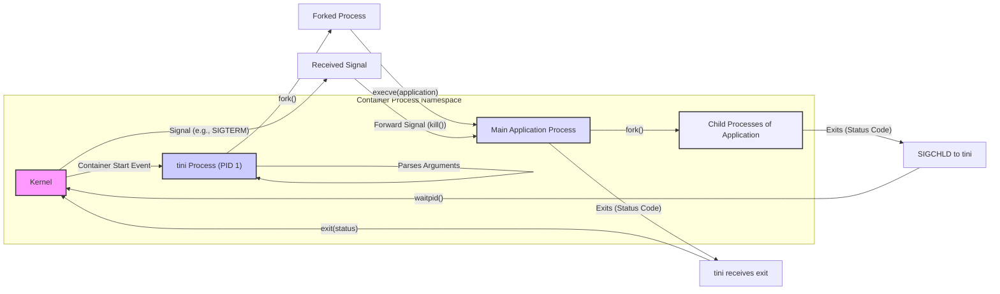

# Project Design Document: tini - A Tiny but Valid `init` for Containers

**Version:** 1.1
**Date:** October 26, 2023
**Author:** Gemini (AI Language Model)
**Project Link:** [https://github.com/krallin/tini](https://github.com/krallin/tini)

## 1. Introduction

This document provides an enhanced design overview of the `tini` project, building upon the previous version. `tini` serves as a fundamental, minimal `init` process specifically designed for containerized environments. Its core responsibility is to address the "PID 1 zombie reaping problem" inherent in containerization when applications spawn child processes. This revised document aims to offer a more granular understanding of `tini`'s architecture, component interactions, and data flow, specifically tailored to facilitate thorough threat modeling.

## 2. Goals and Objectives

The fundamental goals of `tini` remain:

*   **Strict Correctness:** Function as a precise and valid `init` process, ensuring accurate signal handling and consistent reaping of zombie processes.
*   **Extreme Simplicity:** Maintain a lean codebase with a sharply defined scope of responsibilities, minimizing complexity.
*   **High Reliability:** Exhibit robust and dependable behavior within the constraints of containerized deployments.
*   **Seamless Compatibility:** Integrate without issue with standard container runtimes and common application deployment patterns.

## 3. System Overview

`tini` is implemented as a single, statically linked executable intended to be the primordial process (PID 1) within a container's process namespace. When a process terminates within a container, it transitions into a zombie state, awaiting its parent process to acknowledge its exit (reaping). Without a proper `init` system like `tini`, these zombie processes can accumulate, consuming system resources unnecessarily. `tini` resolves this by assuming the role of the parent for all other container processes, actively reaping terminated children. Furthermore, it intelligently forwards specific signals directed at the container to the designated main application process.

## 4. Architectural Design

### 4.1. Components

`tini`'s architecture is deliberately minimalistic, comprising the following key logical components:

*   **Core Process Management (PID 1):** This is the central component of `tini`, responsible for:
    *   **Signal Handling Registration:** Establishing signal handlers for critical signals such as `SIGCHLD` (child process termination), `SIGTERM` (termination request), and `SIGINT` (interrupt signal).
    *   **Application Process Lifecycle Management:**  Initiating the main application process specified via command-line arguments using `fork()` and `exec()`.
    *   **Orphaned Process Adoption (Implicit):** By being PID 1, `tini` implicitly becomes the parent of any orphaned processes within the container.
    *   **Zombie Process Reclamation:**  Monitoring for the termination of child processes and utilizing the `wait()` family of system calls (e.g., `waitpid()`) to reclaim their resources.
    *   **Selective Signal Proxying:**  Forwarding designated signals received by `tini` to the primary application process, enabling controlled shutdown and interruption.
    *   **Exit Code Propagation:**  Upon the termination of the main application process, `tini` exits with the same exit code, communicating the application's termination status to the container runtime.
*   **Configuration Interface (Command-line Arguments):**  `tini`'s operational parameters are primarily set through command-line arguments. The most crucial argument specifies the path to the executable intended to be the main application process within the container. The range of configurable options is intentionally limited to maintain simplicity.

### 4.2. Interactions and Data Flow



**Detailed Data Flow Description:**

1. The container runtime initiates the container, starting `tini` as the initial process with PID 1 within the container's process namespace.
2. `tini` parses the command-line arguments provided during container startup to identify the path to the main application executable.
3. `tini` utilizes the `fork()` system call to create a child process.
4. Within the forked child process, `tini` uses the `execve()` system call to replace the child process's image with the main application executable specified in the arguments.
5. The main application process may subsequently fork and create its own child processes to perform its intended functions.
6. When a child process of the main application terminates, it transitions into a zombie state. The kernel signals `tini` (its parent) by sending a `SIGCHLD` signal. The exit status of the child process is associated with this signal.
7. `tini`'s registered signal handler for `SIGCHLD` is invoked. This handler calls the `waitpid()` system call (or a related `wait()` variant) to reap the zombie process. Reaping involves retrieving the child's exit status and releasing the system resources held by the zombie process.
8. If the kernel sends a signal intended for the container's main process (e.g., `SIGTERM` for graceful termination, `SIGINT` for interruption), this signal is delivered to `tini` (PID 1).
9. `tini`'s signal handler for these forwarded signals (e.g., `SIGTERM`, `SIGINT`) then uses the `kill()` system call to relay the signal to the main application process. This ensures that signals intended for the application are properly delivered, enabling actions like graceful shutdown.
10. When the main application process completes its execution and exits, the kernel notifies `tini`.
11. `tini` receives the exit status of the main application process.
12. Finally, `tini` itself terminates using the `exit()` system call, propagating the exit status received from the main application process. This exit status is then reported by the container runtime, indicating the outcome of the application's execution.

### 4.3. Core System Call Usage

`tini`'s functionality is tightly coupled with the following key system calls:

*   `fork()`: Used to create a new process that will then execute the main application.
*   `execve()`: Used to replace the current process image with that of the specified main application executable.
*   `signal()` or `sigaction()`: Used to register signal handlers for asynchronous event notification, particularly for `SIGCHLD` and signals intended for forwarding.
*   `wait()` or `waitpid()`: Crucial for reaping zombie processes, preventing resource leaks and ensuring proper process accounting.
*   `kill()`: Used to send signals to other processes, specifically to forward signals to the main application process.
*   `_exit()`: The system call used by `tini` to terminate its own execution.

## 5. Security Considerations for Threat Modeling

Understanding the potential security vulnerabilities associated with `tini` is crucial for effective threat modeling:

*   **Signal Handling Vulnerabilities:**
    *   **Improper Signal Masking:** If `tini` incorrectly masks or blocks signals, it might fail to receive critical signals like `SIGCHLD`, leading to un-reaped zombie processes.
    *   **Signal Injection/Spoofing (Less Likely for Tini):** While `tini` itself doesn't directly handle external signal sources beyond the kernel, understanding how signals are routed within the container namespace is important. A compromised process *within* the container could potentially send signals to `tini`.
    *   **Race Conditions in Signal Handlers:** Although `tini`'s signal handling is simple, potential race conditions within the handlers could lead to unexpected behavior if multiple signals arrive concurrently.
*   **PID Namespace Interactions and Escapes:**
    *   **Namespace Confusion:** While `tini` itself doesn't facilitate namespace escape, understanding its role *within* the PID namespace is critical. Vulnerabilities elsewhere in the container or kernel could potentially allow an attacker to manipulate processes within or escape the namespace.
    *   **PID Reuse Vulnerabilities (Mitigated by Reaping):**  `tini`'s primary function mitigates issues related to PID reuse by ensuring zombies are reaped promptly. Failure to do so could, in theory, lead to unexpected process interactions if PIDs are rapidly recycled.
*   **Resource Exhaustion:**
    *   **Failure to Reaps Zombies (Tini's Core Responsibility):** A primary threat is `tini` failing to reap zombie processes due to bugs or resource limitations, leading to resource exhaustion (PID exhaustion).
    *   **Signal Flooding:** While less likely to directly impact `tini` itself severely due to its simplicity, a flood of signals could potentially consume resources.
*   **Input Validation on Command-line Arguments:**
    *   **Command Injection:** Although `tini`'s argument parsing is simple, vulnerabilities in how it handles the path to the application executable *could* theoretically be exploited for command injection, though this is highly improbable given its design.
*   **Denial of Service:**
    *   **Signal Bomb:**  A malicious actor (or a buggy process) sending a large number of signals to `tini` could potentially overwhelm it, although its simple design makes it relatively resilient to this.
    *   **Memory Exhaustion (Less Likely):** Given `tini`'s minimal memory footprint, direct memory exhaustion attacks on `tini` itself are unlikely.
*   **Information Disclosure (Indirect):**
    *   **Failure to Terminate Gracefully:** If `tini` fails to forward signals correctly, the main application might not shut down gracefully, potentially leaving sensitive data in memory or logs.
    *   **Core Dumps (Configuration Dependent):** While not directly a vulnerability in `tini`, understanding how `tini` behaves in relation to core dumps of child processes is relevant.

## 6. Deployment Considerations

`tini` is typically deployed as the designated `init` process within a container. This is commonly achieved by specifying `tini` as the `ENTRYPOINT` or part of the `CMD` instruction in a Dockerfile or similar container image definition. Container runtimes like Docker, containerd, and CRI-O will then execute `tini` as the initial process (PID 1) when a container is started.

Example Dockerfile snippet illustrating `tini` deployment:

```dockerfile
FROM alpine:latest
COPY tini /sbin/tini
ENTRYPOINT ["/sbin/tini", "--", "/app/my_application"]
```

In this configuration, when the container starts, the container runtime will execute `/sbin/tini`. `tini` will then parse the remaining arguments, identifying `/app/my_application` as the main application executable to launch. The `--` separator convention is used to distinguish `tini`'s own arguments from the arguments intended for the application it will execute.

## 7. Dependencies

`tini` is designed to have minimal external dependencies. It is typically compiled as a statically linked executable. This means that all necessary libraries are included within the `tini` executable itself, reducing reliance on shared libraries present on the host system or within the container image. The primary dependency is the underlying Linux kernel and its system call interface. `tini` relies on the kernel to provide the fundamental process management and signal handling mechanisms it utilizes.

## 8. Future Considerations (Beyond Current Threat Model Scope)

While not directly relevant for the immediate threat modeling exercise, potential future enhancements to `tini` could include:

*   **Enhanced Signal Management:** Implementing more granular control over signal forwarding and handling, potentially based on configuration.
*   **Extended Configuration Options:** Introducing a limited set of configuration options to address specific edge cases or user requirements.
*   **Integration with cgroups (Control Groups):** Exploring potential interactions with cgroups for resource management or process isolation, though this would add significant complexity.
*   **Support for Different `exec` Variants:**  Potentially offering options for using different `exec` family system calls.

## 9. Conclusion

`tini` remains a vital and elegantly simple solution for addressing the complexities of process management within containerized environments. Its focused design and small codebase contribute significantly to its inherent reliability and security posture. This enhanced design document provides a more detailed examination of `tini`'s architecture, interactions, and the critical system calls it employs. This deeper understanding is essential for conducting thorough threat modeling, allowing for the identification and mitigation of potential security vulnerabilities associated with its operation within containerized systems. While `tini`'s simplicity is a key security advantage, a careful analysis of its role in signal handling, process lifecycle management, and interactions within the container's process namespace is paramount for maintaining a secure container environment.
