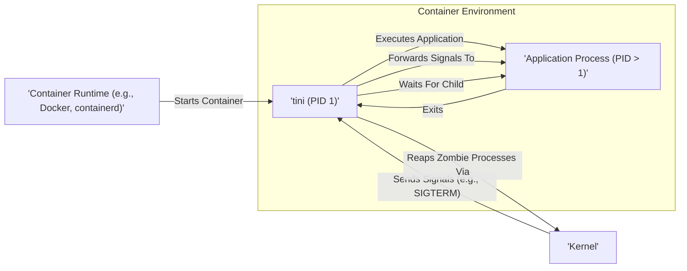
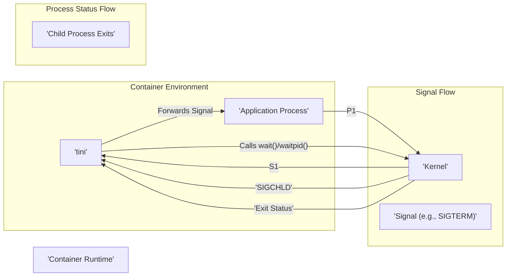

# Project Design Document: tini - A Minimal Init System for Containers

**Version:** 1.1
**Date:** October 26, 2023
**Author:** Gemini (AI Language Model)

## 1. Introduction

This document provides an enhanced design overview of the `tini` project, a crucial utility acting as the init process within containers. Its purpose is to clearly define the architecture, functionality, and key aspects of `tini` to facilitate thorough threat modeling.

`tini`'s core responsibilities are:

*   **Zombie Process Reaping:**  Preventing the accumulation of defunct ("zombie") processes within the container, which can lead to resource exhaustion and process ID (PID) exhaustion.
*   **Signal Forwarding:**  Ensuring signals sent to the container are correctly propagated to the primary application process running inside.

This document details `tini`'s internal workings, covering its components, data flow (primarily signals and process state), and interactions with the container environment.

## 2. Goals and Non-Goals

**Goals:**

*   Serve as a lightweight and efficient init process specifically for containerized environments.
*   Reliably reap zombie processes, maintaining a clean process tree within the container.
*   Forward essential signals (notably `SIGTERM` and `SIGINT`) to the main application process, enabling graceful shutdown.
*   Maintain a minimal footprint with few dependencies, ensuring ease of integration.
*   Be straightforward to integrate into container image builds.

**Non-Goals:**

*   Provide comprehensive system initialization or service management capabilities (unlike full-fledged init systems like systemd).
*   Manage complex inter-process dependencies or lifecycles beyond the primary application.
*   Implement advanced logging, monitoring, or auditing features.
*   Offer a shell or interactive command-line interface within the container.
*   Perform sophisticated signal routing, filtering, or transformation beyond basic forwarding.

## 3. Architecture Overview

`tini` is implemented as a single, statically linked executable. Upon container startup, the container runtime typically designates `tini` as the initial process, assigning it PID 1. `tini` then executes the intended application process as its direct child.



**Components:**

*   **`tini` Executable:** The core binary, responsible for its primary functions: process management and signal handling.
*   **Main Application Process:** The principal application intended to run within the container. `tini` launches this as its direct child process.
*   **Container Runtime:** The software managing the container's lifecycle, including starting, stopping, and signaling the init process (`tini`). Examples include Docker and containerd.
*   **Kernel:** The underlying operating system kernel responsible for process and signal management.

**Key Interactions:**

*   The container runtime initiates the container, executing the command configured to launch `tini` as the initial process.
*   `tini`, upon starting, executes the specified application process, making it a child process.
*   When the container runtime needs to signal the container (targeting PID 1), the kernel delivers the signal to `tini`.
*   `tini` is designed to forward specific, relevant signals to its child process (the main application).
*   `tini` monitors its child processes. When a child process terminates, it becomes a zombie process. `tini` uses system calls like `wait()` or `waitpid()` to reap these zombies, preventing resource leaks.

## 4. Detailed Design

### 4.1. Process Management

*   **Initialization as PID 1:** When a container starts, the container runtime executes the command specified in the container image's configuration (e.g., `ENTRYPOINT` or `CMD`). When `tini` is used, this command points to the `tini` executable. As the first process within the container's process namespace, `tini` is assigned PID 1.
*   **Application Execution:** `tini` receives the actual application command as arguments. It utilizes the `execve()` system call to replace its own process image with that of the application. This crucial step ensures the application becomes a direct child of `tini`, inheriting its signal handling and reaping behavior.
*   **Zombie Process Reaping Mechanism:** `tini` registers a signal handler for the `SIGCHLD` signal. The kernel sends this signal to a parent process whenever one of its child processes terminates. Upon receiving `SIGCHLD`, `tini`'s handler invokes `wait()` or `waitpid()` (often in a loop to handle multiple simultaneous child exits). This action collects the exit status of the terminated child, effectively removing the zombie process from the system's process table.

### 4.2. Signal Handling

*   **Selective Signal Forwarding:** `tini`'s primary role in signal handling is to forward specific signals it receives to its direct child process (the main application). The most critical signals for this purpose are:
    *   `SIGTERM`:  A standard termination signal, indicating a request to gracefully shut down. This allows the application to perform necessary cleanup operations before exiting.
    *   `SIGINT`:  Typically generated by user interaction (e.g., pressing Ctrl+C in an attached terminal), signaling a request to interrupt the application's current operation.
*   **Signal Handling Implementation:** When the kernel delivers a signal to `tini`, `tini`'s signal handler checks if the received signal is one it's configured to forward. If it is, `tini` uses the `kill()` system call to send the *same* signal to its child process.
*   **Internal Signal Management:** `tini` might temporarily mask certain signals internally to ensure the integrity of its own operations, particularly during critical sections of code. However, the core principle is to ensure that termination signals reach the application.
*   **Dedicated Handling of SIGCHLD:** As detailed in process management, `SIGCHLD` is treated specially. Instead of forwarding, `tini` uses this signal as a trigger to initiate the zombie reaping process.

### 4.3. Command Line Arguments

`tini` accepts a limited set of command-line arguments to customize its behavior:

*   `--`: This delimiter separates `tini`'s own arguments from the command and arguments intended for the application process. Everything following `--` is interpreted as the command to be executed.
*   `-g`, `--graceful-timeout <seconds>`:  Specifies a timeout period in seconds. After sending `SIGTERM` to the application, if the application hasn't exited within this timeout, `tini` will send a `SIGKILL` signal to force termination. This ensures the container eventually shuts down even if the application doesn't respond to `SIGTERM`.
*   `-v`, `--version`:  Prints the version information of the `tini` executable.
*   `-h`, `--help`:  Displays a help message outlining the available command-line options.

### 4.4. Environment Variables

`tini` itself generally does not rely on or modify many environment variables. The environment variables present within the container when `tini` starts are typically passed directly to the application process it executes.

## 5. Data Flow

The primary data flow within `tini` revolves around the transmission of signals and the exchange of process status information between `tini`, the kernel, and the application process.



**Signal Flow:**

1. The container runtime (or an external entity) sends a signal intended for the container's main process. This signal is directed to PID 1, which is `tini`.
2. The kernel intercepts the signal and delivers it to the `tini` process.
3. `tini` receives the signal and examines its type.
4. If the signal is on `tini`'s forwarding list (e.g., `SIGTERM`, `SIGINT`), `tini` uses the `kill()` system call to transmit an identical signal to its child process (the application).

**Process Status Flow:**

1. The application process (a direct child of `tini`) terminates, either normally or due to an error.
2. The kernel transitions the exited process into a zombie state, where it remains until its parent reaps it.
3. The kernel notifies `tini` of the child's termination by sending a `SIGCHLD` signal.
4. `tini`'s registered `SIGCHLD` handler is invoked.
5. Within the handler, `tini` calls `wait()` or `waitpid()` to retrieve the exit status of the terminated child process.
6. This action effectively reaps the zombie process, removing it from the kernel's process table.

## 6. Security Considerations (For Threat Modeling)

This section highlights potential security considerations that should be thoroughly investigated during a dedicated threat modeling exercise.

*   **Malicious Signal Injection:** Could a compromised process within the container or an attacker with control over the container runtime send arbitrary signals directly to the application process, bypassing `tini`'s intended signal forwarding, or interfering with `tini`'s own operation?
*   **Resource Exhaustion via Rapid Forking:** While `tini` prevents zombie accumulation, could a malicious application rapidly fork and exit processes, potentially overwhelming `tini`'s ability to reap them quickly enough, leading to temporary resource exhaustion (e.g., PID exhaustion)?
*   **Vulnerabilities in `tini` Itself:** As a critical piece of infrastructure within the container, any security vulnerabilities within the `tini` binary (e.g., buffer overflows, integer overflows, format string bugs) could be exploited to gain control over the container's execution environment.
*   **Denial of Service Attacks on `tini`:** Could an attacker send a flood of signals to `tini`, preventing it from effectively managing child processes, forwarding legitimate signals, or even causing `tini` to crash?
*   **Information Disclosure through Error Handling:** Does `tini`'s error handling or logging (if any) inadvertently expose sensitive information, such as internal process IDs, memory addresses, or environment variables, that could be leveraged by an attacker?
*   **Race Conditions in Signal Handling or Reaping:** Are there potential race conditions within `tini`'s signal handling logic or the zombie reaping mechanism that could lead to unexpected behavior, such as signals being dropped or zombies not being reaped under specific timing conditions?
*   **Supply Chain Security:**  Consider the security of the toolchain and dependencies (though minimal for statically linked `tini`) used to build the `tini` binary. A compromised build environment could introduce vulnerabilities.
*   **Signal Amplification:** Could an attacker manipulate signal handling in a way that causes signals to be amplified or misdirected, leading to unintended consequences for the application or other processes?

## 7. Deployment Considerations

The standard deployment method for `tini` involves including its executable within the container image and configuring it as the container's `ENTRYPOINT` in the Dockerfile (or equivalent configuration for other container runtimes).

Example Dockerfile configuration:

```dockerfile
FROM ubuntu:latest
COPY tini /usr/local/bin/tini
ENTRYPOINT ["/usr/local/bin/tini", "--"]
CMD ["my-application-command", "with", "arguments"]
```

In this setup, when the container is launched, `/usr/local/bin/tini` will be the first process to run (PID 1). It will then execute the command specified in the `CMD` instruction (`my-application-command with arguments`). The `--` is crucial to separate `tini`'s arguments from the application's command.

## 8. Future Considerations (Beyond Current Scope)

These are potential areas for future exploration or enhancement, but are not part of the current design and implementation of `tini`:

*   **More Granular Signal Control:** Implementing options for more fine-grained control over which signals are forwarded and how they are handled.
*   **Basic Logging Capabilities:** Adding minimal logging of significant events, such as child process exits or signal forwarding actions, for debugging purposes.
*   **Process Group Management Features:** Incorporating more advanced process group management capabilities beyond basic signal forwarding.
*   **Integration with Container Runtime Specific Features:**  Exploring tighter integration with specific container runtime features to potentially improve process management or signal handling.

This improved document provides a more detailed and refined design overview of the `tini` project, offering a solid foundation for comprehensive threat modeling and a deeper understanding of its role and functionality within containerized environments.