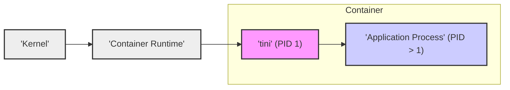
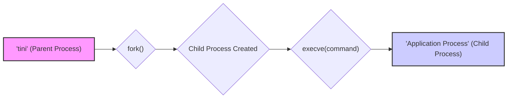
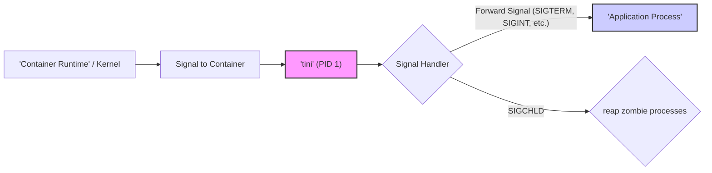
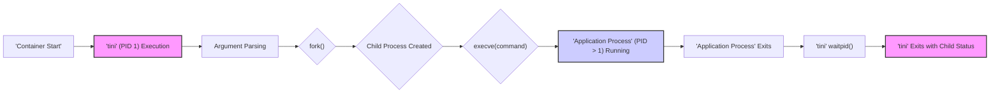
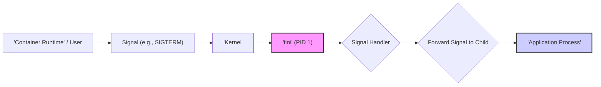
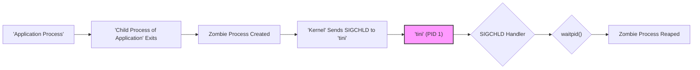
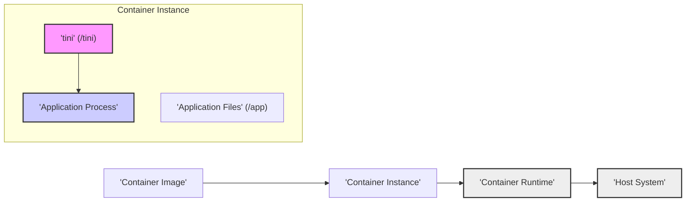

# Project Design Document: Tini - A Minimal Init System for Containers

**Version:** 1.1
**Date:** October 27, 2023
**Author:** AI Cloud & Security Expert

## 1. Introduction

### 1.1 Project Overview

This document details the design of `tini`, a lightweight and robust `init` process specifically engineered for containerized environments.  `tini` addresses critical operational needs within containers, primarily:

*   **Orphaned Process Management (Zombie Reaping):**  Containers, by design, can lead to orphaned processes (zombies) if the main application doesn't properly reap its children.  `tini` as PID 1 takes on the responsibility of reaping these zombie processes, preventing resource exhaustion and maintaining system stability within the container.
*   **Signal Propagation to Application:**  Containers receive signals from the container runtime (e.g., `docker stop`). These signals must be correctly forwarded to the primary application process running inside the container to ensure graceful shutdown or other signal-driven behaviors. `tini` ensures reliable signal forwarding to the intended application.

`tini` is intentionally designed to be minimal, focusing solely on these essential init functionalities. This design philosophy minimizes its footprint, reduces complexity, and consequently shrinks the potential attack surface within container deployments.

### 1.2 Document Scope

This document provides a comprehensive design specification for `tini`, encompassing its architectural components, operational workflows, data flow, deployment considerations, and security implications. It is specifically crafted to serve as a foundational document for conducting thorough threat modeling and security assessments of systems that incorporate `tini`. The focus is on both the logical and physical architecture of `tini` and its interactions within the broader container ecosystem.

### 1.3 Target Audience

This document is intended for consumption by:

*   **Security Architects and Engineers:**  To facilitate threat modeling, vulnerability analysis, and security audits of containerized systems using `tini`.
*   **Software Developers:**  To understand the role of `tini` in containerized applications and how to integrate it effectively.
*   **DevOps and Operations Teams:**  To gain insights into the operational behavior of containers using `tini` and for troubleshooting and management purposes.

## 2. System Overview

### 2.1 High-Level Architecture

`tini` functions as the designated `init` process (Process ID 1 - PID 1) within a container. Its core function is to supervise a single primary child process, which is typically the main application running inside the container. `tini` intercepts signals directed at the container, selectively forwards relevant signals to its child process, and diligently reaps any zombie processes originating from the child process or its descendants.

The following diagram illustrates `tini`'s position and interactions within a containerized environment:



**Diagram Components:**

*   **'tini' (PID 1):** The `tini` executable, running as the initial process within the container's process namespace.
*   **'Application Process' (PID > 1):** The primary application process managed by `tini`. This is the intended workload of the container.
*   **'Container Runtime':**  Software responsible for container lifecycle management, such as Docker, containerd, or CRI-O. It interacts with the kernel to create and manage containers.
*   **'Kernel':** The host operating system kernel, providing core system services and resource management for containers and the container runtime.

### 2.2 Key Responsibilities

`tini` is designed to fulfill the following essential responsibilities within a container:

1.  **Initialization as PID 1:**  `tini` is invoked as the container's entrypoint and becomes the process with PID 1, establishing itself as the `init` process.
2.  **Child Process Launch:** `tini` executes the specified command (the application process) as its direct child process.
3.  **Signal Management:**
    *   **Signal Interception:**  `tini` intercepts all signals directed at the container.
    *   **Selective Signal Forwarding:**  Forwards a predefined set of signals (detailed in Section 3.3) to the child process, enabling controlled shutdown and other signal-driven behaviors.
    *   **`SIGCHLD` Handling:**  Specifically handles `SIGCHLD` signals, which are generated when child processes terminate, to initiate zombie reaping.
4.  **Zombie Process Reaping:**  Proactively monitors for and reaps zombie processes, preventing resource leaks and ensuring process table hygiene.
5.  **Exit Status Propagation:**  Upon termination of the child process, `tini` propagates the child's exit status as its own, accurately reflecting the application's outcome as the container's exit status.

## 3. Component Description

`tini`'s architecture is deliberately simple, comprising a small set of focused components.

### 3.1 Argument Parsing

*   **Functionality:**  `tini` parses command-line arguments provided at container startup to determine the command to execute as the child application. It supports two operational modes:
    *   **Default Executable Mode:**  `tini` executes the provided command and its arguments directly. This is the standard and most common usage pattern.
    *   **Signal Processing Only Mode (`-s` flag):**  When invoked with the `-s` flag, `tini` operates solely as a signal handler and zombie reaper, without launching a child process. This mode is less frequently used and is intended for specialized scenarios where an external process manager might handle the main application lifecycle, but zombie reaping and signal handling within the container are still required.
*   **Input:** Command-line arguments passed to the `tini` executable when the container is initiated.
*   **Output:**  Determines the command and arguments for child process execution or sets the operational mode to signal processing only.

### 3.2 Process Forking and Execution

*   **Functionality:**  `tini` utilizes the `fork()` system call to create a new child process. Within the child process context, `tini` employs `execve()` to replace the child process's memory space with the executable image of the specified application command.
*   **Input:**  The command and arguments parsed from the command line during startup.
*   **Output:**  Creation of a child process that executes the designated application.



### 3.3 Signal Handling

*   **Functionality:** `tini` establishes signal handlers for a specific set of signals. When `tini` (PID 1) receives a signal, the corresponding signal handler is invoked.
    *   **Signal Forwarding:** For signals intended for the application (e.g., `SIGTERM`, `SIGINT`, `SIGQUIT`, `SIGUSR1`, `SIGUSR2`, `SIGPIPE`, `SIGALRM`, `SIGHUP`), the handler forwards the signal to the child process using the `kill()` system call.
    *   **Zombie Reaping (`SIGCHLD`):** The `SIGCHLD` signal handler is crucial for zombie process management. It iteratively calls `waitpid()` to collect status information from any terminated child processes, effectively reaping them.
*   **Handled Signals and Behavior:**
    *   `SIGTERM`, `SIGINT`, `SIGQUIT`, `SIGUSR1`, `SIGUSR2`, `SIGPIPE`, `SIGALRM`, `SIGHUP`: Forwarded to the child process. These are typically signals that the application should handle for graceful shutdown, reconfiguration, or other application-specific actions.
    *   `SIGCHLD`: Used for zombie reaping. `tini` does not forward `SIGCHLD` to the child process, as it is used internally for process management.
    *   Other signals:  Generally ignored or handled with default behavior, as `tini`'s core responsibility is focused on the signals listed above.
*   **Input:** Signals received by the `tini` process from the kernel or the container runtime environment.
*   **Output:** Signals forwarded to the child process, and zombie processes are reaped and removed from the process table.



### 3.4 Exit Status Propagation

*   **Functionality:**  `tini` monitors the child process for termination using the `waitpid()` system call. Upon the child process exiting, `tini` retrieves its exit status code.  `tini` then terminates itself, using the child process's exit status as its own exit code. This ensures that the container's exit status accurately reflects the outcome of the main application process.
*   **Input:** Exit status of the child process, obtained via `waitpid()`.
*   **Output:** `tini` process terminates, returning the child process's exit status code.

## 4. Data Flow

### 4.1 Process Lifecycle Data Flow



**Data Flow Description:**

1.  **'Container Start':** The container runtime initiates the container startup sequence.
2.  **'tini' (PID 1) Execution:** `tini` is launched as the container's entrypoint and becomes the process with PID 1.
3.  **Argument Parsing:** `tini` parses the command-line arguments provided during container startup.
4.  **fork():** `tini` creates a child process using the `fork()` system call.
5.  **'Child Process Created':** A new process is created as a child of `tini`.
6.  **execve(command):** The child process replaces its execution context with the application process specified in the container image or command.
7.  **'Application Process' (PID > 1) Running:** The main application process is now actively running, supervised by `tini`.
8.  **'Application Process' Exits:** The application process terminates, either normally upon completion or due to an error condition.
9.  **'tini' waitpid():** `tini` detects the child process's termination through the `waitpid()` system call.
10. **'tini' Exits with Child Status:** `tini` terminates, propagating the exit status of the child process as its own, thus setting the container's overall exit status.

### 4.2 Signal Data Flow



**Signal Flow Description:**

1.  **'Container Runtime' / User:** A signal is initiated, either by the container runtime (e.g., during a `docker stop` command) or by a user interacting with the container (e.g., using `docker kill`).
2.  **'Signal (e.g., SIGTERM)':** A signal, such as `SIGTERM` for graceful termination, is directed towards the container.
3.  **'Kernel':** The kernel routes the signal to the container's PID namespace, specifically targeting PID 1 (`tini`).
4.  **'tini' (PID 1):**  `tini`, as PID 1, receives the signal.
5.  **'Signal Handler':** `tini`'s signal handler, registered for the received signal type, is invoked.
6.  **'Forward Signal to Child':** The signal handler determines if the signal should be forwarded to the child application process and, if so, uses `kill()` to send the signal to the child.
7.  **'Application Process':** The application process receives the forwarded signal and can execute appropriate signal handling logic (e.g., initiate a graceful shutdown sequence).

### 4.3 Zombie Reaping Data Flow



**Zombie Reaping Flow Description:**

1.  **'Application Process'**: The main application process is running and may spawn child processes.
2.  **'Child Process of Application' Exits**: A child process spawned by the application process terminates.
3.  **'Zombie Process Created'**: Upon termination, the child process becomes a zombie process, awaiting reaping by its parent.
4.  **'Kernel' Sends SIGCHLD to 'tini'**: The kernel sends a `SIGCHLD` signal to `tini` (PID 1), the parent process of the application (and indirectly the grandparent of the exited child).
5.  **'tini' (PID 1)**: `tini` receives the `SIGCHLD` signal.
6.  **'SIGCHLD Handler'**: `tini`'s `SIGCHLD` signal handler is invoked.
7.  **'waitpid()'**: The `SIGCHLD` handler calls `waitpid()` to check for and collect status information from any terminated child processes (zombies).
8.  **'Zombie Process Reaped'**: `waitpid()` successfully reaps the zombie process, removing it from the process table and freeing up system resources.

## 5. Deployment Architecture

`tini` is designed for seamless integration into container images. It is included within the container image and designated as the `ENTRYPOINT` in the Dockerfile (or equivalent container image configuration).

```dockerfile
FROM ubuntu:latest

# Install application dependencies
# ...

# Copy application files into the image
COPY app /app

# Install tini
ADD https://github.com/krallin/tini/releases/download/v0.19.0/tini-amd64 /tini
RUN chmod +x /tini

# Set tini as the container entrypoint
ENTRYPOINT ["/tini", "--", "/app/run_app.sh"] # Example: run_app.sh is the application startup script

CMD [] # Optional CMD if needed
```

**Deployment Diagram:**



**Deployment Components:**

*   **'Container Image':** The packaged container image, containing the application code, `tini` executable, and necessary dependencies.
*   **'Container Instance':** A running instance of the container image, created and managed by the container runtime.
*   **'tini' (/tini):** The `tini` executable file located within the container's filesystem, typically at `/tini`.
*   **'Application Files' (/app):** The application's executable files, scripts, and data, residing within the container's filesystem, often under `/app`.
*   **'Application Process':** The running application process, initiated and supervised by `tini`.
*   **'Container Runtime':** The container runtime environment (e.g., Docker, containerd) responsible for managing the container instance.
*   **'Host System':** The underlying host operating system infrastructure where the container runtime and containers are executed.

## 6. Security Considerations

### 6.1 Minimal Attack Surface & Codebase

`tini`'s design prioritizes simplicity and a small codebase. This inherent minimalism significantly reduces its potential attack surface. The codebase is concise, primarily written in C, facilitating easier security audits and vulnerability analysis. The limited functionality reduces the number of potential entry points for exploits.

### 6.2 Privilege Requirements and Isolation

`tini` operates within the standard container security model and does not require or request elevated privileges beyond those typically available to processes within a container's user namespace. It runs as PID 1 within the container's isolated environment.  `tini` itself does not introduce new privilege escalation pathways. However, vulnerabilities in the application process managed by `tini` could indirectly impact container security.

### 6.3 Signal Handling Security

While signal handling is core to `tini`'s functionality, potential security considerations exist:

*   **Signal Injection/Spoofing (Low Risk):**  Exploiting signal handling vulnerabilities typically requires the ability to inject or spoof signals directed at the `tini` process. Within the container namespace, signal delivery is managed by the kernel and container runtime, making external signal injection highly improbable under normal circumstances.
*   **Denial of Service via Signal Flooding (Low Risk):**  Although unlikely due to `tini`'s efficient signal handling, a theoretical vulnerability could exist where a flood of specific signals might overwhelm `tini's` signal handlers, leading to a denial of service. However, `tini`'s simple design and efficient signal processing make this scenario less probable.

### 6.4 Dependency Management & Supply Chain Security

`tini` is usually distributed as a statically linked executable. This design choice minimizes dependencies on shared libraries within the container image, reducing the risk of vulnerabilities stemming from external library dependencies.  However, supply chain security remains important:

*   **Trusted Sources:** Always obtain `tini` binaries from official and trusted sources, such as the official GitHub releases page (`https://github.com/krallin/tini/releases`).
*   **Integrity Verification:** Verify the integrity of downloaded binaries using checksums (SHA256 sums are typically provided with releases) to ensure they haven't been tampered with during distribution.
*   **Security Advisories Monitoring:** Stay informed about any security advisories related to `tini` or its build dependencies by monitoring security mailing lists and the project's GitHub repository.

### 6.5 Resource Exhaustion Mitigation (Zombie Processes)

`tini`'s primary security contribution is the prevention of resource exhaustion caused by accumulated zombie processes. Without proper zombie reaping, containers can accumulate zombie processes, consuming process IDs and potentially other kernel resources. This can lead to performance degradation, process table overflow, and even denial of service conditions. `tini` effectively mitigates this risk by ensuring timely reaping of zombie processes.

### 6.6 Security Best Practices for `tini` Deployment

*   **Maintain Up-to-Date `tini` Version:**  While `tini` is a mature and stable project, it's recommended to use the latest stable release to benefit from any bug fixes, performance improvements, and potential security enhancements.
*   **Principle of Least Privilege for Containers:**  Run containers with the minimum necessary privileges. This reduces the potential impact of any vulnerabilities within the container environment, including `tini` or the application itself.
*   **Regular Security Audits and Vulnerability Scanning:**  Incorporate `tini` and container configurations into routine security audits and vulnerability scanning processes to proactively identify and address any potential security weaknesses.

## 7. Assumptions and Constraints

*   **Single Primary Child Process Management:** `tini` is specifically designed to manage a single, primary application process within a container. It is not intended to function as a comprehensive init system like `systemd` and is not designed to manage multiple independent services within a single container.
*   **Static Linking for Portability:** `tini` is typically built and distributed as a statically linked executable to minimize external library dependencies and enhance portability across different container environments.
*   **POSIX Compliance:** `tini` assumes a POSIX-compliant operating system environment for its execution.
*   **Containerized Execution Environment:** `tini` is explicitly designed for use within containerized environments and relies on the process isolation, resource management, and namespace features provided by container runtimes.

## 8. Future Enhancements (Optional and Unlikely)

`tini`'s design philosophy emphasizes minimalism and stability.  Significant future enhancements are generally avoided to maintain its small footprint and simplicity.  However, potential (though unlikely and not currently planned) future considerations, if compelling use cases emerged, might include:

*   **Fine-grained Signal Handling Configuration:**  Potentially allowing for more granular control over which signals are forwarded to the child process, perhaps through configuration options. However, this would increase complexity and is not currently considered a priority.
*   **Minimal Logging/Monitoring Capabilities:**  Adding very basic logging capabilities for debugging or operational monitoring purposes.  Any logging would need to be extremely lightweight to avoid impacting `tini`'s performance and simplicity.

## 9. Conclusion

`tini` stands as a well-engineered, minimal, and robust init process solution for containerized environments. It effectively addresses the critical operational requirements of zombie process reaping and signal forwarding within containers. Its design emphasis on simplicity and focused functionality contributes to a reduced attack surface, making it a valuable and secure component for building efficient and reliable containerized applications. This design document provides a detailed and comprehensive overview of `tini`'s architecture, operational characteristics, and security considerations, serving as a strong foundation for threat modeling, security assessments, and informed deployment decisions.