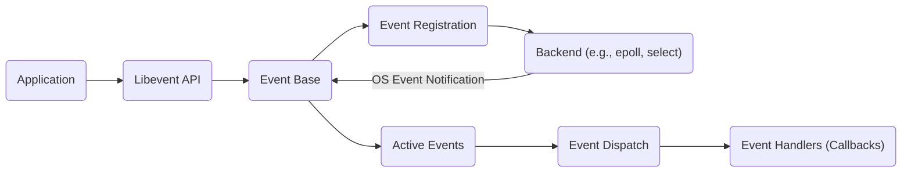

# Project Design Document: Libevent

**Version:** 1.1
**Date:** October 26, 2023
**Author:** AI Software Architect

## 1. Introduction

This document details the architectural design of the Libevent library, a portable C library for asynchronous event notification. It provides a foundation for understanding Libevent's internal workings and serves as a crucial artifact for subsequent threat modeling activities. By outlining the components, data flow, and key functionalities, this document enables a comprehensive analysis of potential security vulnerabilities and risks inherent in the library's design and implementation. Libevent is widely used in network programming to build scalable and efficient applications by providing a consistent event notification mechanism across diverse operating systems.

## 2. Goals and Objectives

The core goals of Libevent are:

* **Cross-Platform Portability:**  To offer a uniform event notification interface across various operating systems, including Linux, macOS, and Windows.
* **High Performance:** To achieve efficient event handling by leveraging the most performant underlying OS mechanisms (e.g., `epoll`, `kqueue`, IOCP).
* **API Simplicity:** To provide a straightforward and developer-friendly API.
* **Extensibility and Flexibility:** To allow for the addition of new event types and backend implementations.

This design document aims to:

* Clearly articulate the architectural design of Libevent.
* Identify and describe the key components and their interactions.
* Illustrate the flow of data and events within the library.
* Highlight aspects of the design relevant to security considerations.
* Provide a solid basis for identifying potential threats and vulnerabilities during threat modeling.

## 3. System Architecture

### 3.1. High-Level Architecture

This diagram illustrates the high-level interaction between an application and Libevent. Applications utilize the Libevent API to register interest in specific events. The central "Event Base" manages these registrations and dispatches events using an appropriate operating system-specific backend.

### 3.2. Detailed Architecture

Libevent comprises several interconnected components:

* **Event Base:**
    * The core structure responsible for managing all registered events.
    * Selects the optimal backend based on the operating system's capabilities.
    * Contains the central event loop that drives event processing.
* **Event:**
    * Represents a specific event to monitor, such as readability or writability on a file descriptor, or a timer expiration.
    * Associated with:
        * A file descriptor (or other event source).
        * An event type (read, write, signal, timer).
        * A user-defined callback function to be executed when the event occurs.
    * Can be configured as persistent (repeating) or non-persistent (one-shot).
* **Backend (Dispatchers):**
    * An abstraction layer that interfaces with the operating system's event notification mechanisms.
    * Concrete examples include `select`, `poll`, `epoll` (Linux), `kqueue` (macOS, BSD), and I/O Completion Ports (Windows).
    * Responsible for monitoring registered file descriptors and notifying the Event Base when events become active.
* **Event Registration Mechanism:**
    * The set of API functions provided by Libevent (e.g., `event_add`, `event_del`) to manage events within the Event Base.
    * Handles the interaction with the chosen backend to register interest in specific events on file descriptors.
* **Event Loop:**
    * The central execution loop within the Event Base.
    * Continuously polls the underlying backend for active events.
    * Dispatches the appropriate callback functions when events are triggered.
* **Timers:**
    * A specialized type of event that triggers after a specified duration.
    * Managed by the Event Base, often implemented using efficient data structures like min-heaps.
* **Signals:**
    * Enables applications to receive notifications of specific operating system signals.
    * Libevent provides a portable interface for signal handling.
* **Bufferevent:**
    * A higher-level abstraction built upon the core event mechanism.
    * Provides buffered input and output operations on file descriptors, simplifying network programming.
* **Listener:**
    * A utility component for listening for incoming network connections on a socket.
    * Utilizes Libevent's event mechanism to handle new connections asynchronously.
* **DNS:**
    * Offers asynchronous DNS resolution capabilities.
    * Leverages Libevent's event loop to perform non-blocking DNS lookups.
* **HTTP:**
    * Provides basic HTTP client and server functionalities.
    * Built on top of Bufferevent and the core Libevent event handling mechanisms.

## 4. Data Flow

The typical data flow for handling an I/O event in Libevent proceeds as follows:

1. **Event Registration:** The application uses a Libevent API function (e.g., `event_add`) to register interest in an event (e.g., readability on a socket). This involves:
    * Creating an `event` structure.
    * Associating the event with:
        * A specific file descriptor.
        * The type of event to monitor (read, write).
        * A callback function to execute when the event occurs.
    * Adding the newly created `event` to the Event Base.
    * The Event Base interacts with the selected backend to register the file descriptor for monitoring by the operating system.

2. **Event Loop Monitoring:** The application enters the main event loop, typically by calling `event_base_dispatch`. The Event Base then:
    * Invokes the polling mechanism of the underlying backend (e.g., `epoll_wait`, `select`).
    * The backend waits for the operating system to signal that an event has occurred on one of the registered file descriptors.

3. **Event Notification:** When an event occurs on a monitored file descriptor:
    * The operating system notifies the relevant Libevent backend.
    * The backend, in turn, informs the Event Base about the active event(s).

4. **Active Event Processing:** The Event Base identifies the specific `event` structure(s) associated with the file descriptor(s) on which events have occurred.

5. **Event Dispatch:** The Event Base invokes the callback function that was registered with the active `event`.

6. **Callback Execution:** The application-provided callback function is executed, allowing the application to handle the event (e.g., read data from the socket).

## 5. Key Components in Detail

### 5.1. Event Base

The Event Base is the central control point of Libevent. Its primary responsibilities include:

* **Backend Selection:** Dynamically choosing the most efficient event notification mechanism available on the current operating system.
* **Event Lifecycle Management:**  Storing, managing, and tracking the lifecycle of all registered events. This often involves using optimized data structures for efficient searching and retrieval.
* **Event Loop Execution:** Implementing the core event loop that continuously monitors for and dispatches events.
* **Timer Management:**  Handling the scheduling and execution of timer events.

### 5.2. Backends (Dispatchers)

The backend layer provides a crucial abstraction, enabling Libevent's portability. Key characteristics include:

* **Operating System Abstraction:** Hiding the platform-specific details of different operating system event notification APIs.
* **Performance Optimization:** Utilizing the most performant mechanism available for the given platform (e.g., `epoll` generally offers better performance than `select` for a large number of file descriptors).
* **Implementation Details:** Each backend implements a common set of operations (add, remove, poll/dispatch) using the corresponding operating system API calls.

### 5.3. Bufferevent

Bufferevent simplifies network programming by providing a higher-level interface with built-in buffering. Key features include:

* **Internal Buffers:**  Maintains separate input and output buffers for managing data flow.
* **Event-Driven Callbacks:**  Triggers user-defined callbacks for read, write, and error conditions.
* **Watermark Management:**  Allows setting thresholds (watermarks) to trigger callbacks when buffer levels reach specific points.
* **SSL/TLS Integration:**  Provides seamless integration with SSL/TLS libraries like OpenSSL for secure communication.

## 6. Security Considerations

This section outlines potential security considerations relevant to Libevent's design and usage, forming the basis for subsequent threat modeling.

* **Input Validation (Application Responsibility):** Libevent itself does not perform application-level input validation. Applications using Libevent *must* rigorously validate all data received through event callbacks to prevent vulnerabilities such as buffer overflows, format string bugs, and injection attacks.
* **Denial of Service (DoS) Attacks:**
    * **Excessive Event Registration:** An attacker could attempt to register an extremely large number of events, potentially overwhelming the Event Base and consuming excessive system resources. Rate limiting and resource quotas on event registrations might be necessary at the application level.
    * **Slowloris Attacks (via Bufferevent):** When using Bufferevent for HTTP or similar protocols, an attacker could send incomplete requests slowly, holding connections open and exhausting server resources. Implementing timeouts and connection limits can mitigate this.
* **Integer Overflow/Underflow:**  Care must be taken in both Libevent's implementation and in applications using it to prevent integer overflows or underflows when calculating buffer sizes, timeouts, or other critical parameters. Such errors can lead to unexpected behavior or exploitable conditions.
* **Time-of-Check to Time-of-Use (TOCTOU) Vulnerabilities:** In scenarios involving file system events or other external state, a TOCTOU vulnerability can occur if the state changes between the time Libevent checks it and the time the application acts upon it. Careful design and synchronization mechanisms are needed to prevent this.
* **Signal Handling Security:** Improper signal handling can introduce vulnerabilities. While Libevent provides a portable abstraction, applications must still adhere to signal safety guidelines and avoid performing non-reentrant operations within signal handlers.
* **Memory Management Issues:** Memory leaks or double-free vulnerabilities within Libevent itself could lead to crashes or exploitable conditions. Thorough code reviews and memory safety tools are essential during development.
* **Third-Party Dependencies:** If Libevent is built with support for features like SSL/TLS, vulnerabilities in those underlying libraries (e.g., OpenSSL) can directly impact applications using Libevent. Keeping dependencies updated is crucial.
* **Secure Defaults and Configuration:** Ensuring that default configurations and settings within Libevent are secure is important. Applications should also review and configure Libevent appropriately for their specific security requirements.
* **Error Handling and Logging:** Robust error handling within Libevent is vital to prevent unexpected behavior and potential security issues. Applications must also handle errors returned by Libevent gracefully and implement appropriate logging for security auditing.

## 7. Deployment Considerations

Libevent is typically deployed as a dynamically or statically linked library within applications. Key deployment considerations include:

* **Operating System Compatibility:**  Verifying that the application and the specific Libevent build are compatible with the target operating system and its kernel version.
* **Backend Availability:** The availability of specific backends (e.g., `epoll`) depends on the operating system kernel features. Applications might need to handle cases where preferred backends are not available.
* **Library Version Management:**  Using a stable and up-to-date version of Libevent is crucial to benefit from bug fixes, performance improvements, and security patches. Employing dependency management tools can help with this.
* **Build Configuration and Optimization:**  Configuring the build process to include necessary features (e.g., SSL support) and to optimize for the target environment (e.g., using appropriate compiler flags) is important.

## 8. Future Considerations

Potential future enhancements and areas for improvement in Libevent include:

* **Enhanced Built-in Security Features:** Exploring the feasibility of incorporating built-in mechanisms for common security tasks, such as basic input sanitization or protection against certain DoS attack patterns.
* **Improved Error Handling and Granular Reporting:** Providing more detailed and context-rich error information to aid in debugging and security analysis.
* **Modern C++ API:**  Developing a more modern and type-safe C++ API to facilitate easier integration with C++ projects and potentially reduce common programming errors.
* **Integration with Modern Asynchronous I/O Frameworks:**  Exploring tighter integration with contemporary asynchronous I/O libraries or frameworks to leverage their advanced features and potentially simplify development.

This document provides a detailed architectural overview of Libevent, serving as a solid foundation for conducting thorough threat modeling. By understanding its components, data flow, and inherent security considerations, developers and security professionals can effectively identify and mitigate potential risks associated with its use.