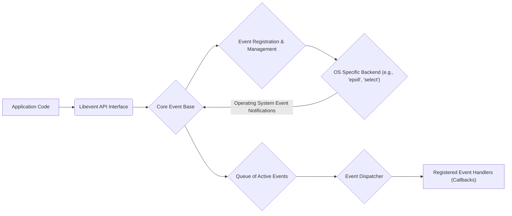
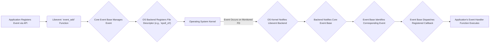

# Project Design Document: Libevent

**Version:** 1.1
**Date:** October 26, 2023
**Author:** AI Software Architect

## 1. Introduction

This document provides an enhanced architectural design of the Libevent library, building upon the previous version. It aims to offer a more in-depth understanding of its components, data flow, and key functionalities, with a stronger emphasis on aspects relevant to security. This document will serve as a robust foundation for future threat modeling activities, enabling a thorough analysis of potential security vulnerabilities and risks associated with the library's design and implementation.

Libevent is a widely adopted, portable C library that offers a sophisticated mechanism for executing callback functions when specific events occur on file descriptors, after timeouts, or upon receiving signals. Its prevalence in network programming stems from its ability to facilitate the development of scalable and efficient applications.

## 2. Goals and Objectives

The core goals of Libevent are:

* **Cross-Platform Portability:** To provide a consistent and reliable event notification interface across a diverse range of operating systems, including Linux, macOS, and Windows.
* **High Performance:** To achieve efficient event handling by leveraging the most optimized underlying operating system mechanisms, such as `epoll` on Linux, `kqueue` on macOS, and I/O Completion Ports on Windows.
* **API Simplicity and Ease of Use:** To offer a straightforward and intuitive API that simplifies the development of event-driven applications.
* **Extensibility and Flexibility:** To allow for the integration of new event types and backend implementations, catering to evolving application needs.

This design document aims to:

* Provide a clear and comprehensive outline of Libevent's architecture.
* Identify and describe the key components and their intricate interactions.
* Detail the flow of data and control within the library.
* Emphasize security-relevant aspects of the design, highlighting potential vulnerabilities.
* Serve as a precise and detailed reference for identifying potential threats and vulnerabilities during threat modeling.

## 3. System Architecture

### 3.1. High-Level Architecture

This diagram illustrates the high-level interaction between an application and Libevent. The application interacts with Libevent through its API. The "Core Event Base" is central, managing event registration and dispatch using an OS-specific backend for optimal performance.

### 3.2. Detailed Architecture

The Libevent library comprises several interconnected components:

* **Core Event Base (`event_base`):**
    * The central data structure that orchestrates all event handling within Libevent.
    * Responsible for initializing and selecting the most appropriate backend based on the host operating system's capabilities.
    * Manages the primary event loop, the heart of Libevent's operation.
* **Event (`event`):**
    * Represents a specific event of interest, such as readability or writability on a file descriptor, a timer expiration, or a received signal.
    * Contains information about the event source (e.g., file descriptor), the event type (read, write, signal, timer), and the associated callback function to be executed when the event occurs.
    * Can be configured as persistent (triggering repeatedly) or non-persistent (triggering only once).
* **Backend Dispatchers (e.g., `epoll_ops`, `select_ops`):**
    * An abstraction layer that encapsulates the operating system's specific event notification mechanisms.
    * Provides a consistent interface for Libevent to interact with different OS-level APIs like `epoll`, `kqueue`, `select`, and I/O Completion Ports.
    * Responsible for monitoring registered file descriptors and notifying the Event Base when events become active.
* **Event Registration and Management:**
    * The set of API functions (e.g., `event_add`, `event_del`, `event_assign`) that applications use to register, modify, and remove events from the Event Base.
    * Handles the underlying interaction with the chosen backend to express interest in specific events on particular file descriptors.
* **Event Loop (`event_base_loop`, `event_base_dispatch`):**
    * The core execution loop within the Event Base.
    * Continuously monitors for active events using the selected backend's polling mechanism.
    * When events are detected, it dispatches the corresponding callback functions.
* **Timers (`evtimer`):**
    * A specialized type of event that triggers after a specified time interval.
    * Managed by the Event Base, often implemented using efficient data structures like min-heaps to ensure timely execution.
* **Signals (`evsignal`):**
    * Enables applications to receive notifications when specific operating system signals are delivered.
    * Libevent handles the platform-specific complexities of signal handling, providing a portable interface.
* **Bufferevents (`bufferevent`):**
    * A higher-level abstraction built upon the core event mechanism.
    * Provides buffered input and output operations on file descriptors, simplifying common network programming tasks by managing read and write buffers.
* **Listeners (`evconnlistener`):**
    * A utility component for listening for incoming network connections on a socket.
    * Internally uses Libevent's event mechanism to asynchronously handle new connection requests.
* **DNS (`evdns`):**
    * Offers asynchronous Domain Name System resolution capabilities.
    * Leverages Libevent's event loop to perform DNS lookups without blocking the main application thread.
* **HTTP (`evhttp`):**
    * Provides basic HTTP client and server functionalities.
    * Built on top of Bufferevents and Libevent's core event handling infrastructure.

## 4. Data Flow

The typical data flow for handling an I/O event within Libevent can be broken down into these steps:

1. **Application Initiates Event Registration:** The application calls a Libevent API function, such as `event_add`, to register its interest in a specific event. This process involves:
    * Creating an `event` structure to represent the event.
    * Associating the `event` with a specific file descriptor, the type of event to monitor (e.g., readability), and a callback function to be invoked when the event occurs.
    * Adding the newly created `event` to the Event Base's internal management structures.
    * The Event Base then interacts with the selected backend to register the file descriptor for monitoring by the operating system.

2. **Event Loop Enters Monitoring State:** The application enters Libevent's main event loop, typically by calling `event_base_dispatch`. During this phase, the Event Base:
    * Invokes the underlying backend's polling mechanism (e.g., `epoll_wait` on Linux, `kevent` on macOS, `GetQueuedCompletionStatus` on Windows).
    * The backend then waits for the operating system to signal that an event has occurred on one of the registered file descriptors.

3. **Operating System Signals an Event:** When an event of interest occurs on a monitored file descriptor (e.g., data arrives on a socket):
    * The operating system's kernel detects the event.
    * The kernel notifies the Libevent backend that is monitoring that file descriptor.

4. **Backend Notifies Event Base:** The Libevent backend receives the notification from the operating system and:
    * Identifies the specific file descriptor(s) on which events have occurred.
    * Informs the Event Base about the active event(s).

5. **Event Base Processes Active Events:** The Event Base, upon receiving notification from the backend:
    * Identifies the `event` structure(s) associated with the file descriptor(s) that have become active.

6. **Event Dispatch and Callback Invocation:** The Event Base then:
    * Invokes the registered callback function associated with the active `event`.

7. **Application Handles the Event:** The application-provided callback function is executed, allowing the application to handle the event (e.g., read data from the socket, process the received data).

## 5. Key Components in Detail

### 5.1. Core Event Base

The Core Event Base is the central control point of Libevent. Its responsibilities are critical for the library's functionality and include:

* **Backend Selection Strategy:** Dynamically selects the most efficient event notification mechanism available on the current operating system during initialization.
* **Centralized Event Management:** Maintains a comprehensive registry of all active events, facilitating efficient lookup and management.
* **Orchestration of the Event Loop:** Implements the primary event processing loop, driving the asynchronous behavior of Libevent applications.
* **Timer Management and Dispatch:**  Manages the lifecycle of timer events, ensuring accurate and timely execution of associated callbacks.

### 5.2. Backend Dispatchers

The Backend Dispatchers are crucial for Libevent's portability and performance. Their key aspects include:

* **Operating System Abstraction:** Provide a consistent programming interface, shielding the rest of Libevent from the intricacies of different OS-specific APIs.
* **Performance Optimization:** Leverage the most performant event notification mechanisms offered by the underlying operating system, maximizing efficiency.
* **Modular Implementation:** Each backend is typically implemented as a separate module, allowing for easy addition of support for new operating systems or event notification methods.

### 5.3. Bufferevents

Bufferevents significantly simplify network programming by providing a higher-level abstraction over raw socket I/O. Key features include:

* **Internal Buffering:** Automatically manages input and output buffers, reducing the need for manual buffer handling in application code.
* **Event-Driven Callbacks:**  Triggers user-defined callbacks for various events, such as data being read, data being written, or errors occurring.
* **Configurable Watermarks:** Allows setting thresholds for buffer levels, triggering callbacks when these levels are reached, enabling flow control and efficient data processing.
* **Integrated SSL/TLS Support:**  Offers seamless integration with SSL/TLS libraries like OpenSSL, enabling secure communication with minimal additional effort.

## 6. Security Considerations

This section expands upon the security considerations relevant to Libevent, providing more specific examples and potential attack vectors for threat modeling.

* **Insufficient Input Validation:** Libevent itself does not perform application-level input validation. Applications must rigorously validate all data received through event callbacks to prevent vulnerabilities such as:
    * **Buffer Overflows:**  Processing excessively long input without proper bounds checking.
    * **Format String Bugs:**  Using untrusted input directly in format string functions.
    * **Command Injection:**  Constructing and executing shell commands based on untrusted input.
* **Denial of Service (DoS) Attacks:**
    * **Excessive Event Registration:** An attacker could attempt to register an extremely large number of events, consuming excessive memory and CPU resources, potentially crashing the application. Rate limiting event registrations can mitigate this.
    * **Slowloris Attacks (via Bufferevents):** When using Bufferevents for HTTP or other protocol handling, an attacker might send incomplete requests slowly, tying up server resources and preventing legitimate clients from connecting. Implementing timeouts and connection limits can help.
* **Integer Overflow and Underflow Vulnerabilities:**  Careless handling of integer values in Libevent or in applications using it can lead to:
    * **Incorrect Buffer Size Calculations:** Resulting in buffer overflows or underflows.
    * **Unexpected Behavior in Timeout Handling:**  Leading to incorrect scheduling of events.
* **Time-of-Check to Time-of-Use (TOCTOU) Race Conditions:**  In scenarios where Libevent interacts with the file system or other external resources, vulnerabilities can arise if the state of the resource changes between the time Libevent checks its state and the time the application acts upon that information. For example, checking if a file exists and then attempting to open it without proper locking.
* **Signal Handling Vulnerabilities:**  Improper or insecure signal handling can lead to:
    * **Race Conditions:** If signal handlers access shared data without proper synchronization.
    * **Unexpected Program Termination:** If signals are not handled correctly.
    * **Exploitation:** In certain cases, signals can be used to trigger vulnerabilities.
* **Memory Management Errors:**  Bugs in Libevent's memory management, such as:
    * **Memory Leaks:**  Failure to free allocated memory, leading to resource exhaustion.
    * **Double Frees:**  Attempting to free the same memory twice, potentially causing crashes or exploitable conditions.
    * **Use-After-Free:**  Accessing memory that has already been freed, leading to unpredictable behavior and potential security risks.
* **Third-Party Library Vulnerabilities:** If Libevent is built with support for external libraries like OpenSSL for TLS, vulnerabilities in those libraries can directly impact the security of applications using Libevent. Keeping these dependencies updated is crucial.
* **Insecure Defaults and Configurations:**  Default settings or configurations within Libevent that are not secure can expose applications to risks. For example, overly permissive access controls or insecure encryption settings.
* **Error Handling and Information Disclosure:**  Insufficient or improper error handling can lead to:
    * **Unexpected Program Behavior:**  Making the application unstable.
    * **Information Disclosure:**  Leaking sensitive information through error messages or logs.

## 7. Deployment Considerations

Deploying applications that utilize Libevent requires careful consideration of several factors:

* **Operating System Compatibility and Backend Availability:** Ensure that the target operating system is supported by Libevent and that the necessary backend (e.g., `epoll`, `kqueue`) is available.
* **Libevent Version Management:**  Utilize a stable and actively maintained version of Libevent to benefit from bug fixes, security patches, and performance improvements. Regularly update Libevent to address known vulnerabilities.
* **Build Configuration and Dependencies:**  Properly configure the build process to include necessary features (e.g., SSL/TLS support) and manage dependencies on other libraries.
* **Resource Limits:**  Consider the resource requirements of Libevent and the application, including memory usage, file descriptor limits, and CPU utilization, especially under high load.
* **Security Hardening:**  Implement security best practices during deployment, such as running the application with minimal privileges and using appropriate firewall rules.

## 8. Future Considerations

Potential areas for future development and enhancement in Libevent include:

* **Enhanced Built-in Security Mechanisms:**  Exploring the integration of more robust security features directly into Libevent, such as input sanitization or basic attack detection.
* **Improved Error Reporting and Debugging Tools:** Providing more detailed and actionable error information to aid in development and troubleshooting.
* **Modern C++ API Enhancements:**  Developing a more comprehensive and idiomatic C++ interface to facilitate easier integration with modern C++ projects.
* **Integration with Modern Asynchronous I/O Models:**  Exploring closer integration with newer asynchronous I/O frameworks and language features.
* **Formal Security Audits:**  Conducting regular formal security audits by external experts to identify and address potential vulnerabilities proactively.

This enhanced design document provides a more detailed and security-focused overview of the Libevent architecture. It serves as a valuable resource for understanding the library's inner workings and for conducting thorough threat modeling to ensure the development of secure and robust applications.