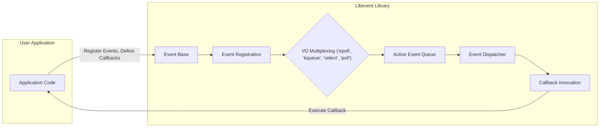
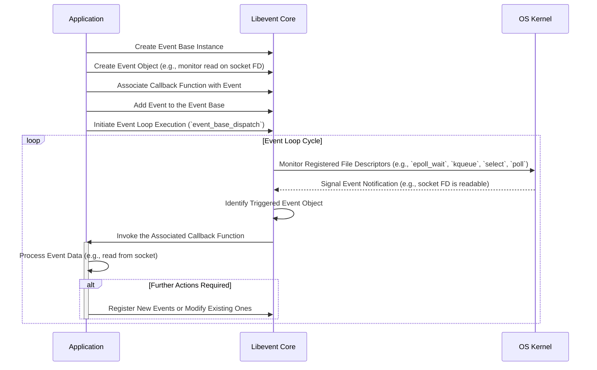

# Project Design Document: Libevent

**Version:** 1.1
**Date:** October 26, 2023
**Author:** AI Software Architect

## 1. Introduction

This document provides a detailed architectural design of the Libevent library, a widely used, cross-platform C library facilitating asynchronous event notification. Libevent enables the execution of callback functions in response to specific events occurring on file descriptors, timers, or signals. Its primary application lies in network programming and systems requiring efficient, non-blocking event handling. This document offers a comprehensive view of Libevent's architecture, its constituent components, and the flow of data within it, serving as a robust foundation for subsequent threat modeling exercises.

## 2. Goals and Non-Goals

**Goals:**

* Deliver a clear and detailed architectural exposition of the Libevent library.
* Identify and describe the core components and their interdependencies.
* Elucidate the data flow mechanisms within the library.
* Highlight potential areas of interest and concern for security analysis.
* Serve as the definitive design reference for threat modeling the Libevent project.

**Non-Goals:**

* Offer a granular, line-by-line analysis of the Libevent source code.
* Detail every conceivable configuration parameter and option.
* Present performance benchmarks, optimization strategies, or tuning advice.
* Provide a comprehensive security audit, penetration test results, or vulnerability disclosure.

## 3. Architectural Overview

Libevent's architecture is centered around the **event loop**, a fundamental pattern for asynchronous programming. Applications register their interest in specific events—such as readability or writability on a socket—with Libevent. Internally, Libevent leverages the operating system's most efficient event notification mechanism (e.g., `epoll` on Linux, `kqueue` on BSD/macOS, `select` or `poll` on less feature-rich systems) to monitor these registered events. Upon the occurrence of a monitored event, Libevent invokes the user-defined callback function associated with that specific event.

**Key Architectural Concepts:**

* **Event Base:** The central control structure managing all registered events and the lifecycle of the event loop. Applications typically instantiate one or more event base objects. The event base encapsulates the chosen I/O multiplexing method and manages the queue of active and pending events.
* **Events:** Represent a specific interest in a condition associated with a file descriptor (read, write, error), a timer expiration, or the delivery of a signal. Each event is linked to a specific callback function.
* **Callbacks:** User-provided functions that are executed by Libevent when their associated event condition is met. These functions contain the application-specific logic to handle the event.
* **I/O Multiplexing:** The underlying operating system facility that allows Libevent to efficiently monitor multiple file descriptors for activity without resorting to blocking operations on each one. Libevent provides an abstraction layer over these different mechanisms, offering a consistent API.
* **Event Loop:** The core execution cycle of Libevent. It continuously polls the operating system for pending events and, upon receiving notification, dispatches the corresponding callbacks.

## 4. Components

This section provides a detailed description of the major components within the Libevent library.

* **Event Base (`struct event_base`):**
    * The primary data structure holding the global state of the event processing system.
    * Manages the collection of registered events, the selected I/O multiplexing strategy, and the set of pending timeouts.
    * Offers functions for creating, configuring, and initiating the event loop (`event_base_dispatch`).
    * Responsible for selecting the appropriate I/O multiplexing backend based on operating system capabilities.

* **Event (`struct event`):**
    * Represents a single, specific event that Libevent is monitoring.
    * Encapsulates details such as the associated file descriptor, the type of event being watched for (read, write, signal, timeout), the priority of the event, and the pointer to the callback function.
    * Is always associated with a particular event base.

* **I/O Multiplexing Backends (e.g., `epoll`, `kqueue`, `select`, `poll`):**
    * Concrete implementations of different operating system mechanisms for monitoring file descriptors.
        * **`epoll` (Linux):** An efficient, scalable mechanism using an event-driven approach.
        * **`kqueue` (BSD, macOS):** A powerful and flexible interface for event notification.
        * **`select` (POSIX standard):** A more basic mechanism with limitations in scalability for large numbers of file descriptors.
        * **`poll` (POSIX standard):** Similar to `select` but offers some improvements in handling file descriptor sets.
        * **Windows I/O Completion Ports (IOCP):**  The native asynchronous I/O mechanism on Windows.
    * Libevent abstracts away the platform-specific details, allowing applications to use a consistent event registration API.

* **Timeout Management:**
    * Provides the functionality to schedule callbacks to be executed after a specified duration.
    * Typically implemented using a priority queue (e.g., a min-heap) to efficiently manage and retrieve the next expiring timer.
    * Timers are associated with an event base and are triggered by the event loop.

* **Signal Handling:**
    * Enables applications to register callbacks that are invoked upon the receipt of specific operating system signals (e.g., `SIGINT`, `SIGTERM`).
    * Integrates signal delivery seamlessly into the event loop, ensuring consistent handling of asynchronous events.

* **Bufferevent (`struct bufferevent`):**
    * A higher-level abstraction built upon the core event mechanism, simplifying buffered input and output operations, particularly over network sockets.
    * Manages internal input and output buffers, reducing the need for applications to handle partial reads and writes directly.
    * Supports different underlying transport mechanisms (e.g., sockets, pipes).
    * Offers features like automatic flushing of output buffers and callbacks for various buffer states (e.g., watermarks).
    * Different types of bufferevents exist, such as:
        * **Socket Bufferevents:** For network connections.
        * **Pair Bufferevents:** For in-memory communication between threads or processes.
        * **Filter Bufferevents:** For applying transformations to data passing through.

* **Listener (`struct evconnlistener`):**
    * Facilitates the creation of listening sockets and the acceptance of incoming network connections in a non-blocking manner.
    * Internally uses Libevent's event mechanism to monitor the listening socket for incoming connection requests.
    * Provides a callback interface to notify the application when a new connection is established.

* **DNS (Optional, `evdns`):**
    * Offers asynchronous Domain Name System resolution capabilities, preventing blocking of the main event loop during DNS lookups.
    * Can perform DNS queries in the background and invoke a callback when the resolution is complete.

* **HTTP (Optional, `evhttp`):**
    * Provides basic HTTP client and server functionalities, built upon the Bufferevent abstraction.
    * Enables asynchronous HTTP communication, allowing applications to handle multiple requests concurrently without blocking.

## 5. Data Flow

The typical sequence of operations and data movement within a Libevent-based application is as follows:

**Detailed Data Flow Steps:**

1. **Initialization:** The application begins by creating an instance of the `event_base`. This sets up the core Libevent infrastructure.
2. **Event Registration:** The application creates `event` objects, specifying the file descriptor of interest, the type of event to monitor (e.g., read, write), and the callback function that should be executed when the event occurs.
3. **Attaching Callbacks:** The application associates the defined callback function with the created `event` object. This function contains the application-specific logic to handle the event.
4. **Adding Events to the Event Base:** The application adds the configured `event` object to the `event_base`. This registers the application's interest in the specified event with Libevent.
5. **Starting the Event Loop:** The application initiates the event processing loop by calling a function like `event_base_dispatch()`. This function blocks, waiting for events to occur.
6. **Monitoring with I/O Multiplexing:** Internally, `event_base_dispatch()` utilizes the operating system's selected I/O multiplexing mechanism (e.g., `epoll_wait`, `kqueue`, `select`, `poll`) to efficiently monitor the registered file descriptors for activity.
7. **Event Notification from the Kernel:** When an event of interest occurs on a monitored file descriptor (e.g., data arrives on a socket), the operating system kernel notifies Libevent.
8. **Identifying the Triggered Event:** Libevent receives the notification from the kernel and identifies the specific `event` object that corresponds to the triggered file descriptor and event type.
9. **Invoking the Callback Function:** Libevent retrieves the callback function associated with the triggered `event` object and executes it. This transfers control back to the application-defined logic.
10. **Callback Execution and Event Handling:** The callback function executes, performing the necessary actions based on the event. For example, it might read data from the socket, process the received data, or initiate a write operation.
11. **Loop Continuation:** After the callback function returns, the event loop continues to monitor for new events, repeating steps 6 through 10.

## 6. Security Considerations (Detailed)

This section outlines potential security considerations relevant to Libevent, providing a basis for more focused threat modeling.

* **Input Validation in Callbacks:** Libevent does not perform any inherent validation of data received through file descriptors. Applications *must* implement robust input validation within their callback functions to prevent vulnerabilities such as:
    * **Buffer Overflows:**  Insufficient bounds checking when reading data into fixed-size buffers.
    * **Format String Bugs:**  Using untrusted input directly in format strings (e.g., with `printf`-like functions).
    * **Injection Attacks (e.g., SQL injection, command injection):** If the received data is used to construct commands or queries without proper sanitization.

* **Resource Exhaustion Attacks:** Malicious actors could attempt to exhaust system resources by:
    * **Registering a Large Number of Events:**  Consuming excessive memory and kernel resources. Applications should impose limits on the number of registered events.
    * **Creating Numerous Connections (DoS):** Overwhelming the server with connection requests, potentially leading to resource exhaustion (file descriptors, memory, CPU). Implement connection rate limiting and resource quotas.
    * **Timeout Manipulation:**  Registering events with extremely long timeouts, tying up resources.

* **Callback Security Vulnerabilities:** The security of the application is directly tied to the security of the callback functions. Vulnerabilities in callbacks can be exploited:
    * **Logic Errors:** Flaws in the callback logic can lead to unexpected behavior or security breaches.
    * **Use-After-Free:** If a callback accesses memory that has been freed elsewhere.

* **Denial of Service (DoS) through Event Manipulation:**
    * **Event Queue Saturation:**  Exploiting potential vulnerabilities in event processing to flood the event queue, delaying the processing of legitimate events.
    * **Infinite Loops in Callbacks:**  Crafting inputs that trigger infinite loops within callback functions, consuming CPU resources.

* **Memory Management Issues (C Language Specific):** As a C library, Libevent relies on manual memory management, increasing the risk of:
    * **Memory Leaks:** Failure to free allocated memory, potentially leading to resource exhaustion over time.
    * **Double-Free Errors:** Attempting to free the same memory region multiple times, leading to crashes or potentially exploitable conditions.
    * **Dangling Pointers:** Accessing memory that has already been freed, leading to unpredictable behavior.

* **Integer Overflows in Size Calculations:**  Careless calculations involving buffer sizes or timeout values could lead to integer overflows, resulting in:
    * **Heap Overflows:** If an overflowed size is used to allocate a buffer, leading to out-of-bounds writes.
    * **Incorrect Timeout Values:** Leading to unexpected delays or premature triggering of events.

* **Signal Handling Race Conditions:** Improper handling of signals, especially in multi-threaded environments, can lead to race conditions and unpredictable behavior.

* **Security of Optional Features:** If using optional components like `evdns` or `evhttp`, the security of these components also needs to be considered:
    * **DNS Spoofing Vulnerabilities:** If `evdns` is not used securely.
    * **HTTP Parsing Vulnerabilities:** If `evhttp` has flaws in its HTTP parsing logic.

## 7. Deployment Considerations

Libevent is typically deployed as a foundational library linked directly into an application.

* **Linking Options:**
    * **Static Linking:**  The Libevent code is compiled directly into the application executable, creating a self-contained binary. This can increase the size of the executable but avoids runtime dependencies on shared libraries.
    * **Dynamic Linking:** The application links against a shared Libevent library at runtime. This reduces the size of the executable and allows for easier updates to the Libevent library, but requires the shared library to be present on the target system.

* **Operating System Specifics:** The choice of the underlying I/O multiplexing backend is automatically determined by Libevent based on the capabilities of the host operating system. Developers generally do not need to explicitly configure this.

* **Configuration Options:** While Libevent handles much of the low-level configuration automatically, applications can influence its behavior through various initialization flags and settings, such as:
    * **Specifying Event Base Flags:**  To influence the behavior of the event loop.
    * **Setting Resource Limits:**  Although it's primarily the application's responsibility to enforce limits.

## 8. Future Considerations

* **Enhanced Security Audits and Fuzzing:**  Regular security audits and fuzzing efforts can help identify and address potential vulnerabilities proactively.
* **Modern Language Bindings:** Providing robust and secure bindings for modern languages (e.g., Rust, Go) could expand Libevent's reach and potentially mitigate some C-specific security concerns.
* **Improved Error Reporting and Debugging Tools:** Enhancements in error reporting and debugging capabilities would aid in identifying and resolving security issues.
* **Consideration of Memory-Safe Alternatives:**  Exploring or integrating with memory-safe system programming libraries or techniques could reduce the risk of memory-related vulnerabilities.

This refined document provides a more detailed and nuanced understanding of Libevent's architecture and potential security considerations, making it a more effective resource for subsequent threat modeling activities.