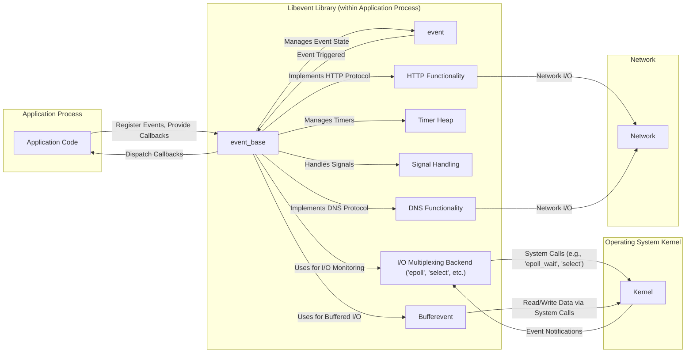

## Project Design Document: Libevent (Improved)

**1. Introduction**

This document provides an enhanced and more detailed design overview of the Libevent library, specifically tailored for threat modeling. It aims to meticulously capture the architectural components, data flows, and interactions within the library, with a strong emphasis on security-relevant aspects. This document will serve as a robust foundation for subsequent threat modeling activities, enabling a comprehensive assessment of potential security vulnerabilities and attack vectors.

**2. Goals**

*   Clearly and comprehensively articulate the architecture and design of Libevent, focusing on security implications.
*   Identify key components, their responsibilities, and their potential security weaknesses.
*   Describe the flow of events and data within the library with a focus on potential manipulation or interception points.
*   Highlight important interactions with the operating system, client applications, and the network, emphasizing security boundaries and trust assumptions.
*   Provide a structured and detailed basis for identifying potential security threats, vulnerabilities, and attack surfaces.

**3. Scope**

This document focuses on the core functionality of the Libevent library, with a security-centric perspective, including:

*   Event loop management and its potential for resource exhaustion.
*   Event registration and dispatching mechanisms and their susceptibility to manipulation.
*   Detailed analysis of supported I/O multiplexing mechanisms (select, poll, epoll, kqueue, etc.) and their security characteristics.
*   Timer management and potential for timing-based attacks or denial of service.
*   Signal handling and its potential for exploitation.
*   In-depth examination of the `Bufferevent` abstraction and its buffering mechanisms.
*   Security analysis of the built-in HTTP client and server functionality.
*   Security analysis of the built-in DNS client functionality.

This document does not cover:

*   Specific application implementations using Libevent beyond illustrative examples.
*   Extremely granular code-level implementation specifics unless directly relevant to security.
*   Historical evolution or alternative designs in detail, unless they highlight security trade-offs.

**4. High-Level Architecture**

Libevent's core is built around an event loop that monitors registered events and dispatches callbacks. This architecture is crucial for understanding potential points of attack. The following diagram illustrates the high-level architecture with a focus on interaction points:

**5. Detailed Design**

This section provides a more granular view of the key components, emphasizing security-relevant aspects.

*   **`event_base`**:
    *   The central control point, managing the event loop's lifecycle.
    *   Responsible for initializing the chosen I/O multiplexing backend. *Security Note:* The selection and initialization of the backend can have performance and security implications (e.g., limitations of `select`).
    *   Maintains internal lists of active and pending events. *Security Note:*  The management of these lists is crucial to prevent resource exhaustion attacks.
    *   Provides the core dispatching mechanism for event callbacks. *Security Note:*  The integrity of the callback pointers is critical.
    *   Manages the timer heap and signal handling. *Security Note:*  Improper timer management can lead to denial of service or timing attacks.

*   **`event`**:
    *   Represents a specific event being monitored.
    *   Contains details about the event type (read, write, signal, timer). *Security Note:* The event type dictates the context of the callback, which needs to be handled securely.
    *   Associated with a file descriptor, signal number, or timeout value. *Security Note:*  The validity and ownership of file descriptors are important security considerations.
    *   Stores the callback function pointer and associated arguments. *Security Note:*  Ensuring the integrity and validity of the callback function is paramount to prevent arbitrary code execution.
    *   Can be configured as persistent or non-persistent. *Security Note:* Misuse of persistent events can lead to unintended repeated execution of callbacks.

*   **I/O Multiplexing Backend (e.g., `epoll`, `select`)**:
    *   Abstracts the OS-specific mechanisms for monitoring file descriptors. *Security Note:* Different backends have different performance characteristics and security implications (e.g., `select`'s scalability limitations).
    *   Relies on system calls to interact with the kernel. *Security Note:* Vulnerabilities in the kernel's implementation of these system calls could be exploited.
    *   Notifies Libevent when a file descriptor is ready for reading or writing. *Security Note:*  Spoofing or manipulating these notifications could lead to security issues.

*   **Timer Heap**:
    *   An efficient data structure (typically a min-heap) for managing timer events. *Security Note:*  The efficiency of the timer heap is important to prevent denial of service by registering a large number of timers.
    *   Stores timer events with their expiration times and associated callbacks. *Security Note:*  The integrity of the timer callbacks is crucial.

*   **Signal Handling**:
    *   Integrates signal handling into the event loop. *Security Note:*  Care must be taken to handle signals safely, especially in multi-threaded environments.
    *   Allows registration of callbacks to be executed upon receiving specific signals. *Security Note:*  Malicious actors might try to trigger signals to disrupt the application's behavior.

*   **`Bufferevent`**:
    *   Provides buffered I/O operations, simplifying data handling. *Security Note:*  Buffer overflows are a potential risk if buffer sizes are not managed correctly.
    *   Manages input and output buffers. *Security Note:*  The size and management of these buffers are critical for preventing memory exhaustion.
    *   Supports different underlying transport mechanisms (e.g., sockets). *Security Note:* The security of the underlying transport directly impacts the security of the `Bufferevent`.
    *   Offers features like rate limiting and watermark callbacks. *Security Note:*  Improper configuration of rate limiting could lead to denial of service.

*   **HTTP Functionality**:
    *   Implements client and server HTTP protocols. *Security Note:*  This component is susceptible to common web application vulnerabilities like cross-site scripting (XSS) if not implemented carefully.
    *   Handles parsing of HTTP requests and responses. *Security Note:*  Vulnerabilities in the parsing logic could lead to buffer overflows or other exploits.
    *   Manages HTTP headers and body data. *Security Note:*  Proper validation and sanitization of HTTP headers are essential to prevent injection attacks.

*   **DNS Functionality**:
    *   Provides asynchronous DNS resolution. *Security Note:*  Susceptible to DNS spoofing attacks if not implemented with proper security measures (e.g., DNSSEC).
    *   Handles DNS queries and responses. *Security Note:*  Parsing of DNS responses needs to be robust against malformed data.

**6. Data Flow**

The data flow within Libevent is critical for understanding potential interception or manipulation points.

1. **Event Registration**: The application provides event details (type, file descriptor, callback) to `event_base`. *Security Note:*  Malicious applications could register events with invalid file descriptors or malicious callbacks.
2. **Event Loop Initialization**: `event_base` initializes the chosen I/O multiplexing mechanism.
3. **Monitoring**: The I/O multiplexing backend monitors registered file descriptors for activity, and the timer heap is checked for expired timers. *Security Note:*  An attacker might try to influence the monitoring process or inject false notifications.
4. **Event Notification**: The OS kernel notifies the I/O multiplexing backend about events. *Security Note:*  Kernel vulnerabilities could allow attackers to manipulate these notifications.
5. **Event Processing**: `event_base` identifies triggered events and retrieves the associated callbacks. *Security Note:*  If the internal state of `event_base` is compromised, incorrect callbacks might be invoked.
6. **Callback Execution**: The registered callback function is executed within the application's process. *Security Note:*  This is a critical point where vulnerabilities in the application's callback code can be exploited.
7. **`Bufferevent` Data Flow**:
    *   Incoming data from the network or other sources is received by the underlying transport and buffered by `Bufferevent`. *Security Note:*  Potential for buffer overflows if the incoming data exceeds buffer limits.
    *   The application reads data from the `Bufferevent`'s input buffer. *Security Note:*  Applications must handle the received data securely.
    *   Data to be sent is written to the `Bufferevent`'s output buffer.
    *   `Bufferevent` writes data to the underlying transport. *Security Note:*  Ensure data integrity during transmission.

**7. Key Interactions**

Libevent's interactions with external entities define trust boundaries and potential attack surfaces.

*   **Operating System Kernel**:
    *   Libevent relies heavily on the kernel for I/O multiplexing, timer management (sometimes), and signal delivery. *Security Note:*  Vulnerabilities in the kernel directly impact Libevent's security. Trust in the kernel's integrity is assumed.
    *   System calls are the primary interface. *Security Note:*  The security of these system calls is paramount.
    *   File descriptors passed to Libevent represent access to kernel resources. *Security Note:*  The application must ensure the validity and appropriate permissions of these file descriptors.

*   **Client Application**:
    *   The application controls the registration of events and provides the callback functions. *Security Note:*  Libevent trusts the application to provide valid and safe callbacks. A malicious application could intentionally register harmful callbacks.
    *   The application interacts with Libevent through its API. *Security Note:*  Vulnerabilities in the Libevent API could be exploited by a malicious application.

*   **Network (for HTTP and DNS)**:
    *   Libevent sends and receives data over the network. *Security Note:*  Network communication is inherently insecure. Encryption (e.g., TLS) should be used where necessary.
    *   Interactions with remote servers for HTTP and DNS. *Security Note:*  Libevent is vulnerable to attacks originating from malicious servers if proper validation and security measures are not in place.

**8. Security Considerations (Pre-Threat Modeling)**

This section provides more specific security considerations to guide threat modeling.

*   **Resource Exhaustion**:
    *   **Event Registration Flooding**: An attacker could register a massive number of events, consuming memory and CPU resources within `event_base`.
    *   **Timer Bomb**: Registering a very large number of timers, especially with short timeouts, can overwhelm the timer heap and the event loop.
    *   **`Bufferevent` Memory Exhaustion**: Sending large amounts of data to a `Bufferevent` without proper flow control can lead to excessive memory consumption.

*   **Input Validation Vulnerabilities**:
    *   **HTTP Header Injection**: If the HTTP functionality doesn't properly sanitize or validate HTTP headers, attackers could inject malicious headers.
    *   **DNS Response Poisoning**: If the DNS client doesn't properly validate DNS responses, it could be susceptible to DNS spoofing attacks.
    *   **Callback Payload Exploits**: Even though Libevent doesn't directly parse application data, vulnerabilities in application callbacks handling data received via Libevent can be exploited.

*   **Race Conditions**:
    *   **Concurrent Access to Shared State**: If multiple threads or processes interact with the same `event_base` or `Bufferevent` without proper synchronization, race conditions can occur, leading to unpredictable behavior or security vulnerabilities.
    *   **Signal Handling Races**: Improper handling of signals, especially in multi-threaded applications, can lead to race conditions.

*   **Timing Attacks**:
    *   **Information Leakage through Timing**: Variations in the time it takes to process certain events or callbacks might reveal sensitive information.

*   **Memory Safety Issues**:
    *   **Buffer Overflows in `Bufferevent`**: If buffer sizes are not correctly managed, writing more data than allocated can lead to buffer overflows.
    *   **Use-After-Free Errors**: Improper management of memory associated with events or `Bufferevents` can lead to use-after-free vulnerabilities.

*   **Signal Handling Exploits**:
    *   **Signal Injection**: In some scenarios, attackers might be able to inject signals to disrupt the application's behavior.
    *   **Unsafe Signal Handlers**: If signal handlers are not carefully written, they can introduce vulnerabilities.

*   **Dependency Chain Vulnerabilities**:
    *   **Kernel Vulnerabilities**: As Libevent relies on the OS kernel, vulnerabilities in the kernel's I/O multiplexing or other relevant subsystems can impact Libevent's security.
    *   **Vulnerabilities in Linked Libraries**: If Libevent is linked against other libraries, vulnerabilities in those libraries could also pose a risk.

**9. Assumptions and Constraints**

*   This design document assumes a basic understanding of networking concepts and operating system fundamentals.
*   The analysis focuses on potential vulnerabilities within Libevent's design and common usage patterns.
*   Specific security mitigations implemented by applications using Libevent are outside the scope of this document.
*   The document assumes the underlying operating system and hardware are functioning as intended and are not compromised.

**10. Future Considerations**

*   Detailed sequence diagrams for specific use cases (e.g., handling an incoming HTTP request) could further enhance understanding for threat modeling.
*   A more in-depth analysis of the security implications of different I/O multiplexing backends could be beneficial.
*   Consideration of security best practices for applications using Libevent could be added as an appendix.
*   This document should be reviewed and updated regularly to reflect changes in Libevent's codebase and emerging security threats.