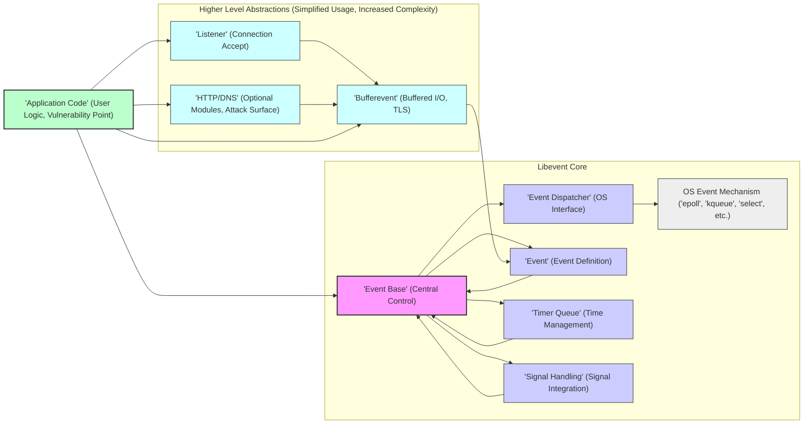
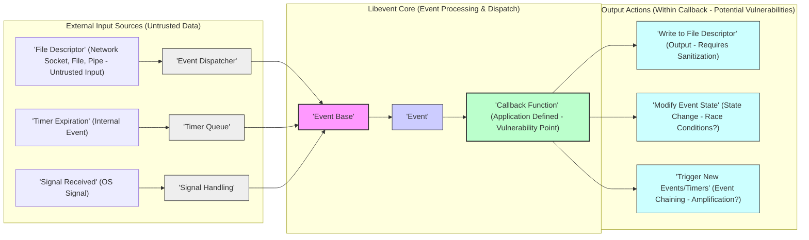

# Project Design Document: libevent for Threat Modeling (Improved)

**Project Name:** libevent

**Project Repository:** [https://github.com/libevent/libevent](https://github.com/libevent/libevent)

**Version:** v2.1.12-stable (Specific version for analysis - crucial for threat modeling as vulnerabilities can be version-specific)

**Document Version:** 1.1
**Date:** October 26, 2023
**Author:** [Your Name/Organization]

## 1. Introduction

This document provides an enhanced and detailed design overview of the libevent library, specifically tailored for comprehensive threat modeling and security analysis. Building upon the previous version, this document further clarifies the architecture, delves deeper into the security implications of key components and data flows, and emphasizes aspects critical for identifying potential security vulnerabilities. It serves as a robust foundation for developing targeted threat models and effective mitigation strategies for systems utilizing libevent.

Libevent remains a foundational C library for asynchronous event handling, abstracting OS-specific mechanisms like `select`, `poll`, `epoll`, `kqueue`, and `devpoll`. Its portability and efficiency make it a cornerstone in numerous network applications. This document aims to provide the necessary architectural context for security experts to perform thorough threat modeling.

## 2. Project Overview

**Purpose:** Libevent's core purpose is to simplify the development of event-driven applications by providing a consistent, performant, and cross-platform API for event notification. It handles the complexities of interacting with diverse OS event mechanisms, allowing developers to focus on application logic rather than low-level system calls.

**Key Features (Security Relevant Highlights):**

*   **Event Notification (File Descriptors, Signals, Timers):**  The core functionality, directly interacting with OS primitives. Security vulnerabilities here could stem from improper handling of file descriptors or signal race conditions.
*   **Bufferevents (Buffered I/O, TLS/SSL):**  A higher-level abstraction that simplifies network I/O but introduces complexities related to buffering, state management, and TLS/SSL integration. Vulnerabilities can arise from buffer overflows, incorrect state transitions, or TLS misconfigurations.
*   **Listener (Connection Handling):**  Manages incoming network connections. Security concerns include connection flooding, resource exhaustion, and vulnerabilities in connection acceptance logic.
*   **HTTP/DNS (Optional, Attack Surface Expansion):**  Optional modules increase the attack surface. HTTP parsing and DNS resolution are inherently complex and prone to vulnerabilities.
*   **Cross-Platform Compatibility (Varied OS Behavior):**  While a strength, cross-platform nature means potential variations in OS-level security behaviors and event mechanism implementations that need consideration during threat modeling.
*   **C Language Implementation (Memory Management Risks):**  Being written in C, libevent is susceptible to memory safety issues if not carefully coded.

**Target Audience:** Security architects, penetration testers, and developers responsible for securing applications that depend on libevent.

## 3. Architecture Overview (Detailed for Security)

Libevent's architecture is designed around the "Event Base," which acts as the central event management and dispatching unit. Understanding the interactions between components is crucial for threat modeling.

**Detailed Component Descriptions (Security Perspective):**

*   **"'Event Base' (Central Control)"**:  The core of libevent. Manages all registered events, timers, and signals. Security implications: If the event base itself has vulnerabilities (e.g., in its internal data structures or event management logic), it could compromise the entire application. Proper initialization, resource management, and error handling within the event base are critical.
*   **"'Event Dispatcher' (OS Interface)"**:  This component directly interacts with the operating system's event notification mechanisms. Security implications: Vulnerabilities could arise from incorrect usage of OS-specific APIs, race conditions in handling events from the OS, or differences in behavior across different OS implementations. The dispatcher must correctly translate OS events into libevent's internal representation and handle potential errors from system calls securely.
*   **"'Event' (Event Definition)"**: Represents a monitored event. Security implications: Improper event registration or management could lead to denial of service (e.g., registering too many events) or unexpected behavior.  Event structures themselves must be protected from unauthorized modification.
*   **"'Timer Queue' (Time Management)"**: Manages timers. Security implications: Timer accuracy and reliability are important.  Vulnerabilities could arise from timer manipulation (e.g., by an attacker influencing system time or timer queue logic) leading to unexpected application behavior or denial of service.
*   **"'Signal Handling' (Signal Integration)"**: Integrates signal handling into the event loop. Security implications: Signal handlers are inherently complex and can introduce race conditions or reentrancy issues. Improper signal handling can lead to crashes or exploitable conditions.  Careful consideration is needed to ensure signal handlers are safe and do not introduce vulnerabilities.
*   **"'Bufferevent' (Buffered I/O, TLS)"**: Provides buffered I/O and optional TLS/SSL. Security implications: Bufferevents are a significant attack surface. Buffer overflows in read/write operations, vulnerabilities in TLS/SSL integration (e.g., improper certificate validation, protocol downgrade attacks), and state management issues are potential risks.  Proper buffer size management, input validation, and secure TLS configuration are crucial.
*   **"'Listener' (Connection Accept)"**: Handles accepting new network connections. Security implications: Listener components are vulnerable to connection flooding attacks.  Improper handling of connection limits or vulnerabilities in connection acceptance logic can lead to denial of service or other attacks.
*   **"'HTTP/DNS' (Optional Modules, Attack Surface)"**: Optional HTTP and DNS client/server modules. Security implications: These modules significantly increase the attack surface. HTTP parsing vulnerabilities (e.g., request smuggling, header injection) and DNS vulnerabilities (e.g., DNS spoofing, injection attacks) are well-known risks. If used, these modules require thorough security scrutiny.

## 4. Data Flow (Security Focused)

Data flow in libevent is event-driven. Understanding how data enters, is processed, and exits the system is crucial for identifying data flow vulnerabilities.

**Data Flow Description (Security Emphasis):**

1.  **Untrusted Input:** Data primarily enters libevent through file descriptors, often network sockets. This input is inherently untrusted and must be treated as potentially malicious.
    *   **"'File Descriptor' (Network Socket, File, Pipe - Untrusted Input)"**: Data from network sockets, files, or pipes is the primary source of external input. This data is untrusted and requires rigorous validation within application callbacks.
    *   **"'Timer Expiration' (Internal Event)"**: Timers are internal events, generally less of a direct external threat vector, but timer logic vulnerabilities could still be exploited.
    *   **"'Signal Received' (OS Signal)"**: Signals are OS-level events. While signals themselves are not data streams, their handling can introduce vulnerabilities if not done securely.

2.  **Event Processing and Dispatch:** Libevent core components process events and dispatch them to application callbacks.
    *   **"'Event Dispatcher'", "'Timer Queue'", "'Signal Handling'"**: These components detect events and notify the "'Event Base'".
    *   **"'Event Base'"**:  Central event manager, dispatches events to registered "'Event'" objects.
    *   **"'Event'"**:  Represents the event and points to the "'Callback Function'".

3.  **Application Callback (Vulnerability Point):** The application-defined callback function is the primary point where vulnerabilities can be introduced if input is not handled securely.
    *   **"'Callback Function' (Application Defined - Vulnerability Point)"**: This is where application logic processes the event data. **Crucially, input validation, sanitization, and secure coding practices must be implemented within these callbacks to prevent vulnerabilities.**

4.  **Output Actions (Potential Vulnerabilities):** Actions taken within callbacks can also introduce vulnerabilities if not handled carefully.
    *   **"'Write to File Descriptor' (Output - Requires Sanitization)"**: Outputting data back to file descriptors, especially network sockets, requires careful sanitization to prevent injection attacks or information leaks.
    *   **"'Modify Event State' (State Change - Race Conditions?)"**: Modifying event states within callbacks needs to be thread-safe and carefully managed to avoid race conditions or unexpected behavior.
    *   **"'Trigger New Events/Timers' (Event Chaining - Amplification?)"**: Triggering new events or timers can create complex event chains.  Uncontrolled event chaining could be exploited for denial of service or amplification attacks.

## 5. Technology Stack (Security Implications)

*   **Programming Language: C (Memory Safety Concerns)**:  C's lack of automatic memory management necessitates careful coding to prevent memory safety vulnerabilities.
*   **Operating System Interfaces (Varied Security Landscape):**
    *   **Event Notification Mechanisms (`epoll`, `kqueue`, `select`, etc.)**:  Different OS mechanisms have varying performance and security characteristics.  Understanding the nuances of each mechanism is important for security analysis.
    *   **Timer and Signal System Calls**:  OS-level timer and signal handling can have security implications if not used correctly.
    *   **Socket APIs**:  Socket APIs are fundamental for network communication, and vulnerabilities in socket handling can have severe security consequences.
*   **Optional Libraries (Dependency Security):**
    *   **OpenSSL/TLS Libraries**:  If TLS/SSL is used, the security of the chosen TLS library is paramount. Vulnerabilities in OpenSSL or other TLS libraries directly impact libevent's security. Regular updates and secure configuration are essential.
    *   **zlib**:  If compression is used, vulnerabilities in zlib could be exploited.
*   **Build System (Supply Chain Security):** Autotools (configure, make) - While less direct, build system vulnerabilities or compromised build environments can also pose a security risk (supply chain attacks).

## 6. Security Considerations (Comprehensive Threat Landscape)

This section expands on the initial security considerations, providing a more structured threat landscape for libevent-based applications.

*   **Input Validation and Sanitization (Critical)**:
    *   **Threat:**  Injection attacks (command injection, SQL injection, header injection, etc.), buffer overflows, format string bugs.
    *   **Description:**  Failure to validate and sanitize input data received from file descriptors (especially network sockets) within application callbacks.
    *   **Mitigation:**  Rigorous input validation, sanitization, and encoding of all external data before processing or using it in system calls or output. Use safe string handling functions.

*   **Resource Exhaustion (Denial of Service)**:
    *   **Threat:** Event queue exhaustion, memory exhaustion, file descriptor exhaustion, CPU exhaustion.
    *   **Description:**  Attackers flooding the application with events, connections, or requests to consume resources and cause denial of service.
    *   **Mitigation:** Rate limiting, connection limits, resource quotas, input size limits, efficient resource management in callbacks, proper error handling to prevent resource leaks.

*   **Memory Safety Vulnerabilities (C Language Risks)**:
    *   **Threat:** Buffer overflows, use-after-free, double-free, memory leaks.
    *   **Description:**  Memory management errors in libevent or application code due to C's manual memory management.
    *   **Mitigation:**  Careful coding practices, code reviews, static analysis tools, fuzzing, memory sanitizers (e.g., AddressSanitizer, MemorySanitizer), using safe memory allocation and deallocation patterns.

*   **Signal Handling Vulnerabilities (Race Conditions, Reentrancy)**:
    *   **Threat:** Race conditions, deadlocks, unexpected program behavior, exploitable signal handlers.
    *   **Description:**  Improper signal handling leading to race conditions, reentrancy issues, or vulnerabilities in signal handlers themselves.
    *   **Mitigation:**  Careful design of signal handlers, minimizing work done in signal handlers, using async-signal-safe functions within signal handlers, proper synchronization mechanisms if needed, avoiding complex logic in signal handlers.

*   **TLS/SSL Vulnerabilities (If Bufferevent with TLS is Used)**:
    *   **Threat:** Protocol downgrade attacks, man-in-the-middle attacks, vulnerabilities in TLS library, improper certificate validation, weak cipher suites.
    *   **Description:**  Vulnerabilities in the TLS/SSL implementation or configuration when using bufferevents with TLS.
    *   **Mitigation:**  Using a secure and updated TLS library (e.g., OpenSSL), proper TLS configuration (strong cipher suites, certificate validation), regular updates of TLS libraries, staying informed about TLS vulnerabilities.

*   **Timing Attacks (Information Leaks)**:
    *   **Threat:** Information leaks through timing differences in event processing or callback execution.
    *   **Description:**  Attackers exploiting timing variations to infer sensitive information.
    *   **Mitigation:**  Constant-time operations where security-sensitive comparisons are performed, minimizing timing variations in critical code paths, considering the potential for timing attacks in security-sensitive applications.

*   **Configuration and Deployment Vulnerabilities (Environment Risks)**:
    *   **Threat:** Running with excessive privileges, exposing unnecessary services, insecure default configurations, vulnerable dependencies.
    *   **Description:**  Vulnerabilities arising from insecure configuration or deployment environments.
    *   **Mitigation:**  Principle of least privilege, disabling unnecessary features and modules, secure default configurations, regular security audits of configuration and deployment, secure dependency management.

*   **Dependency Vulnerabilities (Third-Party Libraries)**:
    *   **Threat:** Vulnerabilities in OpenSSL, zlib, or other dependent libraries.
    *   **Description:**  Libevent's security is also dependent on the security of its dependencies.
    *   **Mitigation:**  Regularly updating dependencies, monitoring security advisories for dependencies, using vulnerability scanning tools, considering the security posture of all dependencies.

## 7. Deployment Environment Assumptions (Security Context)

*   **Server Applications (High Exposure):** Network servers are highly exposed to external attacks and require robust security measures.
*   **Client Applications (Client-Side Risks):** Client applications can also be vulnerable, especially if they process untrusted data from servers.
*   **Embedded Systems (Resource Constraints, Unique Threats):** Embedded systems often have resource constraints and may be deployed in physically insecure environments, requiring specific security considerations.
*   **Operating Systems (OS-Specific Security):** Security measures need to be tailored to the specific operating system and its security features.
*   **User Context (Privilege Management):** Running applications with the least necessary privileges is a fundamental security principle.

## 8. Conclusion

This improved design document provides a more in-depth and security-focused overview of libevent. It highlights key components, data flows, and technology stack elements relevant to threat modeling. The expanded security considerations section offers a more comprehensive threat landscape, enabling security professionals to conduct more effective threat modeling exercises and develop robust mitigation strategies for applications built upon libevent.  This document should be used as a living document, updated as new vulnerabilities are discovered and as the project evolves.  Further steps in threat modeling would involve using this document to identify specific threat actors, attack vectors, and potential impacts within the context of a particular application using libevent.