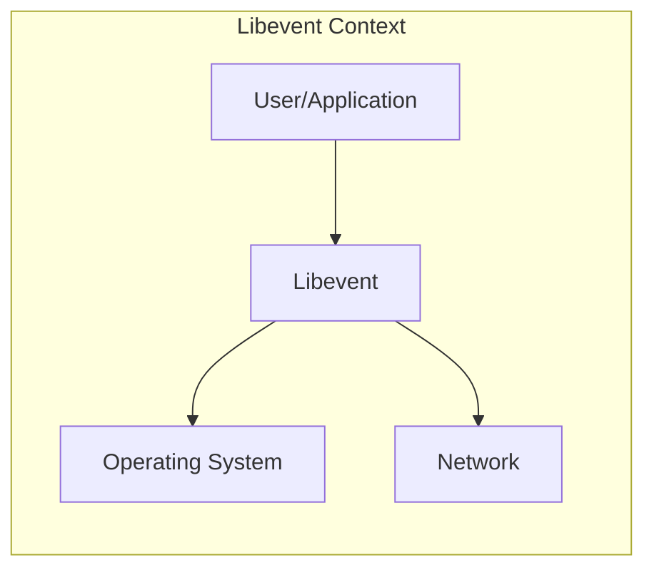
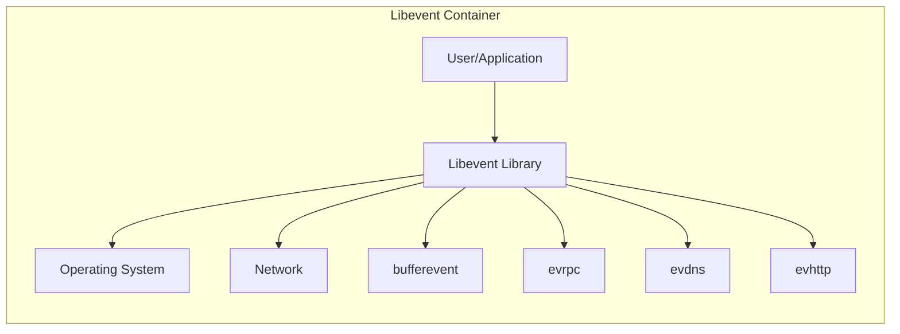
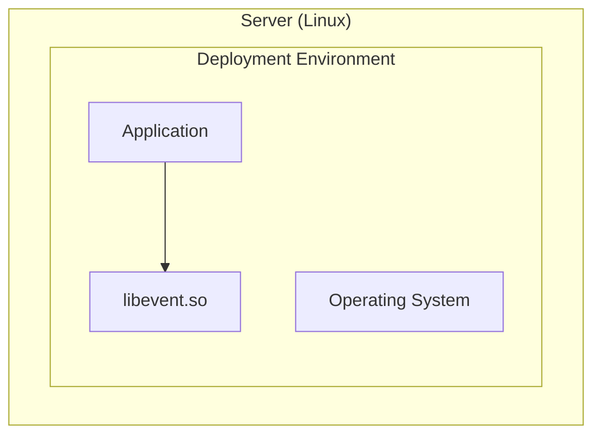

Okay, let's create a design document for Libevent.

# BUSINESS POSTURE

Libevent is a foundational, open-source library used by many other software projects, including high-profile applications and network services.  Its primary business goal is to provide a high-performance, scalable, and cross-platform event notification mechanism.  This enables developers to build applications that can handle a large number of concurrent connections and events efficiently.  The project's success is tied to its adoption, reliability, and performance.  It's not directly tied to revenue generation (like a commercial product), but its widespread use contributes to the overall health of the software ecosystem.

Business Priorities:

*   Reliability: Libevent must be extremely stable and bug-free, as it forms the core of many critical systems.  Crashes or unexpected behavior can have cascading effects.
*   Performance:  High performance and low overhead are paramount.  Libevent is often used in performance-sensitive applications.
*   Cross-Platform Compatibility:  Supporting a wide range of operating systems is crucial for broad adoption.
*   Maintainability:  The codebase should be maintainable and understandable to facilitate contributions and long-term support.
*   Security:  Given its role in handling network events, security is critical to prevent vulnerabilities that could be exploited in applications using Libevent.

Most Important Business Risks:

*   Security Vulnerabilities:  Bugs in Libevent, especially those related to network input handling, could be exploited to compromise applications that rely on it.  This is the highest risk.
*   Performance Degradation:  Changes that negatively impact performance could lead to developers abandoning Libevent for alternatives.
*   Lack of Maintenance:  If the project becomes unmaintained, it will become increasingly difficult to address bugs and security issues, leading to a decline in adoption and trust.
*   Platform Incompatibility:  Failure to keep up with new operating system releases or changes could limit Libevent's usefulness.

# SECURITY POSTURE

Existing Security Controls:

*   security control: Code Reviews: The project uses a pull request-based development model, which implies code reviews before merging changes. (Visible on GitHub).
*   security control: Fuzzing: The project includes fuzzing infrastructure (visible in the `test/fuzz` directory on GitHub). This helps to identify potential vulnerabilities by providing random inputs to the library.
*   security control: Static Analysis: The project mentions the use of Coverity Scan, a static analysis tool, in its documentation. (Mentioned in documentation).
*   security control: AddressSanitizer (ASan): The build system supports AddressSanitizer, a memory error detector. (Visible in build configuration files).
*   security control: Continuous Integration (CI): The project uses CI (GitHub Actions) to automatically build and test the code on various platforms. (Visible in `.github/workflows` on GitHub).
*   security control: Regression Tests: The project has a suite of regression tests to ensure that existing functionality continues to work as expected. (Visible in the `test` directory on GitHub).

Accepted Risks:

*   accepted risk: Complexity: The nature of event notification libraries inherently involves complex interactions with the operating system and network stack. This complexity increases the risk of subtle bugs.
*   accepted risk: Legacy Code: The project has a long history, and some parts of the codebase may be older and less well-understood than others.
*   accepted risk: Dependence on External Libraries: Libevent depends on system libraries (e.g., for cryptography), and vulnerabilities in those libraries could indirectly affect Libevent.

Recommended Security Controls:

*   security control: Regular Security Audits: Conduct periodic, independent security audits to identify vulnerabilities that may be missed by internal reviews and automated tools.
*   security control: Enhanced Fuzzing: Expand the fuzzing infrastructure to cover more code paths and input types. Consider using more advanced fuzzing techniques.
*   security control: Integrate More Static Analysis Tools: Incorporate additional static analysis tools, such as clang-tidy and other linters, to catch potential issues early in the development process.
*   security control: Vulnerability Disclosure Program: Establish a clear and well-defined vulnerability disclosure program to encourage responsible reporting of security issues.

Security Requirements:

*   Authentication: Not directly applicable to Libevent itself, as it's a low-level library. Authentication is the responsibility of applications using Libevent.
*   Authorization: Not directly applicable to Libevent itself. Authorization is the responsibility of applications using Libevent.
*   Input Validation:
    *   Libevent must carefully validate all input received from the operating system and network. This includes checking buffer sizes, data types, and other parameters to prevent buffer overflows, integer overflows, and other common vulnerabilities.
    *   Input validation should be performed as early as possible in the processing pipeline.
    *   Use a whitelist approach whenever possible, accepting only known-good input and rejecting everything else.
*   Cryptography:
    *   If Libevent is used for secure communication (e.g., with OpenSSL), it must correctly handle cryptographic operations, such as key exchange, encryption, and decryption.
    *   Use strong, well-vetted cryptographic libraries (like OpenSSL) and avoid implementing custom cryptography.
    *   Ensure that cryptographic keys and other sensitive data are handled securely.
*   Error Handling:
    *   Libevent must handle errors gracefully and avoid crashing or leaking sensitive information.
    *   Error messages should be informative but not reveal details that could be exploited by attackers.

# DESIGN

## C4 CONTEXT



Element Descriptions:

*   Element:
    *   Name: User/Application
    *   Type: External Entity (Software System)
    *   Description: Any application or user that utilizes Libevent for event notification.
    *   Responsibilities:
        *   Initializes and configures Libevent.
        *   Registers event handlers.
        *   Processes events dispatched by Libevent.
    *   Security controls:
        *   Implements application-level security controls (authentication, authorization, etc.).
        *   Uses Libevent securely, following best practices.

*   Element:
    *   Name: Libevent
    *   Type: Software System
    *   Description: The Libevent library itself.
    *   Responsibilities:
        *   Provides an abstraction layer for event notification.
        *   Interfaces with the operating system's event notification mechanisms (e.g., epoll, kqueue, select, poll).
        *   Manages event loops and dispatches events to registered handlers.
    *   Security controls:
        *   Input validation.
        *   Fuzzing.
        *   Static analysis.
        *   AddressSanitizer.

*   Element:
    *   Name: Operating System
    *   Type: External Entity (Operating System)
    *   Description: The underlying operating system (e.g., Linux, macOS, Windows).
    *   Responsibilities:
        *   Provides the core event notification mechanisms (e.g., epoll, kqueue, select, poll).
        *   Manages network sockets and other resources.
    *   Security controls:
        *   OS-level security features (e.g., firewalls, access controls).

*   Element:
    *   Name: Network
    *   Type: External Entity (Network)
    *   Description: The network infrastructure.
    *   Responsibilities:
        *   Transmits data to and from the application.
    *   Security controls:
        *   Network-level security controls (e.g., firewalls, intrusion detection systems).

## C4 CONTAINER

Since Libevent is a library, the container diagram is essentially the same as the context diagram.  It doesn't have separate deployable units *within* the library itself.  The "containers" are the modules within the library, but these are linked together at compile time.



Element Descriptions:

*   Element:
    *   Name: User/Application
    *   Type: External Entity (Software System)
    *   Description: Any application or user that utilizes Libevent for event notification.
    *   Responsibilities:
        *   Initializes and configures Libevent.
        *   Registers event handlers.
        *   Processes events dispatched by Libevent.
    *   Security controls:
        *   Implements application-level security controls (authentication, authorization, etc.).
        *   Uses Libevent securely, following best practices.

*   Element:
    *   Name: Libevent Library
    *   Type: Software System
    *   Description: The Libevent library itself.
    *   Responsibilities:
        *   Provides an abstraction layer for event notification.
        *   Interfaces with the operating system's event notification mechanisms (e.g., epoll, kqueue, select, poll).
        *   Manages event loops and dispatches events to registered handlers.
    *   Security controls:
        *   Input validation.
        *   Fuzzing.
        *   Static analysis.
        *   AddressSanitizer.

*   Element:
    *   Name: Operating System
    *   Type: External Entity (Operating System)
    *   Description: The underlying operating system (e.g., Linux, macOS, Windows).
    *   Responsibilities:
        *   Provides the core event notification mechanisms (e.g., epoll, kqueue, select, poll).
        *   Manages network sockets and other resources.
    *   Security controls:
        *   OS-level security features (e.g., firewalls, access controls).

*   Element:
    *   Name: Network
    *   Type: External Entity (Network)
    *   Description: The network infrastructure.
    *   Responsibilities:
        *   Transmits data to and from the application.
    *   Security controls:
        *   Network-level security controls (e.g., firewalls, intrusion detection systems).

*   Element:
    *   Name: bufferevent
    *   Type: Library Module
    *   Description: Provides a buffered I/O abstraction on top of the basic event notification.
    *   Responsibilities:
        *   Manages input and output buffers.
        *   Provides callbacks for read, write, and error events.
    *   Security controls:
        *   Input validation.
        *   Buffer overflow protection.

*   Element:
    *   Name: evrpc
    *   Type: Library Module
    *   Description: Provides a simple RPC (Remote Procedure Call) framework.
    *   Responsibilities:
        *   Handles RPC request and response serialization.
        *   Manages RPC connections.
    *   Security controls:
        *   Input validation.
        *   Protection against malformed RPC requests.

*   Element:
    *   Name: evdns
    *   Type: Library Module
    *   Description: Provides asynchronous DNS resolution.
    *   Responsibilities:
        *   Performs DNS lookups without blocking the main event loop.
    *   Security controls:
        *   Protection against DNS spoofing and other DNS-related attacks.

*   Element:
    *   Name: evhttp
    *   Type: Library Module
    *   Description: Provides a simple HTTP client and server implementation.
    *   Responsibilities:
        *   Handles HTTP request and response parsing.
        *   Manages HTTP connections.
    *   Security controls:
        *   Input validation.
        *   Protection against common HTTP vulnerabilities (e.g., cross-site scripting, injection attacks).

## DEPLOYMENT

Libevent is a library, not a standalone application. Therefore, it's "deployed" as part of other applications.  There are several common deployment scenarios:

1.  **Static Linking:** The Libevent code is compiled directly into the application executable.
2.  **Dynamic Linking:** The application links against a shared Libevent library (e.g., `libevent.so` on Linux, `libevent.dylib` on macOS, `libevent.dll` on Windows).
3.  **System Package:** Libevent is installed as a system package (e.g., via `apt`, `yum`, `brew`) and used by multiple applications.
4.  **Embedded Systems:** Libevent might be cross-compiled and deployed as part of a firmware image for an embedded device.

We'll describe the **Dynamic Linking** scenario in detail, as it's a very common approach.



Element Descriptions:

*   Element:
    *   Name: Application
    *   Type: Software System
    *   Description: An application that uses Libevent.
    *   Responsibilities:
        *   Performs its specific application logic.
        *   Uses Libevent for event handling.
    *   Security controls:
        *   Application-specific security controls.

*   Element:
    *   Name: libevent.so
    *   Type: Shared Library
    *   Description: The dynamically linked Libevent library.
    *   Responsibilities:
        *   Provides the Libevent API.
    *   Security controls:
        *   All security controls built into Libevent (fuzzing, static analysis, etc.).

*   Element:
    *   Name: Operating System
    *   Type: Operating System
    *   Description: The underlying operating system (Linux in this case).
    *   Responsibilities:
        *   Loads and manages shared libraries.
        *   Provides system calls and resources.
    *   Security controls:
        *   OS-level security features.

## BUILD

Libevent uses a combination of Autotools and CMake for its build system. The build process typically involves the following steps:

1.  **Developer:** Writes code and creates/modifies build files (e.g., `configure.ac`, `Makefile.am`, `CMakeLists.txt`).
2.  **Configuration:** The `configure` script (generated by Autotools) or CMake is run to determine the system configuration and generate build files (e.g., `Makefile`).
3.  **Compilation:** The source code is compiled into object files.
4.  **Linking:** The object files are linked together to create the Libevent library (either static or shared).
5.  **Testing:** The regression tests are run to verify the build.
6.  **Installation (Optional):** The library and header files are installed to a system directory.
7.  **Artifacts:** The build process produces the Libevent library files (e.g., `libevent.a`, `libevent.so`) and header files.

```mermaid
graph LR
    Developer[Developer] --> Git[Git Repository]
    Git --> CI[Continuous Integration Server]
    CI --> Configure[Configure (Autotools/CMake)]
    Configure --> Compile[Compile]
    Compile --> Link[Link]
    Link --> Test[Run Tests]
    Test --> Artifacts[Libevent Library Files]
    CI --> SAST[Static Analysis (Coverity)]
    CI --> Fuzz[Fuzzing]
    Developer -.-> Configure
```

Security Controls in the Build Process:

*   security control: Continuous Integration (CI): GitHub Actions is used to automatically build and test the code on every commit and pull request. This helps to catch errors early and ensures that the code works on different platforms.
*   security control: Static Analysis (SAST): Coverity Scan is used to perform static analysis of the code, identifying potential vulnerabilities.
*   security control: Fuzzing: The build process includes running fuzz tests to identify potential vulnerabilities by providing random inputs.
*   security control: AddressSanitizer (ASan): ASan is used during testing to detect memory errors.
*   security control: Compiler Warnings: The build system is configured to enable compiler warnings, which can help to identify potential coding errors.

# RISK ASSESSMENT

*   Critical Business Processes:
    *   Providing reliable and performant event notification to applications. This is the core function of Libevent.
    *   Maintaining a stable and secure codebase to ensure the long-term viability of the project.

*   Data We Are Trying to Protect:
    *   Libevent itself doesn't directly handle sensitive user data. However, it handles network data in transit, which *could* contain sensitive information depending on the application using it. The primary concern is preventing vulnerabilities that could allow attackers to:
        *   Intercept or modify network traffic.
        *   Gain control of the application using Libevent.
        *   Cause a denial-of-service (DoS) by crashing the application or the system.
    *   Data Sensitivity: The sensitivity of the data handled by Libevent depends entirely on the application using it. Libevent itself should be treated as a critical component, as vulnerabilities in it can have wide-ranging consequences.

# QUESTIONS & ASSUMPTIONS

*   Questions:
    *   Are there any specific performance targets or benchmarks that Libevent must meet?
    *   What is the process for handling security vulnerabilities reported by external researchers?
    *   Are there any plans to integrate additional security tools or techniques into the development process?
    *   What are the specific threat models that have been considered for Libevent?
    *   What is the long-term maintenance plan for Libevent?

*   Assumptions:
    *   BUSINESS POSTURE: The primary goal of the Libevent project is to provide a robust and performant event notification library, not to generate revenue directly.
    *   SECURITY POSTURE: The Libevent developers are committed to security and follow best practices for secure software development.
    *   DESIGN: The existing build system and testing infrastructure are adequate for maintaining the quality and security of the code. The library will continue to be used primarily through dynamic linking.
    *   The project will continue to rely on external libraries (like OpenSSL) for cryptographic functionality.
    *   The project will continue to support a wide range of operating systems.