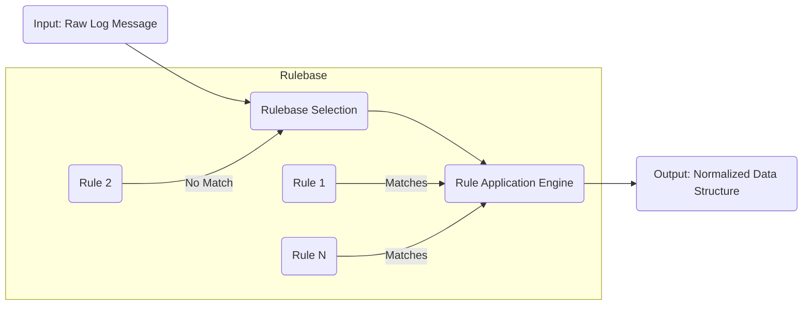
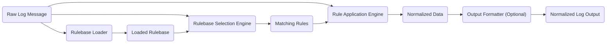

# Project Design Document: liblognorm

**Project Name:** liblognorm

**Project Repository:** [https://github.com/rsyslog/liblognorm](https://github.com/rsyslog/liblognorm)

**Document Version:** 1.1

**Date:** October 26, 2023

**Author:** Gemini (AI Language Model)

## 1. Introduction

This document provides a detailed design overview of the `liblognorm` project. `liblognorm` is a library designed for normalizing log messages. It provides a mechanism to parse unstructured log data into a structured format, making it easier to analyze and process. This document outlines the library's architecture, key components, data flow, and important considerations for its operation. This design document will serve as the foundation for subsequent threat modeling activities.

## 2. Goals and Objectives

The primary goals of `liblognorm` are:

*   **Log Message Normalization:** To provide a robust and efficient way to parse and structure diverse log message formats.
*   **Flexibility:** To support a wide range of log formats through configurable rulesets.
*   **Performance:** To process log messages with minimal overhead.
*   **Extensibility:** To allow for the addition of new log format definitions and parsing capabilities.
*   **Reliability:** To handle malformed or unexpected log data gracefully.

## 3. Scope

This design document covers the core functionalities of the `liblognorm` library, including:

*   Log message parsing and normalization process.
*   The structure and usage of rulebases.
*   Key internal components and their interactions.
*   Data flow within the library.
*   Configuration mechanisms.

This document does not cover:

*   Specific applications that utilize `liblognorm`.
*   The build process or packaging of the library.
*   Detailed implementation specifics of individual functions.

## 4. High-Level Architecture

The `liblognorm` library operates based on a rule-driven approach. It takes a raw log message as input and applies a set of rules defined in a rulebase to extract and structure the relevant information.

**Key Components:**

*   **Input:** The raw, unstructured log message string.
*   **Rulebase:** A collection of rules defining how to parse and structure different log formats.
*   **Rulebase Selection:** The process of identifying the appropriate rule(s) to apply to a given log message.
*   **Rule Application Engine:** The core component responsible for executing the rules against the log message and extracting data.
*   **Output:** A structured representation of the log message, typically a key-value pair structure or a similar data format.

## 5. Component Details

This section details the key components within the `liblognorm` library.

### 5.1. Rulebase

*   **Functionality:** Stores a collection of rules that define how to parse and normalize different log message formats. Each rule typically consists of a pattern to match against the log message and a set of field definitions to extract data.
*   **Inputs:**
    *   Configuration files defining the rules.
    *   In-memory data structures representing rule definitions.
*   **Outputs:**
    *   A structured representation of the rules accessible to the Rule Application Engine.
*   **Key Considerations:**
    *   The format and syntax of the rule definition language.
    *   The efficiency of rule lookup and matching.
    *   Mechanisms for managing and updating rulebases.

### 5.2. Rulebase Loader

*   **Functionality:** Responsible for loading and parsing rulebase definitions from various sources.
*   **Inputs:**
    *   Paths to rulebase definition files.
    *   In-memory rule definitions.
*   **Outputs:**
    *   An in-memory representation of the rulebase.
*   **Key Considerations:**
    *   Support for different rule definition formats (e.g., plain text, JSON, YAML).
    *   Error handling during rulebase loading (e.g., invalid syntax, file not found).
    *   Security considerations related to loading external rule definitions (e.g., path traversal vulnerabilities).

### 5.3. Rulebase Selection Engine

*   **Functionality:** Determines which rule(s) from the loaded rulebase are applicable to the input log message.
*   **Inputs:**
    *   The raw log message.
    *   The loaded rulebase.
*   **Outputs:**
    *   A list of matching rules.
*   **Key Considerations:**
    *   The efficiency of the rule matching algorithm (e.g., pattern matching, regular expression evaluation).
    *   Handling cases where multiple rules match (e.g., priority-based selection).
    *   Handling cases where no rules match.
    *   The order in which rules are evaluated.

### 5.4. Rule Application Engine

*   **Functionality:** Executes the selected rule(s) against the input log message to extract and structure the data.
*   **Inputs:**
    *   The raw log message.
    *   The selected rule(s).
*   **Outputs:**
    *   A structured representation of the extracted data (e.g., a dictionary or map of key-value pairs).
*   **Key Considerations:**
    *   The robustness of the parsing logic defined in the rules.
    *   Error handling during data extraction (e.g., malformed data, unexpected formats).
    *   Performance of the parsing process, especially for complex rules.
    *   Memory management during parsing to prevent leaks or excessive consumption.

### 5.5. Output Formatter (Optional)

*   **Functionality:** Transforms the extracted data into a specific output format.
*   **Inputs:**
    *   The structured data extracted by the Rule Application Engine.
*   **Outputs:**
    *   The normalized log message in the desired output format (e.g., JSON, key-value pairs, syslog format).
*   **Key Considerations:**
    *   Support for different output formats.
    *   Configuration options for the output format (e.g., field delimiters, quoting).

## 6. Data Flow

The typical data flow within `liblognorm` is as follows:

**Detailed Steps:**

1. A **Raw Log Message** is received as input.
2. The **Rulebase Loader** loads and parses the rule definitions, creating a **Loaded Rulebase**.
3. The **Rulebase Selection Engine** uses the **Raw Log Message** and the **Loaded Rulebase** to identify **Matching Rules**.
4. The **Rule Application Engine** takes the **Raw Log Message** and the **Matching Rules** to extract **Normalized Data**.
5. Optionally, the **Output Formatter** transforms the **Normalized Data** into a specific format, resulting in the **Normalized Log Output**.

## 7. Configuration

`liblognorm` relies on configuration to define the rulebases and potentially other operational parameters.

*   **Rulebase Files:** Configuration files containing the definitions of the rules used for parsing and normalization. These files are typically in a specific format understood by the Rulebase Loader.
*   **API Parameters:** Configuration options can be passed programmatically through the library's API, such as specifying the path to rulebase files, logging levels, or other settings.

## 8. Security Considerations

While a dedicated threat model will follow, some initial security considerations include:

*   **Rulebase Integrity:** Ensuring the integrity and authenticity of rulebase files to prevent malicious rule injection or tampering. This could involve using checksums or digital signatures.
*   **Input Validation:**  Thoroughly validating and sanitizing raw log messages to prevent injection attacks (e.g., command injection, log injection) or buffer overflows during parsing.
*   **Resource Consumption:**  Implementing safeguards to prevent denial-of-service attacks by limiting resource consumption during log processing (e.g., CPU time limits, memory limits, limits on the complexity of rules).
*   **Error Handling:**  Implementing robust error handling to prevent information leakage or unexpected behavior when processing malformed or malicious logs. Avoid exposing sensitive information in error messages.
*   **Regular Expression Security:**  If regular expressions are used in rules, ensuring they are carefully crafted to avoid catastrophic backtracking (ReDoS) or other performance issues. Consider using safe regular expression libraries or techniques.
*   **Dependency Management:**  Maintaining up-to-date dependencies to address known security vulnerabilities in third-party libraries.
*   **Secure Defaults:**  Ensuring that default configurations are secure and minimize potential attack surfaces.
*   **Principle of Least Privilege:**  If the library interacts with the file system or other resources, ensure it operates with the minimum necessary privileges.

## 9. Deployment Considerations

`liblognorm` is typically deployed as a library that is linked into other applications or systems that need to normalize log messages. Key deployment considerations include:

*   **Integration with Logging Infrastructure:**  Ensuring seamless integration with existing logging pipelines and systems.
*   **Performance Impact:**  Understanding the performance overhead introduced by `liblognorm` and optimizing its configuration and usage accordingly.
*   **Resource Allocation:**  Allocating sufficient resources (CPU, memory) to the applications using `liblognorm` to handle the expected log volume.
*   **Security Context:**  Deploying and running applications using `liblognorm` in a secure environment with appropriate access controls.

## 10. Future Considerations

*   **Enhanced Rule Definition Language:**  Potentially expanding the rule definition language to support more complex parsing scenarios, data transformations, or conditional logic.
*   **Performance Optimizations:**  Continuously improving the performance of the parsing and rule matching engines through algorithmic improvements or code optimization.
*   **Support for New Log Formats:**  Adding support for emerging or less common log formats and providing mechanisms for users to easily contribute new format definitions.
*   **Integration with Other Systems:**  Exploring potential integrations with other log management, security information and event management (SIEM), or analysis tools.
*   **Metrics and Monitoring:**  Adding capabilities to expose metrics about the library's performance and operation for monitoring purposes.
