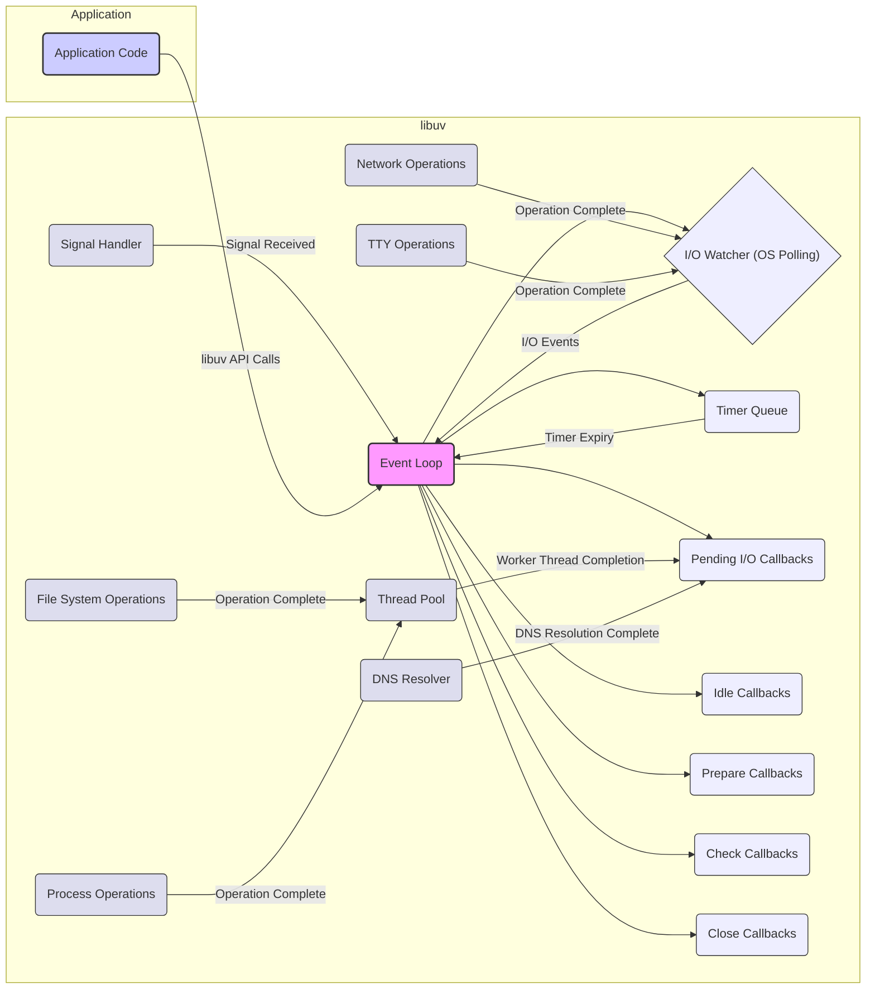

# Project Design Document: libuv

**Version:** 1.1
**Date:** October 26, 2023
**Prepared By:** Gemini (AI Language Model)

## 1. Introduction

This document provides an enhanced and more detailed design overview of the libuv library, specifically tailored for threat modeling. It builds upon the previous version, offering greater clarity and focusing on potential security implications within the library's architecture and functionality.

### 1.1. Purpose

The primary purpose of this document remains to provide a comprehensive understanding of libuv's design to facilitate effective threat modeling. This revised version aims to offer more specific details and examples to aid in identifying potential vulnerabilities and security risks.

### 1.2. Target Audience

The target audience remains the same:

* Security engineers and architects responsible for threat modeling and security assessments.
* Developers who are building applications on top of libuv and need to understand its security implications.
* Anyone seeking a deeper, security-focused understanding of libuv's internal workings.

### 1.3. Scope

The scope is largely consistent with the previous version but with a greater emphasis on security-relevant aspects:

* The event loop and its operation, with a focus on potential points of failure or manipulation.
* Handling of I/O operations (network, file system, etc.), highlighting potential vulnerabilities in each.
* Timer management and its potential for abuse.
* Process and thread management, with a focus on security implications of forking and threading.
* Signal handling and its susceptibility to race conditions or malicious signals.
* TTY handling and potential risks associated with terminal interactions.
* DNS resolution and its vulnerability to spoofing and other attacks.

This document still does not cover:

* Specific language bindings for libuv (e.g., Node.js).
* Extremely low-level implementation specifics within each component unless directly relevant to security.
* Performance optimization strategies, except where they intersect with security concerns.

### 1.4. Assumptions

The assumptions remain the same:

* The reader has a basic understanding of operating system concepts, including processes, threads, and I/O operations.
* The reader is familiar with the general principles of event-driven programming.

## 2. Project Overview

libuv is a foundational library for asynchronous I/O, crucial for building high-performance, event-driven applications. Its cross-platform nature and efficient handling of concurrency make it a popular choice, but also necessitate careful security considerations.

Key features of libuv, from a security perspective, include:

* **Centralized Event Loop:**  A single point of control, making it a critical component to secure.
* **Asynchronous Nature:** While improving performance, it introduces complexities in managing state and potential race conditions.
* **Platform Abstraction:** While beneficial for development, it requires understanding the security implications of the underlying platform-specific implementations.
* **Thread Pool Usage:** Offloading tasks introduces potential vulnerabilities related to thread safety and data sharing.
* **Interaction with OS Resources:**  Managing file descriptors, processes, and signals requires careful handling to prevent abuse.

## 3. Architectural Design

The architecture, centered around the event loop, presents several areas for potential security vulnerabilities.

### 3.1. Key Components and Security Implications

* **Event Loop (`uv_loop_t`):**
    * **Security Implication:** If the event loop is compromised or its execution flow is manipulated, the entire application's behavior can be affected. For example, delaying or dropping events could lead to denial of service.
* **Handles (`uv_handle_t`):**
    * **Sockets (`uv_tcp_t`, `uv_udp_t`):**
        * **Security Implication:** Vulnerable to attacks like buffer overflows (if not handling incoming data correctly), man-in-the-middle attacks (if not using encryption), and denial-of-service attacks (e.g., SYN floods). Improper closure can lead to resource leaks.
    * **Files (`uv_fs_t`):**
        * **Security Implication:** Susceptible to path traversal vulnerabilities, allowing access to unauthorized files. Incorrect permission handling can lead to information disclosure or modification.
    * **Timers (`uv_timer_t`):**
        * **Security Implication:**  Maliciously manipulating timer intervals or callbacks could disrupt application logic or trigger unintended actions.
    * **Processes (`uv_process_t`):**
        * **Security Implication:**  Command injection vulnerabilities if input to spawned processes is not sanitized. Privilege escalation if the spawned process runs with elevated privileges.
    * **Pipes (`uv_pipe_t`):**
        * **Security Implication:**  Similar to sockets, vulnerable to buffer overflows and information leaks if not handled carefully. Security of inter-process communication depends on the security of the communicating processes.
    * **TTYs (`uv_tty_t`):**
        * **Security Implication:**  Potential for terminal injection attacks if untrusted data is written to the TTY.
    * **Signals (`uv_signal_t`):**
        * **Security Implication:**  Race conditions in signal handlers can lead to unexpected behavior. Malicious signals could be used to terminate or disrupt the application.
* **Requests (`uv_req_t`):**
    * **Security Implication:**  The callbacks associated with requests are critical. If a callback is compromised, it can lead to arbitrary code execution.
* **I/O Watcher (OS Polling):**
    * **Security Implication:**  While largely managed by the OS, vulnerabilities in the underlying polling mechanism could potentially be exploited.
* **Timer Queue:**
    * **Security Implication:**  Manipulation of the timer queue could lead to denial of service or unexpected execution of callbacks.
* **Thread Pool:**
    * **Security Implication:**  Race conditions and data corruption if shared resources are not properly synchronized. Vulnerabilities in worker threads could compromise the entire application.
* **Signal Handler:**
    * **Security Implication:**  Asynchronous signal handling can be complex and prone to race conditions. Reentrant functions must be used carefully within signal handlers.
* **DNS Resolver:**
    * **Security Implication:**  Vulnerable to DNS spoofing attacks, potentially redirecting the application to malicious servers.

### 3.2. Event Loop Operation and Potential Threats

The cyclical nature of the event loop presents several points where vulnerabilities could be introduced:

1. **Polling for I/O Events:**
    * **Threat:**  If the underlying OS polling mechanism has vulnerabilities, it could be exploited. Resource exhaustion by registering a large number of file descriptors.
2. **Running Timers:**
    * **Threat:**  Manipulation of the timer queue could delay critical operations or trigger malicious code at specific times.
3. **Processing Pending Callbacks:**
    * **Threat:**  Vulnerabilities in callback functions are a major concern, potentially leading to arbitrary code execution. Race conditions if multiple callbacks access shared resources.
4. **Handling Signals:**
    * **Threat:**  Signal handlers can interrupt normal execution flow, and if not carefully written, can introduce race conditions or vulnerabilities.

## 4. Data Flow and Security Considerations

Understanding how data flows through libuv is crucial for identifying potential attack vectors.

* **Inbound Data (e.g., from Network Sockets):**
    * **Flow:** Data arrives at the socket, is detected by the I/O watcher, and a read callback is invoked.
    * **Security Consideration:**  This is a primary entry point for attacks. Insufficient input validation in the read callback can lead to buffer overflows, format string bugs, and other vulnerabilities.
* **Outbound Data (e.g., sending data over a Socket):**
    * **Flow:** The application calls a write function, and libuv handles the asynchronous write operation.
    * **Security Consideration:**  Ensure data being sent is properly sanitized to prevent injection attacks on the receiving end.
* **File System Operations:**
    * **Flow:** The application requests a file system operation (read, write, open), which is often handled by the thread pool.
    * **Security Consideration:**  Path traversal vulnerabilities if file paths are not validated. Incorrect permission handling can lead to unauthorized access.
* **Data passed to Child Processes:**
    * **Flow:** When spawning a process, data might be passed as arguments or through pipes.
    * **Security Consideration:**  Command injection vulnerabilities if arguments are not properly escaped or sanitized.
* **Data received from DNS Resolution:**
    * **Flow:** The application initiates a DNS lookup, and the resolved IP address is returned via a callback.
    * **Security Consideration:**  Susceptible to DNS spoofing. Applications should implement checks to verify the authenticity of DNS responses.

## 5. Key Security Considerations (Expanded)

This section expands on the initial security considerations, providing more specific examples:

* **Input Validation:**
    * **Network Data:** Validate the size and format of incoming data to prevent buffer overflows. Sanitize data to prevent injection attacks (e.g., SQL injection if data is used in database queries).
    * **File Paths:**  Canonicalize and validate file paths to prevent path traversal vulnerabilities.
    * **Process Arguments:**  Sanitize arguments passed to spawned processes to prevent command injection.
* **Resource Management:**
    * **File Descriptors:**  Ensure proper closure of file descriptors to prevent leaks. Implement limits on the number of open connections or files to mitigate denial-of-service attacks.
    * **Memory Allocation:**  Be mindful of memory allocation and deallocation to prevent memory leaks and use-after-free vulnerabilities.
    * **Thread Pool:**  Limit the size of the thread pool to prevent resource exhaustion.
* **Concurrency and Thread Safety:**
    * **Synchronization Primitives:**  Use mutexes, semaphores, or other synchronization primitives to protect shared resources accessed by multiple threads.
    * **Atomic Operations:**  Utilize atomic operations where appropriate to ensure data consistency.
* **Signal Handling:**
    * **Reentrancy:**  Ensure that functions called within signal handlers are reentrant.
    * **Signal Masking:**  Use signal masking to prevent race conditions.
* **DNS Security:**
    * **DNSSEC:**  Consider using DNSSEC to verify the authenticity of DNS responses.
    * **Timeout Configuration:**  Implement appropriate timeouts for DNS lookups to prevent indefinite delays.
* **File System Security:**
    * **Principle of Least Privilege:**  Run the application with the minimum necessary privileges.
    * **Secure File Permissions:**  Set appropriate file permissions to restrict access.
* **Process Management Security:**
    * **Input Sanitization:**  Thoroughly sanitize any input passed to child processes.
    * **Principle of Least Privilege:**  Spawn child processes with the minimum necessary privileges.
* **Error Handling:**
    * **Avoid Information Disclosure:**  Do not expose sensitive error information in error messages.
    * **Graceful Degradation:**  Implement mechanisms for graceful degradation in case of errors.
* **Dependency Security:**
    * **Regular Updates:** Keep libuv and the underlying operating system updated to patch known vulnerabilities.

## 6. Assumptions for Threat Modeling

When performing threat modeling, consider these assumptions, but also challenge them to identify potential weaknesses:

* **Trusted libuv Implementation:** Assume the core libuv library itself is free of intentional backdoors.
* **Competent Developers:** Assume developers using libuv understand basic security principles.
* **Reasonable OS Security:** Assume the underlying operating system provides a baseline level of security.

## 7. Out of Scope for Threat Modeling (Initial Focus)

The initial threat modeling should focus on vulnerabilities directly related to libuv's core functionalities. The following remain out of scope for the initial phase:

* **Vulnerabilities in specific language bindings (e.g., Node.js API vulnerabilities).**
* **Highly application-specific logic built on top of libuv.**
* **Extremely theoretical or improbable attack scenarios.**

This enhanced design document provides a more detailed and security-focused understanding of libuv, serving as a stronger foundation for effective threat modeling. By considering the potential vulnerabilities associated with each component and data flow, security engineers and developers can build more resilient and secure applications.