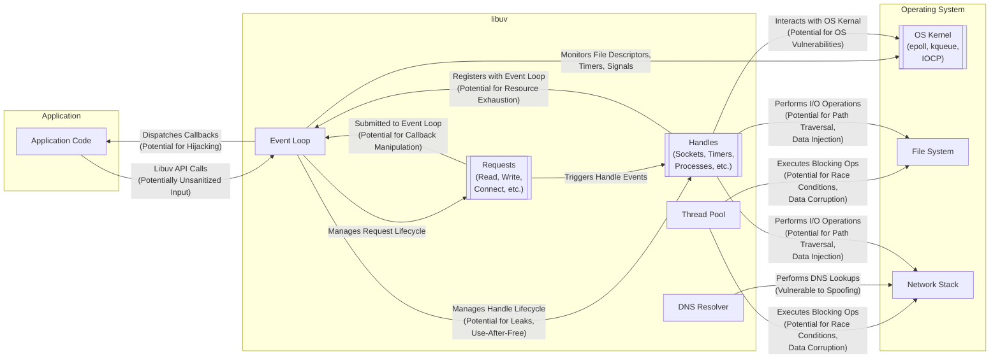

## Project Design Document: libuv (Improved for Threat Modeling)

**1. Introduction**

This document provides an enhanced high-level design overview of the libuv library, specifically tailored to facilitate thorough threat modeling. It aims to clearly articulate the architecture, components, and key functionalities of libuv, with a strong emphasis on identifying potential security vulnerabilities and attack surfaces. This document is intended for security architects, developers, and anyone involved in assessing the security posture of systems utilizing libuv.

**2. Goals**

* Provide a comprehensive architectural overview of libuv with a security-centric lens.
* Identify key components and their interactions, highlighting potential security implications.
* Detail potential attack surfaces and vulnerabilities within libuv's architecture.
* Serve as a foundational document for structured threat modeling exercises.
* Enable informed security analysis and mitigation strategies.

**3. Scope**

This document covers the core functionalities and architecture of the libuv library as represented by the code in the linked GitHub repository. It focuses on the logical components, their interactions, and potential security ramifications, without delving into excessive platform-specific implementation details unless directly relevant to security.

**4. Target Audience**

* Security Architects
* Software Developers
* Security Engineers
* Penetration Testers
* Security Auditors

**5. System Overview**

libuv is a foundational, multi-platform library providing asynchronous I/O capabilities. Its core strength lies in offering a consistent API across diverse operating systems for network and file system operations, alongside other system-level functionalities. The central concept is an event loop, which efficiently monitors file descriptors and other event sources, dispatching associated callbacks upon event triggers. This asynchronous model enables applications to perform non-blocking I/O, improving performance and responsiveness. From a security perspective, the asynchronous nature and interaction with the underlying OS introduce complexities that need careful consideration.

**Key Features:**

* **Centralized Event Loop:** Manages and dispatches events, a critical point for monitoring and potential manipulation.
* **Asynchronous TCP and UDP Sockets:** Handles network communication, a major attack vector.
* **Asynchronous DNS Resolution:** Involves external lookups, susceptible to spoofing and manipulation.
* **Asynchronous File System Operations:** Interacts with the file system, requiring careful permission and access control.
* **Child Process Spawning and Management:** Introduces risks related to command injection and privilege escalation.
* **Signal Handling:**  Can be exploited for process control or denial-of-service.
* **Timer Management:** While seemingly benign, can be used for timing attacks or resource exhaustion.
* **TTY Control:** Interaction with terminal devices can have security implications related to escape sequences and control characters.
* **ANSI Escape Code Emulation for TTYs:** Potential for terminal injection vulnerabilities.
* **Inter-Process Communication (IPC) with Pipes and Unix Domain Sockets:** Requires careful management of access and data integrity between processes.
* **Thread Pool for Offloading Blocking Operations:** Introduces concurrency challenges and potential race conditions.

**6. Component Breakdown (with Security Considerations)**

This section details the major components of libuv and their responsibilities, with a focus on potential security implications.

* **Event Loop:**
    * **Responsibility:**  The core orchestrator, monitoring and dispatching events.
    * **Security Considerations:**
        * **Event Injection:** Can malicious events be injected into the loop?
        * **Starvation:** Can an attacker flood the loop with events, causing denial-of-service?
        * **Callback Hijacking:** Could an attacker manipulate callbacks to execute arbitrary code?
        * **Timing Attacks:** Can the timing of event dispatch reveal sensitive information?
    * **Attack Surfaces:**  Interfaces for registering and triggering events, internal scheduling mechanisms.

* **Handles:**
    * **Responsibility:** Represent long-lived resources managed by the event loop.
    * **Security Considerations:**
        * **Handle Leakage:** Failure to properly close handles can lead to resource exhaustion.
        * **Use-After-Free:** Accessing handles after they are closed can lead to crashes or arbitrary code execution.
        * **Type Confusion:**  Treating a handle as a different type can lead to unexpected behavior and potential vulnerabilities.
    * **Attack Surfaces:** APIs for creating, accessing, and closing handles.
    * **Examples:**
        * **`uv_tcp_t` (TCP Socket):**  Vulnerable to typical network attacks (e.g., SYN floods, data injection).
        * **`uv_udp_t` (UDP Socket):** Susceptible to spoofing and amplification attacks.
        * **`uv_timer_t` (Timer):** Potential for timing attacks or resource exhaustion if timers are created excessively.
        * **`uv_fs_event_t` (File System Event Watcher):**  Can be used to monitor sensitive files or directories. Vulnerable if not properly authorized.
        * **`uv_process_t` (Child Process):** High-risk if not handled carefully. Command injection, privilege escalation are major concerns.
        * **`uv_signal_t` (Signal Handler):**  Can be exploited for process termination or unexpected behavior.
        * **`uv_pipe_t` (Pipe/Unix Domain Socket):** Requires careful access control to prevent unauthorized communication.
        * **`uv_tty_t` (TTY):** Vulnerable to terminal injection attacks via escape sequences.

* **Requests:**
    * **Responsibility:** Represent short-lived asynchronous operations.
    * **Security Considerations:**
        * **Callback Manipulation:** Could an attacker influence the callbacks associated with requests?
        * **Data Corruption:** Can data be corrupted during asynchronous operations?
        * **Race Conditions:** Asynchronous nature can introduce race conditions leading to unexpected states.
    * **Attack Surfaces:** APIs for initiating and managing requests, callback mechanisms.
    * **Examples:**
        * **`uv_connect_t` (Connection Request):** Potential for connection hijacking or man-in-the-middle attacks if not secured with TLS.
        * **`uv_write_t` (Write Operation):**  Vulnerable to buffer overflows or format string bugs if data is not sanitized.
        * **`uv_read_t` (Read Operation):**  Potential for reading sensitive data if permissions are not properly enforced.
        * **`uv_fs_req_t` (File System Operation Request):**  Vulnerable to path traversal attacks if file paths are not validated.
        * **`uv_getaddrinfo_t` (DNS Lookup Request):** Susceptible to DNS spoofing attacks.

* **OS Abstraction Layer:**
    * **Responsibility:** Provides a consistent API across operating systems.
    * **Security Considerations:**
        * **Platform-Specific Vulnerabilities:** Bugs in the underlying OS can be exposed through this layer.
        * **Incorrect Abstraction:**  Improper abstraction can lead to inconsistent security behavior across platforms.
    * **Attack Surfaces:**  System calls and OS-specific APIs used by this layer.

* **Thread Pool:**
    * **Responsibility:** Executes blocking operations off the main thread.
    * **Security Considerations:**
        * **Race Conditions:** Shared resources accessed by threads can lead to race conditions.
        * **Data Corruption:** Improper synchronization can lead to data corruption.
        * **Thread Starvation:** An attacker might be able to starve the thread pool, causing denial-of-service.
    * **Attack Surfaces:**  Interfaces for submitting tasks to the thread pool, shared memory or data structures.

* **DNS Resolver:**
    * **Responsibility:** Performs asynchronous DNS resolution.
    * **Security Considerations:**
        * **DNS Spoofing:**  Vulnerable to attacks where malicious DNS responses are injected.
        * **DNS Cache Poisoning:**  Attacker might be able to poison the DNS cache.
    * **Attack Surfaces:**  Interfaces for initiating DNS lookups, handling DNS responses.

* **Signal Handling:**
    * **Responsibility:** Allows applications to handle system signals.
    * **Security Considerations:**
        * **Signal Injection:**  Can an attacker send signals to the process?
        * **Signal Handler Vulnerabilities:**  Bugs in signal handlers can be exploited.
        * **Denial-of-Service:**  Sending specific signals can terminate the process.
    * **Attack Surfaces:**  APIs for registering signal handlers, mechanisms for signal delivery.

* **File System Operations:**
    * **Responsibility:** Provides asynchronous file system access.
    * **Security Considerations:**
        * **Path Traversal:**  Improperly validated file paths can allow access to unauthorized files.
        * **Symbolic Link Attacks:**  Manipulating symbolic links can lead to unintended file access or modification.
        * **Race Conditions:**  Asynchronous operations can introduce race conditions in file access.
        * **Permission Issues:** Incorrect file permissions can lead to unauthorized access.
    * **Attack Surfaces:** APIs for opening, reading, writing, and manipulating files.

* **Networking:**
    * **Responsibility:** Handles asynchronous TCP and UDP socket operations.
    * **Security Considerations:**
        * **Network Protocol Vulnerabilities:**  Susceptible to attacks specific to TCP and UDP protocols (e.g., SYN floods, UDP amplification).
        * **Data Injection:**  Malicious data can be injected into network streams.
        * **Man-in-the-Middle Attacks:**  Communication can be intercepted if not secured with encryption.
    * **Attack Surfaces:** APIs for creating, binding, connecting, sending, and receiving data on sockets.

* **TTY/Pty Support:**
    * **Responsibility:**  Provides interaction with terminal devices.
    * **Security Considerations:**
        * **Terminal Injection Attacks:**  Malicious escape sequences can be injected to execute commands or manipulate the terminal.
        * **Information Disclosure:**  Sensitive information might be displayed on the terminal.
    * **Attack Surfaces:** APIs for controlling terminal attributes and reading/writing data.

* **IPC (Pipes and Unix Domain Sockets):**
    * **Responsibility:** Enables inter-process communication.
    * **Security Considerations:**
        * **Unauthorized Access:**  Lack of proper access controls can allow unauthorized processes to communicate.
        * **Data Tampering:**  Data exchanged between processes can be intercepted and modified.
    * **Attack Surfaces:** APIs for creating and managing pipes and sockets, sending and receiving data.

**7. Data Flow Diagram (Security Focused)**

**8. Security Considerations (Detailed)**

This section expands on the initial security thoughts, providing more specific examples and potential attack scenarios.

* **Input Validation:**
    * **Threat:** Malicious input to libuv APIs (e.g., filenames, network addresses, data buffers) could lead to buffer overflows, format string bugs, or path traversal vulnerabilities.
    * **Example:** Passing a long, uncontrolled string as a filename to `uv_fs_open`.

* **Resource Management:**
    * **Threat:** Failure to properly manage resources (file descriptors, memory, threads) can lead to denial-of-service attacks.
    * **Example:**  Creating a large number of sockets without closing them, exhausting system resources.

* **Privilege Escalation:**
    * **Threat:** Vulnerabilities in libuv could be exploited to gain higher privileges, especially when spawning child processes.
    * **Example:**  Improperly sanitizing arguments passed to `uv_spawn`, allowing command injection.

* **Data Confidentiality and Integrity:**
    * **Threat:** Sensitive data handled by libuv could be exposed or modified if not properly protected.
    * **Example:** Reading sensitive files without proper authorization or transmitting data over unencrypted connections.

* **Concurrency and Thread Safety:**
    * **Threat:** Race conditions in libuv's internal logic or in applications using libuv can lead to unpredictable behavior and security vulnerabilities.
    * **Example:** Multiple threads accessing shared handle data without proper synchronization.

* **Dependency Management:**
    * **Threat:** While libuv has few direct dependencies, vulnerabilities in the underlying OS or its standard libraries can impact libuv's security.
    * **Example:** A vulnerability in the OS's socket implementation could be exploitable through libuv's socket APIs.

* **Error Handling:**
    * **Threat:** Insufficient or incorrect error handling can lead to unexpected program states or information disclosure.
    * **Example:**  Failing to check the return value of a system call, leading to subsequent operations on invalid resources.

* **Secure Defaults:**
    * **Threat:** Insecure default configurations or behaviors can leave applications vulnerable.
    * **Example:**  Default permissions for created files being overly permissive.

* **Signal Handling Security:**
    * **Threat:** Malicious actors could send signals to disrupt the application or trigger unintended behavior.
    * **Example:** Sending a `SIGKILL` signal to terminate a critical process.

* **DNS Spoofing and Hijacking:**
    * **Threat:** Attackers can manipulate DNS responses to redirect network traffic to malicious servers.
    * **Example:**  A DNS spoofing attack could lead an application to connect to a fake server.

* **File System Race Conditions:**
    * **Threat:** Asynchronous file system operations can create opportunities for race conditions, such as time-of-check-time-of-use (TOCTOU) vulnerabilities.
    * **Example:** Checking if a file exists and then opening it, but the file is removed in between.

**9. Dependencies**

libuv has minimal external dependencies. Its primary dependency is the standard C library (`libc`). It also relies on operating system-specific APIs for its core functionalities, making it indirectly dependent on the security of the underlying OS kernel and its libraries.

**10. Deployment Considerations**

libuv is typically embedded within applications and libraries that require asynchronous I/O capabilities. Its security posture is heavily influenced by the security of the host operating system and the application that utilizes it. Care should be taken to deploy applications using libuv in secure environments with appropriate access controls and security hardening.

**11. Future Considerations**

* As libuv evolves, new features and functionalities may introduce new attack surfaces and vulnerabilities, requiring continuous security assessment and updates to this document.
* Further detailed design documents focusing on the security aspects of specific components or features could be created for deeper analysis.
* Integration with static and dynamic analysis tools can help identify potential vulnerabilities in libuv and applications using it.

This improved document provides a more security-focused understanding of the architecture of libuv, highlighting potential threats and vulnerabilities to facilitate effective threat modeling and security analysis.