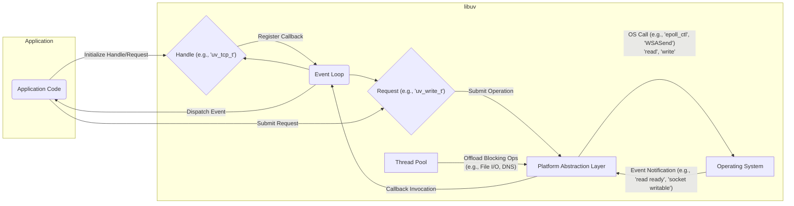

## Improved Project Design Document: libuv

**1. Introduction**

This document provides an enhanced and detailed design overview of the libuv library. Its primary purpose is to serve as a comprehensive reference for understanding the architectural components, data flows, and external interfaces of libuv, specifically to facilitate thorough threat modeling activities. This document aims to provide the necessary depth and clarity for security analysts and developers to identify potential security vulnerabilities and attack surfaces within the library.

**2. Project Overview**

libuv is a high-performance, multi-platform support library that provides asynchronous I/O capabilities. It offers a consistent API across various operating systems, abstracting away platform-specific differences and complexities. This allows developers to write portable and efficient applications that leverage non-blocking I/O operations. libuv is crucial for building event-driven applications and is the foundation for popular platforms like Node.js. Its core functionalities include:

*   Performing asynchronous file system operations without blocking the main thread.
*   Providing asynchronous DNS resolution to avoid blocking network operations.
*   Enabling non-blocking network communication using TCP and UDP.
*   Managing child processes asynchronously.
*   Controlling TTY devices.
*   Handling operating system signals gracefully.
*   Efficiently polling file descriptors, sockets, and timers for events.
*   Offering threading primitives for parallel execution of tasks.

libuv is designed with a focus on being lightweight, efficient, and embeddable, making it a versatile choice for various software projects.

**3. Goals**

The primary goals of this enhanced design document are to:

*   Clearly and comprehensively articulate the architecture and key components of libuv, providing sufficient detail for security analysis.
*   Thoroughly describe the data flow and interactions between different parts of the library, highlighting potential points of interest for security vulnerabilities.
*   Precisely identify the external interfaces and dependencies of libuv, including interactions with the underlying operating system.
*   Provide a robust and detailed foundation to enable effective and comprehensive threat modeling of the library.

**4. Core Components**

The following are the key components of the libuv library, with more detailed explanations:

*   **Event Loop:** The central control mechanism of libuv. It continuously polls for events on registered handles and timers. When an event occurs, the event loop dispatches the corresponding callback function. This non-blocking nature is fundamental to libuv's asynchronous operation.
*   **Handles:** Abstractions representing long-lived resources that participate in the event loop. Each handle type has specific methods for initiating and managing asynchronous operations:
    *   `uv_tcp_t`: Represents a TCP socket, used for establishing reliable, connection-oriented network communication.
    *   `uv_udp_t`: Represents a UDP socket, used for connectionless network communication.
    *   `uv_pipe_t`: Represents a named pipe (on Windows) or a Unix domain socket (on Unix-like systems), used for inter-process communication.
    *   `uv_tty_t`: Represents a TTY (teletypewriter) device, allowing interaction with terminal input and output.
    *   `uv_fs_event_t`: Represents a file system event watcher, allowing applications to be notified of changes to files or directories.
    *   `uv_idle_t`: Represents an idle handle, whose callback is invoked when the event loop has no other active handles or requests.
    *   `uv_timer_t`: Represents a timer, allowing the execution of a callback after a specified delay or at regular intervals.
    *   `uv_process_t`: Represents a child process, enabling the spawning and management of external processes.
    *   `uv_signal_t`: Represents a signal handler, allowing applications to respond to operating system signals.
*   **Requests:** Abstractions representing short-lived asynchronous operations. Requests are typically associated with a specific handle and a callback function that is invoked upon completion:
    *   `uv_connect_t`: Represents a connection request for a TCP socket.
    *   `uv_write_t`: Represents a write request for a socket or pipe.
    *   `uv_read_t`: Represents a read request for a socket or pipe.
    *   `uv_fs_req_t`: Represents a file system operation request (e.g., open, read, write, stat, unlink).
    *   `uv_getaddrinfo_t`: Represents a DNS resolution request, translating hostnames to IP addresses.
*   **Platform Abstraction Layer (src/unix/, src/win/):** This crucial layer provides platform-specific implementations for the core functionalities. It encapsulates the differences between operating systems, such as using `epoll` on Linux, `kqueue` on macOS/BSD, and IOCP (I/O Completion Ports) on Windows for efficient event notification.
*   **Thread Pool (src/threadpool.c):** libuv utilizes a thread pool to offload blocking operations, such as file system operations and DNS resolution, from the main event loop thread. This prevents the event loop from being blocked and maintains responsiveness. The size of the thread pool is configurable.
*   **Signal Handling (src/unix/core.c, src/win/core.c):** Provides a mechanism to register callbacks for specific operating system signals. The implementation is platform-dependent.
*   **File System Operations (src/unix/fs.c, src/win/fs.c):** Offers asynchronous wrappers around standard file system calls, executed in the thread pool.
*   **DNS Resolution (src/unix/getaddrinfo.c, src/win/getaddrinfo.c):** Provides asynchronous DNS lookup functionality, also typically executed in the thread pool.
*   **Child Process Management (src/unix/process.c, src/win/process.c):** Allows for spawning and managing child processes, including setting up pipes for communication.
*   **TTY Control (src/unix/tty.c, src/win/tty.c):** Enables interaction with terminal devices, including setting terminal modes.

**5. Data Flow**

The general data flow within libuv can be visualized as follows:

**Detailed Description of Data Flow:**

1. The **Application Code** initializes handles (e.g., creating a TCP socket using `uv_tcp_init`) and registers callback functions with the event loop for specific events related to those handles.
2. The application submits requests (e.g., initiating a write operation using `uv_write`), associating them with a handle and a completion callback.
3. Handles register their interest in specific events (e.g., readability of a socket) with the **Event Loop**. Requests are submitted to the event loop for processing.
4. The **Event Loop** uses the **Platform Abstraction Layer** to interact with the **Operating System**'s event notification mechanisms (e.g., `epoll`, `kqueue`, IOCP). This involves making system calls to register file descriptors, sockets, or other event sources for monitoring.
5. When an event occurs (e.g., data is available on a socket, a timer expires), the operating system notifies the **Platform Abstraction Layer**.
6. The **Platform Abstraction Layer** translates the OS-specific event notification into a libuv-internal event and informs the **Event Loop**.
7. The **Event Loop** checks its internal data structures to identify the handle and request associated with the event.
8. The **Event Loop** dispatches the event by invoking the registered callback function associated with the handle or request. This callback is executed in the main thread of the event loop.
9. For blocking operations (like file I/O or DNS resolution), the **Event Loop** offloads the work to the **Thread Pool**. The request is passed to a worker thread in the pool.
10. The worker thread in the **Thread Pool** executes the blocking operation by making the appropriate operating system calls.
11. Upon completion of the blocking operation, the worker thread notifies the **Event Loop** (typically through a thread-safe mechanism like a pipe or event).
12. The **Event Loop**, upon receiving notification from the thread pool, invokes the associated callback function in its main thread.

**6. External Interfaces**

libuv interacts with the following external entities:

*   **Application Code (C API):** The primary interface is the C API provided by libuv. Applications use this API to create and manage handles, submit requests, register callbacks, and control the event loop. This API includes functions like `uv_tcp_init`, `uv_write`, `uv_run`, etc.
*   **Operating System (System Calls):** libuv relies heavily on operating system APIs for core functionalities. The specific system calls used vary depending on the platform. Examples include:
    *   **Network:** `socket`, `bind`, `listen`, `connect`, `accept`, `send`, `recv`, `epoll_create`, `kqueue`, `CreateIoCompletionPort`, `WSASend`, `WSARecv`.
    *   **File System:** `open`, `read`, `write`, `close`, `stat`, `mkdir`, `unlink`, `readdir`, `inotify_init`, `FindFirstChangeNotification`, `ReadFile`, `WriteFile`.
    *   **Threading:** `pthread_create`, `CreateThread`, synchronization primitives (mutexes, semaphores).
    *   **Signals:** `signal`, `sigaction`, `SetConsoleCtrlHandler`.
    *   **Time:** `gettimeofday`, `clock_gettime`, `GetSystemTimeAsFileTime`.
    *   **Process Management:** `fork`, `exec`, `CreateProcess`.
    *   **Pipes/Sockets:** `pipe`, `socketpair`.
    *   **DNS:** `getaddrinfo`.
*   **Network Stack:** For network-related handles (TCP, UDP), libuv interacts directly with the operating system's network stack to send and receive data.
*   **File System:** For file system operations, libuv interacts with the underlying file system implementation of the operating system.

**7. Deployment Considerations**

libuv is typically deployed as a shared or static library that is linked with applications. Its design allows for flexible deployment in various environments:

*   **Embedded Systems:** Due to its small footprint and efficiency, libuv is suitable for resource-constrained embedded systems.
*   **Desktop Applications:** Many desktop applications utilize libuv for asynchronous I/O operations, particularly those built with frameworks like Electron.
*   **Server-Side Applications:** libuv is a cornerstone of server-side applications, most notably as the core I/O engine for Node.js, enabling highly scalable and non-blocking server architectures.
*   **Libraries and Frameworks:** libuv is often used as a foundational library by other higher-level libraries and frameworks that require asynchronous I/O capabilities.

**8. Security Considerations (Detailed for Threat Modeling)**

This section provides a more detailed exploration of security considerations to guide the threat modeling process:

*   **Input Validation:**
    *   **File Paths:** Improper validation of file paths provided to file system operations could lead to path traversal vulnerabilities, allowing access to unauthorized files or directories.
    *   **Socket Addresses:** Insufficient validation of socket addresses (IP addresses and ports) could lead to connection to malicious hosts or services.
    *   **Buffer Sizes:** Lack of proper bounds checking on buffer sizes in read/write operations could lead to buffer overflows.
*   **Resource Management:**
    *   **File Descriptor Leaks:** Failure to properly close file descriptors associated with handles could lead to resource exhaustion.
    *   **Memory Leaks:** Improper memory management in handle and request allocation/deallocation could lead to memory exhaustion and denial of service.
    *   **Thread Pool Exhaustion:** Submitting excessive blocking operations to the thread pool could lead to thread pool exhaustion, impacting performance.
*   **Platform-Specific Vulnerabilities:**
    *   **Differences in OS APIs:** Security vulnerabilities in the underlying operating system APIs used by the platform abstraction layer could be exposed through libuv.
    *   **Implementation Bugs:** Bugs in the platform-specific implementations within libuv could introduce vulnerabilities.
*   **Concurrency and Thread Safety:**
    *   **Race Conditions:** Although the main event loop is single-threaded, interactions with the thread pool and signal handlers introduce concurrency. Race conditions in shared data access could lead to unexpected behavior or vulnerabilities.
    *   **Deadlocks:** Improper synchronization mechanisms in the thread pool or signal handling could lead to deadlocks, causing the application to hang.
*   **Signal Handling Security:**
    *   **Signal Injection:** While generally not directly exploitable through libuv's API, understanding how signals are handled is important. Improper handling of signals could lead to unexpected program termination or behavior.
*   **Dependency Security:**
    *   While libuv has minimal external dependencies, the security of the build environment and any linked libraries should be considered.
*   **Error Handling:**
    *   **Insufficient Error Checking:** Failure to properly check return values from system calls could lead to unexpected behavior or security vulnerabilities.
    *   **Information Disclosure:** Error messages that reveal sensitive information could be a security risk.
*   **Permissions and Privileges:**
    *   **Privilege Escalation:** If libuv is used in a context with elevated privileges, vulnerabilities could potentially be exploited to gain unauthorized access.
    *   **File System Permissions:** Operations on files and directories are subject to the underlying file system permissions. Misconfigurations or vulnerabilities could lead to unauthorized access or modification.
*   **DNS Security:**
    *   **DNS Spoofing:** Asynchronous DNS resolution relies on the underlying system's DNS resolver, which is susceptible to DNS spoofing attacks.
*   **Child Process Security:**
    *   **Command Injection:** When spawning child processes, improper sanitization of arguments could lead to command injection vulnerabilities.
    *   **Environment Variable Manipulation:**  Care must be taken when setting environment variables for child processes.

**9. Conclusion**

This enhanced design document provides a comprehensive and detailed overview of the libuv library, focusing on its architecture, data flow, and external interfaces. The detailed security considerations outlined in this document serve as a crucial starting point for conducting thorough threat modeling. By understanding the intricacies of libuv's design and its interactions with the underlying operating system, security analysts and developers can effectively identify and mitigate potential security vulnerabilities, ensuring the robustness and security of applications built upon this foundational library.