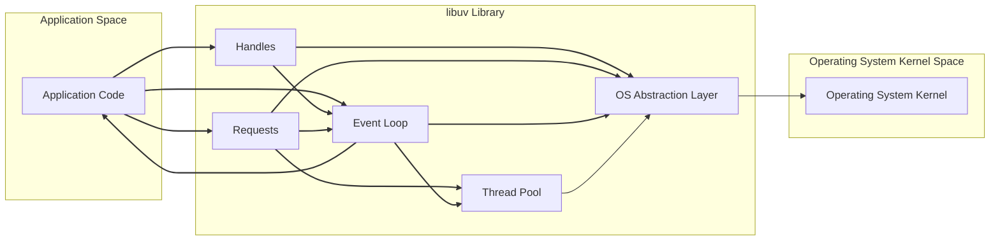

# Project Design Document: libuv for Threat Modeling

**Project Name:** libuv

**Project Repository:** [https://github.com/libuv/libuv](https://github.com/libuv/libuv)

**Document Version:** 1.1
**Date:** 2023-10-27
**Author:** AI Software Architect

## 1. Project Overview

libuv is a high-performance, multi-platform support library for asynchronous I/O. Originally designed for Node.js, it is now used in various projects requiring robust and portable asynchronous capabilities. libuv abstracts away operating system differences, providing a consistent API for:

*   **Event Loop:**  The core asynchronous event notification loop, crucial for non-blocking I/O.
*   **File System Operations:** Asynchronous file I/O, file system watching, and related functionalities.
*   **Networking (TCP, UDP, Pipes, Unix Domain Sockets):**  Provides abstractions for various network protocols and inter-process communication mechanisms.
*   **DNS Resolution:** Asynchronous DNS lookups, handling hostname resolution without blocking the main thread.
*   **Child Processes and Process Management:**  Spawning and managing external processes asynchronously.
*   **Timers and Time Management:**  Scheduling events based on time, essential for timeouts and periodic tasks.
*   **TTY Control:**  Asynchronous terminal I/O operations, including controlling terminal attributes.
*   **Signal Handling:**  Cross-platform signal handling, allowing applications to respond to OS signals gracefully.
*   **Threading and Synchronization Primitives:**  Internal thread pool for offloading blocking operations and synchronization primitives (mutexes, semaphores, etc.) for concurrent programming.

libuv is implemented in C, emphasizing efficiency and low overhead. Its primary design goal is to enable developers to build portable, event-driven applications without dealing with platform-specific I/O complexities.

## 2. System Architecture

libuv's architecture revolves around a central event loop that efficiently manages asynchronous operations. It acts as an intermediary between the application and the operating system, providing a unified interface.

### 2.1. High-Level Components

*   **"Event Loop"**: The heart of libuv. It polls for events from various sources (file descriptors, timers, signals) using the most efficient mechanism available on the target OS (e.g., `epoll` on Linux, `kqueue` on macOS/FreeBSD, IOCP on Windows). When events occur, it dispatches associated callbacks. Each libuv instance operates with its own event loop.
*   **"Handles"**: Represent long-lived resources that perform asynchronous operations. They are abstractions over OS-specific resources and are managed by the event loop. Examples include:
    *   `uv_tcp_t`: Represents a TCP socket connection or listener.
    *   `uv_udp_t`: Represents a UDP socket.
    *   `uv_pipe_t`: Represents a pipe for inter-process communication (IPC).
    *   `uv_fs_event_t`: Represents a file system watcher.
    *   `uv_timer_t`: Represents a timer.
    *   `uv_process_t`: Represents a child process.
*   **"Requests"**: Represent short-lived, asynchronous operations initiated on handles. Requests are typically allocated on the stack or heap and are freed after the operation completes. Examples include:
    *   `uv_connect_t`: Request to establish a TCP connection.
    *   `uv_write_t`: Request to write data to a socket or pipe.
    *   `uv_fs_req_t`: Request for file system operations (e.g., read, write, open, stat).
    *   `uv_getaddrinfo_t`: Request for asynchronous DNS resolution.
*   **"Thread Pool"**:  Used to offload blocking operations from the main event loop thread. This is crucial for maintaining the non-blocking nature of the event loop, especially for operations that are inherently blocking on some platforms (e.g., file I/O, DNS lookups on certain systems). The size of the thread pool is configurable.
*   **"OS Abstraction Layer"**:  This layer encapsulates platform-specific system calls and APIs. It provides a consistent interface to the upper layers of libuv, hiding the differences between operating systems. This is key to libuv's cross-platform compatibility.
*   **"Synchronization Primitives"**:  libuv provides internal synchronization primitives (mutexes, condition variables, semaphores, etc.) used within the thread pool and for internal operations. Applications can also utilize these primitives if needed for their own concurrency management.

### 2.2. Component Interaction Diagram



**Interaction Flow Description:**

1.  **Application Initialization:** The "Application Code" initializes libuv, typically creating an "Event Loop" instance.
2.  **Asynchronous Operation Initiation:** The application initiates asynchronous operations by creating "Handles" (e.g., a TCP socket handle) and "Requests" (e.g., a connect request). Callbacks are registered with these requests to be executed upon completion.
3.  **Event Loop Monitoring:** The "Event Loop" uses the "OS Abstraction Layer" to register interest in events associated with "Handles" with the "Operating System Kernel". This registration mechanism is OS-specific (e.g., `epoll_ctl`, `kevent`, `CreateIoCompletionPort`).
4.  **Event Notification:** When an event occurs (e.g., data arrives on a socket, a timer expires, a file is ready for reading), the "Operating System Kernel" notifies the "Event Loop" via the "OS Abstraction Layer".
5.  **Callback Dispatch:** The "Event Loop" processes the event and dispatches the appropriate callback function registered by the "Application Code" when the operation was initiated. Callbacks are executed within the event loop thread.
6.  **Thread Pool Offloading (for Blocking Operations):** For operations that might block (e.g., file system operations, DNS lookups on some platforms), the "Event Loop" offloads these tasks to the "Thread Pool". Threads in the "Thread Pool" execute the blocking system calls via the "OS Abstraction Layer".
7.  **Callback Invocation from Thread Pool:** Once a thread pool operation completes, it signals the "Event Loop" (typically via a thread-safe mechanism like a pipe or eventfd). The "Event Loop" then schedules and executes the associated callback in its own thread.
8.  **Data Transfer:** Data is exchanged between the "Application Code" and libuv through buffers associated with "Handles" and "Requests". Libuv manages the transfer of data between these buffers and the "Operating System Kernel".

## 3. Data Flow

Data flow in libuv varies depending on the type of operation. We will detail network and file system data flows as representative examples.

### 3.1. Network Data Flow (TCP/UDP)

```mermaid
graph LR
    subgraph "Application"
        AppSend["Application Send Buffer"]
        AppRecv["Application Receive Buffer"]
    end
    subgraph "libuv"
        TcpHandle["uv_tcp_t Handle"]
        SendReq["uv_write_t Request"]
        RecvBuf["Receive Buffer (libuv)"]
    end
    subgraph "Operating System"
        SocketBuf["Socket Buffer (OS)"]
        Network["Network"]
    end

    AppSend --> SendReq
    SendReq --> TcpHandle
    TcpHandle --> SocketBuf
    SocketBuf --> Network
    Network --> SocketBuf
    SocketBuf --> TcpHandle
    TcpHandle --> RecvBuf
    RecvBuf --> AppRecv

    linkStyle 0,1,2,3,4,5,6,7,8,9 stroke-width:2px;
```

**Detailed Data Flow Description (Network Send):**

1.  **Application Data Preparation:** The "Application Code" prepares data to be sent and places it in the "Application Send Buffer".
2.  **Initiate `uv_write` Operation:** The application calls `uv_write`, providing the "uv_tcp_t Handle", a "uv_write_t Request", and a reference to the "Application Send Buffer" (often using `uv_buf_t`).
3.  **Data Transfer to Socket Buffer:** libuv, using the "OS Abstraction Layer", copies data from the "Application Send Buffer" into the "Operating System Socket Buffer" via system calls like `send` or `WSASend`. In some cases, zero-copy techniques might be employed if supported by the OS and application buffer management.
4.  **Network Transmission:** The "Operating System" takes data from the "Socket Buffer" and transmits it over the "Network".

**Detailed Data Flow Description (Network Receive):**

1.  **Network Data Arrival:** Data arrives from the "Network" and is placed into the "Operating System Socket Buffer" by the OS network stack.
2.  **Event Loop Notification:** The "Operating System" notifies libuv's "Event Loop" (via mechanisms like `epoll`, `kqueue`, IOCP) that data is available for reading on the socket.
3.  **Data Read into libuv Buffer:** The "Event Loop", in response to the event, uses the "OS Abstraction Layer" to read data from the "Operating System Socket Buffer" into a "Receive Buffer (libuv)" managed by libuv. This is typically done using system calls like `recv` or `WSARecv`.
4.  **Data Transfer to Application Buffer and Callback:** libuv copies data from the "Receive Buffer (libuv)" to the "Application Receive Buffer" (provided by the application in a prior `uv_read_start` call, also using `uv_buf_t`).  Finally, libuv invokes the read callback function registered by the application, passing the amount of data received and a status code.

### 3.2. File System Data Flow

```mermaid
graph LR
    subgraph "Application"
        AppFileBuf["Application File Buffer"]
    end
    subgraph "libuv"
        FSHandle["uv_fs_t Request"]
        ThreadPool["Thread Pool"]
        FileBuf["File Buffer (libuv)"]
    end
    subgraph "Operating System"
        FileSystem["File System"]
    end

    AppFileBuf --> FSHandle
    FSHandle --> ThreadPool
    ThreadPool --> FileSystem
    FileSystem --> ThreadPool
    ThreadPool --> FileBuf
    FileBuf --> AppFileBuf

    linkStyle 0,1,2,3,4,5,6 stroke-width:2px;
```

**Detailed Data Flow Description (File Read):**

1.  **Initiate `uv_fs_read` Operation:** The application calls `uv_fs_read`, providing a "uv_fs_t Request", a file handle, an "Application File Buffer", and other parameters.
2.  **Offload to Thread Pool:** libuv recognizes that file I/O operations can be blocking and offloads the `read` system call to the "Thread Pool".
3.  **File System Read in Thread Pool:** A thread from the "Thread Pool" executes the actual file read operation using OS system calls (e.g., `read`, `ReadFile`) on the "File System".
4.  **Data Read into Thread Pool Buffer:** Data is read from the "File System" into a "File Buffer (libuv)" that is managed within the thread pool context.
5.  **Data Transfer to Application Buffer and Callback:** Once the read operation completes, the thread pool thread signals the event loop. The event loop then copies data from the "File Buffer (libuv)" to the "Application File Buffer". Finally, the event loop invokes the file system operation callback function registered by the application, providing the number of bytes read and a status code.

## 4. Technology Stack

*   **Core Language:** C (ANSI C)
*   **Target Operating Systems:**
    *   Linux (various distributions)
    *   Windows (Windows 7 and later)
    *   macOS
    *   FreeBSD
    *   OpenBSD
    *   Solaris/Illumos
    *   AIX
    *   Android
    *   iOS
    *   QNX
    *   Other POSIX-compliant systems
*   **Build System:** CMake (cross-platform build system generator)
*   **External Dependencies:**
    *   **System Libraries:** Relies heavily on standard system libraries provided by the operating system (e.g., POSIX standard library on Unix-like systems, Windows API on Windows). No external third-party libraries are directly linked into the core libuv library itself, minimizing external dependency risks.

## 5. Security Considerations for Threat Modeling (STRIDE Focused)

This section outlines security considerations for threat modeling libuv, implicitly using the STRIDE model (Spoofing, Tampering, Repudiation, Information Disclosure, Denial of Service, Elevation of Privilege) to categorize potential threats.

*   **Spoofing (S):**
    *   **Source Address Spoofing (Network):**  Libuv, when handling network connections, relies on the OS to provide source IP addresses and ports. Applications using libuv need to be aware of the potential for source address spoofing in network protocols (e.g., UDP spoofing). Libuv itself doesn't inherently prevent this, as it's a network protocol issue. Application-level authentication and authorization are necessary.
    *   **File Path Spoofing/Symbolic Link Attacks (File System):** When dealing with file paths provided by applications, libuv relies on the OS file system APIs. Applications must sanitize and validate file paths to prevent symbolic link attacks or path traversal vulnerabilities. Libuv's file system operations could be exploited if applications pass unsanitized paths.

*   **Tampering (T):**
    *   **Data Corruption in Transit (Network):**  While TCP provides reliable, ordered delivery, UDP does not. Applications using libuv with UDP need to consider data integrity and potential tampering during network transmission. Libuv provides checksumming options for UDP, but application-level checks might be needed for higher assurance.
    *   **File System Data Tampering:** If an attacker gains access to the file system, they could tamper with files being read or written by applications using libuv. Libuv itself doesn't provide file integrity checks; this needs to be handled at the application level if required.
    *   **Memory Corruption Vulnerabilities in libuv:** Bugs in libuv's C code (e.g., buffer overflows, use-after-free) could lead to memory corruption, potentially allowing attackers to tamper with application data or control flow. Regular security audits and code reviews of libuv are crucial to mitigate this.

*   **Repudiation (R):**
    *   **Lack of Audit Trails (General):** Libuv itself doesn't provide built-in audit logging. Applications needing audit trails for actions performed using libuv (e.g., network connections, file operations) must implement their own logging mechanisms.
    *   **Non-Repudiation in Network Communication:** For applications requiring non-repudiation of network communication, protocols and mechanisms beyond libuv's scope (e.g., digital signatures, TLS with client certificates) are necessary.

*   **Information Disclosure (I):**
    *   **Unintentional Data Exposure (Network/File System):**  If applications using libuv don't properly handle buffers or close resources, sensitive data might be unintentionally exposed (e.g., leaving data in memory, leaking file handles). Secure coding practices in applications are essential.
    *   **Information Leakage through Error Messages/Debugging Information:**  Verbose error messages or debugging output from libuv (or applications using it) could inadvertently disclose sensitive information. Production deployments should minimize verbose logging and error reporting.
    *   **Side-Channel Attacks:** While less likely to be directly in libuv, timing variations in libuv operations or resource usage patterns could potentially be exploited for side-channel attacks in very specific, highly sensitive scenarios.

*   **Denial of Service (D):**
    *   **Resource Exhaustion (Memory, File Descriptors, Threads):**
        *   **Memory Leaks:** Application-level memory leaks due to improper handle/request management can lead to memory exhaustion and DoS.
        *   **File Descriptor Leaks:** Failure to close handles (sockets, pipes, file handles) can exhaust file descriptors, causing DoS.
        *   **Thread Pool Exhaustion:** Submitting excessive blocking operations to the thread pool or configuring an inappropriately small thread pool can lead to thread pool exhaustion and DoS.
    *   **Event Loop Starvation (Blocking Callbacks):**  If application callbacks registered with libuv are computationally intensive or blocking, they can starve the event loop, preventing it from processing other events and leading to DoS.
    *   **Malformed Input Handling (Network/File System):**  Vulnerabilities in libuv's handling of malformed network packets or file system inputs could potentially be exploited to cause crashes or resource exhaustion, leading to DoS. Fuzzing and robust input validation within libuv are important.
    *   **Amplification Attacks (UDP):** Applications using libuv with UDP need to be aware of UDP amplification attacks, where attackers can send small spoofed requests to a UDP service to elicit large responses directed at a victim.

*   **Elevation of Privilege (E):**
    *   **Vulnerabilities in libuv Leading to Privilege Escalation:**  Critical vulnerabilities in libuv itself (e.g., buffer overflows, format string bugs) could potentially be exploited by a local attacker to gain elevated privileges on the system. This is a high-severity threat. Rigorous code review, security testing, and timely patching of libuv are paramount.
    *   **Exploiting Setuid/Setgid Binaries (Child Processes):** If applications using libuv spawn child processes with elevated privileges (e.g., using `setuid` or `setgid`), vulnerabilities in how libuv handles child processes or passes arguments could potentially be exploited for privilege escalation. Careful handling of child process spawning and argument sanitization is needed.

## 6. Threat Modeling Scope and Methodology

This design document provides a solid foundation for threat modeling libuv.  For a comprehensive threat model, consider the following scope and methodologies:

**Scope:**

*   **Focus Areas:**
    *   **Interfaces:** Analyze the interfaces between the Application and libuv API, and between libuv and the Operating System API. Pay close attention to data and control flow across these boundaries.
    *   **Data Flows:**  Thoroughly examine the data flow diagrams (Network and File System) to identify potential interception, manipulation, or leakage points. Consider data at rest and data in transit.
    *   **Components:**  Individually assess the security of each major libuv component ("Event Loop", "Handles", "Requests", "Thread Pool", "OS Abstraction Layer"). Look for potential vulnerabilities in their design and implementation.
    *   **Interactions:**  Analyze the interactions between components, especially those crossing security domains (e.g., data passing from the OS kernel to application space via libuv).
    *   **Common Use Cases:**  Model threats relevant to typical libuv usage scenarios, such as:
        *   Network servers (HTTP, TCP, UDP servers).
        *   File system watchers and utilities.
        *   Applications managing child processes.
        *   Applications using timers and asynchronous operations.

*   **Boundaries:**
    *   Application Code <-> libuv Library (API boundary)
    *   libuv Library <-> Operating System Kernel (System call boundary)
    *   Network Boundary (for network operations)
    *   File System Boundary (for file system operations)

**Methodology:**

1.  **Decomposition:** Use this design document to decompose libuv into its key components and data flows.
2.  **Threat Identification (STRIDE):** Apply the STRIDE model systematically to each component, data flow, and boundary identified in the decomposition phase. Brainstorm potential threats for each STRIDE category. Consider both generic threats and threats specific to asynchronous I/O and system libraries.
3.  **Vulnerability Analysis:** For each identified threat, analyze potential vulnerabilities in libuv's design or implementation that could be exploited. Consider common vulnerability types (buffer overflows, race conditions, input validation issues, etc.).
4.  **Risk Assessment:** Assess the risk associated with each identified threat based on its likelihood and impact. Prioritize threats based on risk level.
5.  **Mitigation Strategies:**  Develop mitigation strategies for high-risk threats. This might involve:
    *   Code changes in libuv (if vulnerabilities are found).
    *   Recommendations for secure coding practices for applications using libuv.
    *   Deployment guidelines and security configurations.
6.  **Documentation and Reporting:** Document the threat modeling process, identified threats, risk assessments, and mitigation strategies in a formal threat model report.

**Out of Scope (for initial focused threat modeling):**

*   Detailed analysis of specific operating system kernel vulnerabilities (assume a reasonably secure OS kernel).
*   In-depth source code audit of the entire libuv codebase (focus on design and architecture first, code review can follow for high-risk areas).
*   Threat modeling of specific applications built on top of libuv (unless focusing on application-libuv interactions).
*   Performance threat modeling (DoS related to performance bottlenecks, unless directly exploitable for security DoS).

This improved design document and the suggested threat modeling scope and methodology should provide a robust starting point for securing applications that rely on the libuv library. Continuous threat modeling and security assessments are recommended as libuv and its usage evolve.