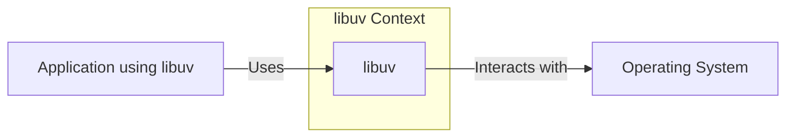
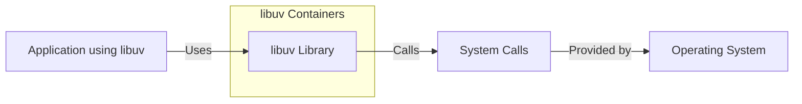

# BUSINESS POSTURE

libuv is a foundational, low-level library providing core I/O capabilities for many high-profile, performance-critical applications (most notably Node.js). Its primary goal is to provide a consistent, cross-platform API for asynchronous I/O operations. Given its widespread use, the business priorities are centered around reliability, performance, and compatibility.

Business Priorities:

- Reliability: libuv must be exceptionally stable. Bugs or crashes in libuv can have cascading effects on numerous dependent applications, potentially causing widespread disruption.
- Performance: As a core I/O library, libuv's performance is paramount. Any performance degradation can significantly impact the responsiveness and throughput of applications built upon it.
- Cross-Platform Compatibility: libuv must function consistently across a wide range of operating systems (Windows, macOS, Linux, and others). Inconsistencies can lead to platform-specific bugs and hinder the portability of applications using libuv.
- Maintainability: The codebase should be maintainable to allow for bug fixes, performance improvements, and the addition of new features over time.
- Security: Given its low-level nature and widespread use, libuv must be secure against vulnerabilities that could be exploited to compromise dependent applications or the underlying operating system.

Business Risks:

- Widespread Outages: A critical bug in libuv could lead to widespread outages or malfunctions in numerous applications, including high-profile services.
- Performance Bottlenecks: Performance regressions in libuv could create bottlenecks in many applications, impacting user experience and potentially leading to financial losses.
- Security Exploits: Vulnerabilities in libuv could be exploited to gain unauthorized access to systems, steal data, or disrupt services. This is a major risk due to libuv's low-level access and widespread deployment.
- Compatibility Issues: Incompatibilities with specific operating systems or hardware configurations could limit the adoption of libuv or force developers to implement platform-specific workarounds.

# SECURITY POSTURE

Existing Security Controls:

- security control: Fuzzing: The project uses OSS-Fuzz for continuous fuzzing, which helps identify potential vulnerabilities like buffer overflows and memory leaks. (Described in the `SECURITY.md` file and integrated into the build process).
- security control: Code Reviews: All changes to the codebase undergo code review by other maintainers. (Implicit in the GitHub workflow).
- security control: Static Analysis: The project uses static analysis tools, including Coverity and clang-tidy, to identify potential coding errors and security vulnerabilities. (Mentioned in `SECURITY.md` and integrated into CI).
- security control: AddressSanitizer (ASan): Used during testing to detect memory errors like use-after-free and buffer overflows. (Mentioned in `SECURITY.md` and integrated into CI).
- security control: MemorySanitizer (MSan): Used to detect use of uninitialized memory. (Mentioned in `SECURITY.md` and integrated into CI).
- security control: UndefinedBehaviorSanitizer (UBSan): Used to detect undefined behavior in C code. (Mentioned in `SECURITY.md` and integrated into CI).
- security control: Continuous Integration (CI): The project uses CI (GitHub Actions) to automatically build and test the code on various platforms. (Visible in the `.github/workflows` directory).
- security control: Compiler Warnings: The project aims to compile with high warning levels and treat warnings as errors. (Implicit in the build configuration).

Accepted Risks:

- accepted risk: Complexity: libuv is a complex, low-level library, which inherently increases the risk of subtle bugs and vulnerabilities.
- accepted risk: Cross-Platform Compatibility: Supporting a wide range of operating systems introduces complexity and potential for platform-specific issues.
- accepted risk: Performance Optimization: The focus on performance may lead to the use of complex, low-level code that is more difficult to secure.
- accepted risk: Third-Party Dependencies: While libuv minimizes external dependencies, it still relies on system libraries and potentially third-party code (e.g., for specific platform support), which could introduce vulnerabilities.

Recommended Security Controls:

- security control: Regular External Security Audits: Conduct periodic security audits by independent security experts to identify vulnerabilities that may be missed by internal reviews and automated tools.
- security control: Enhanced Fuzzing: Explore more advanced fuzzing techniques, such as coverage-guided fuzzing and structure-aware fuzzing, to improve the effectiveness of fuzzing efforts.
- security control: Formal Verification: Consider using formal verification techniques for critical parts of the codebase to mathematically prove their correctness and absence of certain types of vulnerabilities.

Security Requirements:

- Authentication: Not directly applicable to libuv, as it's a low-level library and doesn't handle authentication.
- Authorization: Not directly applicable to libuv. Authorization is typically handled at higher levels of the application stack.
- Input Validation:
    - Requirement: libuv must carefully validate all inputs from user space, including file paths, network addresses, and data buffers.
    - Requirement: Integer overflow/underflow checks should be performed where appropriate.
    - Requirement: Buffer sizes should be validated to prevent buffer overflows.
    - Requirement: Input validation should be centralized and well-documented.
- Cryptography:
    - Requirement: If libuv implements any cryptographic functionality (e.g., for secure communication), it must use well-vetted cryptographic libraries and follow best practices for key management and algorithm selection.  It should not "roll its own crypto."
- General:
    - Requirement: All security-relevant bugs must be addressed promptly.
    - Requirement: The project should adhere to the principle of least privilege, minimizing the privileges required for its operation.
    - Requirement: The project should have a clear security reporting and disclosure process.

# DESIGN

## C4 CONTEXT



Element Descriptions:

- Element:
    - Name: libuv
    - Type: Library
    - Description: A multi-platform support library with a focus on asynchronous I/O.
    - Responsibilities:
        - Provide an abstraction layer for asynchronous I/O operations.
        - Handle event loops, timers, file system operations, networking, and other low-level tasks.
        - Provide a consistent API across different operating systems.
    - Security Controls:
        - Fuzzing (OSS-Fuzz)
        - Code Reviews
        - Static Analysis (Coverity, clang-tidy)
        - Sanitizers (ASan, MSan, UBSan)
        - Continuous Integration (CI)
        - Compiler Warnings

- Element:
    - Name: Application using libuv
    - Type: Software System
    - Description: Any application that utilizes libuv for its I/O operations (e.g., Node.js, Julia, etc.).
    - Responsibilities:
        - Utilize libuv's API to perform I/O operations.
        - Handle application-specific logic.
    - Security Controls: Dependent on the specific application.

- Element:
    - Name: Operating System
    - Type: Operating System
    - Description: The underlying operating system (Windows, macOS, Linux, etc.) on which libuv and the application run.
    - Responsibilities:
        - Provide the core system calls and resources that libuv uses.
        - Manage processes, memory, file systems, and networking.
    - Security Controls: Dependent on the specific operating system and its configuration.

## C4 CONTAINER

Since libuv is a single library, the container diagram is essentially an expanded view of the context diagram.



Element Descriptions:

- Element:
    - Name: libuv Library
    - Type: Library
    - Description: The compiled libuv library.
    - Responsibilities:
        - Provide an abstraction layer for asynchronous I/O operations.
        - Handle event loops, timers, file system operations, networking, and other low-level tasks.
        - Provide a consistent API across different operating systems.
    - Security Controls:
        - Fuzzing (OSS-Fuzz)
        - Code Reviews
        - Static Analysis (Coverity, clang-tidy)
        - Sanitizers (ASan, MSan, UBSan)
        - Continuous Integration (CI)
        - Compiler Warnings

- Element:
    - Name: Application using libuv
    - Type: Software System
    - Description: Any application that utilizes libuv for its I/O operations (e.g., Node.js, Julia, etc.).
    - Responsibilities:
        - Utilize libuv's API to perform I/O operations.
        - Handle application-specific logic.
    - Security Controls: Dependent on the specific application.

- Element:
    - Name: Operating System
    - Type: Operating System
    - Description: The underlying operating system (Windows, macOS, Linux, etc.).
    - Responsibilities:
        - Provide system calls and resources.
        - Manage processes, memory, file systems, and networking.
    - Security Controls: Dependent on the specific OS and configuration.

- Element:
    - Name: System Calls
    - Type: API
    - Description: The interface provided by the operating system kernel for interacting with hardware and system resources.
    - Responsibilities:
        - Provide low-level access to hardware and system resources.
        - Handle I/O operations, process management, memory management, etc.
    - Security Controls: Implemented by the operating system kernel.

## DEPLOYMENT

libuv is typically deployed as a statically or dynamically linked library within an application.  There isn't a separate "libuv deployment" in the traditional sense.  The deployment model is inherently tied to the application that uses it.

Possible Deployment Solutions:

1. Static Linking: libuv is compiled directly into the application executable.
2. Dynamic Linking: libuv is compiled as a separate shared library (e.g., .so, .dll, .dylib) that is loaded by the application at runtime.
3. System Library: libuv might be installed as a system-wide library, available to all applications.

Chosen Deployment Solution (Dynamic Linking - most common for flexibility and updates):

```mermaid
graph LR
    subgraph Deployment - Dynamic Linking
        A[Application Executable]
        B[libuv Shared Library (e.g., libuv.so, libuv.dll)]
        C[Operating System]
        A -- Loads --> B
        B -- System Calls --> C
    end
```

Element Descriptions:

- Element:
    - Name: Application Executable
    - Type: Executable File
    - Description: The compiled application that uses libuv.
    - Responsibilities:
        - Contains the application's main logic.
        - Loads and uses the libuv shared library.
    - Security Controls: Dependent on the specific application.

- Element:
    - Name: libuv Shared Library (e.g., libuv.so, libuv.dll)
    - Type: Shared Library
    - Description: The compiled libuv library, separate from the application executable.
    - Responsibilities:
        - Provide asynchronous I/O functionality to the application.
    - Security Controls:
        - Fuzzing (OSS-Fuzz)
        - Code Reviews
        - Static Analysis (Coverity, clang-tidy)
        - Sanitizers (ASan, MSan, UBSan)
        - Continuous Integration (CI)
        - Compiler Warnings

- Element:
    - Name: Operating System
    - Type: Operating System
    - Description: The underlying operating system.
    - Responsibilities:
        - Provides system calls and resources.
        - Loads shared libraries.
    - Security Controls: Dependent on the specific OS and configuration.

## BUILD

libuv uses a combination of Makefiles and GYP (Generate Your Project) for its build system.  It also heavily relies on GitHub Actions for continuous integration and testing.

```mermaid
graph LR
    subgraph Build Process
        A[Developer]
        B[Source Code (GitHub)]
        C[GitHub Actions (CI)]
        D[Build System (Make/GYP)]
        E[Compiler/Linker]
        F[Static Analysis Tools]
        G[Fuzzing (OSS-Fuzz)]
        H[Test Suite]
        I[libuv Library (Static/Dynamic)]
        J[Test Reports]

        A -- Commits --> B
        B -- Triggers --> C
        C -- Uses --> D
        D -- Uses --> E
        C -- Runs --> F
        C -- Runs --> G
        C -- Runs --> H
        E -- Produces --> I
        F -- Produces --> J
        H -- Produces --> J
    end
```

Build Process Description:

1.  Developer commits code changes to the GitHub repository.
2.  GitHub Actions detects the changes and triggers a CI build.
3.  The build system (Make/GYP) is invoked to configure and build the project.
4.  The compiler and linker are used to compile the source code and create the libuv library (either static or dynamic).
5.  Static analysis tools (Coverity, clang-tidy) are run as part of the CI process to identify potential code quality and security issues.
6.  Fuzzing (OSS-Fuzz) is run continuously and independently of the main CI pipeline, but results are monitored.
7.  The test suite is executed to verify the functionality and stability of the library.
8.  Build artifacts (the libuv library) and test reports are generated.

Security Controls in Build Process:

- security control: Continuous Integration (GitHub Actions): Automates the build and testing process, ensuring that all changes are thoroughly tested.
- security control: Static Analysis (Coverity, clang-tidy): Helps identify potential coding errors and security vulnerabilities before they are merged into the codebase.
- security control: Fuzzing (OSS-Fuzz): Continuously tests the library with random inputs to discover potential crashes and vulnerabilities.
- security control: Sanitizers (ASan, MSan, UBSan): Used during testing to detect memory errors and undefined behavior.
- security control: Compiler Warnings: Compiling with high warning levels and treating warnings as errors helps prevent common coding mistakes.

# RISK ASSESSMENT

Critical Business Processes:

- Asynchronous I/O Operations: libuv's core function is to provide reliable and performant asynchronous I/O. This is critical for the operation of any application that relies on it.
- Event Loop Management: libuv's event loop is the heart of its asynchronous processing model. Any disruption to the event loop can halt application execution.
- Cross-Platform Compatibility: Maintaining consistent behavior across different operating systems is crucial for the portability of applications using libuv.

Data Protection:

- libuv itself does not directly handle sensitive data in most cases. It primarily deals with low-level I/O operations. However, vulnerabilities in libuv could be exploited to:
    - Data Sensitivity: Low (directly) - High (indirectly, through exploitation)
    - Access or modify data buffers passed to it by applications.
    - Intercept or modify network traffic.
    - Gain unauthorized access to the file system.
    - Execute arbitrary code with the privileges of the application using libuv.

# QUESTIONS & ASSUMPTIONS

Questions:

- What are the specific performance targets for libuv? Are there any benchmarks or metrics that are used to measure performance?
- Are there any plans to add support for new operating systems or platforms?
- What is the process for handling security vulnerabilities reported by external researchers?
- Are there any specific security certifications or compliance requirements that libuv needs to meet?

Assumptions:

- Business Posture:
    - Assumption: The primary users of libuv are developers building applications that require high-performance asynchronous I/O.
    - Assumption: The maintainers of libuv prioritize stability, performance, and security.
    - Assumption: There is a strong community around libuv that contributes to its development and testing.
- Security Posture:
    - Assumption: The existing security controls (fuzzing, static analysis, code reviews) are effectively implemented and maintained.
    - Assumption: The project follows secure coding practices.
    - Assumption: Security vulnerabilities are addressed promptly.
- Design:
    - Assumption: The design of libuv is well-documented and understood by the maintainers.
    - Assumption: The build process is automated and reliable.
    - Assumption: The test suite provides adequate coverage of the codebase.
    - Assumption: libuv minimizes external dependencies to reduce the attack surface.