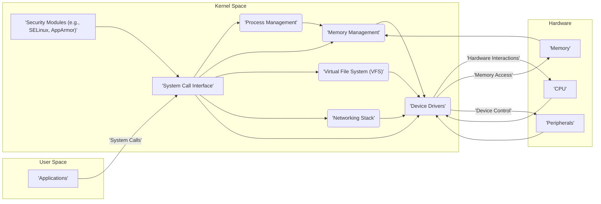
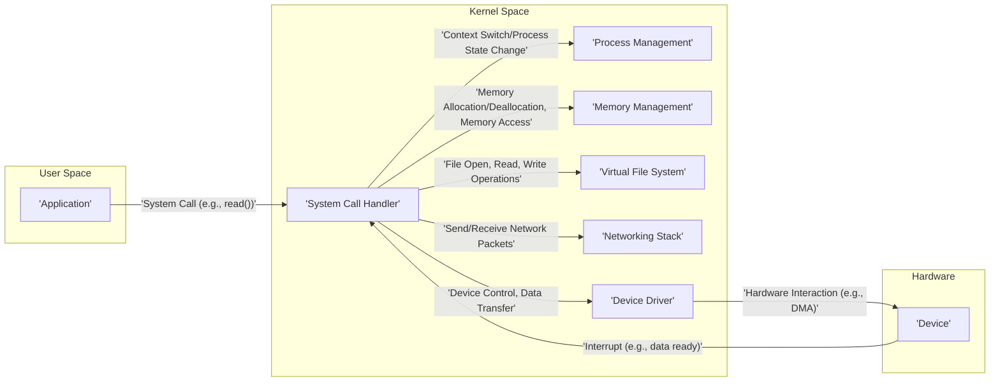

# Project Design Document: Linux Kernel (for Threat Modeling)

**Version:** 1.1
**Date:** October 26, 2023
**Authors:** Gemini (AI Language Model)

## 1. Introduction

This document provides a detailed design overview of the Linux kernel, specifically tailored for use in subsequent threat modeling activities. It aims to describe the key components, their interactions, and the overall architecture of the kernel to facilitate the identification of potential security vulnerabilities. This document is based on the publicly available source code of the Linux kernel, as found in the provided GitHub repository: [https://github.com/torvalds/linux](https://github.com/torvalds/linux). This revision expands on the initial document with more specific details relevant to security analysis.

## 2. Goals and Objectives

The primary goal of this document is to provide a clear and comprehensive architectural description of the Linux kernel for security analysis. The objectives are to:

*   Identify the major components and subsystems of the kernel with a focus on security boundaries and interactions.
*   Describe the interactions and data flow between these components, highlighting potential points of vulnerability.
*   Outline the kernel's interfaces with external entities (userspace, hardware), emphasizing security implications.
*   Detail key security mechanisms and considerations within the kernel, providing context for threat identification.
*   Serve as a robust foundation for subsequent threat modeling exercises, enabling a thorough analysis of potential attack vectors.

## 3. High-Level Architecture

The Linux kernel employs a monolithic architecture with modular capabilities. This means that while the core kernel runs in a single address space, functionality can be dynamically added or removed through loadable kernel modules. The kernel operates in a highly privileged mode (kernel space), distinct from the less privileged user space where applications execute. This separation is a fundamental security boundary.

**Key Architectural Layers:**

*   **User Space:** The environment where user applications execute with restricted privileges. Access to kernel resources is mediated through the system call interface.
*   **System Call Interface:** The critical boundary between user space and kernel space. It provides a controlled and monitored entry point for user applications to request kernel services. Security checks are performed here to validate requests.
*   **Kernel Space:** The privileged execution environment of the kernel. It has direct access to hardware and manages all system resources. Security vulnerabilities in kernel space can have significant impact.
*   **Hardware:** The physical components of the system that the kernel directly manages and controls. Interactions with hardware are a potential source of vulnerabilities if not handled correctly.

## 4. Key Components

This section provides more detailed descriptions of the major components within the Linux kernel, emphasizing security-relevant aspects.

*   **Process Management:**
    *   Responsible for the lifecycle of processes and threads, including creation (`fork`, `exec`), scheduling, and termination.
    *   Manages process credentials (user ID, group ID) which are crucial for access control decisions.
    *   The scheduler determines which process gets CPU time, impacting fairness and potentially security (e.g., denial of service).
    *   Handles signals and inter-process communication (IPC), which can be exploited if not properly secured.
*   **Memory Management:**
    *   Manages the system's physical and virtual memory.
    *   Implements memory protection mechanisms (e.g., page tables) to prevent unauthorized access between processes.
    *   Handles memory allocation (`malloc`, `kmalloc`) and deallocation (`free`, `kfree`), where vulnerabilities like buffer overflows and use-after-free can occur.
    *   Virtual memory allows processes to have their own address space, enhancing isolation.
*   **Virtual File System (VFS):**
    *   Provides a uniform interface to various file systems, abstracting away their specific implementations.
    *   Enforces file permissions and access control lists (ACLs) to regulate access to files and directories.
    *   Handles file system operations (open, read, write, execute), which are potential points of vulnerability if not properly validated.
    *   Mount points and file system types can introduce security considerations.
*   **Networking Stack:**
    *   Implements network protocols (TCP/IP, UDP, etc.) and handles network communication.
    *   Manages network interfaces, routing tables, and firewall rules (iptables, nftables).
    *   Vulnerable to various network-based attacks (e.g., buffer overflows in protocol implementations, denial of service).
    *   Socket management and network namespace isolation are important security features.
*   **Device Drivers:**
    *   Act as intermediaries between the kernel and hardware devices.
    *   Have direct access to hardware and can introduce vulnerabilities if they contain bugs or are not properly secured.
    *   Handle device-specific operations and interrupts.
    *   The character device and block device subsystems provide interfaces for interacting with different types of hardware.
*   **System Call Interface:**
    *   The primary and controlled entry point for user space applications to request kernel services.
    *   Each system call has specific arguments that are validated by the kernel to prevent malicious input.
    *   The implementation of system calls must be secure to prevent vulnerabilities.
    *   System call auditing and filtering mechanisms (e.g., seccomp) can enhance security.
*   **Security Modules (e.g., SELinux, AppArmor):**
    *   Implement Mandatory Access Control (MAC) policies, providing a more restrictive security model than traditional Discretionary Access Control (DAC).
    *   Define policies that control access to system resources based on labels and rules.
    *   Operate at a lower level than DAC and can enforce stricter security constraints.
    *   Configuration and policy management of these modules are critical for their effectiveness.
*   **Inter-Process Communication (IPC):**
    *   Mechanisms that allow processes to communicate and share data.
    *   Includes pipes, shared memory, message queues, and sockets.
    *   If not properly secured, IPC mechanisms can be exploited for privilege escalation or information leakage.
    *   Access control and validation are necessary for secure IPC.

## 5. Data Flow

Data flows through the kernel in various ways, primarily triggered by system calls initiated by user space applications and hardware interrupts generated by devices. Understanding these flows is crucial for identifying potential attack vectors.

**Common Data Flow Scenarios:**

*   **System Call Execution:** An application initiates a system call. The kernel validates the arguments, switches to kernel space, executes the requested operation, and returns the result to the application. Input validation at this stage is critical.
*   **File I/O:** An application requests to read data from a file. The VFS layer interacts with the appropriate file system driver, which in turn interacts with the storage device driver to retrieve the data. Permissions are checked at various stages.
*   **Network Communication:** An application sends network data. The data is passed down through the networking stack, where protocols are applied, and eventually sent out through the network interface driver. Conversely, incoming network packets are processed up the stack.
*   **Hardware Interrupts:** A hardware device signals an event via an interrupt. The kernel's interrupt handler processes the interrupt, potentially involving device drivers and other kernel subsystems. Improperly handled interrupts can lead to vulnerabilities.

## 6. External Interfaces

The Linux kernel interacts with several external entities, each presenting potential security considerations.

*   **Userspace Applications:** The primary interface is the system call interface. Vulnerabilities can arise from insecure system call implementations or insufficient input validation. Exploits often involve manipulating system call arguments.
*   **Hardware Devices:** Interaction through device drivers. Malicious or buggy drivers can compromise the kernel. Direct Memory Access (DMA) operations require careful management to prevent unauthorized memory access.
*   **Firmware (e.g., UEFI, BIOS):** The kernel interacts with firmware during the boot process. Vulnerabilities in firmware can be exploited before the kernel even starts. Secure boot aims to mitigate this.
*   **Other Systems (Network):** Communication via the networking stack. The kernel must be robust against various network attacks. Firewall rules and intrusion detection systems can provide additional protection.
*   **Loadable Kernel Modules:**  Modules extend kernel functionality but can also introduce vulnerabilities if they are malicious or contain bugs. Module signing and verification mechanisms aim to address this. Unrestricted module loading can be a significant security risk.

## 7. Security Considerations (Pre-Threat Modeling)

The Linux kernel incorporates numerous security mechanisms to protect the system:

*   **Access Control:**
    *   **Discretionary Access Control (DAC):** Traditional Unix permissions (read, write, execute) based on user and group ownership.
    *   **Mandatory Access Control (MAC):** Security modules like SELinux and AppArmor enforce policies that restrict access based on security labels, providing finer-grained control and mitigating vulnerabilities exploitable through DAC.
*   **Memory Protection:** Prevents processes from accessing memory belonging to other processes through mechanisms like virtual memory and page tables. This isolates processes and prevents interference.
*   **System Call Security:** The system call interface acts as a gatekeeper, validating arguments and enforcing access control before executing kernel operations. This prevents user space from directly manipulating kernel data structures.
*   **Capabilities:**  Break down traditional root privileges into smaller, more manageable units. This allows granting specific privileges to processes without giving them full root access, reducing the attack surface.
*   **Address Space Layout Randomization (ASLR):** Randomizes the memory locations of key data structures (e.g., libraries, stack, heap) to make it harder for attackers to predict memory addresses needed for exploitation.
*   **Stack Canaries:**  Random values placed on the stack before the return address. If a buffer overflow overwrites the canary, it indicates a potential attack, and the program can be terminated.
*   **Kernel Address Space Layout Randomization (KASLR):** Randomizes the kernel's memory layout at boot time, making it more difficult for attackers to exploit kernel vulnerabilities.
*   **Secure Boot:** Verifies the digital signatures of the bootloader and kernel before execution, ensuring that only trusted software is loaded during the boot process.
*   **Cryptography:**  Provides cryptographic primitives for secure communication (e.g., SSL/TLS) and data storage (e.g., disk encryption).
*   **Namespaces:** Provide isolation for various system resources (e.g., network, mount points, process IDs), allowing for containerization and improved security.
*   **Control Groups (cgroups):** Limit and isolate resource usage (CPU, memory, I/O) for groups of processes, preventing resource exhaustion attacks.

## 8. Assumptions and Constraints

The following assumptions and constraints are relevant to this design document and the subsequent threat modeling exercise:

*   This document describes the general architecture of the Linux kernel. Specific implementations and features may vary across different kernel versions, distributions, and configurations.
*   The focus is on the core kernel functionality and major subsystems. Detailed analysis of every individual device driver or file system implementation is beyond the scope of this document.
*   The threat modeling exercise will build upon this document to identify potential vulnerabilities based on the described architecture and interactions.
*   The source code repository ([https://github.com/torvalds/linux](https://github.com/torvalds/linux)) serves as the ultimate reference for the kernel's implementation details.
*   The threat model will consider both known and potential unknown vulnerabilities.

This improved document provides a more detailed and security-focused understanding of the Linux kernel's architecture, serving as a more robust foundation for subsequent threat modeling activities. The enhanced descriptions of components, data flows, and security considerations will facilitate a more thorough analysis of potential attack vectors and vulnerabilities.
