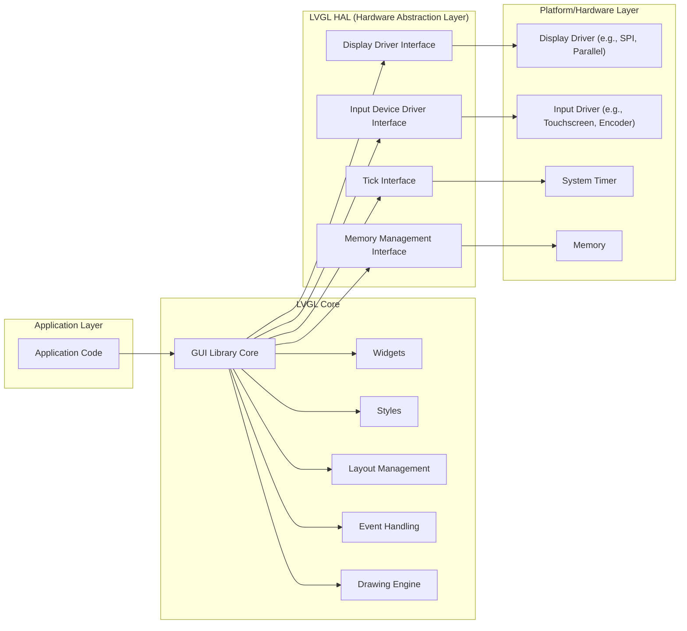

# Project Design Document: LittlevGL (LVGL)

**Version:** 1.1
**Date:** October 26, 2023
**Author:** AI Software Architect

## 1. Introduction

This document provides an enhanced design overview of the LittlevGL (LVGL) graphics library, specifically tailored for threat modeling activities. Building upon the previous version, this document offers more granular details about the architectural components, data flow, and potential security considerations within the LVGL ecosystem.

## 2. Project Overview

LVGL remains a free and open-source graphics library designed to facilitate the creation of embedded Graphical User Interfaces (GUIs). Its key strengths lie in providing user-friendly graphical elements, visually appealing effects, and a low memory footprint, making it suitable for resource-constrained embedded systems. It is implemented in C and emphasizes portability across diverse microcontroller platforms.

## 3. Goals

*   Deliver a highly portable and efficient GUI library for embedded devices.
*   Offer a comprehensive suite of customizable UI widgets with rich functionality.
*   Enable visually engaging user interfaces through smooth animations and effects.
*   Maintain a minimal memory footprint to accommodate resource limitations.
*   Provide a flexible and adaptable architecture for various display technologies and input methods.
*   Offer a clear and intuitive API for application developers to build upon.

## 4. Non-Goals

*   To function as a complete operating system, providing low-level system services.
*   To offer extensive hardware abstraction beyond the fundamental display and input drivers.
*   To inherently manage complex networking or communication protocols (though integration is possible at the application level).
*   To incorporate built-in, end-to-end security features such as encryption or authentication at the library level (these are expected to be handled by the application and the underlying system).

## 5. System Architecture

LVGL employs a layered architecture to achieve modularity and platform independence. The core library encapsulates the fundamental GUI functionalities, while the Hardware Abstraction Layer (HAL) and platform integrations manage hardware-specific interactions.

### 5.1. Architectural Layers

*   **Application Layer:** This is the domain of the application developer, where custom GUI logic is implemented using the LVGL API.
*   **LVGL Core:** This layer houses the core functionalities of the graphics library.
    *   **GUI Library Core:** Manages the lifecycle of GUI elements (objects), including creation, deletion, and overall state management.
    *   **Widgets:** Provides a library of pre-built, interactive UI components such as buttons, labels, sliders, charts, and more.
    *   **Styles:** Defines the visual attributes of GUI objects, including colors, fonts, borders, padding, and other visual properties. Styles can be reused across multiple objects for consistency.
    *   **Layout Management:** Implements algorithms for automatically arranging GUI objects on the display, adapting to different screen sizes and orientations.
    *   **Event Handling:** Manages the processing of user interactions (e.g., touch events, button presses, encoder movements) and dispatches them to the appropriate GUI objects.
    *   **Drawing Engine:**  The core rendering component responsible for translating the GUI object structure and styles into pixel data that can be displayed. It handles tasks like clipping, layering, and applying visual effects.
*   **LVGL HAL (Hardware Abstraction Layer):** This layer provides a set of abstract interfaces that allow LVGL Core to interact with the underlying hardware without needing to know the specific hardware details.
    *   **Display Driver Interface:** Defines functions for initializing the display controller, writing pixel data to the display buffer, and controlling display-related functionalities.
    *   **Input Device Driver Interface:** Defines functions for initializing input devices and reading input events (e.g., touch coordinates, button states, encoder values).
    *   **Tick Interface:** Provides a mechanism for LVGL to obtain a periodic time tick, essential for animations, timeouts, and other time-dependent operations.
    *   **Memory Management Interface:** Allows for customization of memory allocation and deallocation routines used by LVGL, enabling integration with platform-specific memory management schemes.
*   **Platform/Hardware Layer:** This represents the specific hardware and software environment on which LVGL is deployed.
    *   **Display Driver:** Hardware-specific code that directly interacts with the display controller to send pixel data.
    *   **Input Driver:** Hardware-specific code that reads raw input data from input devices.
    *   **System Timer:** A hardware timer that generates periodic interrupts used to provide the tick for LVGL.
    *   **Memory:** The system's RAM where LVGL's data structures, drawing buffers, and application data reside.

## 6. Components

This section provides a more detailed breakdown of the key components within the LVGL architecture, highlighting their specific roles.

### 6.1. Core Components

*   **Objects (`lv_obj_t`):** The fundamental building blocks of the GUI. All visible and interactive elements are objects. Widgets are specialized types of objects with predefined functionalities and appearances.
*   **Displays (`lv_disp_t`):** Represents a physical display screen. LVGL can manage multiple displays simultaneously. Each display has its own associated driver and drawing buffers.
*   **Input Devices (`lv_indev_t`):** Represents an input source, such as a touchscreen, keyboard, mouse, or encoder. Each input device has an associated driver that provides input events.
*   **Styles (`lv_style_t`):** Define the visual properties of objects, such as colors, fonts, borders, opacity, and more. Styles are independent of objects and can be applied to multiple objects, promoting consistency and efficient resource usage.
*   **Themes (`lv_theme_t`):** Collections of predefined styles that provide a consistent look and feel for the entire GUI. Themes simplify the process of styling applications.
*   **Events (`lv_event_t`):** Signals that indicate user interactions (e.g., button clicks, touch gestures), state changes of objects, or other significant occurrences within the GUI.
*   **Tasks (`lv_task_t`):** Functions that are executed periodically by the LVGL library's internal task scheduler. Tasks are used for animations, periodic updates, and other time-based operations.
*   **Drawing Buffers:** Memory areas used by the drawing engine to render the GUI before it is displayed on the screen. Double or triple buffering can be used to prevent flickering.

### 6.2. HAL Components

*   **Display Driver Functions (Implementation-Specific):**
    *   `disp_init()`: Initializes the display hardware, configuring parameters like resolution and interface.
    *   `disp_flush(area, color_p)`:  Sends a rectangular area of pixel data (`color_p`) to the display hardware. This is the core function for updating the display.
    *   `disp_draw_rect(area, fill_dsc)`: (Optional) Hardware acceleration for drawing filled rectangles.
    *   `disp_fill_area(area, color)`: (Optional) Hardware acceleration for filling an area with a specific color.
*   **Input Device Driver Functions (Implementation-Specific):**
    *   `indev_init()`: Initializes the input device, setting up communication and interrupt handling.
    *   `indev_read(data)`: Reads the current state of the input device and populates an input data structure (`data`) with information like coordinates, button presses, or encoder deltas.
*   **Tick Driver Function (Implementation-Specific):**
    *   `lv_tick_inc(tick_period_ms)`:  A function called periodically by the system timer interrupt to inform LVGL about the elapsed time. `tick_period_ms` represents the duration of the tick in milliseconds.
*   **Memory Management Functions (Optional Customization):**
    *   `lv_mem_alloc(size)`: Allocates a block of memory of the specified `size`.
    *   `lv_mem_free(ptr)`: Frees a previously allocated memory block pointed to by `ptr`. These functions can be overridden to use custom memory management implementations.

## 7. Data Flow

The following diagram illustrates the typical flow of data within an LVGL application, providing a more detailed view of the rendering process.

```mermaid
graph LR
    subgraph "Input Event"
        A["Hardware Input Device"] --> B("Input Driver (HAL)")
        B --> C("LVGL Input Device Handling")
    end
    subgraph "Event Processing"
        C --> D{"Determine Target Object"}
        D --> E("Dispatch Event to Object")
    end
    subgraph "GUI Update"
        E --> F{"Object State Change"}
        F --> G("Invalidate Object Area(s)")
        G --> H("Request Redraw")
    end
    subgraph "Rendering"
        H --> I("Determine Invalidated Regions")
        I --> J("Prepare Drawing Buffer")
        J --> K("Drawing Engine: Iterate Objects in Region")
        K --> L("Draw Object Primitives (Rectangles, Text, etc.)")
        L --> M("Write Pixels to Drawing Buffer")
        M --> N("Display Driver (HAL): disp_flush()")
        N --> O["Display Hardware"]
    end
```

1. **Input Event:**
    *   A user interacts with a physical input device.
    *   The **Input Driver (HAL)** reads the raw input data from the hardware.
    *   **LVGL Input Device Handling** processes the raw data, debounces inputs, and converts them into logical LVGL events (e.g., touch pressed, button released).
2. **Event Processing:**
    *   LVGL determines the specific GUI object that the event is intended for based on the input coordinates or focus.
    *   The event is dispatched to the target object's registered event handler function.
3. **GUI Update:**
    *   The object's event handler may modify the object's internal state (e.g., changing the text of a label, toggling a button's state).
    *   Changes in object state often require the object (or parts of the screen it occupies) to be redrawn. The affected areas are marked as invalid.
    *   LVGL's redraw manager schedules a rendering pass.
4. **Rendering:**
    *   LVGL determines the precise regions of the display that need to be updated based on the invalidated areas.
    *   A **Drawing Buffer** is prepared for rendering. This might involve selecting a specific buffer in a double or triple buffering setup.
    *   The **Drawing Engine** iterates through the objects that intersect with the invalidated regions, in their correct Z-order (layering).
    *   For each object, the **Drawing Engine** calls functions to draw its basic graphical primitives (e.g., drawing rectangles for borders, drawing text for labels, drawing images).
    *   These drawing operations write pixel data into the **Drawing Buffer**.
    *   The **Display Driver (HAL)'s `disp_flush()` function** is called to transfer the contents of the drawing buffer to the **Display Hardware**, making the updated GUI visible.

## 8. Security Considerations (for Threat Modeling)

This section outlines potential security vulnerabilities and attack vectors that should be considered during threat modeling of systems incorporating LVGL.

*   **Input Validation Vulnerabilities:**
    *   **Malicious Input Events:**  If the **Input Driver (HAL)** or **LVGL Input Device Handling** does not properly validate input data (e.g., touch coordinates, encoder values), malicious actors could inject crafted input events to trigger unintended behavior, such as accessing restricted areas of the UI or causing denial of service.
    *   **Buffer Overflows in Input Drivers:** Vulnerabilities in the HAL input drivers could allow attackers to send overly long or malformed input data, leading to buffer overflows and potential code execution.
*   **Memory Safety Vulnerabilities:**
    *   **Heap Corruption:** Bugs in LVGL's core or widget code, particularly in dynamic memory allocation and deallocation, could lead to heap corruption, potentially allowing attackers to overwrite critical data structures or execute arbitrary code.
    *   **Stack Overflows:**  Deeply nested event handlers or recursive drawing operations, especially if combined with large data structures on the stack, could lead to stack overflows.
    *   **Integer Overflows:**  Calculations involving sizes, coordinates, or other numerical values without proper bounds checking could result in integer overflows, leading to unexpected behavior or memory corruption.
*   **Rendering Security Vulnerabilities:**
    *   **Denial of Service through Excessive Redraws:**  An attacker might be able to trigger rapid and unnecessary redraws, consuming excessive processing power and potentially leading to a denial of service.
    *   **Font and Image Handling Vulnerabilities:** If LVGL is configured to use external fonts or load images from untrusted sources, vulnerabilities in the underlying font rendering or image decoding libraries could be exploited.
*   **HAL Security Vulnerabilities:**
    *   **Display Driver Exploits:** Vulnerabilities in the **Display Driver (HAL)**, such as buffer overflows in the `disp_flush()` function, could allow attackers to gain low-level control over the display hardware or the system.
    *   **Lack of Secure Communication with Peripherals:** If the display or input devices communicate over insecure interfaces (e.g., unencrypted SPI), attackers might be able to eavesdrop or inject malicious data.
*   **State Management Issues:**
    *   **Race Conditions:** In multithreaded environments (if LVGL is used with threading), improper synchronization of access to shared GUI state could lead to race conditions and unpredictable behavior.
*   **Configuration and Deployment Issues:**
    *   **Insecure Default Configurations:**  Default settings that are not secure could leave the system vulnerable.
    *   **Lack of Secure Boot:** If the underlying system does not have secure boot mechanisms, attackers could potentially modify the LVGL library or application code.

## 9. Deployment Considerations

The security posture of an LVGL-based system is significantly influenced by its deployment environment. Key considerations include:

*   **Resource Constraints:** Limited memory and processing power on embedded systems can make it challenging to implement robust security measures. Developers might be forced to make trade-offs between security and performance.
*   **Real-time Requirements:** The need for responsive user interfaces can limit the complexity of security checks that can be performed without impacting performance.
*   **Trust Boundaries:** Understanding the trust boundaries within the system is crucial. Where does untrusted data enter the system? Are external peripherals considered trusted?
*   **Update Mechanisms:**  Having a secure mechanism for updating the LVGL library and application code is essential for patching vulnerabilities.
*   **Physical Security:** In some deployments, physical access to the device might be a concern, requiring measures to prevent tampering.

## 10. Future Considerations

Potential future developments in LVGL could introduce new security challenges:

*   **Direct Network Integration:** If LVGL gains features for directly fetching data or resources over a network (e.g., for dynamic content updates), new vulnerabilities related to network security (e.g., injection attacks, man-in-the-middle attacks) would need to be addressed.
*   **Advanced Input Method Support:**  Support for more complex input methods, such as voice control or gesture recognition, could introduce new attack surfaces related to the processing of potentially untrusted input data.
*   **Increased Use of External Libraries:**  As LVGL evolves, it might rely on more external libraries for features like advanced graphics effects or multimedia support. This increases the attack surface, as vulnerabilities in these external libraries could impact LVGL.
*   **Scripting Language Integration:** If LVGL integrates with scripting languages for more dynamic UI development, security considerations related to script injection and execution would become relevant.

This enhanced design document provides a more detailed and nuanced understanding of the LVGL architecture, specifically for the purpose of threat modeling. The expanded descriptions of components, the more granular data flow diagram, and the more comprehensive list of security considerations should facilitate a more thorough and effective threat analysis of systems utilizing the LVGL library.