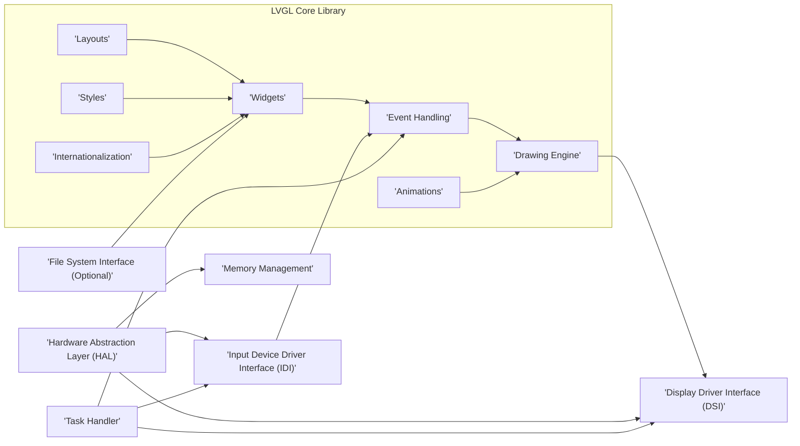
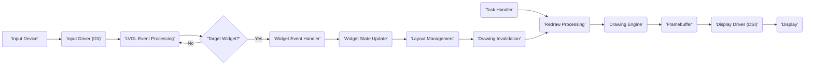

# Project Design Document: LittlevGL (LVGL)

**Version:** 1.1
**Date:** October 26, 2023
**Prepared By:** Gemini (AI Language Model)

## 1. Introduction

This document provides a detailed architectural design of the LittlevGL (LVGL) project, an open-source graphics library tailored for resource-constrained embedded systems. Its primary purpose is to serve as a foundation for comprehensive threat modeling activities. This document meticulously outlines the core components of LVGL, their interactions, the flow of data within the system, and its external dependencies. Understanding these aspects is crucial for identifying potential security vulnerabilities.

## 2. Project Overview

LVGL is a free and open-source graphics library designed to facilitate the creation of embedded Graphical User Interfaces (GUIs). It offers a comprehensive suite of tools, including pre-built UI elements, visual effects, and efficient memory management, making it suitable for devices with limited resources. Written in C, LVGL boasts high portability across diverse microcontroller and microprocessor platforms.

**Key Features:**

*   Rich set of customizable UI building blocks (buttons, labels, charts, sliders, etc.).
*   Support for visual enhancements like animations, opacity, smooth scrolling, and anti-aliasing.
*   Abstraction layer for handling input from various devices (touchscreen, mouse, keyboard, encoders, physical buttons).
*   Abstraction layer for managing different display technologies and resolutions.
*   Optimized for minimal memory footprint, crucial for embedded environments.
*   Capability to support multiple languages and character sets for global applications.
*   Highly flexible system for defining the visual appearance of UI elements.
*   Core engine responsible for rendering graphical content.

## 3. System Architecture

The LVGL architecture is modular, comprising several interconnected components:

*   **Core Library:** The central part of LVGL, encompassing the logic for widget management, layout algorithms, event processing, and the graphics rendering engine.
*   **Display Driver Interface (DSI):**  An abstraction layer defining the interface between LVGL and specific display hardware. Users implement this interface to support their target display.
*   **Input Device Driver Interface (IDI):** An abstraction layer that handles input events from various sources. Users implement this to integrate specific input devices.
*   **Hardware Abstraction Layer (HAL):** Provides low-level access to hardware functionalities like timers, memory allocation, and interrupt handling. This is typically platform-specific.
*   **Memory Management:** LVGL incorporates its own memory management system optimized for embedded systems.
*   **File System Interface (Optional):** Enables LVGL to load external resources like images and fonts from a file system, if available.
*   **Task Handler:** Manages the periodic execution of LVGL's internal tasks, such as refreshing the display and polling for input.

### 3.1. Component Diagram

### 3.2. Component Descriptions

*   **Widgets:** Reusable UI components with predefined appearance and behavior. Examples include buttons for user interaction, labels for displaying text, and charts for data visualization.
*   **Layouts:** Algorithms that define how widgets are arranged on the screen. Common layouts include column-based, row-based, and grid-based arrangements.
*   **Event Handling:** The mechanism by which LVGL processes user interactions (e.g., touch events, button presses) and triggers corresponding actions within the application.
*   **Drawing Engine:** The core component responsible for rendering the graphical elements of the GUI onto the display buffer. It interacts with the DSI to communicate with the display hardware.
*   **Styles:** Define the visual attributes of widgets, such as colors, fonts, borders, and padding. Styles can be applied individually or globally for consistent UI design.
*   **Animations:** Provides a framework for creating dynamic visual effects and transitions, enhancing the user experience.
*   **Internationalization:** Supports the display of text in various languages and character encodings, making applications globally accessible.
*   **Display Driver Interface (DSI):**  A set of functions that **must be implemented by the user** to adapt LVGL to a specific display controller. This includes functions for initializing the display, writing pixel data to the framebuffer, and synchronizing updates. **This is a critical interface for potential vulnerabilities if not implemented securely.**
*   **Input Device Driver Interface (IDI):** A set of functions that **must be implemented by the user** to feed input events from devices like touchscreens, mice, or physical buttons into LVGL. **Improperly implemented IDIs can introduce vulnerabilities related to input injection or denial-of-service.**
*   **Hardware Abstraction Layer (HAL):**  Provides low-level access to hardware resources. The specific functions within the HAL are platform-dependent but often include:
    *   **Timer Management:** Functions for setting up and managing timers used for scheduling tasks and animations.
    *   **Memory Allocation:** While LVGL manages its own memory, the HAL might provide the underlying memory allocation primitives. **Vulnerabilities in the underlying memory allocator can impact LVGL.**
    *   **Interrupt Handling:** Functions for registering and handling interrupts from input devices or other peripherals. **Incorrect interrupt handling can lead to race conditions or denial-of-service.**
*   **Memory Management:** LVGL employs its own dynamic memory allocation strategies, optimized for the constraints of embedded systems. **Bugs in LVGL's memory management could lead to buffer overflows or memory leaks.**
*   **File System Interface (Optional):** If enabled, allows LVGL to load resources like image files, font files, and potentially configuration files from a connected file system (e.g., SD card, flash memory). **This introduces potential vulnerabilities related to file parsing and access control.**
*   **Task Handler:**  A mechanism, often a simple loop or a function within an Real-Time Operating System (RTOS) task, responsible for periodically calling LVGL's internal task handler function (`lv_timer_handler`). This function drives the GUI by processing events, updating the display, and running animations. **The timing and priority of the task handler can impact the responsiveness and stability of the GUI.**

## 4. Data Flow

The typical data flow within LVGL proceeds as follows:

1. **Input Event Generation:** An external input device (e.g., a user touching the screen) generates an event.
2. **Input Driver Processing:** The user-implemented IDI captures the raw input data from the device.
3. **Event Translation:** The IDI translates the raw input data into LVGL-understandable input events (e.g., touch pressed at coordinates X,Y; button released).
4. **Event Dispatch:** LVGL's event handling mechanism determines which widget is the target of the event, typically based on the event coordinates or the currently focused widget.
5. **Event Handler Execution:** The event handler function associated with the targeted widget is executed. This function might update the widget's state, trigger an animation, or perform other application-specific actions.
6. **Widget State Update:** The internal data or visual properties of the widget are modified based on the event handling logic.
7. **Layout Adjustment:** If the widget's state change necessitates a change in the layout, the layout manager recalculates the positions and sizes of affected widgets.
8. **Redraw Invalidation:** The regions of the display that need to be updated due to the changes are marked as invalid.
9. **Task Handler Invocation:** The `lv_timer_handler` function is called periodically by the task handler.
10. **Redraw Processing Initiation:** The drawing engine iterates through the invalidated areas of the screen.
11. **Drawing Operations Execution:** For each invalid area, the drawing engine calls the draw functions of the widgets that occupy that area, using the current styles and properties.
12. **Framebuffer Modification:** The drawing operations write the updated pixel data into the display framebuffer.
13. **Display Update:** The DSI's flush function is called to transfer the contents of the framebuffer to the physical display, making the changes visible to the user.

### 4.1. Data Flow Diagram

## 5. Dependencies

LVGL relies on the following dependencies:

*   **Essential Dependencies:**
    *   **C Compiler:**  A standard C compiler (e.g., GCC, Clang) is required to build LVGL and applications using it.
    *   **Build System:** A build system such as CMake or Make is typically used to manage the compilation and linking process.
    *   **Target Hardware:**
        *   **Microcontroller/Microprocessor:** The specific embedded device where LVGL will be executed.
        *   **Display Controller Hardware:** The hardware responsible for controlling the display panel.
        *   **Display Panel:** The physical display screen used to present the GUI.
        *   **Input Device(s):** The hardware components used for user interaction (e.g., touchscreen, mouse, buttons).
    *   **User-Provided Drivers (Critical for Security):**
        *   **Display Driver (DSI Implementation):** The user must implement the DSI to interface LVGL with their specific display hardware. **Security vulnerabilities can arise from insecure implementations of the DSI.**
        *   **Input Driver (IDI Implementation):** The user must implement the IDI to handle input events from their chosen input devices. **Insecure IDI implementations can be a major source of vulnerabilities.**
*   **Optional Libraries (Adding Functionality and Potential Attack Surface):**
    *   **FreeType:** Used for advanced font rendering capabilities. **Vulnerabilities in FreeType could impact LVGL if this dependency is used.**
    *   **Image Decoding Libraries (e.g., libpng, libjpeg):**  Used for decoding image formats. **Security flaws in these libraries could be exploited if LVGL uses them to load images.**
    *   **Compression Libraries (e.g., zlib):** May be used for compressing data, such as images or fonts. **Vulnerabilities in compression libraries can be a concern.**
    *   **File System Libraries (e.g., FATFS, LittleFS):** Required if file system support is enabled. **Insecure file system libraries or improper usage can lead to vulnerabilities.**
    *   **Real-Time Operating System (RTOS):** An RTOS can be used to manage tasks and timing within the embedded system. **The security of the RTOS itself is a dependency to consider.**

## 6. Security Considerations (Detailed)

This section outlines potential security considerations that are crucial for the subsequent threat modeling process.

*   **Input Validation and Sanitization (IDI):**  The IDI is a primary entry point for external data. Insufficient validation and sanitization of input data can lead to vulnerabilities such as:
    *   **Input Injection Attacks:** Maliciously crafted input data could potentially be interpreted as commands or control sequences, leading to unintended actions.
    *   **Denial of Service (DoS):**  Large or malformed input data could overwhelm the system, causing it to crash or become unresponsive.
*   **Buffer Overflows (Core Library, DSI, IDI, Optional Libraries):**  Occur when data exceeds the allocated buffer size. Potential causes include:
    *   **String Handling:** Improper handling of strings, especially when receiving data from external sources or when parsing files.
    *   **Image/Font Processing:**  Vulnerabilities in image or font decoding libraries or improper handling of image/font data within LVGL.
    *   **Framebuffer Operations (DSI):**  Incorrectly calculated buffer sizes or offsets when writing to the framebuffer.
*   **Resource Exhaustion (Core Library, Event Handling):**  Malicious actors might attempt to consume excessive system resources:
    *   **Excessive Object Creation:**  Flooding the system with a large number of widgets or other LVGL objects.
    *   **Animation Abuse:** Triggering a large number of complex animations simultaneously.
    *   **Event Flooding:**  Sending a high volume of input events to overwhelm the event processing mechanism.
*   **File System Vulnerabilities (Optional File System Interface):** If file system support is enabled:
    *   **Path Traversal:** Attackers might try to access files outside of the intended directories.
    *   **Malicious File Loading:** Loading and processing of malicious image or font files could lead to code execution or crashes.
*   **Memory Management Issues (Core Library):**  Bugs in LVGL's memory management can lead to:
    *   **Memory Leaks:**  Failure to release allocated memory, eventually leading to system instability.
    *   **Use-After-Free:** Accessing memory that has already been freed, potentially leading to crashes or exploitable conditions.
*   **Timing Attacks (HAL, DSI, IDI):**  Information leakage through observing the time taken for certain operations. This is less likely in typical LVGL usage but could be a concern in highly secure applications.
*   **Supply Chain Vulnerabilities (Optional Libraries):**  Security vulnerabilities in external libraries used by LVGL (e.g., FreeType, libpng) can indirectly affect the security of the LVGL application.
*   **Insecure Defaults and Configurations:**  Default configurations or settings within LVGL or user-provided drivers might introduce security weaknesses.

## 7. Deployment Scenarios

LVGL's versatility allows it to be deployed in a wide range of embedded systems:

*   **Industrial Control Systems (ICS) / Human-Machine Interfaces (HMIs):** Providing graphical interfaces for controlling and monitoring industrial equipment.
*   **Consumer Electronics:**  User interfaces for smart home devices, wearable technology, and various appliances with displays.
*   **Medical Devices:**  Graphical interfaces for medical equipment, requiring careful consideration of data integrity and security.
*   **Automotive Industry:**  In-vehicle infotainment systems, digital instrument clusters, and other display-based interfaces.
*   **Internet of Things (IoT) Devices:** Devices with integrated displays for user interaction and data visualization.

This improved design document provides a more detailed and security-focused overview of the LVGL project architecture. It highlights critical interfaces and potential areas of concern, serving as a solid foundation for conducting thorough threat modeling exercises.
