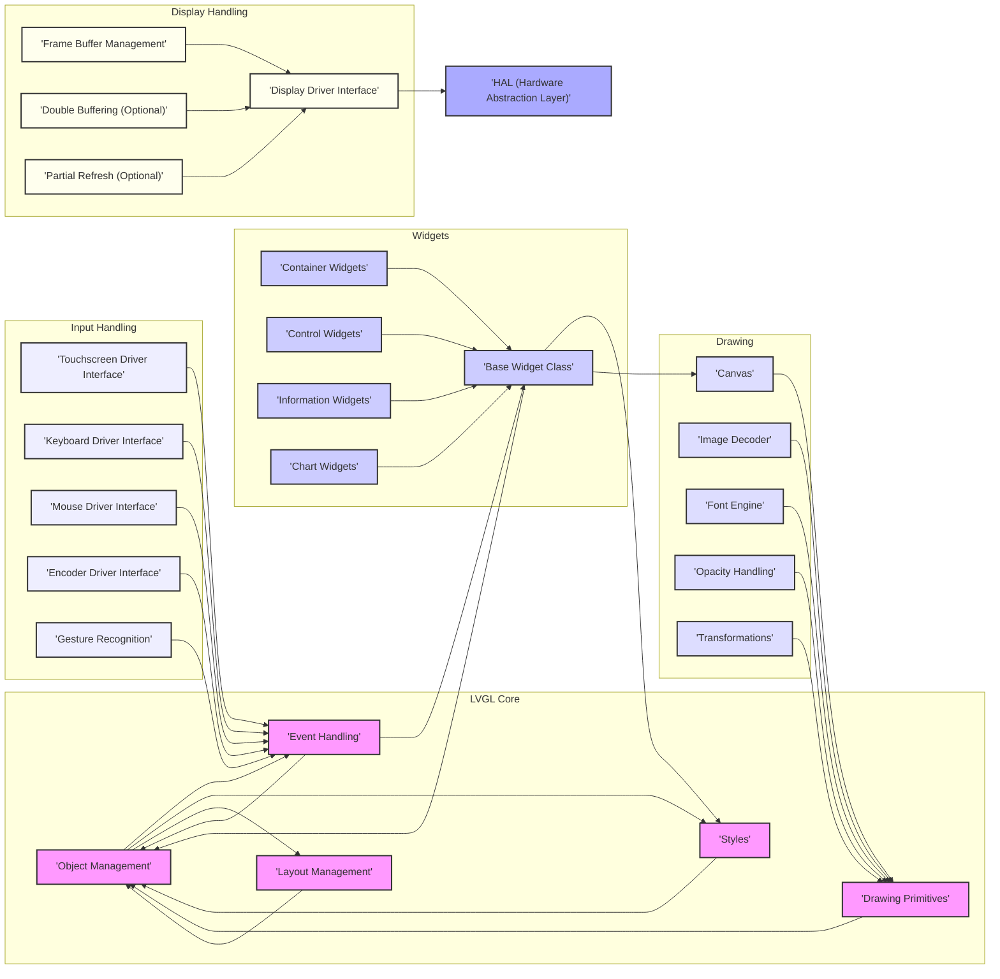
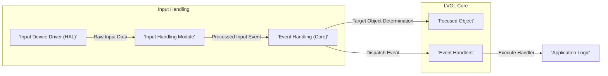
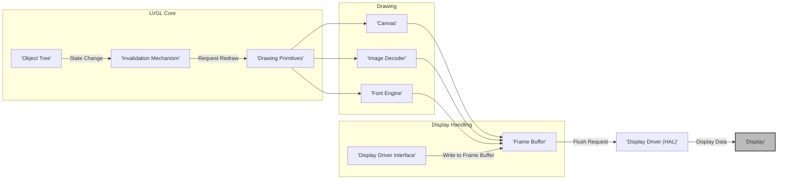

# Project Design Document: LVGL (Light and Versatile Graphics Library)

**Version:** 1.1
**Date:** October 26, 2023
**Author:** AI Software Architect

## 1. Introduction

This document provides a detailed design overview of the LVGL (Light and Versatile Graphics Library) project. It aims to capture the key architectural components, data flows, and interactions within the library. This document will serve as the foundation for subsequent threat modeling activities. It is intended for security engineers, developers, and anyone involved in assessing the security of systems utilizing LVGL.

LVGL is a free and open-source graphics library providing everything needed to create embedded GUIs with easy-to-use graphical elements, beautiful visual effects, and a low memory footprint. It's written in C and is designed to be portable across various microcontroller platforms.

## 2. Goals and Objectives

*   Provide a comprehensive architectural overview of LVGL.
*   Identify key components and their responsibilities.
*   Describe the primary data flows within the library.
*   Outline the interactions between different modules.
*   Establish a clear understanding of the system for threat modeling purposes.
*   Highlight potential areas of security concern based on the design.

## 3. System Architecture

LVGL follows a layered architecture, separating concerns and promoting modularity. The core components can be broadly categorized as follows:

*   **Core:** Provides fundamental functionalities like object management, event handling, drawing primitives, styles, and layout management.
*   **Widgets:** Offers a rich set of pre-built UI elements (buttons, labels, sliders, charts, etc.). These are built upon the Core functionalities.
*   **Drawing:** Handles the actual rendering of graphical elements on the display, utilizing image decoding and font rendering capabilities.
*   **Input Handling:** Manages input events from various sources (touchscreen, keyboard, mouse, encoders), translating raw input into actionable events.
*   **Display Handling:** Provides an abstraction layer for interacting with different display drivers, managing frame buffers and refresh mechanisms.
*   **HAL (Hardware Abstraction Layer):** Offers interfaces for platform-specific functionalities like display flushing, input reading, tick management, and potentially file system access.

## 4. Component Details

This section provides a more detailed description of the key components:

*   **Core:**
    *   **Object Management:**  Handles the lifecycle of UI objects (widgets), including creation, deletion, and hierarchical organization. This is crucial for managing the UI structure and event propagation. Potential vulnerabilities could arise from improper object management leading to dangling pointers or memory leaks.
    *   **Event Handling:**  Manages the flow of events triggered by user input or system actions. This involves identifying the target object and invoking registered event handlers. Security concerns include the possibility of malicious events being injected or event handlers not properly validating data.
    *   **Drawing Primitives:**  Provides the fundamental building blocks for rendering graphics (lines, rectangles, text, etc.). Bugs in these primitives could lead to unexpected visual behavior or even crashes.
    *   **Styles:**  Defines the visual attributes of objects. Improperly handled or overly complex styles could potentially lead to performance issues or unexpected rendering behavior.
    *   **Layout Management:**  Automates the positioning and sizing of child objects within containers. Vulnerabilities here could lead to UI elements being rendered outside of their intended bounds or overlapping in unexpected ways.

*   **Widgets:**
    *   **Base Widget Class:**  Defines the common interface and functionality for all widgets, including handling basic events and drawing. Security issues in the base class could affect all derived widgets.
    *   **Container Widgets (e.g., `lv_obj`, `lv_win`, `lv_tabview`):**  Manage child widgets and their layout. Improper handling of child widgets could lead to vulnerabilities.
    *   **Control Widgets (e.g., `lv_button`, `lv_slider`, `lv_checkbox`):**  Provide interactive elements for user input. These are prime targets for input validation vulnerabilities.
    *   **Information Widgets (e.g., `lv_label`, `lv_image`, `lv_bar`):**  Display information to the user. Potential vulnerabilities include displaying sensitive information insecurely or being susceptible to format string bugs if displaying user-provided data.
    *   **Chart Widgets (e.g., `lv_chart`):**  Visualize data graphically. Vulnerabilities could arise from handling large or malicious datasets.

*   **Drawing:**
    *   **Canvas:**  Provides a pixel-level drawing surface for custom graphics. Direct pixel manipulation requires careful bounds checking to prevent buffer overflows.
    *   **Image Decoder:**  Responsible for decoding various image formats (e.g., BMP, PNG, JPG). Vulnerabilities in image decoders are common and can lead to crashes or remote code execution if processing untrusted images.
    *   **Font Engine:**  Renders text using different fonts and sizes. Issues in font rendering could lead to unexpected behavior or even crashes when processing specially crafted fonts.
    *   **Opacity Handling:**  Manages the transparency of graphical elements. Incorrect opacity calculations might lead to visual glitches or unexpected behavior.
    *   **Transformations:**  Allows for scaling, rotating, and translating graphical elements. Bugs in transformation logic could lead to incorrect rendering or unexpected behavior.

*   **Input Handling:**
    *   **Touchscreen Driver Interface:**  Receives raw touch input data. It's crucial to validate and sanitize this input to prevent injection attacks or unexpected behavior.
    *   **Keyboard Driver Interface:**  Receives keyboard input. Similar to touchscreen input, validation is essential.
    *   **Mouse Driver Interface:**  Handles mouse input.
    *   **Encoder Driver Interface:**  Processes input from rotary encoders.
    *   **Gesture Recognition:**  Interprets sequences of input events as gestures. Vulnerabilities could arise from incorrect gesture recognition logic or handling of malicious input sequences.

*   **Display Handling:**
    *   **Display Driver Interface:**  Provides the low-level interface to the display hardware. Bugs in the display driver can lead to display corruption or instability.
    *   **Frame Buffer Management:**  Manages the memory used to store the display content. Buffer overflows are a significant concern here.
    *   **Double Buffering (Optional):**  Uses two frame buffers to prevent flickering. Incorrect synchronization or management of the buffers could lead to issues.
    *   **Partial Refresh (Optional):**  Allows updating only specific regions of the display. Incorrectly calculated refresh regions could lead to display corruption or security vulnerabilities if sensitive information is not properly overwritten.

*   **HAL (Hardware Abstraction Layer):**
    *   Provides platform-specific implementations for critical functionalities. This is a key security boundary, as vulnerabilities in the HAL can directly impact the security of the entire system.
        *   **Display Flushing:**  Sending the contents of the frame buffer to the display. Potential vulnerabilities include writing outside of the intended display memory region.
        *   **Input Reading:**  Reading input events from the configured input devices. The HAL must ensure that only valid input data is passed to the higher layers.
        *   **Tick Management:**  Providing a time base for animations and other time-dependent operations. Inaccurate or manipulated time can have security implications.
        *   **Memory Allocation:**  The HAL might provide memory allocation functions. Memory management vulnerabilities in the HAL are critical.
        *   **File System Access:** If image or font loading from files is used, the HAL provides the interface to the file system. This is a significant area for potential vulnerabilities, including path traversal and access to unauthorized files.

## 5. Data Flow Diagrams

This section illustrates the primary data flows within LVGL.

### 5.1. Input Event Processing

**Description:**

1. The **Input Device Driver (HAL)** reads raw input data from the hardware (e.g., touch coordinates, key presses). This is a critical point for potential data injection or manipulation if the HAL is compromised.
2. The **Input Handling Module** processes this raw data, converting it into logical input events (e.g., touch pressed, button clicked). Vulnerabilities here could involve incorrect interpretation of raw data.
3. The **Event Handling (Core)** module receives the processed input event.
4. The **Event Handling (Core)** determines the target object for the event, often based on the current focus or the location of the input. Bypassing this mechanism could lead to events being delivered to unintended objects.
5. The event is dispatched to the **Event Handlers** associated with the target object.
6. The **Application Logic** (user-defined code) within the event handler is executed. This is where application-specific vulnerabilities related to input handling can occur.

### 5.2. Display Update

**Description:**

1. A change in the state of a UI object (e.g., text change, position change) triggers the **Invalidation Mechanism**.
2. The **Invalidation Mechanism** marks the affected areas of the display as needing a redraw. Incorrect invalidation could lead to information not being updated or unnecessary redraws.
3. The **Drawing Primitives** are used to render the invalidated areas onto the **Canvas** or directly into the **Frame Buffer**. This may involve using the **Image Decoder** and **Font Engine**. Vulnerabilities in these components can lead to display corruption or crashes.
4. The **Display Driver Interface** provides functions to write pixel data to the **Frame Buffer**. Buffer overflows are a major concern here.
5. When a redraw is complete or a certain interval has passed, a flush request is sent to the **Display Driver (HAL)**.
6. The **Display Driver (HAL)** sends the contents of the **Frame Buffer** to the **Display**. Vulnerabilities in the HAL's display flushing mechanism can lead to display corruption or other issues.

## 6. Security Considerations (More Specific)

This section outlines potential security considerations that will be further explored during threat modeling:

*   **Input Validation Vulnerabilities:**
    *   Insufficient validation of input data from touchscreens, keyboards, and encoders could allow injection of malicious commands or data, potentially leading to unexpected behavior or crashes.
    *   Lack of sanitization of text input displayed in labels or other widgets could lead to format string bugs or cross-site scripting (XSS) like vulnerabilities if web views are involved.
*   **Memory Safety Issues:**
    *   Buffer overflows in drawing primitives, image decoders, font engines, or frame buffer management could lead to crashes or potentially arbitrary code execution.
    *   Use-after-free vulnerabilities in object management or event handling could also lead to crashes or exploitable conditions.
    *   Double-free vulnerabilities in memory management within LVGL or the underlying HAL could lead to crashes or heap corruption.
*   **Resource Exhaustion:**
    *   Processing excessively large or complex images or fonts could lead to excessive memory consumption or CPU usage, resulting in denial-of-service.
    *   Rapidly generating and destroying UI objects could lead to memory fragmentation and eventual exhaustion.
*   **Configuration Vulnerabilities:**
    *   Insecure default configurations or allowing overly permissive configuration options could expose vulnerabilities.
    *   Improper handling of configuration parameters could lead to unexpected behavior or security flaws.
*   **Dependency Vulnerabilities:**
    *   Vulnerabilities in external libraries used for image decoding or other functionalities could be exploited through LVGL.
    *   The security of the underlying HAL is critical, as vulnerabilities there can directly impact LVGL's security.
*   **Information Disclosure:**
    *   Sensitive information displayed on the UI without proper protection could be exposed.
    *   Debugging features left enabled in production builds could leak sensitive information.
*   **Supply Chain Security:**
    *   Compromised source code or malicious dependencies could introduce vulnerabilities into LVGL.

## 7. Deployment Scenarios and Security Implications

LVGL is typically deployed in embedded systems with the following characteristics, each with its own security implications:

*   **Resource-Constrained Microcontrollers (MCUs):**  Limited memory and processing power make it challenging to implement robust security measures. Vulnerabilities that exploit memory safety issues are particularly concerning.
*   **Real-Time Operating Systems (RTOS):**  The security of the RTOS itself is a critical factor. LVGL's interaction with the RTOS needs to be secure.
*   **Bare-Metal Environments:**  Security relies entirely on the application and LVGL itself. There is no underlying OS to provide security features.
*   **Displays with External Interfaces (e.g., over network):** If the display or the system running LVGL is accessible over a network, it becomes a potential target for remote attacks. Input validation and secure communication are crucial.
*   **Systems Handling Sensitive Data:**  If LVGL is used in systems displaying or processing sensitive data (e.g., medical devices, financial systems), vulnerabilities could have serious consequences. Secure storage and handling of this data are paramount.

## 8. Dependencies and Security Implications

LVGL has minimal external dependencies within its core. However, the following aspects rely on platform-specific implementations and external libraries, which introduce potential security risks:

*   **Display Drivers (HAL):**  Vulnerabilities in the display driver can lead to display corruption or even system instability. Untrusted or poorly written drivers are a significant risk.
*   **Input Drivers (HAL):**  Compromised input drivers could inject malicious input into the system.
*   **Image Decoding Libraries (Optional, potentially linked through HAL):**  Vulnerabilities in image decoding libraries (e.g., libpng, libjpeg) are well-known and can lead to remote code execution if processing untrusted images.
*   **Font Rendering Libraries (Optional, potentially linked through HAL):** Similar to image decoding, vulnerabilities in font rendering libraries can be exploited.
*   **File System Access (HAL):** If file system access is used for loading images or fonts, vulnerabilities like path traversal could allow access to unauthorized files.
*   **Communication Libraries (if network connectivity is used):** If LVGL is part of a system with network connectivity, the security of the communication libraries (e.g., TCP/IP stack) is critical.

## 9. Future Considerations for Security

*   Static code analysis to identify potential memory safety issues and other vulnerabilities.
*   Fuzzing of image decoding, font rendering, and input handling components to discover unexpected behavior and crashes.
*   Regular security audits of the codebase.
*   Development and adherence to secure coding practices.
*   Consideration of memory protection mechanisms offered by target platforms.
*   Implementation of input sanitization and validation routines throughout the library.
*   Further breakdown of individual widget implementations for targeted security analysis.

This document provides a more detailed and security-focused understanding of the LVGL project architecture. It will serve as a more robust basis for conducting a thorough threat model to identify and mitigate potential security risks.