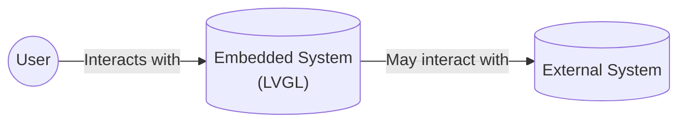
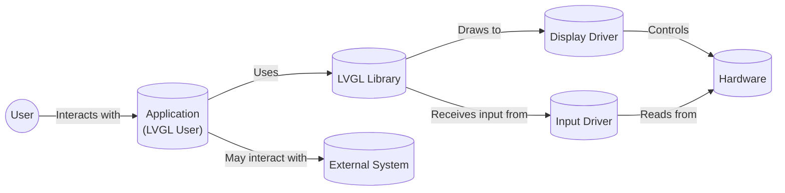

# BUSINESS POSTURE

Business Priorities and Goals:

*   Provide a free and open-source graphics library (LVGL) for creating embedded GUIs with easy-to-use graphical elements, beautiful visual effects, and a low memory footprint.
*   Offer a wide range of widgets, styles, and features to enable developers to create visually appealing and interactive user interfaces for various embedded systems.
*   Maintain a well-documented and actively maintained project with a supportive community.
*   Ensure the library is highly portable and compatible with different microcontrollers, displays, and input devices.
*   Continuously improve the library's performance, features, and ease of use.

Business Risks:

*   Malicious code injection: Given that LVGL is a graphics library used in embedded systems, a significant risk is the potential for malicious code injection that could compromise the device's functionality or security. This is particularly critical if the embedded system controls physical hardware or handles sensitive data.
*   Denial of Service (DoS): Attacks that exploit vulnerabilities in the library to cause excessive resource consumption (memory, CPU) could lead to a denial of service, rendering the embedded system unresponsive.
*   Buffer overflows: As a C library, LVGL is potentially susceptible to buffer overflow vulnerabilities if not carefully managed. These could be exploited to execute arbitrary code.
*   Untrusted input: If LVGL processes untrusted input data (e.g., from external sources or user input), vulnerabilities could arise if the input is not properly validated and sanitized.
*   Supply chain attacks: Compromised development tools, build systems, or third-party dependencies could introduce vulnerabilities into the LVGL library itself.
*   Lack of security updates: If vulnerabilities are discovered but not promptly addressed with security updates, deployed devices using LVGL could remain vulnerable to attack.

# SECURITY POSTURE

Existing Security Controls:

*   security control: Code quality checks: The project uses static analysis tools (e.g., Coverity) and linters to identify potential code quality issues and vulnerabilities. (Mentioned in the repository's documentation and CI configuration).
*   security control: Community review: As an open-source project, LVGL benefits from community review, where developers can scrutinize the code for potential security issues. (Implicit in the open-source nature of the project).
*   security control: Documentation: The project provides extensive documentation, which can help developers use the library securely. (Available on the project's website and in the repository).
*   security control: Regular releases: The project has a history of regular releases, which suggests that bug fixes and security updates are likely to be addressed in a timely manner. (Evident from the project's release history).

Accepted Risks:

*   accepted risk: Resource constraints: Embedded systems often have limited resources (memory, processing power), which may constrain the implementation of certain security features.
*   accepted risk: Third-party dependencies: LVGL may rely on third-party libraries or components, which could introduce their own security risks.
*   accepted risk: User-controlled input: In some use cases, LVGL may process user-controlled input, which inherently carries a risk of injection vulnerabilities if not handled carefully.

Recommended Security Controls:

*   security control: Fuzz testing: Implement fuzz testing to automatically discover potential vulnerabilities by providing invalid or unexpected inputs to the library.
*   security control: Memory safety checks: Integrate memory safety checks (e.g., AddressSanitizer) into the build and testing process to detect memory corruption errors.
*   security control: Input validation: Enforce strict input validation for all data received from external sources or user input.
*   security control: Secure coding guidelines: Develop and enforce secure coding guidelines for contributors to the project.
*   security control: Vulnerability disclosure program: Establish a clear process for reporting and addressing security vulnerabilities.
*   security control: Dependency analysis: Regularly analyze and update third-party dependencies to mitigate supply chain risks.

Security Requirements:

*   Authentication: Not directly applicable to the core functionality of a graphics library. However, if LVGL is used in a system that requires authentication, the application using LVGL would be responsible for implementing it.
*   Authorization: Similar to authentication, authorization is typically handled at the application level, not within the graphics library itself.
*   Input validation: LVGL should validate all inputs to its API functions to prevent unexpected behavior or vulnerabilities. This includes checking for valid ranges, data types, and lengths. Special attention should be given to any input that originates from external sources or user interaction.
*   Cryptography: LVGL itself does not handle cryptographic operations. If encryption or other cryptographic functions are needed, they should be implemented at the application level or using dedicated cryptographic libraries.
*   Memory Management: LVGL should manage memory safely and efficiently, avoiding memory leaks, buffer overflows, and other memory-related vulnerabilities.

# DESIGN

## C4 CONTEXT



Element Descriptions:

*   Element:
    *   Name: User
    *   Type: Person
    *   Description: A person interacting with the embedded system that utilizes the LVGL library.
    *   Responsibilities: Provides input to the embedded system and receives visual output.
    *   Security controls: None (handled by the embedded system).

*   Element:
    *   Name: Embedded System (LVGL)
    *   Type: Software System
    *   Description: The embedded system running the application that uses the LVGL library for its graphical user interface.
    *   Responsibilities: Executes the application logic, renders the GUI using LVGL, handles user input, and potentially interacts with external systems.
    *   Security controls: Input validation, code quality checks, community review, regular releases.

*   Element:
    *   Name: External System
    *   Type: Software System
    *   Description: Any external system that the embedded system might interact with (e.g., a network service, a sensor, another device). This is optional and depends on the specific application.
    *   Responsibilities: Varies depending on the specific external system.
    *   Security controls: Depends on the specific external system. The embedded system should treat interactions with external systems as potential security risks and implement appropriate safeguards.

## C4 CONTAINER



Element Descriptions:

*   Element:
    *   Name: User
    *   Type: Person
    *   Description: A person interacting with the embedded system.
    *   Responsibilities: Provides input and receives visual output.
    *   Security controls: None (handled by the application).

*   Element:
    *   Name: Application (LVGL User)
    *   Type: Container (Software)
    *   Description: The application code that utilizes the LVGL library. This is the code written by the developer using LVGL.
    *   Responsibilities: Implements the application logic, creates and manages LVGL objects (widgets, styles, etc.), handles user input events, and interacts with the LVGL library.
    *   Security controls: Input validation, secure coding practices.

*   Element:
    *   Name: LVGL Library
    *   Type: Container (Library)
    *   Description: The LVGL library itself.
    *   Responsibilities: Provides the API for creating and managing graphical elements, handles rendering, and manages input events.
    *   Security controls: Code quality checks, community review, regular releases.

*   Element:
    *   Name: Display Driver
    *   Type: Container (Software)
    *   Description: The driver software for the specific display hardware being used.
    *   Responsibilities: Translates LVGL's drawing commands into the specific signals required by the display hardware.
    *   Security controls: Depends on the specific driver implementation.

*   Element:
    *   Name: Input Driver
    *   Type: Container (Software)
    *   Description: The driver software for the specific input device(s) being used (e.g., touchscreen, buttons).
    *   Responsibilities: Reads input events from the hardware and provides them to LVGL.
    *   Security controls: Depends on the specific driver implementation.

*   Element:
    *   Name: Hardware
    *   Type: Container (Hardware)
    *   Description: The physical hardware components, including the display, input devices, microcontroller, and memory.
    *   Responsibilities: Executes the software and provides the physical interface for user interaction.
    *   Security controls: Hardware security features (if available).

*   Element:
    *   Name: External System
    *   Type: Software System
    *   Description: Any external system that the embedded system might interact with.
    *   Responsibilities: Varies depending on the specific external system.
    *   Security controls: Depends on the specific external system.

## DEPLOYMENT

Deployment Solutions:

1.  **Bare-metal deployment:** The LVGL library and the application code are compiled and linked together into a single binary image, which is then flashed directly onto the microcontroller's memory. This is the most common deployment scenario for embedded systems.
2.  **RTOS-based deployment:** The LVGL library and the application code are run within a real-time operating system (RTOS). The RTOS provides task scheduling, memory management, and other services.
3.  **Embedded Linux deployment:** LVGL can be used on embedded systems running Linux. In this case, LVGL would typically be used as a library within a larger application framework (e.g., Qt, GTK).

Chosen Deployment Solution (Bare-metal):

```mermaid
graph LR
    Microcontroller[("Microcontroller\n(Flash Memory)")]
    ApplicationBinary(("Application Binary\n(LVGL + App Code)")]

    ApplicationBinary -- "Flashed onto" --> Microcontroller
```

Element Descriptions:

*   Element:
    *   Name: Microcontroller (Flash Memory)
    *   Type: Hardware
    *   Description: The microcontroller unit (MCU) with its built-in flash memory.
    *   Responsibilities: Executes the application code stored in flash memory.
    *   Security controls: Hardware security features (if available), secure boot (if implemented).

*   Element:
    *   Name: Application Binary (LVGL + App Code)
    *   Type: Software
    *   Description: The compiled binary image containing the LVGL library and the application code.
    *   Responsibilities: Contains all the instructions to be executed by the microcontroller.
    *   Security controls: Code signing (if implemented), integrity checks (if implemented).

## BUILD

```mermaid
graph LR
    Developer[("Developer\n(Local Workstation)")]
    SourceCode(("Source Code\n(LVGL + App)"))
    BuildSystem[("Build System\n(Compiler, Linker)")]
    StaticAnalysis[("Static Analysis\n(Coverity, Linters)")]
    ApplicationBinary(("Application Binary")]
    ArtifactRepository[("Artifact Repository")]

    Developer -- "Writes code" --> SourceCode
    SourceCode -- "Build process" --> BuildSystem
    BuildSystem -- "Performs" --> StaticAnalysis
    BuildSystem -- "Produces" --> ApplicationBinary
    ApplicationBinary -- "Stored in" --> ArtifactRepository
```

Build Process Description:

1.  **Development:** Developers write the application code and integrate the LVGL library.
2.  **Source Code:** The source code (including LVGL and the application) is stored in a version control system (e.g., Git).
3.  **Build System:** A build system (e.g., CMake, Make) is used to compile and link the source code. This involves:
    *   **Compilation:** Compiling the C source code into object files.
    *   **Linking:** Linking the object files (including LVGL and the application) together to create the final executable binary.
4.  **Static Analysis:** Static analysis tools (e.g., Coverity, linters) are integrated into the build process to automatically check for code quality issues and potential vulnerabilities.
5.  **Application Binary:** The output of the build process is the application binary, ready to be deployed to the target device.
6.  **Artifact Repository:** The application binary can optionally be stored in an artifact repository for later retrieval and deployment.

Security Controls in Build Process:

*   security control: Static analysis: As mentioned above, static analysis tools are used to identify potential vulnerabilities.
*   security control: Compiler warnings: The build system should be configured to enable compiler warnings and treat them as errors, forcing developers to address potential issues.
*   security control: Dependency management: If the project uses external dependencies, a dependency management system should be used to track and update them, mitigating supply chain risks.
*   security control: Build automation: The build process should be fully automated to ensure consistency and reproducibility.
*   security control: Code signing (optional): The application binary can be digitally signed to ensure its authenticity and integrity.

# RISK ASSESSMENT

Critical Business Processes:

*   The primary business process is providing a functional and reliable graphics library for embedded systems. Any disruption to the library's functionality or security could impact the devices using it.

Data Protection:

*   LVGL itself does not typically handle sensitive data directly. However, the *applications* using LVGL might. The sensitivity of the data depends on the specific application. Examples include:
    *   **Low sensitivity:** Displaying non-sensitive information like sensor readings or status updates.
    *   **Medium sensitivity:** User interface for controlling a device that does not handle personal or financial data.
    *   **High sensitivity:** User interface for a medical device, a financial transaction terminal, or a system that controls critical infrastructure.

The application developer is responsible for protecting any sensitive data handled by their application, regardless of whether LVGL is used. LVGL's role is to provide a secure and reliable foundation for the GUI, but it cannot guarantee the security of the application's data.

# QUESTIONS & ASSUMPTIONS

Questions:

*   Are there any specific regulatory requirements or compliance standards that the embedded system using LVGL must adhere to (e.g., medical device regulations, automotive safety standards)?
*   Will the embedded system be connected to a network or the internet? If so, what are the security implications?
*   Will the embedded system process any user-provided input? If so, what are the potential attack vectors?
*   What are the specific hardware security features available on the target microcontroller?
*   What is the expected lifetime of the embedded system, and how will security updates be managed over time?
*   Are there any third-party libraries or components used in conjunction with LVGL?

Assumptions:

*   BUSINESS POSTURE: The primary goal is to provide a robust and reliable open-source graphics library. Security is a high priority, but resource constraints on embedded systems may limit the implementation of some security features.
*   SECURITY POSTURE: The existing security controls are limited to code quality checks and community review. There is room for improvement by implementing additional security measures like fuzz testing and memory safety checks.
*   DESIGN: The deployment model is assumed to be bare-metal, which is the most common scenario for embedded systems. The build process is assumed to be automated and include static analysis.