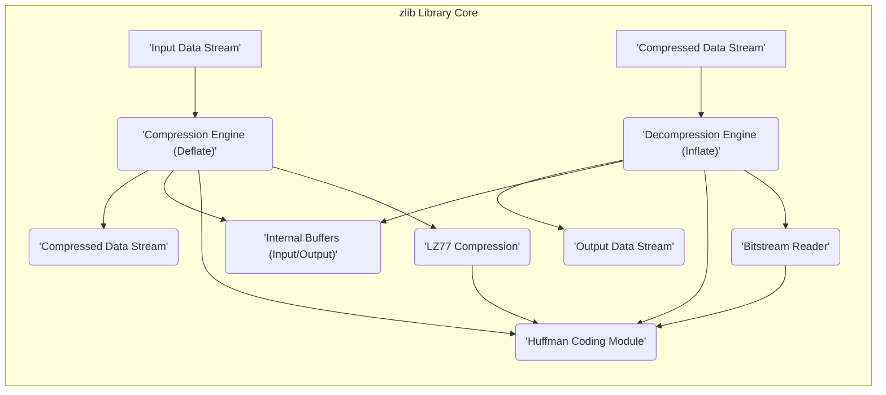
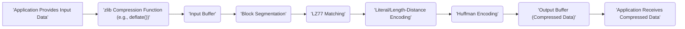
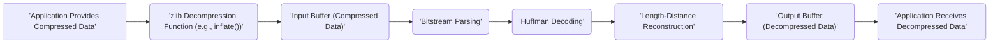

## Project Design Document: zlib Compression Library (Improved)

**1. Project Overview**

* **Project Name:** zlib
* **Project Repository:** [https://github.com/madler/zlib](https://github.com/madler/zlib)
* **Project Description:** zlib is a rigorously tested, general-purpose lossless data compression library. It offers in-memory compression and decompression functions, emphasizing portability and efficiency across diverse platforms. Its widespread adoption makes it a foundational component in numerous applications and operating systems.
* **Project Goal:** To maintain and provide a highly reliable, performant, and portable library for lossless data compression and decompression, suitable for a wide range of applications.
* **Target Audience:** Software developers requiring lossless data compression and decompression capabilities for their applications, system programmers integrating compression into operating systems or low-level utilities, and researchers in data compression techniques.

**2. Architecture Overview**

This section provides a high-level overview of the zlib library's architecture, illustrating the core modules and their interactions.

**3. Key Components**

This section details the major functional components within the zlib library, elaborating on their responsibilities and internal workings.

* **Compression Engine (Deflate):**
    * **Responsibility:**  Transforms an input data stream into a compressed representation using the Deflate algorithm.
    * **Functionality:**
        * **Block Segmentation:** Divides the input data into manageable blocks for processing.
        * **Matching Algorithm (LZ77):** Identifies repeating sequences of data within a sliding window and represents them with back-references (length and distance).
        * **Literal Encoding:**  Encodes individual bytes that do not form part of a repeating sequence.
        * **Huffman Coding:**  Applies Huffman coding to the literals and length-distance pairs, assigning shorter codes to more frequent symbols to achieve compression. Can use pre-defined or dynamically generated Huffman trees.
* **Decompression Engine (Inflate):**
    * **Responsibility:** Reconstructs the original data stream from its compressed representation.
    * **Functionality:**
        * **Bitstream Reader:**  Parses the compressed data stream bit by bit to extract encoded symbols.
        * **Huffman Decoding:**  Uses the Huffman tree (either pre-defined or embedded in the compressed data) to decode the variable-length codes back into literals and length-distance pairs.
        * **Length-Distance Reconstruction:**  Reconstructs the original data by inserting the referenced sequences based on the decoded length and distance information.
* **Internal Buffers (Input/Output):**
    * **Responsibility:**  Provides temporary storage for data during the compression and decompression processes.
    * **Functionality:**
        * **Input Buffer:** Holds the incoming data to be compressed or the compressed data to be decompressed.
        * **Output Buffer:** Stores the resulting compressed or decompressed data before it is returned to the caller.
        * **Sliding Window:**  Used by the LZ77 algorithm to maintain a history of recently processed data for identifying repeating sequences.
* **Huffman Coding Module:**
    * **Responsibility:** Implements the Huffman coding algorithm for both compression and decompression.
    * **Functionality:**
        * **Huffman Tree Construction:** Builds Huffman trees based on the frequency of symbols.
        * **Encoding:**  Converts symbols into their corresponding Huffman codes.
        * **Decoding:**  Converts Huffman codes back into their original symbols.
* **LZ77 Compression:**
    * **Responsibility:**  Identifies and encodes repeating sequences within the input data.
    * **Functionality:**
        * **Sliding Window Search:**  Searches a sliding window of previously processed data for matches with the current input.
        * **Back-reference Encoding:**  Represents matching sequences with a pair of values: the length of the match and the distance (offset) to the previous occurrence.
* **Bitstream Reader:**
    * **Responsibility:**  Provides a mechanism for reading bits from the compressed data stream.
    * **Functionality:**
        * **Bit-level Access:** Allows reading individual bits or groups of bits from the input buffer.
        * **Buffer Management:**  Handles the underlying buffer and ensures efficient access to the bitstream.

**4. Data Flow**

This section illustrates the flow of data through the zlib library during both compression and decompression operations.

**4.1. Compression Data Flow**

**4.2. Decompression Data Flow**

**5. Security Considerations (Pre-Threat Modeling)**

This section outlines potential security considerations inherent in the design and implementation of zlib. These points will serve as a basis for more detailed threat modeling.

* **Buffer Overflows (Compression & Decompression):**
    * **Input Buffer Overflow:**  Providing excessively large input data without proper size validation could lead to writing beyond the allocated input buffer.
    * **Output Buffer Overflow:**  If the output buffer is too small to accommodate the compressed or decompressed data, it could result in a buffer overflow. This is particularly relevant during decompression where the output size might not be known in advance.
    * **Internal Buffer Overflow:**  Errors in calculating or managing the size of internal buffers (e.g., the sliding window) could lead to overflows.
* **Integer Overflows (Compression & Decompression):**
    * **Length/Distance Calculations:**  Overflows in calculations involving lengths and distances in the LZ77 algorithm could lead to incorrect memory access or control flow.
    * **Buffer Size Calculations:**  Integer overflows when calculating buffer sizes could result in undersized allocations, leading to subsequent buffer overflows.
* **Denial of Service (DoS) via Decompression Bombs:**
    * **Excessive Memory Allocation:** Maliciously crafted compressed data can be designed to decompress into an extremely large size, potentially exhausting available memory and causing a denial of service.
    * **CPU Exhaustion:**  Complex or deeply nested compressed structures can require significant processing power to decompress, potentially leading to CPU exhaustion.
* **Format String Vulnerabilities:**
    * While less likely in the core compression logic, any logging or error handling mechanisms that utilize format strings without proper sanitization could be exploited to execute arbitrary code or leak information.
* **Memory Management Issues (Leaks & Use-After-Free):**
    * **Memory Leaks:**  Failure to properly deallocate memory used for internal buffers or data structures could lead to memory leaks over time.
    * **Use-After-Free:**  Accessing memory that has already been freed could lead to crashes or exploitable vulnerabilities.
* **Side-Channel Attacks (Timing Attacks):**
    * Variations in the execution time of compression or decompression operations based on the input data could potentially leak sensitive information. This is generally a lower-risk concern for zlib but should be considered in highly sensitive applications.
* **Magic Number Validation Bypass:**
    * If the validation of the zlib stream's magic number is flawed or can be bypassed, it might be possible to trick the decompressor into processing invalid or malicious data.
* **State Management Errors:**
    * Incorrect handling of the internal state of the compression or decompression engines could lead to unexpected behavior or vulnerabilities.

**6. Dependencies**

* **Standard C Library:** zlib relies on the standard C library (`libc`) for fundamental functionalities such as memory allocation (`malloc`, `free`, `calloc`, `realloc`), and potentially for basic input/output operations depending on the usage context.

**7. Deployment Considerations**

* **Library Integration Methods:**
    * **Dynamically Linked Library:** The most common deployment method, where the zlib library is linked at runtime. This reduces the size of executable files and allows for shared updates.
    * **Statically Linked Library:** The zlib code is directly incorporated into the executable. This avoids runtime dependencies but increases the executable size.
* **Operating System Support:** zlib is highly portable and can be deployed on a wide range of operating systems, including Windows, Linux, macOS, and various embedded operating systems.
* **Programming Language Bindings:**  zlib has bindings and wrappers available for numerous programming languages (e.g., Python, Java, C++, Go), enabling its use in diverse development environments.
* **Application Contexts:**
    * **File Compression Utilities:** Used in tools like `gzip` and `zip`.
    * **Network Protocols:** Employed in protocols like HTTP (using `gzip` content encoding) and SSH.
    * **Data Storage:** Utilized for compressing data at rest in databases and file systems.
    * **In-Memory Compression:** Used for compressing data in memory to reduce memory footprint.
    * **Embedded Systems:** Integrated into resource-constrained devices for data compression.

**8. Assumptions**

* **General Data Integrity:** The library assumes that the underlying memory and storage mechanisms are functioning correctly and do not introduce errors into the data being processed.
* **Correct API Usage:** Developers integrating zlib are expected to adhere to the documented API, including proper initialization, providing valid input parameters, and handling return codes appropriately. Incorrect usage can lead to undefined behavior or vulnerabilities.
* **No Malicious Intent (Initial Input):** While zlib can handle various data patterns, it is not inherently designed to be a primary defense against intentionally malicious, oversized, or deeply nested compressed data streams. Additional layers of security might be necessary in such scenarios.
* **Sufficient System Resources:** The environment where zlib is deployed is assumed to have adequate memory, processing power, and stack space to execute the compression and decompression algorithms without resource exhaustion.

This improved design document provides a more detailed and comprehensive understanding of the zlib compression library, enhancing its value for subsequent threat modeling activities. The expanded descriptions of components, data flows, and security considerations offer a more robust foundation for identifying and mitigating potential vulnerabilities.