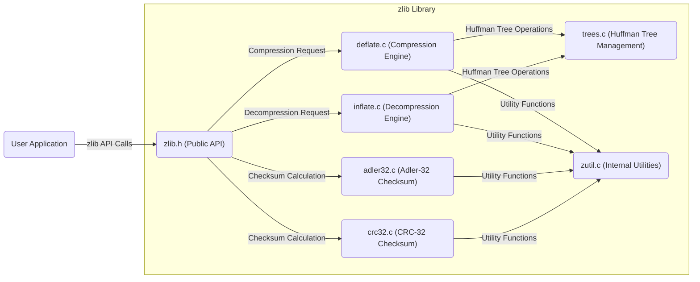
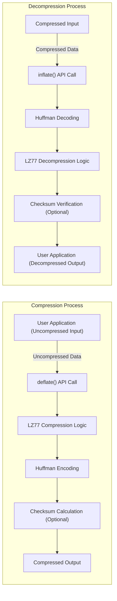

## Project Design Document: zlib Compression Library (Improved)

**1. Introduction**

This document provides an enhanced design overview of the zlib compression library, based on the version available at the specified GitHub repository: [https://github.com/madler/zlib](https://github.com/madler/zlib). This improved document aims to provide a more robust foundation for threat modeling activities by offering deeper insights into the library's architecture, data flow, security considerations, and potential attack vectors.

**2. Project Overview**

* **Project Name:** zlib
* **Project Description:** zlib is a widely adopted, general-purpose lossless data compression library. Its primary function is to provide efficient and portable compression and decompression capabilities for various data types. It is a foundational component in numerous applications and operating systems.
* **Primary Functionality:** Offers core functions for compressing and decompressing data streams utilizing the DEFLATE algorithm.
* **Key Features:**
    * **In-memory operations:** Supports compression and decompression of data held in memory buffers.
    * **Streaming capability:** Allows processing of data in sequential chunks, suitable for large files or continuous data streams.
    * **Data integrity checks:** Includes algorithms for calculating and verifying data integrity using Adler-32 and CRC-32 checksums.
    * **Configurable compression levels:** Provides options to adjust the compression level, allowing users to balance compression ratio against processing speed.
    * **Cross-platform compatibility:** Designed for portability across diverse operating systems and hardware architectures.
    * **Open-source licensing:** Distributed under a permissive open-source license, facilitating widespread adoption.
* **Target Audience:** Software developers, security engineers, system architects, and individuals involved in threat modeling and security analysis.

**3. Architectural Design**

zlib's architecture is centered around a procedural C API, with the DEFLATE algorithm forming the core of its compression and decompression logic.

* **Key Modules and Components:**
    * **`zlib.h`:** Defines the public interface of the library, including function prototypes, data structures (like `z_stream`), constants, and error codes. This is the primary entry point for applications using zlib.
    * **`deflate.c`:** Implements the DEFLATE compression algorithm. This module is further subdivided into logical units:
        * **Literal and Length Encoding:** Handles the encoding of literal bytes and repeated string lengths.
        * **Huffman Tree Construction:** Builds and manages Huffman trees for efficient symbol encoding.
        * **LZ77 Matching:** Implements the LZ77 algorithm to find and encode duplicate data sequences using back-references.
        * **Block Management:** Organizes the compressed output into blocks.
    * **`inflate.c`:** Implements the DEFLATE decompression algorithm, performing the reverse operations of the compression process. Key functionalities include:
        * **Huffman Decoding:** Decodes the compressed data using the Huffman trees.
        * **LZ77 Reconstruction:** Reconstructs the original data sequences based on the back-references.
        * **Bitstream Handling:** Manages the reading of bits from the compressed input stream.
    * **`adler32.c` and `crc32.c`:** Provide implementations for the Adler-32 and CRC-32 checksum algorithms, used for verifying data integrity during decompression.
    * **`trees.c`:** Contains functions for creating, manipulating, and managing the Huffman trees used in both compression and decompression.
    * **`zutil.c`:** Offers a collection of utility functions used internally by other zlib modules, including memory allocation wrappers, error handling, and platform-specific optimizations (if present).

* **Core Data Structures:**
    * **`z_stream`:** The central structure for managing the state of a compression or decompression operation. It contains pointers to the input and output buffers, information about the amount of data available and processed, compression state variables, and error indicators.
    * **Internal State Variables:** Various internal variables within the compression and decompression functions track the progress of the operation and maintain necessary context.

* **Control Flow Diagram:**

**4. Data Flow (Detailed)**

Understanding the data flow is crucial for identifying potential vulnerabilities.

* **Compression Data Flow:**
    * **Input Stage:** The user application provides uncompressed data to the `deflate()` function via the `z_stream` structure's input buffer (`next_in`) and specifies the amount of available input (`avail_in`).
    * **Processing Stages (within `deflate.c`):**
        * **Tokenization:** The input data is analyzed to identify literal bytes and sequences that can be represented by back-references.
        * **LZ77 Compression:** Repeated sequences are identified, and their length and distance are encoded as back-references.
        * **Huffman Encoding:** Literal bytes and the tokens representing lengths and distances are encoded using variable-length Huffman codes, with more frequent symbols having shorter codes. `trees.c` is used to manage the Huffman trees.
        * **Block Formation:** The encoded data is organized into compressed blocks.
        * **Checksum Calculation (Optional):** If requested, Adler-32 or CRC-32 checksums are calculated over the uncompressed data and included in the compressed output.
    * **Output Stage:** Compressed data is written to the output buffer (`next_out`) of the `z_stream` structure. The application retrieves the compressed data and updates the `avail_out` counter.

* **Decompression Data Flow:**
    * **Input Stage:** The user application provides compressed data to the `inflate()` function via the `z_stream` structure's input buffer (`next_in`) and specifies the amount of available input (`avail_in`).
    * **Processing Stages (within `inflate.c`):**
        * **Bitstream Reading:** The compressed input stream is read bit by bit.
        * **Huffman Decoding:** Huffman codes are decoded to retrieve the original literal bytes and the length-distance tokens. `trees.c` is used to manage the Huffman trees.
        * **LZ77 Reconstruction:** Back-references are used to reconstruct the original data sequences by copying previously decompressed data.
        * **Checksum Verification (Optional):** If checksums are present in the compressed data, `adler32.c` or `crc32.c` are used to calculate the checksum of the decompressed data and compare it with the stored checksum to verify data integrity.
    * **Output Stage:** Decompressed data is written to the output buffer (`next_out`) of the `z_stream` structure. The application retrieves the decompressed data and updates the `avail_out` counter.

**5. Security Considerations (Enhanced)**

This section details potential security vulnerabilities and considerations when using zlib.

* **Buffer Overflows:** A critical concern, particularly in C-based libraries.
    * **Heap-based Buffer Overflows:**  Occur when writing beyond the allocated bounds of a heap-allocated buffer during compression or decompression. This can be triggered by providing unexpectedly large input data or by vulnerabilities within the DEFLATE implementation itself.
    * **Stack-based Buffer Overflows:** Less common in zlib's core, but could arise in custom wrappers or integrations if buffer sizes on the stack are not handled correctly when interacting with zlib's API.
* **Integer Overflows:**  Potential for integer overflows in calculations related to buffer sizes, compression ratios, or internal state management. An overflow can lead to unexpected behavior, including incorrect memory allocation sizes, which can then lead to buffer overflows or other memory corruption issues.
* **Denial of Service (DoS):** Maliciously crafted compressed data can exploit the decompression algorithm's complexity, leading to excessive CPU or memory consumption, effectively causing a denial of service.
    * **Decompression Bombs (Zip Bombs):**  Small compressed files that expand to enormous sizes upon decompression can overwhelm system resources.
    * **Algorithmic Complexity Exploitation:**  Specific patterns in the compressed data could trigger inefficient execution paths within the `inflate()` function, leading to prolonged processing times.
* **Memory Allocation Failures:** While zlib handles memory allocation internally, insufficient memory or errors during allocation can lead to crashes or unexpected behavior. Robust error handling in the calling application is crucial to manage these scenarios gracefully.
* **Input Validation Vulnerabilities:** The calling application has the responsibility to validate input data before passing it to zlib. Failure to do so can expose zlib to unexpected or malicious input, potentially triggering vulnerabilities.
* **Dependency Chain Risks:** If zlib is used as a dependency in other libraries or applications, vulnerabilities in zlib can propagate to those dependent components. Maintaining up-to-date versions of zlib is essential.
* **Side-Channel Attacks (Theoretical):** While less likely in typical use cases, theoretical vulnerabilities related to timing variations or power consumption during compression/decompression could be exploited in highly sensitive environments to infer information about the processed data.

**6. Dependencies**

zlib has a very minimal dependency footprint, which is a security advantage.

* **Standard C Library:** Relies on standard C library functions for core operations like memory management (`malloc`, `free`, `memcpy`), string manipulation, and basic input/output.
* **Operating System Interface (Minimal):**  The core functionality is largely OS-independent. Platform-specific optimizations might utilize OS-specific APIs, but the fundamental compression and decompression logic does not directly depend on specific operating system features.

**7. Deployment Scenarios**

zlib's versatility leads to its widespread deployment across various domains.

* **Application Development:** Directly embedded within applications for compressing data before storage or network transmission, and decompressing it upon retrieval.
* **Operating Systems:** Integral part of many operating systems, used for tasks like file system compression, kernel modules, and system utilities.
* **Networking Protocols:** Employed in protocols like HTTP (gzip compression), SSH, TLS/SSL, and others to reduce bandwidth usage and improve transfer speeds.
* **Archiving and Backup Software:** Core component of popular archiving tools such as `gzip`, `zip`, and `tar`, enabling the creation of compressed archives.
* **Data Storage Systems:** Used in databases, file systems, and cloud storage services to compress data at rest, saving storage space and potentially improving I/O performance.
* **Software Libraries and Frameworks:** Serves as a foundational compression library for higher-level libraries and frameworks across various programming languages.

**8. Potential Attack Surface (Detailed)**

This section elaborates on the potential attack surfaces, providing more specific examples.

* **Input to `deflate()`:**
    * **Large, Highly Redundant Data:** While not directly exploitable in zlib itself, processing extremely large input data with high redundancy might expose vulnerabilities in the calling application's buffer management or memory handling.
* **Input to `inflate()`:** This is a primary attack surface.
    * **Malformed Compressed Data:** Carefully crafted compressed data with invalid headers, incorrect checksums, or out-of-bounds back-references can trigger errors or vulnerabilities in the `inflate()` function, potentially leading to crashes, buffer overflows, or infinite loops.
    * **Decompression Bombs:**  Small compressed files that expand to disproportionately large sizes upon decompression can exhaust system resources (CPU, memory, disk space).
    * **Exploiting Huffman Tree Vulnerabilities:**  Maliciously crafted compressed data could manipulate the Huffman trees in a way that leads to incorrect decoding or out-of-bounds memory access during decompression.
* **Buffer Management (Calling Application Responsibility):**
    * **Insufficient Output Buffer Size:** Providing an output buffer to `deflate()` or `inflate()` that is too small to hold the compressed or decompressed data can lead to data truncation or errors.
    * **Incorrectly Calculating Buffer Sizes:** Errors in calculating the required buffer sizes can lead to buffer overflows when writing data.
* **Memory Allocation (Indirectly):**
    * **Triggering Excessive Memory Allocation:** Malicious compressed data could be designed to force `inflate()` to allocate large amounts of memory, potentially leading to memory exhaustion and DoS.
* **Interaction with Calling Application:**
    * **Failure to Handle Errors:**  If the calling application does not properly check the return codes of zlib functions, errors indicating vulnerabilities or unexpected behavior might be ignored, leading to further issues.
    * **Improper Use of API:** Incorrectly initializing the `z_stream` structure or misusing the zlib API functions can introduce vulnerabilities.

This enhanced design document provides a more comprehensive understanding of the zlib library's architecture, data flow, and security considerations, serving as a stronger foundation for conducting thorough threat modeling activities.