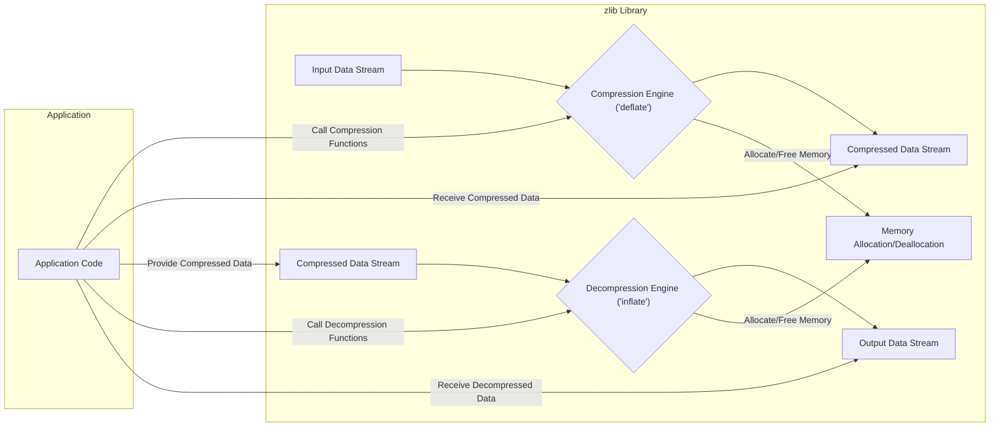
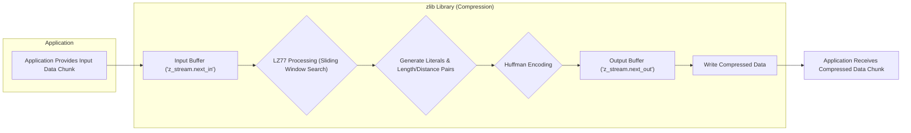
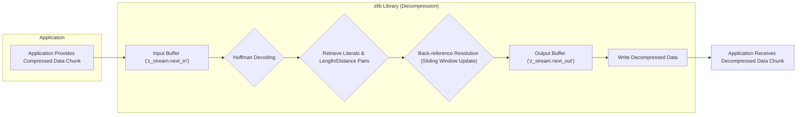

# Project Design Document: zlib Compression Library

**Version:** 1.1
**Date:** October 26, 2023
**Author:** AI Software Architect

## 1. Introduction

This document provides an enhanced and more detailed design overview of the zlib compression library, based on the codebase at [https://github.com/madler/zlib](https://github.com/madler/zlib). This revision aims to provide a richer understanding of the library's internal workings, specifically tailored for subsequent threat modeling activities. The focus remains on the core compression and decompression functionalities.

## 2. Goals and Objectives

The fundamental goals of the zlib library are:

*   **Lossless Data Compression:**  Achieving a reduction in data size without any compromise to the original information.
*   **Decompression Fidelity:**  Ensuring the accurate reconstruction of original data from its compressed representation.
*   **Cross-Platform Compatibility:**  Facilitating straightforward compilation and utilization across diverse operating systems and hardware platforms.
*   **Performance Efficiency:**  Delivering compression and decompression operations with reasonable speed and manageable memory footprint.
*   **Open Source Availability:**  Maintaining its status as a freely accessible and modifiable library under the terms of the zlib license.

## 3. Architectural Overview

zlib is fundamentally a C library offering in-memory compression and decompression capabilities. It implements the DEFLATE algorithm, a well-established technique combining the LZ77 algorithm for finding duplicate data and Huffman coding for efficient symbol representation.

Here's a refined high-level architectural diagram:

## 4. Detailed Component Description

The zlib library comprises several interconnected components:

*   **Compression Engine (`deflate`):**
    *   The core module responsible for transforming raw input data into a compressed output stream.
    *   Implements the DEFLATE algorithm through these key stages:
        *   **LZ77 Compression:** Identifies repeating sequences of bytes within a sliding window and replaces them with back-references (distance-length pairs). This reduces redundancy.
        *   **Huffman Encoding:** Encodes both literal bytes (non-repeating) and the length/distance pairs generated by LZ77 using variable-length Huffman codes. More frequent symbols get shorter codes, further compressing the data.
    *   Key source files: `deflate.c`, `deflate.h`.
*   **Decompression Engine (`inflate`):**
    *   The counterpart to the compression engine, responsible for reconstructing the original data from a compressed input stream.
    *   Performs the inverse operations of the compression engine:
        *   **Huffman Decoding:** Decodes the variable-length Huffman codes in the compressed stream to retrieve the original literals and length/distance pairs.
        *   **Back-reference Reconstruction:** Uses the retrieved length/distance pairs to copy data from a sliding window, effectively reconstructing the original repeating sequences.
    *   Key source files: `inflate.c`, `inflate.h`.
*   **Data Structures:**
    *   **`z_stream`:** A central structure that manages the state of a compression or decompression operation. It contains:
        *   Pointers to the input and output buffers (`next_in`, `next_out`).
        *   The amount of available data in the input buffer and space in the output buffer (`avail_in`, `avail_out`).
        *   The total number of input and output bytes processed (`total_in`, `total_out`).
        *   Internal state information for the compression/decompression engine.
        *   Error codes (`msg`).
    *   **Internal Buffers:** zlib utilizes internal buffers for temporary storage of input and output data during processing. The size and management of these buffers are critical for security.
    *   **Huffman Trees:** Data structures representing the Huffman codes used for encoding and decoding. These trees are built dynamically during compression or are pre-defined for certain compression levels.
    *   **Window:** A buffer maintained by the LZ77 algorithm to store a history of recently processed data. This allows for the detection and referencing of repeating sequences.
*   **Utility Functions:**
    *   **Initialization and Finalization:** Functions like `deflateInit2`, `inflateInit2`, `deflateEnd`, and `inflateEnd` are used to set up and tear down compression/decompression streams, allocating and releasing necessary resources.
    *   **Core Operations:** The `deflate` and `inflate` functions perform the actual compression and decompression of data chunks.
    *   **Memory Management:** Functions like `zalloc` and `zfree` provide a consistent interface for memory allocation and deallocation within the library.
    *   **Checksum Calculation:** Functions like `crc32` and `adler32` calculate checksums of the data, used for verifying data integrity.
*   **Configuration Options:**
    *   **Compression Level:** Controls the trade-off between compression ratio and speed (e.g., `Z_BEST_COMPRESSION`, `Z_BEST_SPEED`, `Z_DEFAULT_COMPRESSION`, `Z_NO_COMPRESSION`).
    *   **Window Bits:** Determines the size of the sliding window used by the LZ77 algorithm. Larger windows can potentially find more redundancies but require more memory.
    *   **Memory Level:** Affects the amount of memory used for internal hash tables and other data structures during compression.
    *   **Strategy:** Influences the heuristics used by the compression algorithm (e.g., `Z_DEFAULT_STRATEGY`, `Z_FILTERED`, `Z_HUFFMAN_ONLY`).

## 5. Data Flow

The flow of data through the zlib library during compression and decompression is detailed below:

**Compression Data Flow:**

1. The application provides a portion of the input data to the zlib compression functions, populating the input buffer referenced by `z_stream.next_in`.
2. The LZ77 processing stage searches for matching byte sequences within the sliding window.
3. Matching sequences are represented as length/distance pairs; non-matching bytes are treated as literals.
4. The literals and length/distance pairs are then encoded using Huffman coding.
5. The resulting compressed data is written to the output buffer referenced by `z_stream.next_out`.
6. The application retrieves the compressed data from the output buffer.

**Decompression Data Flow:**

1. The application provides a chunk of compressed data to the zlib decompression functions, placing it in the input buffer (`z_stream.next_in`).
2. The Huffman decoding stage decodes the compressed data to recover the original literals and length/distance pairs.
3. For length/distance pairs, the back-reference resolution stage copies the corresponding data from the sliding window to reconstruct the original sequence.
4. The reconstructed (decompressed) data is written to the output buffer (`z_stream.next_out`).
5. The application retrieves the decompressed data from the output buffer.

## 6. Key Data Structures

A deeper understanding of these data structures is crucial for identifying potential vulnerabilities:

*   **`z_stream`:**  Specifically, the pointers `next_in` and `next_out`, and the size variables `avail_in` and `avail_out` are critical. Incorrect manipulation or insufficient bounds checking on these could lead to buffer overflows or out-of-bounds reads/writes. The `total_in` and `total_out` fields could be targets for integer overflow vulnerabilities if not handled carefully.
*   **Internal Buffers:** The size and allocation of these buffers are potential areas for vulnerabilities. If the library doesn't correctly calculate or limit buffer sizes based on input, buffer overflows can occur.
*   **Huffman Trees:**  Maliciously crafted compressed data could attempt to create excessively deep or unbalanced Huffman trees, potentially leading to excessive memory consumption or denial-of-service during decompression.
*   **Window:**  Incorrect management of the sliding window during decompression could lead to incorrect data reconstruction or, in some scenarios, information leakage if an attacker can influence the window's contents.

## 7. Security Considerations (Pre-Threat Modeling)

Building upon the initial considerations, here are more specific potential security concerns:

*   **Buffer Overflows (CWE-120):**  Occur when the library writes beyond the allocated boundaries of input or output buffers. This could be triggered by providing overly large input data without proper size checks or by vulnerabilities in the internal buffer management logic during compression or decompression.
*   **Denial of Service (DoS) (CWE-400):**
    *   **CPU Exhaustion:**  Maliciously crafted compressed data with deeply nested back-references or complex Huffman trees could force the decompression engine to perform excessive computations, leading to CPU exhaustion.
    *   **Memory Exhaustion:**  Attempts to decompress data that expands to an extremely large size or triggers excessive memory allocation for internal data structures (like Huffman trees) could lead to memory exhaustion.
*   **Integer Overflows (CWE-190):** Calculations involving data sizes, lengths, or offsets, especially when handling compressed data, could potentially overflow, leading to incorrect memory access or other unexpected behavior. For example, calculating the size of the output buffer based on untrusted input.
*   **Memory Corruption (CWE-416, CWE-762):** Errors in memory management, such as use-after-free vulnerabilities or double-free vulnerabilities, could corrupt the heap and potentially lead to arbitrary code execution. This could arise from incorrect handling of the `zalloc` and `zfree` functions or improper state management.
*   **Input Validation Vulnerabilities (CWE-20):** The library relies on the caller to provide valid compressed data. Insufficient validation of the compressed data format could lead to crashes, unexpected behavior, or exploitable conditions. For example, failing to validate Huffman code lengths or back-reference distances.
*   **Error Handling Vulnerabilities (CWE-391):**  Insufficient or incorrect error handling could mask underlying issues or provide attackers with information about the system's internal state. For instance, failing to properly handle decompression errors could lead to inconsistent data or further vulnerabilities.

## 8. Dependencies

zlib's dependencies are intentionally minimal, primarily relying on standard C library functions:

*   **Standard C Library (`libc`):** Provides essential functions for memory management (`malloc`, `free`, `calloc`, `realloc`), string manipulation, and other core system operations.

## 9. Deployment Considerations

The way zlib is deployed can influence its attack surface:

*   **Statically Linked Library:** When zlib is statically linked into an application, its code becomes part of the application's executable. This can simplify deployment but might make patching vulnerabilities more complex, requiring a rebuild and redeployment of the entire application.
*   **Dynamically Linked Library:** When deployed as a shared library (e.g., `.so` on Linux, `.dll` on Windows), zlib can be updated independently of the applications that use it. This simplifies patching but introduces a dependency that needs to be managed. Vulnerabilities in the system's zlib library could affect multiple applications.
*   **Language Bindings:** When used through language bindings (e.g., Python's `zlib` module), the security of the binding layer itself becomes a consideration, in addition to the core zlib library.

## 10. Future Considerations

For ongoing development and future threat modeling efforts, consider these aspects:

*   **Security Audits and Fuzzing:** Regular security audits and fuzz testing are crucial for proactively identifying potential vulnerabilities in the codebase.
*   **Formal Verification Techniques:** Applying formal verification methods to critical parts of the compression and decompression logic could provide stronger guarantees about their correctness and security.
*   **Exploration of Memory-Safe Languages (for future iterations):** While zlib is written in C, exploring the possibility of implementing future compression libraries in memory-safe languages could mitigate certain classes of vulnerabilities.
*   **Monitoring for New Attack Vectors:** Staying informed about new attack techniques and how they might apply to compression libraries is essential for maintaining security.

This enhanced design document provides a more detailed and security-focused overview of the zlib library, intended to be a valuable resource for conducting thorough threat modeling activities. The detailed component descriptions, data flow diagrams, and specific security considerations offer a solid foundation for identifying potential threats and vulnerabilities.