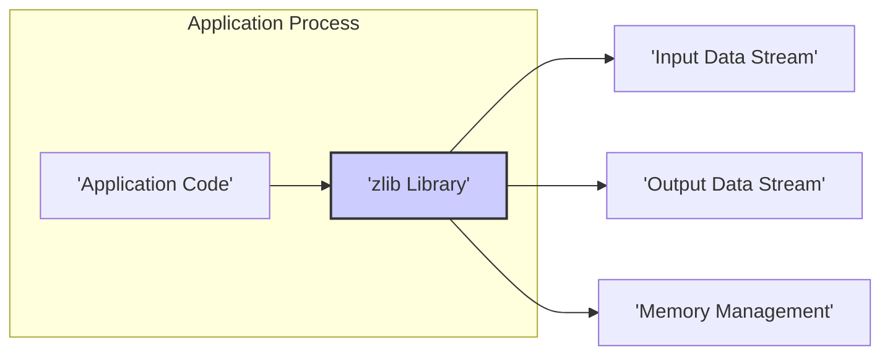

# Project Design Document: zlib Library for Threat Modeling (Improved)

**Project Name:** zlib Library

**Project Repository:** [https://github.com/madler/zlib](https://github.com/madler/zlib)

**Version:**  (Specify the version if targeting a specific version for threat modeling, otherwise, use "Latest" or "General") General / Latest

**Document Version:** 1.1

**Date:** 2023-10-27

**Author:** [Your Name/Organization] - AI Expert in Software, Cloud and Cybersecurity Architecture

## 1. Introduction

This document provides an enhanced and more detailed design overview of the zlib compression library, specifically tailored for comprehensive threat modeling and security analysis. Building upon the previous version, this document further elaborates on the architecture, components, data flow, and external interfaces of zlib to facilitate a more in-depth and effective threat modeling exercise.  Understanding these details is crucial for identifying potential vulnerabilities and developing appropriate mitigation strategies.

## 2. Project Overview

zlib remains a cornerstone of data compression, widely adopted across diverse computing environments. Its key characteristics for security consideration are:

* **Ubiquity:** Its widespread use means vulnerabilities can have a broad impact.
* **Low-Level C Implementation:**  Written in C for performance, it inherits C's memory management characteristics, requiring careful attention to buffer handling and memory safety.
* **Complex Algorithms:** The DEFLATE and INFLATE algorithms are intricate, increasing the potential for implementation flaws.
* **Performance Criticality:** Often used in performance-sensitive paths, optimizations might sometimes come at the expense of security if not carefully reviewed.

This document aims to provide the necessary architectural insights to analyze these aspects from a security perspective.

## 3. System Architecture

zlib's architecture is designed for embedding within applications, acting as a service provider for compression and decompression.

### 3.1. High-Level Architecture Diagram



**Description:** (No change from previous version - still accurate)

* **Application Code:**  This represents the software that utilizes the zlib library. It calls zlib functions to perform compression or decompression operations.
* **zlib Library:** This is the core zlib library itself, containing the compression and decompression algorithms, data structures, and API functions.
* **Input Data Stream:**  The raw data that is provided to zlib for compression or decompression.
* **Output Data Stream:** The compressed or decompressed data produced by zlib.
* **Memory Management:** zlib handles memory allocation and deallocation for its internal operations and buffers.

### 3.2. Component Diagram (Enhanced)

This diagram provides a more detailed breakdown of the zlib library's functional components, highlighting algorithm specifics.

```mermaid
graph LR
    subgraph "zlib Library"
        subgraph "Compression Engine"
            CE_IN["'Input Buffer (Compression)'"] --> CE_LZ77["'LZ77 Compression'"];
            CE_LZ77 --> CE_HUFFMAN["'Huffman Encoding'"];
            CE_HUFFMAN --> CE_DEFLATE_OUT["'DEFLATE Bitstream Output'"];
            CE_DEFLATE_OUT --> CE_OUT["'Output Buffer (Compressed Data)'"];
        end
        subgraph "Decompression Engine"
            DE_IN["'Input Buffer (Compressed Data)'"] --> DE_INFLATE_IN["'DEFLATE Bitstream Input'"];
            DE_INFLATE_IN --> DE_HUFFMAN["'Huffman Decoding'"];
            DE_HUFFMAN --> DE_LZ77["'LZ77 Decompression'"];
            DE_LZ77 --> DE_OUT["'Output Buffer (Decompressed Data)'"];
        end
        API["'Public API (zlib.h)'"] --> CompressionEngine;
        API --> DecompressionEngine;
        API --> MEM["'Memory Management'"];
        API --> CONFIG["'Configuration & Parameters'"];
        CompressionEngine --> MEM;
        DecompressionEngine --> MEM;
    end
    style "zlib Library" fill:#eef,stroke:#333,stroke-width:2px

    subgraph "External Interfaces"
        EXT_APP["'Application Code'"];
        EXT_FS["'File System (Optional)'"];
        EXT_NET["'Network (Indirectly via Applications)'"];
    end

    EXT_APP --> API;
    EXT_APP --> CE_IN;
    EXT_APP --> DE_IN;
    CE_OUT --> EXT_APP;
    DE_OUT --> EXT_APP;

    classDef component fill:#ccf,stroke:#333,stroke-width:1px,stroke-dasharray: 5 5;
    class CompressionEngine,DecompressionEngine,MEM,CONFIG component;
```

**Enhanced Component Descriptions:**

* **Public API (zlib.h):** (Description remains similar, see previous version for function list).  Crucially, the API provides entry points for controlling compression level, memory allocation, and handling input/output buffers.  Incorrect API usage is a significant threat vector.
* **Compression Engine:**
    * **Input Buffer (Compression):** (Description remains similar).  Buffer overflows can occur if input data size is not properly managed relative to buffer capacity.
    * **LZ77 Compression:** This stage identifies and replaces repeated sequences of data with references to previous occurrences. Vulnerabilities can arise from incorrect length/distance calculations in LZ77, leading to out-of-bounds reads or writes.
    * **Huffman Encoding:**  Encodes the output of LZ77 using variable-length codes based on frequency.  Incorrect Huffman table construction or processing can lead to data corruption or vulnerabilities.
    * **DEFLATE Bitstream Output:**  Combines LZ77 output and Huffman codes into a compressed bitstream according to the DEFLATE specification. Bitstream manipulation errors can lead to vulnerabilities.
    * **Output Buffer (Compressed Data):** (Description remains similar). Buffer overflows can occur if the compressed data exceeds the output buffer size.
* **Decompression Engine:**
    * **Input Buffer (Compressed Data):** (Description remains similar). Maliciously crafted compressed data can exploit vulnerabilities during decompression.
    * **DEFLATE Bitstream Input:** Parses the incoming DEFLATE compressed bitstream.  Errors in bitstream parsing can lead to vulnerabilities.
    * **Huffman Decoding:** Reconstructs the original data from Huffman codes.  Vulnerabilities can arise from malformed Huffman codes or tables in the input stream.
    * **LZ77 Decompression:** Reconstructs the original data by expanding LZ77 references.  Incorrect length/distance interpretation from the compressed stream can lead to buffer overflows.
    * **Output Buffer (Decompressed Data):** (Description remains similar). Decompression bombs exploit excessive output buffer requirements, leading to DoS. Buffer overflows can also occur if decompressed data size is not properly managed.
* **Memory Management:** (Description remains similar).  Custom allocators introduce a dependency and potential vulnerability if flawed.  Standard `malloc`/`free` usage in C requires careful attention to prevent memory leaks and double frees.
* **Configuration & Parameters:** (Description remains similar).  While configuration options offer flexibility, incorrect or malicious configuration (e.g., extremely high compression levels in decompression scenarios) can be a DoS vector.
* **External Interfaces:** (Descriptions remain similar).  The application code is the primary interface and source of potential misuse.

## 4. Data Flow Diagram (Enhanced)

This diagram now includes more detail about the algorithmic stages within compression and decompression.

```mermaid
graph LR
    subgraph "Compression Data Flow"
        APP_DATA_IN_C["'Application Input Data'"] --> API_COMPRESS["'zlib API (e.g., compress, deflate)'"];
        API_COMPRESS --> COMP_IN_BUF["'Compression Input Buffer'"];
        COMP_IN_BUF --> LZ77_COMP["'LZ77 Compression'"];
        LZ77_COMP --> HUFFMAN_ENC["'Huffman Encoding'"];
        HUFFMAN_ENC --> DEFLATE_STREAM_C["'DEFLATE Bitstream Generation'"];
        DEFLATE_STREAM_C --> COMP_OUT_BUF["'Compression Output Buffer'"];
        COMP_OUT_BUF --> API_COMPRESS_RET["'zlib API Return (Compressed Data)'"];
        API_COMPRESS_RET --> APP_DATA_OUT_C["'Application Output Data (Compressed)'"];
    end

    subgraph "Decompression Data Flow"
        APP_DATA_IN_D["'Application Input Data (Compressed)'"] --> API_DECOMPRESS["'zlib API (e.g., uncompress, inflate)'"];
        API_DECOMPRESS --> DECOMP_IN_BUF["'Decompression Input Buffer'"];
        DECOMP_IN_BUF --> DEFLATE_STREAM_D["'DEFLATE Bitstream Parsing'"];
        DEFLATE_STREAM_D --> HUFFMAN_DEC["'Huffman Decoding'"];
        HUFFMAN_DEC --> LZ77_DECOMP["'LZ77 Decompression'"];
        LZ77_DECOMP --> DECOMP_OUT_BUF["'Decompression Output Buffer'"];
        DECOMP_OUT_BUF --> API_DECOMPRESS_RET["'zlib API Return (Decompressed Data)'"];
        API_DECOMPRESS_RET --> APP_DATA_OUT_D["'Application Output Data (Decompressed)'"];
    end

    style "Compression Data Flow" fill:#fdd,stroke:#333,stroke-width:1px;
    style "Decompression Data Flow" fill:#ddf,stroke:#333,stroke-width:1px;
```

**Enhanced Data Flow Description:**

**Compression:** (Stages now explicitly named)

1. **Application Input Data:** (No change)
2. **zlib API (e.g., `compress`, `deflate`):** (No change)
3. **Compression Input Buffer:** (No change)
4. **LZ77 Compression:**  Input data is processed by the LZ77 algorithm to find and replace repeating patterns.
5. **Huffman Encoding:** The output of LZ77 is encoded using Huffman coding for further compression.
6. **DEFLATE Bitstream Generation:** The LZ77 and Huffman encoded data is formatted into a DEFLATE compliant bitstream.
7. **Compression Output Buffer:** (No change)
8. **zlib API Return (Compressed Data):** (No change)
9. **Application Output Data (Compressed):** (No change)

**Decompression:** (Stages now explicitly named)

1. **Application Input Data (Compressed):** (No change)
2. **zlib API (e.g., `uncompress`, `inflate`):** (No change)
3. **Decompression Input Buffer:** (No change)
4. **DEFLATE Bitstream Parsing:** The compressed input bitstream is parsed to extract Huffman codes and LZ77 references.
5. **Huffman Decoding:** Huffman codes are decoded back to their original symbols.
6. **LZ77 Decompression:** LZ77 references are expanded to reconstruct the original data sequences.
7. **Decompression Output Buffer:** (No change)
8. **zlib API Return (Decompressed Data):** (No change)
9. **Application Output Data (Decompressed):** (No change)

## 5. External Interfaces in Detail (Enhanced)

* **C API (zlib.h):** (Enhanced descriptions with security relevance)
    * **Compression Functions:**
        * `compress(dest, destLen, source, sourceLen)`:  Simplest compression. **Security Note:** Requires careful pre-allocation of `dest` buffer. Buffer overflow if `destLen` is too small.
        * `compress2(dest, destLen, source, sourceLen, level)`:  Allows specifying compression level. **Security Note:**  Higher levels consume more resources, potential DoS if level is maliciously controlled.
        * `deflateInit_(strm, level, version, stream_size)`/`deflate`/`deflateEnd`:  More flexible, stream-based compression. **Security Note:**  Requires careful state management (`z_stream` struct). Incorrect state transitions can lead to errors.  `strm->avail_in`, `strm->next_in`, `strm->avail_out`, `strm->next_out` must be managed correctly to prevent buffer overflows and underflows.
    * **Decompression Functions:**
        * `uncompress(dest, destLen, source, sourceLen)`: Simplest decompression. **Security Note:** Highly vulnerable to decompression bombs if `destLen` is too large and compressed data is malicious.  No inherent size limit checking.
        * `inflateInit_(strm, version, stream_size)`/`inflate`/`inflateEnd`: Stream-based decompression. **Security Note:** Similar state management concerns as `deflate`. `inflate` needs to handle potentially malicious compressed data that could cause excessive memory allocation or processing time.
    * **Memory Management Functions (Customizable):** `zalloc`, `zfree`, `z_stream.zalloc`, `z_stream.zfree`, `z_stream.opaque`. **Security Note:** Custom allocators must be robust and secure. Vulnerabilities in custom allocators directly impact zlib's security.
    * **Error Handling:** zlib uses return codes (e.g., `Z_OK`, `Z_BUF_ERROR`, `Z_MEM_ERROR`, `Z_DATA_ERROR`) and `z_stream.msg`. **Security Note:** Applications *must* check return codes and handle errors appropriately. Ignoring errors can mask vulnerabilities or lead to unexpected behavior.
    * **Version Information:** (No significant security relevance directly).

* **Input Data Stream:** (Enhanced security notes)
    * zlib accepts arbitrary byte streams for compression. **Security Note:**  While zlib itself handles raw bytes, the *meaning* of those bytes in the application context is important for higher-level security.
    * For decompression, it expects DEFLATE compressed format. **Security Note:**  Maliciously crafted DEFLATE streams are the primary attack vector.  zlib must robustly handle invalid or malicious streams without crashing or exhibiting exploitable behavior.

* **Output Data Stream:** (Enhanced security notes)
    * zlib produces byte streams as output. **Security Note:** Applications must handle the output data securely, especially decompressed data, as it might originate from untrusted sources.

* **Configuration Parameters:** (Enhanced security notes)
    * **Compression Level:** (See `compress2` security note above).
    * **Memory Allocation Strategy:** (See custom memory allocators security note above).
    * **Window Bits (for advanced deflate/inflate):**  Affects compression ratio and memory usage. **Security Note:**  Incorrect window bits can lead to decompression errors or vulnerabilities if not handled consistently between compression and decompression.
    * **Memory Level (for deflate):** Controls memory usage during compression. **Security Note:**  Primarily a DoS concern if maliciously manipulated to consume excessive memory.

## 6. Security Considerations Relevant to Threat Modeling (Expanded and Categorized)

This section is significantly expanded to provide a more structured and detailed view of security considerations.

**6.1. Memory Safety Vulnerabilities:**

* **Buffer Overflows (Read/Write):**
    * **Cause:** Insufficient bounds checking when copying data to or from buffers during compression/decompression (input buffers, output buffers, internal buffers in LZ77, Huffman stages).
    * **Example Scenarios:**
        * `compress`/`uncompress` with undersized output buffers.
        * Incorrect length/distance calculations in LZ77 leading to out-of-bounds memory access.
        * Malformed Huffman tables causing out-of-bounds reads during decoding.
    * **Mitigation:** Rigorous bounds checking, using safe buffer handling practices, memory safety tools (static analysis, fuzzing, address sanitizers).

* **Heap Overflows:**
    * **Cause:**  Overflowing heap-allocated buffers, often due to incorrect size calculations or unbounded allocations.
    * **Example Scenarios:**
        * Decompression bombs leading to excessive memory allocation and potential heap overflow.
        * Incorrect handling of dynamic memory allocation within zlib.
    * **Mitigation:**  Input size limits, resource limits, careful memory allocation size calculations, memory safety tools.

* **Use-After-Free:**
    * **Cause:** Accessing memory after it has been freed, often due to incorrect memory management logic or double frees.
    * **Example Scenarios:**
        * Errors in `z_stream` state management leading to premature freeing of internal structures.
        * Double freeing of buffers due to logic errors.
    * **Mitigation:**  Careful memory management, robust state management, memory safety tools.

**6.2. Input Validation and Data Integrity Vulnerabilities:**

* **Decompression Bombs (Zip Bombs):**
    * **Cause:**  Maliciously crafted compressed data that decompresses to an extremely large size, causing DoS due to resource exhaustion (memory, disk space, CPU).
    * **Example Scenarios:**  Nested compressed layers, highly repetitive patterns that compress very efficiently but expand enormously.
    * **Mitigation:**  Output size limits, resource quotas, input validation (detecting suspicious compression ratios), time limits for decompression.

* **Data Corruption:**
    * **Cause:**  Errors in DEFLATE/INFLATE implementation or handling of malformed compressed data leading to incorrect decompression results.
    * **Example Scenarios:**
        * Bitstream parsing errors causing incorrect Huffman decoding or LZ77 decompression.
        * Logic errors in the algorithms leading to data corruption.
    * **Mitigation:**  Thorough testing, validation against DEFLATE specification, fuzzing with malformed inputs, checksums/integrity checks (though zlib itself doesn't inherently provide these, applications might add them).

**6.3. Denial of Service (DoS) Vulnerabilities:**

* **Resource Exhaustion (CPU, Memory):**
    * **Cause:**  Processing maliciously crafted input that consumes excessive CPU time or memory. Decompression bombs are a prime example, but other algorithmic inefficiencies can be exploited.
    * **Example Scenarios:**
        * Decompression bombs.
        * Input designed to trigger worst-case performance in LZ77 or Huffman algorithms.
        * Excessive memory allocation due to configuration parameters or input data.
    * **Mitigation:**  Resource limits, timeouts, input validation, rate limiting, careful configuration management.

**6.4. API Misuse Vulnerabilities:**

* **Incorrect Buffer Management:**
    * **Cause:** Applications providing insufficient output buffer sizes, incorrect input buffer pointers, or mismanaging buffer lengths in API calls.
    * **Example Scenarios:**
        * Calling `compress` or `uncompress` with output buffers too small, leading to buffer overflows if return codes are ignored.
        * Incorrectly calculating buffer sizes based on untrusted input.
    * **Mitigation:**  Clear API documentation, example code, static analysis tools to detect API misuse, robust error handling in applications.

* **Ignoring Return Codes:**
    * **Cause:** Applications not checking zlib API return codes and proceeding as if operations were successful even when errors occurred.
    * **Example Scenarios:**  Ignoring `Z_BUF_ERROR` after `compress` or `inflate`, leading to truncated output or further errors.
    * **Mitigation:**  Mandatory return code checking in application code, static analysis tools to enforce return code checks.

## 7. Using this Document for Threat Modeling

This design document is structured to facilitate a systematic threat modeling process. Here's how to use it:

**7.1. Choose a Threat Modeling Methodology:**

* **STRIDE:** Categorize threats based on STRIDE categories (Spoofing, Tampering, Repudiation, Information Disclosure, Denial of Service, Elevation of Privilege) for each component and data flow.
* **PASTA:** Process for Attack Simulation and Threat Analysis. Use this document to understand the system, decompose it, identify threats, vulnerabilities, and attacks.
* **Other Methodologies:**  Use any suitable threat modeling methodology, leveraging the information provided here.

**7.2. Identify Assets:**

* **Data:** Input data streams (compressed and uncompressed), output data streams.
* **Components:** Public API, Compression Engine (LZ77, Huffman), Decompression Engine (Huffman, LZ77), Memory Management, Configuration.
* **External Interfaces:** Application code, file system (indirect), network (indirect).

**7.3. Identify Threats per Component and Data Flow:**

* **For each component (Section 3.2) and data flow (Section 4):**
    * **Consider STRIDE categories.**
    * **Refer to Security Considerations (Section 6) for potential vulnerability types.**
    * **Example Threats (using STRIDE and Security Considerations):**
        * **Public API:**
            * **DoS:** Malicious application code calling API in a loop to exhaust resources.
            * **Tampering:**  Application code modifying `z_stream` struct in unexpected ways.
        * **Compression Engine (LZ77):**
            * **Buffer Overflow (Tampering, DoS):**  Exploiting vulnerabilities in LZ77 implementation to cause buffer overflows.
        * **Decompression Engine (Huffman):**
            * **DoS:** Decompression bomb input targeting Huffman decoding to consume excessive resources.
            * **Data Corruption (Tampering):** Malformed Huffman tables in input leading to incorrect decompression.
        * **Memory Management:**
            * **DoS:**  Triggering excessive memory allocation through API calls or malicious input.
            * **Elevation of Privilege (if custom allocator is vulnerable):** Exploiting vulnerabilities in custom memory allocators.
        * **Data Flow (Compression):**
            * **Information Disclosure:**  Side-channel attacks potentially leaking information during compression (less likely, but consider).
        * **Data Flow (Decompression):**
            * **DoS:** Decompression bomb input in the input data stream.

**7.4. Document Threats and Vulnerabilities:**

* Create a threat model document or spreadsheet.
* For each identified threat, document:
    * **Threat ID:** Unique identifier.
    * **Threat Name:**  Descriptive name (e.g., "Decompression Bomb DoS").
    * **STRIDE Category:** (if using STRIDE).
    * **Affected Component/Data Flow:**  Which part of zlib is affected.
    * **Description:** Detailed explanation of the threat.
    * **Potential Vulnerability:**  Specific vulnerability that could be exploited.
    * **Likelihood:**  Estimate of how likely the threat is to be exploited.
    * **Impact:**  Severity of the impact if the threat is realized.
    * **Mitigation Strategies:**  Possible countermeasures to reduce the likelihood or impact.

**7.5. Prioritize and Mitigate:**

* Prioritize threats based on risk (likelihood x impact).
* Develop and implement mitigation strategies.
* Re-evaluate the threat model after mitigation to ensure effectiveness.

This improved design document provides a more detailed and security-focused foundation for threat modeling zlib. By systematically analyzing the components, data flows, and security considerations outlined here, you can conduct a more thorough and effective threat modeling exercise, leading to a more secure integration of zlib in your applications and systems.