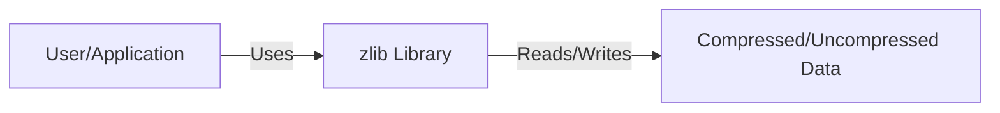
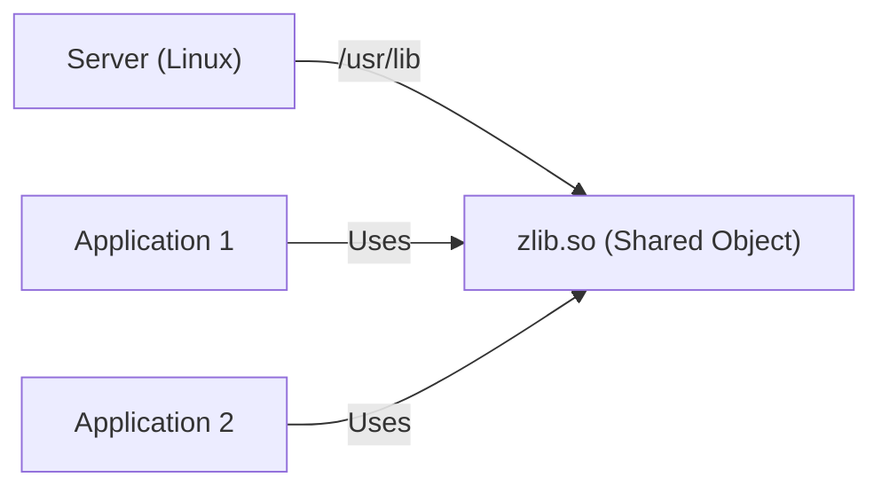
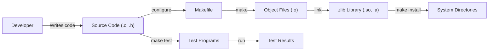

# Project Design Document: zlib

## BUSINESS POSTURE

zlib is a widely-used, general-purpose compression library. Its primary business goal is to provide a reliable, efficient, and portable lossless data compression solution. It's a foundational component for many other software systems and applications, including operating systems, networking protocols (like HTTP and SSH), and data storage formats.

Business priorities:

-   Reliability: The library must produce correct and consistent results across different platforms and architectures. Incorrect compression or decompression can lead to data corruption and application failures.
-   Performance: Compression and decompression speed are critical, as zlib is often used in performance-sensitive contexts.
-   Portability: zlib needs to be compatible with a wide range of hardware and software environments.
-   Security: While not directly handling sensitive data, vulnerabilities in zlib can be exploited to compromise systems that rely on it.
-   Maintainability: The codebase should be maintainable and understandable to facilitate bug fixes, security updates, and future enhancements.

Most important business risks:

-   Buffer overflow vulnerabilities: These could lead to arbitrary code execution, compromising the security of systems using zlib.
-   Denial-of-service vulnerabilities: Maliciously crafted compressed data could cause excessive memory consumption or CPU usage, leading to application or system crashes.
-   Data corruption: Bugs in the compression or decompression algorithms could lead to silent data corruption, which is particularly dangerous.
-   Compatibility issues: Changes to the library could break existing applications that depend on it.
-   Performance regressions: New versions or modifications could inadvertently slow down compression or decompression, impacting application performance.

## SECURITY POSTURE

Existing security controls:

-   security control: Fuzz testing: The project uses fuzz testing (e.g., with OSS-Fuzz) to identify potential vulnerabilities. (Mentioned in the README and continuous integration setup).
-   security control: AddressSanitizer (ASan): Used during testing to detect memory errors like buffer overflows. (Implied by OSS-Fuzz integration).
-   security control: Regular updates and maintenance: The project maintainers actively address reported bugs and vulnerabilities. (Evident from the project's history).
-   security control: Code reviews: Changes to the codebase are likely reviewed by other developers. (Standard practice for open-source projects).
-   security control: Static analysis: The project may use static analysis tools to identify potential coding errors. (Common practice, but not explicitly confirmed).
-   accepted risk: Limited input validation: zlib primarily relies on the calling application to provide valid input data. While it does perform some checks, it's not designed to handle arbitrary, potentially malicious input directly.
-   accepted risk: No built-in encryption: zlib is a compression library, not an encryption library. It doesn't provide any confidentiality guarantees.

Recommended security controls:

-   security control: Integrate a robust static analysis tool into the build process: This will help catch potential vulnerabilities early in the development cycle. Examples include Coverity, SonarQube, or clang-tidy.
-   security control: MemorySanitizer (MSan): Use MSan to detect use of uninitialized memory, which can lead to unpredictable behavior and vulnerabilities.
-   security control: UndefinedBehaviorSanitizer (UBSan): Use UBSan to detect undefined behavior in the C code, which can be a source of subtle bugs and vulnerabilities.
-   security control: Explore formal verification techniques: For critical parts of the compression and decompression algorithms, consider using formal verification methods to prove their correctness.

Security requirements:

-   Authentication: Not applicable, as zlib is a library and doesn't handle authentication.
-   Authorization: Not applicable, as zlib is a library and doesn't handle authorization.
-   Input validation:
    -   The library should perform basic checks on input parameters (e.g., buffer sizes, pointers) to prevent obvious errors.
    -   The library should handle invalid or corrupted compressed data gracefully, without crashing or causing excessive resource consumption.
-   Cryptography: Not directly applicable, as zlib is not a cryptographic library. However, if zlib is used in conjunction with encryption, it's crucial to ensure that compression is performed *before* encryption. Compressing after encryption is generally ineffective and can leak information about the plaintext.

## DESIGN

### C4 CONTEXT

Element descriptions:

-   Element:
    -   Name: User/Application
    -   Type: External entity (software or user)
    -   Description: Any application or user that utilizes the zlib library for compression or decompression.
    -   Responsibilities: Provides input data to zlib, receives output data from zlib, and handles the overall application logic.
    -   Security controls: Input validation (to ensure data provided to zlib is well-formed), proper handling of zlib return codes, and secure memory management.

-   Element:
    -   Name: zlib Library
    -   Type: Software library
    -   Description: The zlib compression library itself.
    -   Responsibilities: Provides functions for compressing and decompressing data, manages internal buffers, and handles errors.
    -   Security controls: Fuzz testing, AddressSanitizer, MemorySanitizer, UndefinedBehaviorSanitizer, static analysis, code reviews, and regular updates.

-   Element:
    -   Name: Compressed/Uncompressed Data
    -   Type: Data
    -   Description: The data that is either compressed or uncompressed by zlib.
    -   Responsibilities: N/A (passive data)
    -   Security controls: None within zlib itself. Security relies on the calling application to handle the data appropriately (e.g., encryption, access controls).

### C4 CONTAINER

Since zlib is a single library, the container diagram is essentially the same as the context diagram.

Element descriptions:

-   Element:
    -   Name: User/Application
    -   Type: External entity (software or user)
    -   Description: Any application or user that utilizes the zlib library for compression or decompression.
    -   Responsibilities: Provides input data to zlib, receives output data from zlib, and handles the overall application logic.
    -   Security controls: Input validation (to ensure data provided to zlib is well-formed), proper handling of zlib return codes, and secure memory management.

-   Element:
    -   Name: zlib Library
    -   Type: Software library
    -   Description: The zlib compression library itself.
    -   Responsibilities: Provides functions for compressing and decompressing data, manages internal buffers, and handles errors.
    -   Security controls: Fuzz testing, AddressSanitizer, MemorySanitizer, UndefinedBehaviorSanitizer, static analysis, code reviews, and regular updates.

-   Element:
    -   Name: Compressed/Uncompressed Data
    -   Type: Data
    -   Description: The data that is either compressed or uncompressed by zlib.
    -   Responsibilities: N/A (passive data)
    -   Security controls: None within zlib itself. Security relies on the calling application to handle the data appropriately (e.g., encryption, access controls).

### DEPLOYMENT

zlib is typically deployed as a dynamically linked library (.so on Linux, .dll on Windows, .dylib on macOS) or a statically linked library (.a).

Deployment options:

1.  System-wide installation: zlib is installed in a standard system directory (e.g., /usr/lib, /lib) and is available to all applications.
2.  Application-specific installation: zlib is included within the application's directory and is only used by that application.
3.  Static linking: zlib's code is directly incorporated into the application's executable during compilation.

Chosen deployment (system-wide installation on Linux):

Element descriptions:

-   Element:
    -   Name: Server (Linux)
    -   Type: Operating System
    -   Description: A Linux server environment.
    -   Responsibilities: Provides the runtime environment for applications and libraries.
    -   Security controls: Operating system security features (e.g., user permissions, file system security, SELinux/AppArmor).

-   Element:
    -   Name: zlib.so (Shared Object)
    -   Type: Dynamically linked library
    -   Description: The compiled zlib library, installed in a system-wide location.
    -   Responsibilities: Provides compression/decompression functionality to applications.
    -   Security controls: Regular security updates from the distribution's package manager, file system permissions.

-   Element:
    -   Name: Application 1
    -   Type: Application
    -   Description: An application that uses zlib.
    -   Responsibilities: Performs its specific tasks, utilizing zlib for compression/decompression as needed.
    -   Security controls: Application-specific security measures, secure coding practices.

-   Element:
    -   Name: Application 2
    -   Type: Application
    -   Description: Another application that uses zlib.
    -   Responsibilities: Performs its specific tasks, utilizing zlib for compression/decompression as needed.
    -   Security controls: Application-specific security measures, secure coding practices.

### BUILD

zlib uses a Makefile-based build system, with configurations for various platforms. The build process typically involves:

1.  Configuration: Running a configure script (or manually editing a Makefile) to set platform-specific options.
2.  Compilation: Compiling the C source code into object files.
3.  Linking: Linking the object files to create the zlib library (either shared or static).
4.  Testing: Running test programs to verify the library's functionality.
5.  Installation: Copying the library and header files to the appropriate system directories.

Security controls in the build process:

-   security control: Compiler warnings: The Makefile should enable compiler warnings (e.g., -Wall, -Wextra) to identify potential coding issues.
-   security control: Static analysis (recommended): Integrate a static analysis tool into the build process (e.g., running it as part of the 'make' command).
-   security control: Fuzz testing (existing): Continuous fuzz testing with OSS-Fuzz helps identify vulnerabilities before releases.
-   security control: AddressSanitizer, MemorySanitizer, UndefinedBehaviorSanitizer (existing/recommended): These tools should be used during testing to detect memory errors and undefined behavior.

## RISK ASSESSMENT

Critical business processes to protect:

-   Data compression and decompression: Ensuring the integrity and reliability of these processes is paramount, as zlib is a foundational component for many other systems.
-   Software distribution: Protecting the integrity of the zlib library itself during distribution (e.g., preventing tampering with released binaries).

Data to protect and sensitivity:

-   zlib itself does not handle sensitive data directly. However, it processes data that *may* be sensitive, depending on the application using it. The sensitivity of the data is determined by the calling application, not by zlib itself.
-   The zlib source code and build artifacts should be protected from unauthorized modification to prevent the introduction of vulnerabilities.

## QUESTIONS & ASSUMPTIONS

Questions:

-   Are there any specific performance targets (e.g., compression/decompression speed) that need to be met?
-   What are the target platforms and architectures that need to be supported?
-   Are there any specific regulatory or compliance requirements that apply to the use of zlib (e.g., FIPS 140-2)?
-   What is the process for reporting and handling security vulnerabilities?
-   Is there a specific versioning scheme used for zlib releases?

Assumptions:

-   BUSINESS POSTURE: The primary goal is to provide a reliable and efficient compression library, with security being a critical consideration.
-   SECURITY POSTURE: The project maintainers are committed to addressing security vulnerabilities and maintaining the library's integrity.
-   DESIGN: The library will be used in a variety of contexts, and its design should prioritize portability and compatibility. The calling application is responsible for handling sensitive data appropriately.