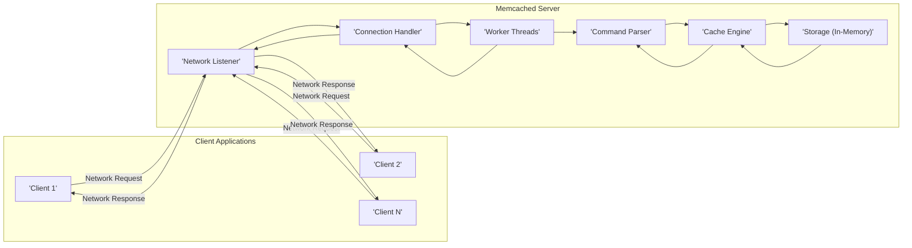
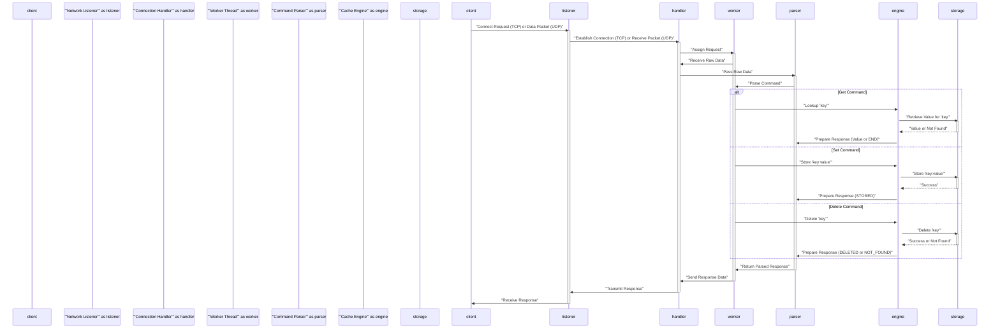

# Project Design Document: Memcached

**Version:** 1.1
**Date:** October 26, 2023
**Author:** AI Software Architect

## 1. Introduction

This document provides an enhanced architectural design of the Memcached project, based on the publicly available source code repository: [https://github.com/memcached/memcached](https://github.com/memcached/memcached). Building upon the previous version, this document offers more granular detail and clarifies specific aspects relevant to security analysis and threat modeling. It outlines the key components, data flow, interactions, and security considerations within the Memcached system.

## 2. Goals and Objectives

The primary goal of this document remains to provide a comprehensive and accurate representation of the Memcached architecture for security analysis and threat modeling. Specific objectives include:

*   Providing a more detailed breakdown of the core components of the Memcached server, including their internal functions.
*   Clarifying the data flow within the system, with a focus on potential security implications at each stage.
*   Elaborating on the communication protocols and data formats used, highlighting security considerations for each.
*   Providing more specific examples of configuration options that impact security.
*   Offering a clearer and more structured overview tailored for security professionals conducting threat assessments.

## 3. Architectural Overview

Memcached is a high-performance, distributed memory object caching system designed to accelerate dynamic web applications by reducing database load. It operates as a service, listening on network ports and managing an in-memory key-value store. Clients interact with Memcached to store and retrieve data.

## 4. Detailed Component Description

This section provides a more in-depth look at the key components of the Memcached server, emphasizing their internal functions and security relevance.

*   **Network Listener:** This component is responsible for passively listening for incoming client connection requests on configured TCP and/or UDP ports (typically 11211). It performs the initial TCP handshake or receives UDP packets. Security considerations include:
    *   Exposure of the listening port to the network.
    *   Potential for SYN flood attacks on TCP.
    *   Potential for UDP packet spoofing.
*   **Connection Handler:**  Upon accepting a connection (TCP) or receiving a packet (UDP), a connection handler is invoked. For TCP, it manages the state of an individual client connection, handling the continuous stream of data. For UDP, it processes individual packets. Key functions and security considerations:
    *   Managing connection state and resources.
    *   Buffering incoming data, which can be a point for buffer overflow vulnerabilities if not handled correctly.
    *   Multiplexing connections to worker threads.
*   **Worker Threads:** Memcached uses a multi-threaded architecture (or potentially event-based for non-blocking I/O). Worker threads are responsible for processing client requests concurrently. Security considerations:
    *   Thread safety and potential race conditions in shared data structures.
    *   Resource exhaustion if too many connections are established.
*   **Command Parser:** This component receives raw data from the connection handler and interprets it according to the Memcached protocol (text or binary). It identifies the requested command and extracts parameters. Security considerations:
    *   Vulnerabilities in parsing logic can lead to buffer overflows or other memory corruption issues.
    *   Improper handling of malformed or oversized commands.
    *   Potential for command injection, especially with the text protocol if input validation is insufficient.
*   **Cache Engine:** The core logic of Memcached. It receives parsed commands and interacts with the storage component. It implements core functionalities like:
    *   **Item Lookup:** Searching for items based on keys.
    *   **Item Storage:** Adding new key-value pairs, potentially evicting older items.
    *   **Item Retrieval:** Fetching the value associated with a key.
    *   **Item Deletion:** Removing items from the cache.
    *   **Eviction Policies:** Implementing algorithms like LRU (Least Recently Used) to manage memory usage. Security considerations:
        *   Predictable eviction policies might be exploitable in certain scenarios.
        *   Race conditions during concurrent access to cached items.
*   **Storage (In-Memory):** Memcached stores data in RAM, typically using a hash table for efficient lookups. Security considerations:
    *   Data is stored in plain text in memory by default, posing a risk if the server's memory is compromised.
    *   Memory management vulnerabilities could lead to crashes or information leaks.

## 5. Data Flow

The data flow for a client interaction with Memcached is as follows, with a focus on potential security touchpoints:

1. **Client Request:** A client application initiates a connection (TCP) or sends a packet (UDP) to the Memcached server.
2. **Network Listener:** The listener accepts the connection or receives the packet. This is the first point of network exposure.
3. **Connection Handling:** A connection handler manages the communication, buffering incoming data. Buffer overflows are a potential risk here.
4. **Worker Thread Assignment:** The connection is assigned to a worker thread for processing.
5. **Command Reception:** The worker thread receives the raw command data.
6. **Command Parsing:** The command parser interprets the data. Vulnerabilities in the parser can be exploited at this stage.
7. **Cache Engine Processing:** The cache engine executes the command:
    *   **Get Request:** The engine looks up the key in storage. Timing attacks might be possible if response times vary significantly based on the presence of the key.
    *   **Set Request:** The engine stores the data. If input validation is weak, malicious data could be stored.
    *   **Delete Request:** The engine removes the data.
8. **Response Generation:** The cache engine generates a response.
9. **Response Transmission:** The response is sent back to the client through the connection handler and network listener.

## 6. Communication Protocols and Data Formats

Memcached supports two primary communication protocols, each with distinct security implications:

*   **Text Protocol:** A human-readable, line-based protocol. Commands and data are transmitted as ASCII text.
    *   **Security Considerations:** Easier to debug but more susceptible to command injection vulnerabilities if input is not carefully validated. Parsing can be less efficient, potentially leading to DoS if complex or large commands are sent.
*   **Binary Protocol:** A more efficient protocol where commands and data are transmitted in a binary format.
    *   **Security Considerations:** Generally less susceptible to simple command injection attacks due to the structured binary format. However, vulnerabilities in the binary parsing logic can still exist. More efficient, reducing the attack surface for resource exhaustion attacks related to parsing.

Data is stored as key-value pairs with associated metadata:

*   **Keys:** Typically strings. Length limits should be enforced to prevent resource exhaustion.
*   **Values:** Arbitrary binary data up to a configurable size limit. Lack of encryption at rest and in transit is a significant security consideration.
*   **Flags:** A 32-bit unsigned integer. Misuse of flags is generally not a direct security vulnerability but could lead to application logic errors.
*   **Expiration Time:**  A Unix timestamp or relative time. Incorrectly set expiration times could lead to data being available for longer than intended or being prematurely evicted.

## 7. Configuration Options

Memcached's configuration options significantly impact its security posture. Key options include:

*   **`-l <interface_or_address>`:**  Specifies the network interface or IP address to listen on. Binding to specific interfaces limits exposure.
*   **`-p <num>`:**  Specifies the listening port. Using non-default ports can offer a degree of obscurity but is not a strong security measure.
*   **`-u <username>`:** Runs the Memcached process under a specific user. Running with minimal privileges is crucial.
*   **`-m <megabytes>`:**  Sets the maximum amount of memory to use for the cache. Prevents uncontrolled memory consumption.
*   **`-c <connections>`:**  Sets the maximum number of concurrent connections. Helps mitigate resource exhaustion attacks.
*   **`-s <socket_path>`:**  Enables listening on a Unix domain socket instead of a network port. Can improve security for local access.
*   **`-a <password>` (SASL):** Enables Simple Authentication and Security Layer (SASL) for authentication. This is a critical security feature for controlling access. Different SASL mechanisms offer varying levels of security.
*   **`-U <port>`:** Enables UDP protocol support. If not needed, disabling UDP reduces the attack surface.
*   **`-vv` (verbosity):** While primarily for debugging, excessive logging can expose sensitive information.

## 8. Deployment Considerations

Secure deployment of Memcached requires careful planning:

*   **Network Segmentation:**  Isolate Memcached servers within private networks, restricting access from untrusted sources.
*   **Access Control:** Implement firewalls or network policies to control which clients can connect to Memcached.
*   **Authentication:**  Utilize SASL for authentication to prevent unauthorized access. Choose strong SASL mechanisms.
*   **Encryption:**  Memcached does not provide built-in encryption. Consider using network-level encryption (e.g., TLS/SSL via a proxy) if transmitting sensitive data. Encrypting data at the application layer before caching is also an option.
*   **Resource Limits:** Configure appropriate memory limits and connection limits to prevent resource exhaustion.
*   **Monitoring and Logging:** Implement monitoring to detect unusual activity and logging to track access and potential security incidents.

## 9. Security Considerations (Pre-Threat Modeling)

This section highlights specific security considerations to guide the threat modeling process:

*   **Authentication Bypass:** If SASL is not enabled or configured correctly, unauthorized access is possible. Weak SASL mechanisms can be vulnerable to brute-force attacks.
*   **Command Injection:**  Especially with the text protocol, insufficient input validation can allow attackers to inject malicious commands.
*   **Denial of Service (DoS):**
    *   **Connection Exhaustion:** Attackers can open a large number of connections, exhausting server resources.
    *   **Memory Exhaustion:**  Sending a large number of `set` commands with large values can fill the cache, potentially evicting legitimate data or crashing the server.
    *   **CPU Exhaustion:**  Sending computationally expensive commands or a high volume of requests can overload the CPU.
*   **Data Confidentiality Breach:**  Data in Memcached is stored in plain text in RAM. If the server is compromised, sensitive data can be exposed. Network sniffing can also reveal data transmitted over unencrypted connections.
*   **Man-in-the-Middle (MitM) Attacks:** Without encryption, communication between clients and the server can be intercepted and potentially modified.
*   **Memory Corruption:** Vulnerabilities in parsing or memory management could lead to buffer overflows or other memory corruption issues, potentially allowing for arbitrary code execution.
*   **Predictable Data:** If cached data is predictable, attackers might be able to infer information without direct access.

## 10. Future Considerations

This enhanced design document provides a more detailed foundation for threat modeling. Future improvements could include:

*   Analysis of specific Memcached extensions or third-party tools used in conjunction.
*   Detailed examination of the SASL implementation and supported mechanisms.
*   Integration with specific deployment environments and infrastructure.
*   Formal threat model diagrams and analysis based on this document.

This document aims to provide security professionals with a comprehensive understanding of the Memcached architecture, enabling them to effectively identify and mitigate potential security risks.