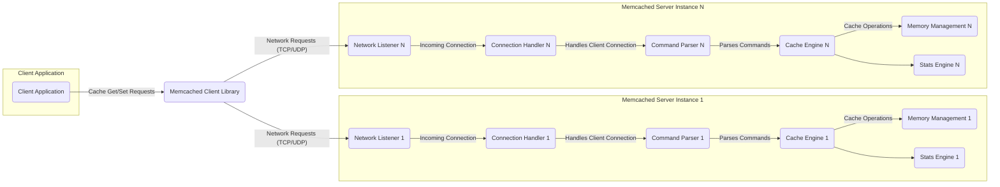
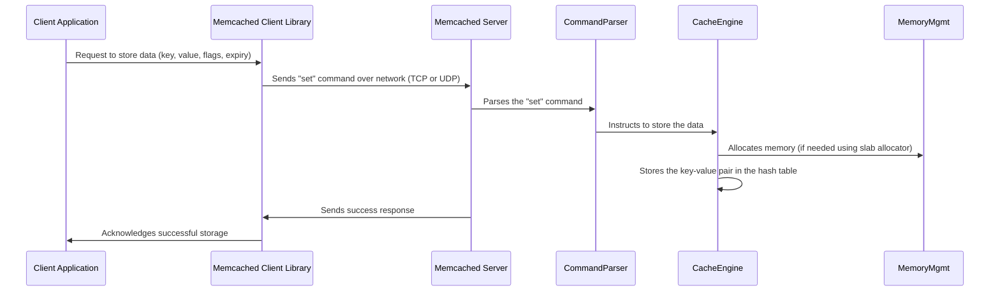
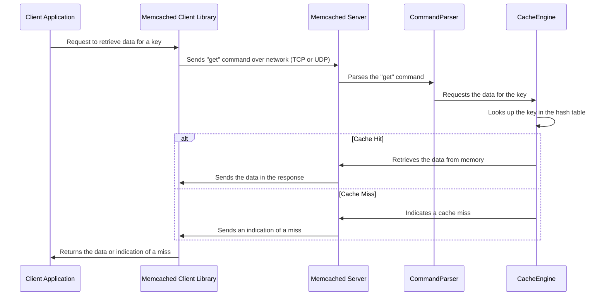

# Project Design Document: Memcached

**Version:** 1.1
**Date:** October 26, 2023
**Author:** AI Software Architect

## 1. Introduction

This document provides a detailed architectural design of the Memcached system, based on the project hosted at [https://github.com/memcached/memcached](https://github.com/memcached/memcached). This document aims to serve as a foundation for subsequent threat modeling activities by outlining the system's components, interactions, and data flow, with a particular focus on security-relevant aspects.

## 2. Goals and Objectives

The primary goal of Memcached is to provide a high-performance, distributed memory object caching system. Key objectives include:

*   Significantly reducing the load on backend data stores (e.g., databases) by caching frequently accessed data in memory.
*   Improving application response times and overall performance by serving cached data with low latency.
*   Achieving horizontal scalability by distributing the cache across multiple independent server instances.
*   Maintaining simplicity in design, deployment, and operation, making it easy to integrate into existing systems.

## 3. Architectural Overview

Memcached employs a client-server architecture where client applications interact with one or more independent Memcached server instances. Crucially, data distribution and consistency across multiple servers are primarily managed by the client library, typically using consistent hashing or other distribution algorithms. Servers operate autonomously and do not inherently communicate with each other for data replication or coherence.

## 4. Component Details

This section provides a detailed breakdown of the key components within the Memcached ecosystem.

### 4.1. Client Application

*   The software application requiring data caching functionality.
*   Responsible for initiating cache operations (get, set, delete, etc.) through the Memcached client library.
*   Implements application-specific logic for handling cache hits (serving data from the cache) and cache misses (fetching data from the primary data source and potentially populating the cache).
*   Often configured with a list of available Memcached server addresses.

### 4.2. Memcached Client Library

*   A crucial intermediary component that provides an API for client applications to interact with Memcached servers.
*   Manages the lifecycle of connections to Memcached servers, including establishing, maintaining, and closing connections.
*   Encodes and decodes messages according to the Memcached protocol (either text-based or the more efficient binary protocol).
*   Implements the core logic for distributing keys across multiple Memcached servers, typically using consistent hashing algorithms (like Ketama hashing) to ensure even distribution and minimize cache churn during server additions or removals.
*   May offer features such as connection pooling (reusing connections to reduce overhead), timeouts for operations, retry mechanisms for transient network errors, and support for various data serialization formats.

### 4.3. Memcached Server

Each Memcached server instance operates independently and is composed of the following key components:

*   **Network Listener:**
    *   Continuously monitors a specified network port (typically TCP or UDP port 11211) for incoming connection requests from clients.
    *   Upon receiving a connection request, it initiates the process of establishing a new network connection with the client.
    *   Configuration options determine the listening interface (e.g., specific IP address or all interfaces) and port.
*   **Connection Handler:**
    *   Dedicated to managing individual client connections once they are established.
    *   Responsible for reading data from the client socket (incoming requests) and writing data back to the client socket (responses).
    *   Typically employs a non-blocking I/O model, often leveraging libraries like `libevent` or `libev`, to efficiently handle a large number of concurrent client connections without blocking on any single connection.
*   **Command Parser:**
    *   Interprets incoming command strings or binary data received from the client, adhering to the defined Memcached protocol.
    *   Identifies the specific operation being requested (e.g., `get`, `set`, `add`, `replace`, `delete`, `increment`, `decrement`, `stats`).
    *   Extracts the necessary parameters for the command, such as the key, flags, expiration time, and data value (if applicable).
*   **Cache Engine:**
    *   The central component responsible for the core caching functionality: storing and retrieving data items.
    *   Utilizes an in-memory hash table (or a similar data structure) to store key-value pairs, providing fast lookups based on the key.
    *   Implements a cache eviction policy (typically Least Recently Used - LRU) to manage memory usage and remove older or less frequently accessed items when the cache reaches its capacity.
    *   Handles item expiration based on the Time-To-Live (TTL) specified when the item was stored. Expired items are considered invalid and may be evicted.
*   **Memory Management:**
    *   Manages the allocation and deallocation of memory used for storing cached data items.
    *   Often employs a slab allocator, a memory management technique designed to reduce memory fragmentation and improve performance.
    *   Slab allocation involves pre-allocating memory into fixed-size chunks (slabs), which are then divided into smaller, equal-sized items. This helps to efficiently store items of similar sizes.
*   **Stats Engine:**
    *   Collects and maintains various runtime statistics about the server's operation and performance.
    *   Provides insights into metrics such as the number of get and set requests, cache hit and miss ratios, current memory usage, number of active connections, and eviction counts.
    *   These statistics can be accessed by clients using specific commands (e.g., the `stats` command), enabling monitoring and performance analysis.

## 5. Data Flow

This section details the typical sequence of operations for common Memcached interactions.

### 5.1. Set Operation (Storing Data)

### 5.2. Get Operation (Retrieving Data)

## 6. Security Considerations

This section elaborates on potential security concerns associated with Memcached, providing a basis for threat modeling.

*   **Network Security:**
    *   **Cleartext Communication:** Memcached, by default, transmits data over the network in plain text (both TCP and UDP). This makes it vulnerable to eavesdropping attacks where malicious actors can intercept and read sensitive cached data.
    *   **Lack of Encryption:** Without explicit configuration or the use of SASL with encryption, there is no built-in encryption for data in transit.
    *   **UDP Amplification Attacks:** When using UDP, Memcached servers can be susceptible to UDP amplification attacks, where attackers send small requests with spoofed source IP addresses, causing the server to send large responses to the spoofed address, potentially overwhelming the target.
    *   **Unauthorized Access:** If the server is exposed without proper firewall rules, any host on the network (or internet) can potentially connect and interact with the cache.
*   **Authentication and Authorization:**
    *   **Historical Lack of Authentication:** Older versions of Memcached lacked built-in authentication mechanisms, meaning any client with network access could perform any operation.
    *   **SASL Authentication:** Newer versions support Simple Authentication and Security Layer (SASL), which allows for pluggable authentication mechanisms (e.g., PLAIN, CRAM-MD5). However, this needs to be explicitly configured and enabled.
    *   **Authorization Limitations:** Even with authentication, Memcached lacks granular authorization controls. Once authenticated, a client typically has full access to perform any operation on the cache.
*   **Denial of Service (DoS):**
    *   **Connection Exhaustion:** Attackers can flood the server with connection requests, exhausting available resources and preventing legitimate clients from connecting.
    *   **Memory Exhaustion:** Sending a large number of `set` requests with large data payloads can consume all available memory, leading to cache eviction of legitimate data and potentially server instability.
    *   **Command Flooding:** Bombarding the server with a high volume of requests (even small ones) can overwhelm its processing capacity.
*   **Data Security:**
    *   **In-Memory Storage:** Data is stored solely in memory, meaning it is volatile and will be lost upon server restart or failure. This has implications for data durability.
    *   **Lack of Encryption at Rest:** Data stored in memory is not encrypted by default. If an attacker gains access to the server's memory, they could potentially extract sensitive information.
    *   **Exposure of Sensitive Data:** Caching sensitive data without proper consideration can increase the attack surface and the potential impact of a security breach.
*   **Command Injection:**
    *   While less common due to the structured nature of the Memcached protocol, if client input is not properly validated and sanitized before being incorporated into Memcached commands, there is a theoretical risk of command injection vulnerabilities.
*   **Configuration Security:**
    *   **Insecure Defaults:** Default configurations (e.g., binding to all interfaces without authentication) can create immediate security risks if not properly addressed during deployment.
    *   **Information Disclosure:** The `stats` command, while useful for monitoring, can expose sensitive information about the server's state and potentially the nature of the cached data if not properly restricted.

## 7. Deployment Considerations

Understanding common deployment patterns is crucial for assessing security risks.

*   **Standalone Servers:** A single Memcached instance serving as a cache. Simpler to manage but represents a single point of failure.
*   **Clustered Deployment (Client-Side Sharding):** Multiple independent Memcached servers are used, with the client library responsible for distributing data across them. This provides scalability and redundancy but requires careful configuration of the client library.
*   **Behind a Firewall:** Deploying Memcached servers within a private network, accessible only through firewalls, is a common security practice.
*   **Containerized Environments (Docker, Kubernetes):**  Memcached can be easily deployed and managed within containerized environments, offering scalability and isolation. Security considerations include container image security and network policies within the cluster.
*   **Cloud-Managed Services:** Cloud providers offer managed Memcached services, handling infrastructure and often providing enhanced security features.

## 8. Assumptions and Constraints

These assumptions and constraints are relevant to the scope of this document.

*   This design document is based on the open-source Memcached project as found on the provided GitHub repository.
*   The focus is primarily on the core architectural components and the standard data flow patterns.
*   Specific implementation details and available features may vary across different versions of Memcached.
*   Security considerations are presented at a high level and will require further detailed analysis during the threat modeling process.

## 9. Future Considerations

*   Detailed analysis of different SASL authentication mechanisms and their security implications.
*   Evaluation of the security benefits and drawbacks of using TCP versus UDP for Memcached communication.
*   Investigation into methods for securing data in transit, such as using stunnel or other TLS termination proxies.
*   Exploring strategies for mitigating DoS attacks against Memcached servers.
*   Developing recommendations for secure configuration and deployment practices.
*   Analyzing the impact of different client library implementations on overall system security.
