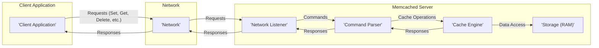
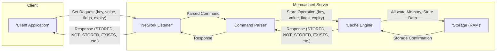
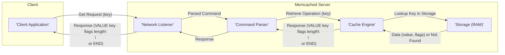
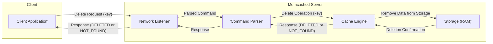

# Project Design Document: Memcached for Threat Modeling

**Version:** 1.1
**Date:** October 26, 2023
**Author:** Gemini (AI Language Model)

## 1. Introduction

This document provides a detailed design overview of the Memcached project (as represented by the codebase at [https://github.com/memcached/memcached](https://github.com/memcached/memcached)). The primary purpose of this document is to serve as a foundational resource for conducting thorough threat modeling. It meticulously outlines the key components, data flows, and interactions within the Memcached system, providing the necessary context for identifying potential security vulnerabilities and attack vectors. This document is intended for security engineers, developers, system architects, and anyone involved in assessing and mitigating the security risks associated with systems utilizing Memcached.

## 2. System Overview

Memcached is a high-performance, distributed, in-memory key-value store primarily used for caching frequently accessed data to accelerate dynamic web applications and reduce database load. It operates as a network service, listening for client connections and processing commands to store, retrieve, and manage data. Data is stored as key-value pairs within the server's RAM.

### 2.1. High-Level Architecture

### 2.2. Key Characteristics

*   **Volatile In-Memory Storage:** Data persistence is not a primary concern; data resides solely in RAM, offering rapid access but susceptibility to loss upon server restart or failure.
*   **Simple Key-Value Model:** Data is structured as basic key-value pairs, limiting complex data relationships or querying capabilities.
*   **Network Accessibility:** Clients interact with Memcached servers over a network using either a text-based or a more efficient binary protocol.
*   **Stateless Operation:** Memcached servers generally do not maintain persistent connections or session state for individual clients, simplifying the server-side implementation but potentially impacting security auditing.
*   **Scalability through Distribution:**  Horizontal scaling is achieved by deploying Memcached as a cluster of independent servers. Client-side logic or specialized client libraries are responsible for distributing keys across the cluster, often using consistent hashing algorithms.
*   **Protocol Options:** Supports both a human-readable text-based protocol and a more compact and efficient binary protocol. The binary protocol offers advantages in terms of parsing speed and reduced network overhead.
*   **Core Command Set:**  The command set is intentionally limited to fundamental caching operations, focusing on speed and simplicity.

## 3. Components

This section provides a detailed description of the primary components within the Memcached system.

*   **Client Application:**
    *   The software application that initiates communication with the Memcached server to perform caching operations.
    *   Responsible for serializing application data into a format suitable for storage in Memcached and deserializing retrieved data.
    *   May implement logic for distributing keys across a cluster of Memcached servers, including handling server failures and rebalancing.
    *   Establishes network connections to the Memcached server(s) using the specified protocol (text or binary).
    *   Client-side vulnerabilities (e.g., improper input validation) can indirectly impact Memcached security.

*   **Network:**
    *   The underlying network infrastructure enabling communication between client applications and Memcached servers.
    *   Network characteristics such as latency, bandwidth, and security controls (firewalls, intrusion detection systems) significantly influence Memcached's performance and security posture.
    *   The network itself can be a target for attacks (e.g., network sniffing, man-in-the-middle attacks).

*   **Memcached Server:**
    *   The core process responsible for managing the in-memory cache and handling client requests.
    *   Listens for incoming client connections on configurable network ports (default: TCP 11211, UDP 11211).

    *   **Network Listener:**
        *   Accepts incoming client connection requests on the designated port(s).
        *   Manages the establishment and termination of network connections.
        *   May implement basic connection limiting or rate limiting to mitigate simple denial-of-service attacks.

    *   **Command Parser:**
        *   Receives raw data streams from the network listener.
        *   Interprets incoming commands based on the selected protocol (text or binary).
        *   For the **text protocol**, this involves parsing human-readable commands and arguments. Vulnerabilities can arise from improper parsing of malformed commands.
        *   For the **binary protocol**, this involves parsing a structured binary format. While generally more efficient, vulnerabilities can still exist in the parsing logic.
        *   Extracts the requested operation and associated parameters (key, value, flags, expiration time, etc.).

    *   **Cache Engine:**
        *   The central component responsible for managing the in-memory cache.
        *   Implements the core logic for storing, retrieving, and deleting key-value pairs.
        *   Manages memory allocation and reclamation, including the use of slabs and chunks for efficient memory utilization.
        *   Enforces eviction policies (e.g., Least Recently Used - LRU) to remove older or less frequently accessed items when memory is constrained.
        *   Handles item expiration based on configured Time-To-Live (TTL) values.

    *   **Storage (RAM):**
        *   The system's Random Access Memory (RAM) where cached data is physically stored.
        *   Organized into slabs of different sizes to minimize memory fragmentation. Within slabs, data is stored in chunks.
        *   The amount of available RAM directly dictates the maximum capacity of the cache.
        *   Data stored in RAM is susceptible to volatility and can be lost upon server failure or restart.

## 4. Data Flow

This section illustrates the typical flow of data during common Memcached operations, highlighting the interaction between components.

### 4.1. Set Operation (Storing Data)

*   The client application sends a "set" command, including the key, value, optional flags, and an expiration time, to the Memcached server.
*   The network listener accepts the connection and receives the data.
*   The command parser interprets the "set" command and extracts the parameters.
*   The cache engine attempts to allocate memory and store the key-value pair in RAM, respecting the provided flags and expiry.
*   The storage component confirms the successful storage or indicates failure (e.g., out of memory).
*   The cache engine sends a response indicating the outcome (e.g., STORED, NOT_STORED, EXISTS) back through the command parser and network listener to the client.

### 4.2. Get Operation (Retrieving Data)

*   The client application sends a "get" command with the key of the data to retrieve.
*   The network listener accepts the connection and receives the request.
*   The command parser interprets the "get" command and extracts the key.
*   The cache engine attempts to locate the key in the storage (RAM).
*   If found and not expired, the storage component retrieves the associated value and flags.
*   The cache engine constructs a response containing the value (and flags) or an indication that the key was not found (END), sending it back through the command parser and network listener to the client.

### 4.3. Delete Operation (Removing Data)

*   The client application sends a "delete" command with the key of the data to remove.
*   The network listener accepts the connection and receives the request.
*   The command parser interprets the "delete" command and extracts the key.
*   The cache engine attempts to remove the key-value pair from the storage (RAM).
*   The storage component confirms the deletion or indicates that the key was not found.
*   The cache engine sends a response indicating the outcome (DELETED or NOT_FOUND) back through the command parser and network listener to the client.

## 5. Security Considerations (For Threat Modeling)

This section outlines potential security considerations and areas of concern that will be the focus of subsequent threat modeling activities.

*   **Network Layer Attacks:**
    *   **Denial of Service (DoS) and Distributed Denial of Service (DDoS):**  Flooding the Memcached server with excessive requests, potentially exhausting resources (CPU, memory, network bandwidth).
    *   **Traffic Sniffing:**  If encryption is not used, attackers on the network can eavesdrop on communication between clients and the server, potentially exposing sensitive data.
    *   **Man-in-the-Middle (MITM) Attacks:**  Attackers intercepting and potentially manipulating communication between clients and the server.
    *   **Spoofing:**  Attackers forging the source IP address of requests to potentially bypass access controls or cause disruption.

*   **Data Security Risks:**
    *   **Data Exposure:** Sensitive data stored in RAM without encryption is vulnerable to memory dumping attacks or if an attacker gains unauthorized access to the server.
    *   **Data Integrity:**  Without proper authentication or integrity checks, data could be tampered with in transit or at rest (if an attacker gains access to the server's memory).
    *   **Information Disclosure through Errors:** Verbose error messages or statistics could inadvertently reveal sensitive information about the system or the data being cached.

*   **Authentication and Authorization Deficiencies:**
    *   **Lack of Built-in Authentication:**  Traditional Memcached deployments often lack built-in mechanisms to verify the identity of clients, making it accessible to anyone who can reach the network port.
    *   **Absence of Granular Authorization:**  No built-in way to control which clients can access or modify specific keys or data. Reliance on network segmentation and firewalls for access control.

*   **Resource Exhaustion Vulnerabilities:**
    *   **Memory Exhaustion:**  Attackers could intentionally fill the cache with a large number of items, potentially evicting legitimate data or causing the server to run out of memory.
    *   **CPU Exhaustion:**  Crafted requests or a high volume of complex operations could consume excessive CPU resources, impacting performance for legitimate clients.
    *   **Connection Exhaustion:**  Opening a large number of connections without proper closure can exhaust server resources.

*   **Protocol-Specific Vulnerabilities:**
    *   **Text Protocol Parsing Issues:**  Vulnerabilities could exist in the parsing logic for the text protocol, potentially allowing attackers to execute arbitrary commands or cause crashes through malformed input.
    *   **Binary Protocol Vulnerabilities:**  While generally more robust, vulnerabilities could still exist in the binary protocol parsing logic.

*   **Configuration and Deployment Weaknesses:**
    *   **Insecure Default Configurations:**  Default settings might expose the service unnecessarily (e.g., listening on all interfaces).
    *   **Insufficient Access Controls:**  Lack of proper operating system-level access controls on the Memcached server process and configuration files.

## 6. Assumptions and Constraints

*   This design document is based on the standard implementation of Memcached as represented by the core codebase. Extensions or custom modifications might introduce additional components or behaviors not covered here.
*   The primary focus is on the server-side architecture and its inherent security characteristics. The security of client-side implementations and their potential vulnerabilities are considered out of scope for this document, though their interaction with Memcached is acknowledged.
*   It is assumed that the underlying network infrastructure provides basic connectivity and routing between clients and servers.
*   Specific deployment scenarios, such as the use of TLS encryption via a proxy or within a containerized environment, are not detailed in this document but are important considerations for overall security.
*   The threat modeling process will utilize this document as a foundation to identify specific threats, vulnerabilities, and potential mitigations.

## 7. Future Considerations

*   Detailed security analysis of both the text and binary protocols, including potential parsing vulnerabilities and command injection risks.
*   In-depth examination of memory management routines and eviction policies for potential security implications, such as cache poisoning or information leakage.
*   Assessment of the security impact of different deployment configurations, including clustered setups and the use of proxy servers.
*   Exploration of potential security enhancements for Memcached, such as the integration of authentication and authorization mechanisms or support for encrypted communication.