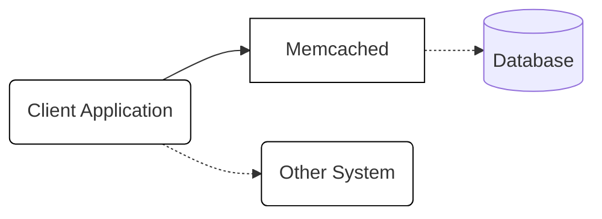
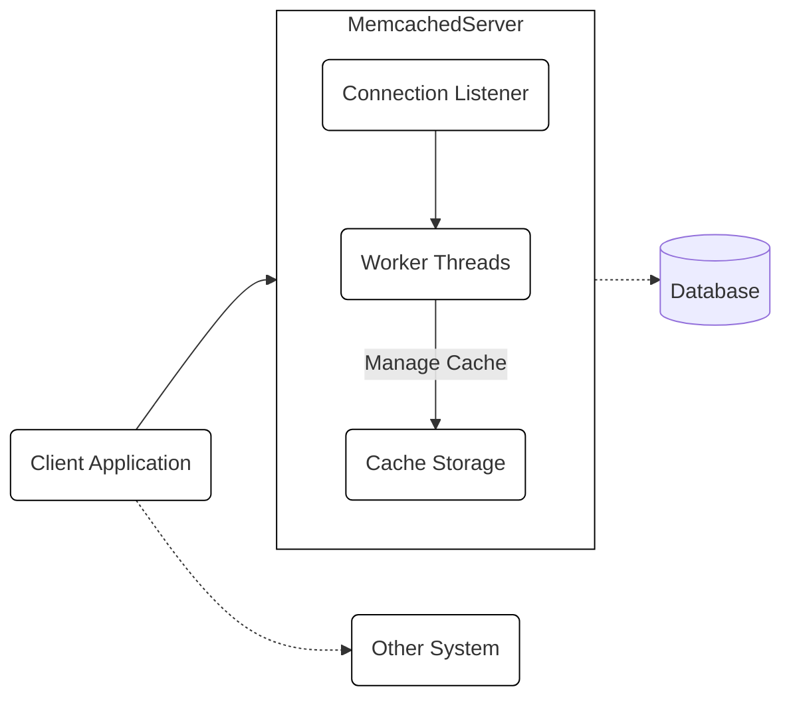
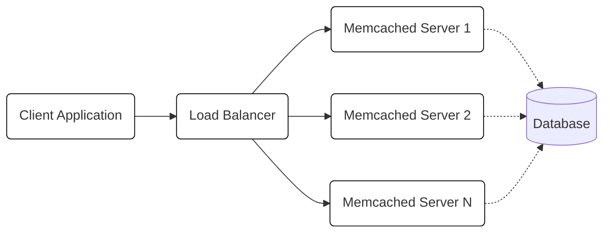
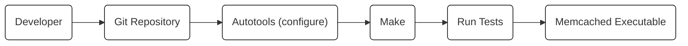

# Project Design Document: Memcached

## BUSINESS POSTURE

Memcached is a widely used, mature, open-source project. Its primary business goal is to provide a high-performance, distributed memory object caching system to speed up dynamic web applications by alleviating database load. Given its widespread adoption, the project likely operates under a model that prioritizes stability, performance, and backward compatibility. The project is likely community-driven, with contributions from various individuals and organizations.

Business Priorities:

- Performance: Minimize latency and maximize throughput for cache operations.
- Scalability: Enable horizontal scaling to handle increasing load.
- Reliability: Ensure data consistency and availability.
- Simplicity: Maintain a simple and easy-to-use interface.
- Compatibility: Maintain backward compatibility with existing clients and deployments.

Business Goals:

- Provide a fast and efficient caching solution.
- Reduce database load and improve application response times.
- Support a large and active user community.

Most Important Business Risks:

- Data breaches or unauthorized access leading to exposure of cached data.
- Denial-of-service attacks impacting the availability of the caching service.
- Data inconsistency or corruption leading to application errors.
- Performance degradation or instability affecting application performance.
- Compatibility issues with newer versions or different client libraries.

## SECURITY POSTURE

Existing Security Controls:

- security control: SASL authentication: Memcached supports SASL (Simple Authentication and Security Layer) for authentication. Described in the `doc/protocol.txt` and `doc/threads.txt` files in the repository.
- security control: Access Control: Limited access control based on IP addresses or network configuration (typically implemented at the network level, external to Memcached itself).
- security control: Regular Updates: The project maintainers release updates to address security vulnerabilities and bugs.
- security control: Community Scrutiny: Being an open-source project, the codebase is subject to scrutiny from the community, which helps identify and address potential security issues.

Accepted Risks:

- accepted risk: Limited built-in security features: Memcached relies heavily on external security measures (e.g., network firewalls, secure deployment environments) and does not implement comprehensive security controls internally.
- accepted risk: Data exposure in transit: By default, Memcached does not encrypt data in transit, making it vulnerable to eavesdropping if deployed in an untrusted network.
- accepted risk: Data exposure at rest: Memcached does not encrypt data at rest, meaning data stored in memory is accessible to anyone with access to the server.
- accepted risk: Denial of Service: Memcached is vulnerable to various denial-of-service attacks, although some mitigations are in place.

Recommended Security Controls:

- Implement TLS encryption for data in transit.
- Consider data-at-rest encryption options, potentially through external tools or libraries.
- Implement more granular access control mechanisms beyond IP-based restrictions.
- Enhance input validation to prevent potential injection vulnerabilities.
- Implement rate limiting and other DoS mitigation techniques.

Security Requirements:

- Authentication:
    - Support strong authentication mechanisms, preferably using SASL with secure authentication mechanisms.
    - Allow configuration of authentication requirements.
- Authorization:
    - Implement access control mechanisms to restrict access to specific commands or data based on user roles or permissions. (Currently limited).
- Input Validation:
    - Validate all input parameters to prevent potential injection attacks or buffer overflows.
    - Sanitize data before storing it in the cache.
- Cryptography:
    - Support TLS encryption for secure communication between clients and servers.
    - Consider options for data-at-rest encryption.

## DESIGN

### C4 CONTEXT

Element Descriptions:

- Client Application:
    - Name: Client Application
    - Type: Software System
    - Description: An application that utilizes Memcached to improve performance by caching frequently accessed data.
    - Responsibilities: Sending requests to Memcached to store and retrieve data. Handling cache misses and fetching data from the primary data source (e.g., database).
    - Security controls: Authenticates to Memcached using SASL (if configured). Implements appropriate error handling and input validation.

- Memcached:
    - Name: Memcached
    - Type: Software System
    - Description: A high-performance, distributed memory object caching system.
    - Responsibilities: Storing and retrieving data in memory. Managing cache expiration. Distributing data across multiple servers (if configured).
    - Security controls: SASL authentication (if configured). Basic access control based on network configuration.

- Database:
    - Name: Database
    - Type: External System
    - Description: The primary data store for the Client Application.
    - Responsibilities: Storing and retrieving data persistently.
    - Security controls: Database security controls (authentication, authorization, encryption, etc.) are assumed to be in place but are external to Memcached.

- Other System:
    - Name: Other System
    - Type: External System
    - Description: Any other system that might interact with the client application.
    - Responsibilities: Varies depending on the specific system.
    - Security controls: Security controls are assumed to be in place but are external to Memcached.

### C4 CONTAINER

Element Descriptions:

- Client Application:
    - Name: Client Application
    - Type: Software System
    - Description: An application that utilizes Memcached to improve performance.
    - Responsibilities: Sending requests to Memcached to store and retrieve data.
    - Security controls: Authenticates to Memcached using SASL (if configured).

- Memcached Server:
    - Name: Memcached Server
    - Type: Container
    - Description: A single instance of the Memcached server.
    - Responsibilities: Handling client connections, processing requests, and managing the cache.
    - Security controls: SASL authentication (if configured).

- Connection Listener:
    - Name: Connection Listener
    - Type: Component
    - Description: Listens for incoming client connections.
    - Responsibilities: Accepting new connections and passing them to worker threads.
    - Security controls: Potentially implements basic DoS protection (e.g., connection limits).

- Worker Threads:
    - Name: Worker Threads
    - Type: Component
    - Description: A pool of threads that handle client requests.
    - Responsibilities: Parsing requests, interacting with the cache storage, and sending responses.
    - Security controls: Input validation.

- Cache Storage:
    - Name: Cache Storage
    - Type: Component
    - Description: The in-memory data store.
    - Responsibilities: Storing and retrieving cached data. Managing cache expiration.
    - Security controls: None directly. Relies on the security of the operating system and server environment.

- Database:
    - Name: Database
    - Type: External System
    - Description: The primary data store.
    - Responsibilities: Storing and retrieving data persistently.
    - Security controls: Database security controls are assumed.

- Other System:
    - Name: Other System
    - Type: External System
    - Description: Any other system that might interact with the client application.
    - Responsibilities: Varies depending on the specific system.
    - Security controls: Security controls are assumed to be in place but are external to Memcached.

### DEPLOYMENT

Possible Deployment Solutions:

1.  Standalone Server: Memcached running on a single dedicated server.
2.  Multiple Servers (Sharded): Memcached running on multiple servers, with data sharded across them.
3.  Cloud-Based (e.g., AWS ElastiCache, Azure Cache for Redis, GCP Memorystore): Managed Memcached services provided by cloud providers.
4.  Containerized (e.g., Docker, Kubernetes): Memcached running within containers.

Chosen Solution (for detailed description): Multiple Servers (Sharded)

Element Descriptions:

- Client Application:
    - Name: Client Application
    - Type: Software System
    - Description: Application using Memcached.
    - Responsibilities: Sending requests.
    - Security controls: Authentication (SASL).

- Load Balancer:
    - Name: Load Balancer
    - Type: Infrastructure Node
    - Description: Distributes client requests across multiple Memcached servers.
    - Responsibilities: Load balancing, health checks.
    - Security controls: Network-level security (firewall, etc.). TLS termination (if configured).

- Memcached Server 1, 2, N:
    - Name: Memcached Server 1, 2, N
    - Type: Infrastructure Node
    - Description: Individual Memcached server instances.
    - Responsibilities: Handling requests, managing cache.
    - Security controls: SASL authentication (if configured). Network-level security.

- Database:
    - Name: Database
    - Type: External System
    - Description: Primary data store.
    - Responsibilities: Storing data persistently.
    - Security controls: Database security controls.

### BUILD

The Memcached build process is primarily managed through a combination of `autotools` (autoconf, automake) and Makefiles. There isn't a dedicated CI/CD pipeline defined within the repository itself, suggesting that builds are likely performed manually or through externally configured CI systems by individual users or organizations.

Build Process Description:

1.  Developer: The developer writes code and commits changes to the Git repository.
2.  Git Repository: The source code is stored in a Git repository.
3.  Autotools (configure): The `configure` script, generated by `autotools`, is used to probe the build environment and generate Makefiles tailored to the specific system.
4.  Make: The `make` command uses the generated Makefiles to compile the source code.
5.  Run Tests: `make test` executes the test suite to verify the functionality of the build.
6.  Memcached Executable: The final output is the `memcached` executable.

Security Controls in Build Process:

- security control: Test Suite: The presence of a test suite (`make test`) helps ensure code quality and can catch potential security regressions.
- security control: Community Review: As an open-source project, the build process and code are subject to community review, which can help identify vulnerabilities.

Recommended Security Controls for Build Process:

- Integrate SAST (Static Application Security Testing) tools into the build process to automatically scan for vulnerabilities.
- Implement SCA (Software Composition Analysis) to identify and manage vulnerabilities in third-party dependencies.
- Use a dedicated CI/CD pipeline (e.g., GitHub Actions, Jenkins) to automate the build and testing process, ensuring consistency and repeatability.
- Digitally sign released builds to ensure their integrity.

## RISK ASSESSMENT

Critical Business Processes to Protect:

- Cache serving: Ensuring the continuous availability and performance of the Memcached service to avoid impacting application performance.
- Data consistency: Maintaining the integrity and consistency of cached data to prevent application errors.

Data to Protect and Sensitivity:

- Cached Data: The sensitivity of the data stored in Memcached depends entirely on the application using it. It can range from non-sensitive data (e.g., website assets) to highly sensitive data (e.g., user session tokens, personal information). Therefore, a general risk assessment must assume the potential for high-sensitivity data.

## QUESTIONS & ASSUMPTIONS

Questions:

- What specific types of data are expected to be cached by applications using this Memcached instance? This is crucial for determining the appropriate security controls.
- What is the expected network environment? Will Memcached be deployed in a trusted internal network, or will it be exposed to the public internet?
- What are the specific performance requirements (throughput, latency)?
- Are there any existing security policies or compliance requirements that need to be considered?
- What is the tolerance for downtime or data loss?

Assumptions:

- BUSINESS POSTURE: The project prioritizes performance, stability, and backward compatibility. The user base is large and diverse.
- SECURITY POSTURE: Memcached is deployed in a relatively secure environment, with basic network-level security measures in place. SASL authentication may or may not be used. Data encryption is not a default feature.
- DESIGN: The deployment will likely involve multiple Memcached servers behind a load balancer. The build process relies on standard tools (`autotools`, `make`) and may not have extensive automated security checks.