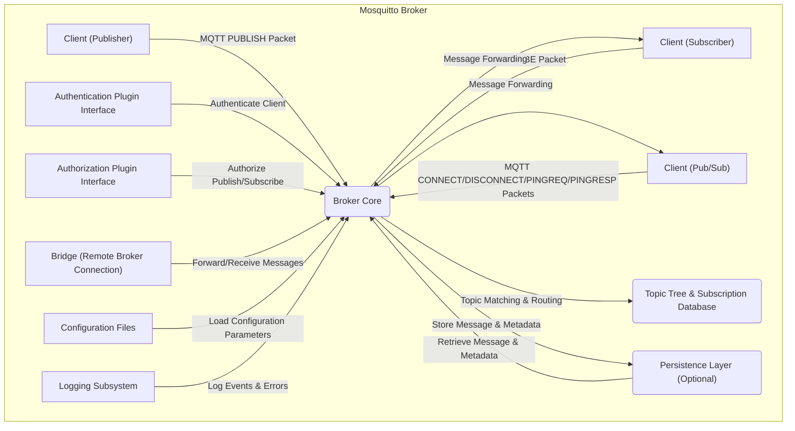

## Project Design Document: Eclipse Mosquitto (Improved)

**1. Introduction**

This document provides an enhanced architectural design of the Eclipse Mosquitto project, an open-source message broker implementing the MQTT protocol. This detailed design serves as a robust foundation for subsequent threat modeling exercises, offering a clear and comprehensive understanding of the system's components, interactions, data flow, and potential security considerations.

**2. Project Overview**

Eclipse Mosquitto is a widely adopted, lightweight message broker that adheres to the MQTT (Message Queuing Telemetry Transport) protocol specification. MQTT is specifically designed for machine-to-machine (M2M) communication and the Internet of Things (IoT), characterized by its efficiency in environments with limited bandwidth and constrained devices.

Mosquitto functions as a central intermediary in MQTT communication, enabling publishers to disseminate messages on designated topics and subscribers to receive messages pertaining to their subscribed topics. The broker's core responsibilities include receiving published messages, filtering them based on their topics, and ensuring their delivery to all relevant subscribers.

**3. System Architecture**

The fundamental architecture of Mosquitto centers around a core broker process responsible for managing client connections, routing messages efficiently, and optionally persisting data.

**4. Component Breakdown**

*   **Broker Core:** The central processing unit of Mosquitto, responsible for the core MQTT functionality:
    *   **Connection Management:** Handles the establishment, maintenance, and termination of client connections, including managing connection state and session persistence.
    *   **MQTT Packet Processing:** Parses and processes all standard MQTT control packets (CONNECT, PUBLISH, SUBSCRIBE, UNSUBSCRIBE, PINGREQ, PINGRESP, DISCONNECT), enforcing protocol rules.
    *   **Publish/Subscribe Engine:** Implements the core publish/subscribe logic, matching published messages to subscriber interests based on topic filters.
    *   **Access Control Enforcement:**  Integrates with authentication and authorization plugins to enforce access control policies, determining if clients are permitted to connect, publish, or subscribe to specific topics.
    *   **Topic Tree and Subscription Management:** Maintains the hierarchical topic tree and manages client subscriptions, enabling efficient message routing.
    *   **Persistence Interface:** Interacts with the optional persistence layer to store and retrieve messages and subscription data for durability.
    *   **Bridging Logic:** Manages connections to other MQTT brokers (bridges), facilitating message exchange between brokers.
    *   **TLS/SSL Handling:**  Manages the encryption and decryption of MQTT traffic using TLS/SSL, ensuring secure communication.
    *   **Will Message Processing:** Handles the storage and delivery of "Will" messages for clients that disconnect unexpectedly.
    *   **Retained Message Handling:** Manages the storage and delivery of retained messages, ensuring new subscribers receive the last published message on a topic.
*   **Client (Publisher):** Any device, application, or service that publishes MQTT messages to the broker on specific topics. Publishers initiate communication by sending PUBLISH packets.
*   **Client (Subscriber):** Any device, application, or service that subscribes to specific topics to receive messages published on those topics. Subscribers express their interest by sending SUBSCRIBE packets.
*   **Client (Publisher/Subscriber):** A client capable of both publishing and subscribing to MQTT topics, acting as both a data source and a data consumer.
*   **Topic Tree & Subscription Database:** A hierarchical data structure used by the broker to organize topics and efficiently match published messages to active subscriptions. The subscription database stores information about which clients are subscribed to which topics.
*   **Persistence Layer (Optional):** Provides a mechanism for storing messages (especially those with QoS > 0), subscriptions, and client session state to ensure data durability across broker restarts. This can be implemented using various storage backends like files or databases.
*   **Authentication Plugin Interface:** Defines an interface for external modules (plugins) to handle client authentication. Mosquitto supports various authentication methods, and plugins allow for extending this functionality.
*   **Authorization Plugin Interface:** Defines an interface for external modules (plugins) to manage client authorization, determining their permissions to publish or subscribe to specific topics.
*   **Bridge (Remote Broker Connection):** A component that establishes and manages connections to other MQTT brokers. Bridges facilitate the forwarding of messages between brokers, enabling the creation of larger, interconnected MQTT networks.
*   **Configuration Files:** Store the broker's configuration parameters, including listening ports, persistence settings, authentication and authorization details, bridge configurations, and TLS/SSL settings.
*   **Logging Subsystem:** Responsible for recording events, errors, and informational messages related to the broker's operation. This is crucial for monitoring, debugging, and auditing.

**5. Data Flow (Detailed)**

The typical data flow within Mosquitto involves the following sequence of actions:

*   **Client Connection Request:** A client initiates a TCP connection to the broker's listening port.
*   **CONNECT Packet Exchange:** The client sends an MQTT CONNECT packet containing client credentials (if any), keep-alive interval, and potentially a Will message.
*   **Authentication:** The Broker Core, through the Authentication Plugin Interface, verifies the client's identity based on the provided credentials.
*   **Authorization (Connection):** The Broker Core, through the Authorization Plugin Interface, determines if the authenticated client is permitted to connect to the broker.
*   **Connection Establishment:** If authentication and authorization are successful, the broker establishes the connection and sends a CONNACK packet to the client.
*   **SUBSCRIBE Packet Processing:** A subscriber client sends a SUBSCRIBE packet specifying the topic filter(s) and desired QoS level.
*   **Subscription Registration:** The Broker Core adds the client's subscription information to the Topic Tree & Subscription Database.
*   **PUBLISH Packet Reception:** A publisher client sends a PUBLISH packet containing the topic, message payload, and QoS level.
*   **Authorization (Publish):** The Broker Core, through the Authorization Plugin Interface, verifies if the publishing client is authorized to publish to the specified topic.
*   **Message Routing and Delivery:**
    *   The Broker Core uses the Topic Tree & Subscription Database to identify all clients with active subscriptions matching the published message's topic.
    *   For each matching subscriber, the broker forwards the message according to the negotiated QoS level.
    *   **QoS 0 (At most once):** The message is sent once without any acknowledgment.
    *   **QoS 1 (At least once):** The message is sent, and the sender expects a PUBACK acknowledgment. If no acknowledgment is received, the message is resent.
    *   **QoS 2 (Exactly once):** A four-part handshake (PUBLISH, PUBREC, PUBREL, PUBCOMP) ensures the message is delivered exactly once.
*   **Persistence (if enabled):** If persistence is enabled and the message has QoS > 0 or is a retained message, the Broker Core interacts with the Persistence Layer to store the message and related metadata. Subscription information is also persisted.
*   **UNSUBSCRIBE Packet Processing:** A subscriber client sends an UNSUBSCRIBE packet to remove a previously established subscription.
*   **Subscription Removal:** The Broker Core removes the client's subscription from the Topic Tree & Subscription Database.
*   **DISCONNECT Packet Processing:** A client sends a DISCONNECT packet to gracefully terminate the connection. The broker may process the client's Will message if configured.
*   **Bridge Message Forwarding:** When configured as a bridge, the broker monitors topics specified in the bridge configuration and forwards matching messages to the remote broker. It also receives messages from the remote broker and distributes them to its local subscribers.

**6. Key Technologies**

*   **Core Programming Language:** C
*   **Primary Protocol:** MQTT (versions 3.1, 3.1.1, and 5.0)
*   **Networking:** TCP/IP for standard MQTT, WebSockets for browser-based clients.
*   **Security:** TLS/SSL for encryption, various authentication and authorization mechanisms.
*   **Operating System Support:** Cross-platform, runs on Linux, macOS, Windows, and embedded systems.
*   **Persistence Options:** File-based storage, SQLite, pluggable interface for other database systems.
*   **Plugin Architecture:** Allows for extending functionality, particularly for authentication and authorization.
*   **Configuration Format:** Typically uses a text-based configuration file.

**7. Deployment Model**

Mosquitto offers flexible deployment options:

*   **Standalone Broker:** A single instance of the Mosquitto broker deployed on a server or virtual machine. Suitable for smaller deployments or development environments.
*   **Clustered Brokers:** Multiple Mosquitto brokers configured to operate as a single logical unit, providing high availability, load balancing, and increased message throughput. Clustering can be implemented using bridging or dedicated clustering plugins.
*   **Embedded Broker:** Mosquitto can be integrated directly into other applications or embedded devices, providing local MQTT messaging capabilities.
*   **Containerized Deployment:** Using Docker or other containerization technologies for easier deployment, scaling, and management in cloud or on-premise environments.
*   **Cloud-Based Services:** Managed Mosquitto instances offered by various cloud providers, simplifying deployment and maintenance.

**8. Security Considerations (Granular)**

This section highlights key areas relevant for threat modeling:

*   **Authentication Vulnerabilities:**
    *   Weak or default credentials.
    *   Bypass vulnerabilities in authentication plugins.
    *   Lack of multi-factor authentication.
    *   Vulnerabilities in the authentication handshake process.
*   **Authorization Vulnerabilities:**
    *   Insufficiently restrictive access control policies.
    *   Bypass vulnerabilities in authorization plugins.
    *   Incorrectly configured ACLs leading to unauthorized access to topics.
    *   Privilege escalation vulnerabilities.
*   **Transport Layer Security (TLS/SSL) Weaknesses:**
    *   Use of weak or outdated TLS/SSL protocols or cipher suites.
    *   Improper certificate validation.
    *   Man-in-the-middle attacks exploiting TLS vulnerabilities.
*   **Message Injection and Tampering:**
    *   Lack of message integrity checks allowing for message modification.
    *   Unauthorized publishing of malicious messages.
*   **Denial of Service (DoS) Attacks:**
    *   Connection flooding attacks overwhelming the broker with connection requests.
    *   Publish flooding attacks overwhelming the broker with messages.
    *   Exploiting vulnerabilities in message processing to cause resource exhaustion.
*   **WebSockets Security:**
    *   Vulnerabilities in the WebSocket implementation.
    *   Cross-site scripting (XSS) vulnerabilities if web clients are involved.
    *   Lack of proper origin validation.
*   **Bridge Security:**
    *   Compromised credentials for bridge connections.
    *   Unencrypted communication between bridged brokers.
    *   Unauthorized message forwarding through bridges.
*   **Persistence Layer Vulnerabilities:**
    *   SQL injection vulnerabilities if using a database backend.
    *   Unauthorized access to persistent storage.
    *   Data breaches of stored messages or credentials.
*   **Configuration Security:**
    *   Exposure of sensitive configuration data (e.g., passwords, keys).
    *   Unauthorized modification of configuration files.
*   **Plugin Security:**
    *   Vulnerabilities in custom authentication or authorization plugins.
    *   Supply chain attacks targeting plugin dependencies.
*   **Logging Security:**
    *   Exposure of sensitive information in log files.
    *   Log injection vulnerabilities.

**9. Potential Threat Modeling Areas**

Based on the architecture and security considerations, the following areas are particularly relevant for threat modeling:

*   **Client Authentication and Authorization Flows:** Analyze the security of the authentication and authorization mechanisms and potential bypasses.
*   **MQTT Packet Processing Logic:** Examine the broker's handling of various MQTT packets for vulnerabilities.
*   **Topic Tree and Subscription Management:** Assess the security of the topic tree structure and subscription management processes.
*   **Persistence Layer Interactions:** Analyze the security of data storage and retrieval mechanisms.
*   **Bridge Communication Security:** Evaluate the security of connections and message exchange between bridged brokers.
*   **Plugin Interfaces and Implementations:** Scrutinize the security of authentication and authorization plugins.
*   **Configuration Management:** Assess the security of configuration storage and access.
*   **WebSockets Implementation:** Analyze the security of the WebSocket transport if enabled.

**10. Conclusion**

This improved design document provides a more detailed and comprehensive understanding of the Eclipse Mosquitto project's architecture, components, and data flow. By elaborating on the security considerations and highlighting potential threat modeling areas, this document serves as a valuable and more robust foundation for conducting thorough security assessments and designing appropriate mitigation strategies. This detailed information is crucial for identifying and addressing potential vulnerabilities within the Mosquitto broker and the systems that rely on its messaging capabilities.
