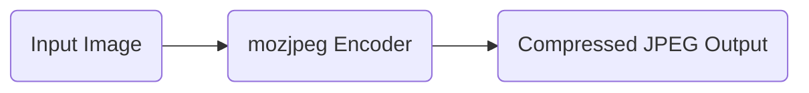
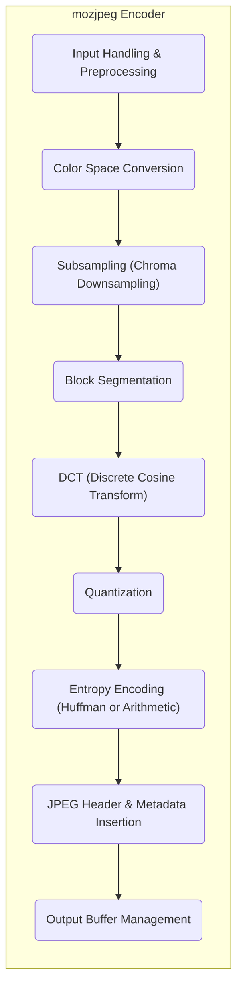
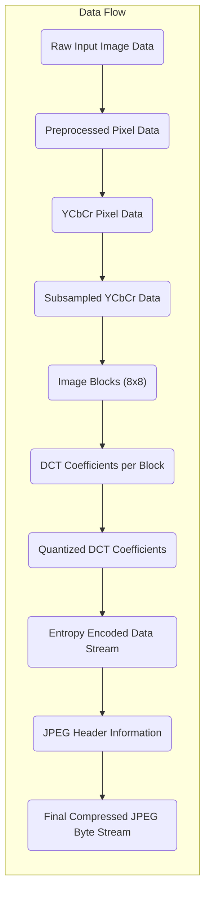

# Project Design Document: mozjpeg

**Version:** 1.1
**Date:** October 26, 2023
**Author:** AI Software Architect

## 1. Introduction

This document provides an enhanced design overview of the mozjpeg project, an actively developed and improved JPEG encoder originating from the libjpeg-turbo project at Mozilla. This document aims to provide a comprehensive and detailed understanding of the system's architecture, individual components, and the flow of data through the encoding process. This detailed design will serve as a crucial foundation for subsequent threat modeling activities, enabling a thorough assessment of potential security risks.

## 2. Goals and Objectives

The fundamental goals driving the development of the mozjpeg project are:

*   **Superior Compression Efficiency:** To achieve significantly smaller file sizes compared to the baseline libjpeg implementation, all while preserving or even enhancing perceived visual quality. This is a core differentiator of mozjpeg.
*   **Standard JPEG Compatibility:**  Maintaining strict adherence to the standard JPEG format is paramount. Encoded images must be decodable by any compliant JPEG decoder without issues.
*   **Optimized Performance:**  While prioritizing compression, mozjpeg aims to provide competitive encoding performance, balancing compression gains with processing time.
*   **Open Source Development:**  The project remains committed to an open-source model, fostering community contributions, transparency in development, and broader accessibility.
*   **Progressive Encoding Support:**  To support the creation of progressive JPEGs, which allow for a low-resolution version of the image to appear quickly, followed by gradual refinement.

## 3. System Architecture

The mozjpeg project manifests as both a command-line utility and a linkable library, providing flexibility in its application. The central function is the transformation of an input image into a highly compressed JPEG output.

### 3.1. High-Level Architecture

*   **Input Image:** The source image intended for compression. While mozjpeg can handle various input formats through preprocessing, its core encoding stage operates on uncompressed image data, typically in a raw pixel format.
*   **mozjpeg Encoder:** This is the central processing unit of the project. It encompasses a series of complex algorithms and transformations to achieve efficient JPEG encoding.
*   **Compressed JPEG Output:** The final result of the encoding process – a JPEG file designed to be significantly smaller than the original input while maintaining acceptable visual fidelity.

### 3.2. Component-Level Architecture

The internal workings of the mozjpeg encoder are structured into distinct, interacting components:

*   **Input Handling & Preprocessing:**
    *   Responsible for the initial intake of the image data. This involves reading the input file, determining its format, and potentially performing format conversions (e.g., from PNG or other formats to a raw pixel representation).
    *   Performs crucial validation checks on the input data, such as verifying image dimensions and color components, to prevent processing errors or potential exploits.
*   **Color Space Conversion:**
    *   Transforms the image's color representation from its original format (often RGB) into a color space more suitable for JPEG compression, primarily YCbCr. This separates luminance (Y) from chrominance (Cb and Cr) components.
*   **Subsampling (Chroma Downsampling):**
    *   Leverages the human eye's lower sensitivity to color details by reducing the resolution of the chrominance (Cb and Cr) components. Common subsampling ratios include 4:2:0, 4:2:2, and 4:4:4.
*   **Block Segmentation:**
    *   Divides the image into smaller, non-overlapping blocks, typically 8x8 pixels. The subsequent DCT and quantization steps are performed on these individual blocks.
*   **DCT (Discrete Cosine Transform):**
    *   Applies the Discrete Cosine Transform to each block, converting the spatial representation of the image data into the frequency domain. This transformation concentrates the image's energy into a smaller number of coefficients.
*   **Quantization:**
    *   This is the primary lossy step in JPEG compression. It reduces the precision of the DCT coefficients by dividing them by values from a quantization table and rounding the results. The quantization table is a key factor in controlling the compression level and visual quality.
*   **Entropy Encoding (Huffman or Arithmetic):**
    *   Encodes the quantized DCT coefficients and other necessary data (like DC coefficients and run-length encoded AC coefficients) efficiently. Huffman coding is the default method, while arithmetic coding offers potentially better compression but with increased computational complexity.
*   **JPEG Header & Metadata Insertion:**
    *   Constructs the necessary header information for the JPEG file. This includes markers defining image dimensions, color space, quantization tables, Huffman or arithmetic coding tables, and other essential metadata.
*   **Output Buffer Management:**
    *   Manages the assembly of the encoded data, including the header and compressed image data, into the final JPEG file format. This involves efficient memory allocation and writing the data to the output destination.

## 4. Data Flow

The journey of image data through the mozjpeg encoder follows a well-defined sequence of transformations:

*   **Raw Input Image Data:** The initial stream of bytes representing the input image.
*   **Preprocessed Pixel Data:** The image data after initial handling, potential format conversion, and validation.
*   **YCbCr Pixel Data:** Image data represented in the YCbCr color space.
*   **Subsampled YCbCr Data:** The chrominance components (Cb and Cr) have undergone resolution reduction.
*   **Image Blocks (8x8):** The image is divided into discrete 8x8 pixel blocks for processing.
*   **DCT Coefficients per Block:** The frequency domain representation of each 8x8 block after the DCT transformation.
*   **Quantized DCT Coefficients:** The DCT coefficients after the precision reduction applied by the quantization step.
*   **Entropy Encoded Data Stream:** The compressed representation of the quantized coefficients and other data, generated by Huffman or arithmetic coding.
*   **JPEG Header Information:** The metadata necessary for a JPEG decoder to interpret the compressed data.
*   **Final Compressed JPEG Byte Stream:** The complete and valid JPEG file, ready for storage or transmission.

## 5. Key Components

*   **`jpegenc.c`:** The primary source file for the mozjpeg command-line encoder. It handles argument parsing, input and output operations, and orchestrates the overall encoding process by calling functions from other modules.
*   **`jccoef.c`:** Contains the core encoding logic, encompassing the DCT, quantization, and entropy encoding stages. This module is central to the compression process.
*   **`jcdctmgr.c`:** Manages the Discrete Cosine Transform (DCT) operations, including forward DCT calculations on image blocks.
*   **`jcparam.c`:** Responsible for managing and setting the various encoding parameters, such as the quantization level, subsampling factors, and whether to use progressive encoding.
*   **`jchuff.c` / `jcarith.c`:** Implement the Huffman and arithmetic entropy encoding algorithms, respectively. The encoder selects one of these modules based on the chosen encoding method.
*   **`jquant1.c` / `jquant2.c`:** Provide different implementations for the quantization step, potentially offering variations in performance or compression characteristics.
*   **`cdjpeg.c`:** While mozjpeg primarily focuses on encoding, this file (inherited from libjpeg) contains utility functions for handling JPEG files, including reading and writing (though encoding is the primary focus).
*   **`jdatadst.c`:** Manages the destination for the compressed JPEG data, handling the writing of the encoded byte stream to the output file or buffer.
*   **`jerror.c`:** Handles error reporting and management within the mozjpeg library, providing mechanisms for reporting and potentially recovering from errors during the encoding process.

## 6. Security Considerations

A thorough understanding of potential security vulnerabilities is crucial for any software project. Here are key security considerations for mozjpeg:

*   **Input Validation Vulnerabilities:**
    *   **Malformed Image Headers:** Failure to properly validate the structure and contents of input image headers could lead to buffer overflows or other memory corruption issues when parsing the header data.
    *   **Invalid Image Dimensions:** Processing images with extremely large or negative dimensions could cause integer overflows or excessive memory allocation, leading to denial-of-service.
    *   **Unexpected Color Space or Component Counts:**  Input images with unexpected color space configurations or an incorrect number of color components could trigger errors or vulnerabilities in subsequent processing stages.
*   **Buffer Overflow Potential:**
    *   **During DCT or Quantization:**  Improper bounds checking during the processing of DCT coefficients or quantization steps could lead to writing data beyond allocated buffer boundaries.
    *   **In Entropy Encoding:** Vulnerabilities in the Huffman or arithmetic encoding implementations could be exploited with carefully crafted input to cause buffer overflows.
*   **Integer Overflow Risks:**
    *   **Dimension Calculations:** Calculations involving image width, height, or block counts, if not carefully handled, could result in integer overflows, leading to incorrect memory allocation sizes or other unexpected behavior.
    *   **Quantization Table Handling:**  Issues in handling or applying quantization tables could lead to incorrect calculations and potential vulnerabilities.
*   **Denial of Service (DoS) Attacks:**
    *   **Resource Exhaustion:** Processing extremely large or complex images with specific characteristics could consume excessive CPU time or memory, leading to denial of service.
    *   **Algorithmic Complexity Exploitation:**  Maliciously crafted input images could be designed to trigger worst-case scenarios in certain algorithms, causing significant performance degradation.
*   **Supply Chain Vulnerabilities:**
    *   **Dependencies on System Libraries:**  Vulnerabilities in underlying system libraries (e.g., memory allocation functions) could indirectly affect mozjpeg's security.
    *   **Compromised Build Environment:** If the build environment used to compile mozjpeg is compromised, malicious code could be injected into the resulting binaries.
*   **Information Leakage Concerns:**
    *   **Metadata Handling:** While primarily a compression tool, improper handling of image metadata could potentially lead to unintended disclosure of sensitive information embedded within the image.
*   **Configuration Security:**
    *   **Insecure Default Settings:**  While less of a direct vulnerability in the code itself, insecure default configuration options could weaken the overall security posture if users are unaware of the implications.

## 7. Dependencies

mozjpeg relies on standard C libraries and may leverage platform-specific optimizations. Key dependencies include:

*   **Standard C Library (`libc`):** Provides fundamental system calls and functions essential for memory management (e.g., `malloc`, `free`), input/output operations (e.g., `fopen`, `fread`, `fwrite`), and other core functionalities.
*   **Operating System Specific Libraries:**  Depending on the platform and build configuration, mozjpeg might utilize operating system-specific libraries for performance enhancements, such as optimized memory allocation routines or SIMD (Single Instruction, Multiple Data) instructions for faster processing.

## 8. Deployment Considerations

mozjpeg is commonly deployed in the following scenarios:

*   **Command-Line Utility:**  Directly used by developers, system administrators, or end-users via the command line to compress individual or batches of images. This is often integrated into scripts or automated workflows.
*   **Integrated Library:**  Linked as a library into other software applications that require JPEG encoding capabilities. This is common in image processing software, web browsers (for encoding images on the fly), and various multimedia applications.
*   **Cloud-Based Image Processing Services:**  Deployed as part of cloud-based services that offer image manipulation and optimization features. These services often handle large volumes of images and require efficient and secure encoding solutions.

## 9. Future Considerations

*   **Advanced Compression Techniques:** Exploration and potential integration of newer or more advanced JPEG compression techniques to further improve compression ratios while maintaining visual quality.
*   **Improved Performance Optimizations:** Continued efforts to optimize the encoding algorithms and leverage hardware acceleration (where available) to enhance encoding speed.
*   **Enhanced Security Measures:** Ongoing analysis and implementation of security best practices to mitigate potential vulnerabilities and strengthen the project's security posture. This includes regular code reviews and vulnerability scanning.
*   **Support for Emerging Standards:**  Monitoring and potential adaptation to emerging image compression standards or extensions to the JPEG standard.

This enhanced design document provides a more in-depth understanding of the mozjpeg project's architecture, components, and data flow. This detailed information is essential for conducting a comprehensive threat model and ensuring the security and reliability of the software.
