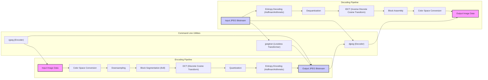

# Project Design Document: mozjpeg

**Version:** 1.1
**Date:** October 26, 2023
**Author:** AI Software Architect

## 1. Introduction

This document provides a detailed design overview of the `mozjpeg` project, a fork of the libjpeg-turbo library with a focus on achieving higher JPEG compression efficiency and improved perceptual quality. This document is specifically crafted to facilitate subsequent threat modeling activities by clearly outlining the system's architecture, data flow, and potential points of interaction.

## 2. Goals

The primary goals of the `mozjpeg` project are:

* **Superior Compression:**  Reduce JPEG file sizes significantly for a given level of visual fidelity compared to standard libjpeg implementations.
* **Enhanced Perceptual Quality:** Produce JPEG images that exhibit fewer visual artifacts at equivalent compression levels.
* **Broad Compatibility:** Maintain a high degree of compatibility with existing JPEG decoders and standards.
* **Optimized Performance:** Deliver competitive encoding and decoding speeds.
* **Robust Security:**  Maintain and enhance the security posture inherited from libjpeg-turbo, minimizing potential vulnerabilities.

## 3. Architectural Overview

`mozjpeg` is fundamentally a library (`libjpeg.so` or `libjpeg.dylib`) offering programmatic interfaces for JPEG encoding and decoding. It also includes command-line utilities built upon this library. The core processing for both encoding and decoding follows a well-defined pipeline structure.

## 4. Data Flow

### 4.1 Encoding Process

* **Input Stage:**
    * Raw image data (typically in RGB or other formats) is received by the encoder, either through function calls in the library or as input to the `cjpeg` command-line tool.
* **Preprocessing:**
    * **Color Space Conversion:** Input data is transformed into the YCbCr color space, the standard for JPEG.
    * **Downsampling:** Chroma subsampling may be applied to reduce the resolution of the color components (Cb and Cr), improving compression.
* **Core Compression:**
    * **Block Segmentation:** The image is divided into 8x8 pixel blocks.
    * **DCT:** The Discrete Cosine Transform is applied to each block, converting spatial pixel values into frequency domain coefficients.
    * **Quantization:** DCT coefficients are quantized, reducing the precision of higher-frequency components. This is the primary lossy step and is where `mozjpeg`'s optimizations are significant.
* **Entropy Encoding:**
    * **Huffman or Arithmetic Coding:** Quantized coefficients are compressed using either Huffman coding (default) or arithmetic coding.
* **Output Stage:**
    * The compressed data is formatted into a JPEG bitstream, including headers and markers, and outputted either via the library API or written to a file by `cjpeg`.

### 4.2 Decoding Process

* **Input Stage:**
    * A JPEG bitstream is provided to the decoder, either through library function calls or as input to the `djpeg` command-line tool.
* **Entropy Decoding:**
    * The compressed data is decoded using the corresponding entropy decoding method (Huffman or arithmetic).
* **Inverse Transformation:**
    * **Dequantization:** Quantized DCT coefficients are scaled back to approximate their original values.
    * **IDCT:** The Inverse Discrete Cosine Transform is applied to the dequantized coefficients, converting them back to the spatial domain (pixel values).
* **Postprocessing:**
    * **Block Assembly:** 8x8 pixel blocks are reassembled to form the image.
    * **Color Space Conversion:** The YCbCr data is converted back to the desired output color space (e.g., RGB).
* **Output Stage:**
    * The reconstructed image data is outputted, either through the library API or written to a file by `djpeg`.

## 5. Key Components

* **Configuration Files:**
    * **`jconfig.h`:**  Primary configuration header defining build options, data types, and feature flags.
    * **`jmorecfg.h`:** Contains additional configuration settings, often platform-specific.
* **Public API Header:**
    * **`jpeglib.h`:** The main header file exposing the public functions and data structures for interacting with the `mozjpeg` library.
* **Encoder Modules:**
    * **`jcapimin.c`, `jcapistd.c`:** API routines for controlling the encoding process.
    * **`jctrans.c`:**  Color transformation routines.
    * **`jcsample.c`:**  Chroma subsampling implementation.
    * **`jfdctflt.c`, `jfdctfst.c`, `jfdctint.c`:** Implementations of the Forward Discrete Cosine Transform (floating-point, fast integer, and accurate integer).
    * **`jquant1.c`:**  Standard quantization routines.
    * **`jquant2.c`:**  `mozjpeg`'s optimized quantization routines for improved compression.
    * **`jchuff.c`, `jcphuff.c`:** Huffman encoding implementation.
    * **`jdarith.c`:** Arithmetic encoding implementation.
* **Decoder Modules:**
    * **`jdapimin.c`, `jdapistd.c`:** API routines for controlling the decoding process.
    * **`jdtrans.c`:** Color transformation routines for decoding.
    * **`jdsample.c`:**  Upsampling of chroma components during decoding.
    * **`jidctflt.c`, `jidctfst.c`, `jidctint.c`:** Implementations of the Inverse Discrete Cosine Transform.
    * **`jdquant.c`:** Dequantization routines.
    * **`jdhuff.c`, `jdphuff.c`:** Huffman decoding implementation.
    * **`jdarith.c`:** Arithmetic decoding implementation.
* **Common Utility Modules:**
    * **`jcmemmgr.c`, `jdmemmgr.c`:** Memory management routines.
    * **`jerror.c`:** Error handling and reporting.
    * **`jutils.c`:**  Various utility functions.
    * **`jmarker.c`:** JPEG marker processing.
* **Command-Line Utility Sources:**
    * **`cjpeg.c`:** Source code for the JPEG encoder command-line tool.
    * **`djpeg.c`:** Source code for the JPEG decoder command-line tool.
    * **`jpegtran.c`:** Source code for the lossless JPEG transformation tool.
* **Progressive JPEG Handling:**
    * **`jccolor.c`, `jdcolor.c`:** Color conversion for progressive JPEGs.
    * **`jcdctmgr.c`, `jddctmgr.c`:** DCT management for progressive encoding/decoding.
    * **`jcarith.c`, `jdarith.c`:** Arithmetic coding for progressive JPEGs.
* **Lossless Transformation:**
    * **`jpegtran.c`:**  Implements lossless operations like cropping, rotation, and flipping.
    * **`jcopy.c`:** Core logic for copying and transforming JPEG data without full re-encoding.

## 6. Dependencies

`mozjpeg` relies on the following core dependencies:

* **Standard C Library (`libc`):** Provides fundamental functions for memory management, input/output, and string manipulation. Potential vulnerabilities in `libc` implementations could affect `mozjpeg`.
* **Operating System Kernel:**  Interacts with the operating system kernel for file system access, memory allocation, and other system-level operations. Security vulnerabilities in the kernel could be exploited if `mozjpeg` interacts with them in an insecure manner.
* **Optional Dependencies (for enhanced features or performance):**
    * **SIMD Intrinsics (SSE, AVX, etc.):**  Used for performance optimizations on supported CPU architectures. These are typically compiler-specific and rely on the correct implementation of these instructions by the CPU. Incorrect usage could lead to unexpected behavior.
    * **Assembly Language (Platform-Specific):**  May include hand-optimized assembly code for critical performance sections. Security vulnerabilities could arise from errors in this assembly code.

## 7. Deployment Scenarios and Attack Surfaces

`mozjpeg` is utilized in a variety of deployment scenarios, each presenting a unique attack surface:

* **Command-Line Tool Usage:**
    * **Scenario:** Users execute `cjpeg`, `djpeg`, or `jpegtran` directly on image files.
    * **Attack Surface:**
        * **Malicious Input Files:**  Crafted JPEG files designed to exploit vulnerabilities in the decoding or transformation logic.
        * **Command Injection:** If the tool is used in scripts or pipelines where filenames or options are dynamically generated from untrusted sources.
        * **Resource Exhaustion:**  Large or specially crafted files could consume excessive CPU, memory, or disk space.
* **Library Integration in Applications (e.g., Web Servers, Image Editors):**
    * **Scenario:** Developers integrate `libjpeg` into their applications for image processing.
    * **Attack Surface:**
        * **Vulnerabilities in Calling Application:**  The application using `mozjpeg` might pass incorrect or malicious data to the library.
        * **Heap Overflow/Buffer Overflow:**  Processing malformed images could lead to overflows in memory buffers within the library.
        * **Integer Overflow:**  Mathematical operations within the library, especially during DCT or quantization, could overflow, leading to unexpected behavior.
        * **Denial of Service:**  Supplying specially crafted images could cause the library to enter infinite loops or consume excessive resources, impacting the application.
* **Cloud-Based Image Processing Services:**
    * **Scenario:** `mozjpeg` is used as a component in a cloud service for image manipulation.
    * **Attack Surface:**
        * **All the above library integration vulnerabilities.**
        * **Exposure through Service API:** Vulnerabilities in the service's API could allow attackers to submit malicious images for processing.
        * **Data Confidentiality:** If sensitive images are being processed, vulnerabilities could lead to unauthorized access or disclosure.
* **Mobile Applications:**
    * **Scenario:** `mozjpeg` is used for image handling on mobile devices.
    * **Attack Surface:**
        * **All the above library integration vulnerabilities.**
        * **Memory Constraints:** Mobile environments have tighter memory constraints, increasing the risk of memory-related vulnerabilities.
        * **Untrusted Input Sources:** Images might originate from untrusted sources (e.g., downloaded from the internet).

## 8. Security Considerations for Threat Modeling

The following security considerations should be thoroughly investigated during threat modeling:

* **Input Validation and Sanitization:**
    * **Malformed JPEG Headers:** Ensure robust parsing and validation of JPEG headers to prevent exploitation of malformed structures.
    * **Invalid Marker Segments:**  Proper handling of unexpected or invalid marker segments within the JPEG bitstream.
    * **Out-of-Bounds Data:** Prevent reads or writes beyond allocated memory when processing image data.
* **Memory Safety:**
    * **Buffer Overflows:**  Scrutinize all memory copy operations and buffer allocations to prevent overflows.
    * **Heap Overflows:**  Carefully manage heap allocations and deallocations to avoid heap corruption.
    * **Use-After-Free:**  Ensure that memory is not accessed after it has been freed.
* **Integer Handling:**
    * **Integer Overflows/Underflows:**  Thoroughly review arithmetic operations, especially during DCT, quantization, and bitstream parsing, to prevent integer overflows or underflows.
    * **Signedness Issues:**  Ensure correct handling of signed and unsigned integers in calculations.
* **Control Flow Integrity:**
    * **Indirect Calls:**  Analyze indirect function calls for potential hijacking.
    * **Return Address Manipulation:**  Assess the risk of return address manipulation vulnerabilities.
* **Denial of Service Prevention:**
    * **Resource Exhaustion:**  Implement safeguards against processing excessively large or complex images that could consume excessive CPU or memory.
    * **Infinite Loops:**  Identify and mitigate potential scenarios where processing malformed input could lead to infinite loops.
* **Side-Channel Attacks:**
    * **Timing Attacks:**  Consider the potential for timing attacks, especially in security-sensitive applications.
* **Dependency Management:**
    * **Vulnerability Scanning:** Regularly scan dependencies for known vulnerabilities.
    * **Secure Updates:**  Implement a process for updating dependencies securely.
* **Command-Line Tool Security:**
    * **Input Sanitization:** Sanitize command-line arguments to prevent command injection.
    * **Privilege Separation:**  Consider running the tools with minimal privileges.

## 9. Future Considerations

* **Continuous Security Monitoring:** Implement automated security testing and vulnerability scanning.
* **Adoption of Safer Coding Practices:**  Encourage the use of memory-safe languages or techniques where feasible.
* **Formal Security Audits:**  Conduct regular security audits by external experts.
* **Community Engagement:**  Encourage security researchers to report potential vulnerabilities through a responsible disclosure process.

This enhanced design document provides a more detailed and structured overview of the `mozjpeg` project, specifically tailored for effective threat modeling. The expanded descriptions of components, data flows, deployment scenarios, and security considerations offer a solid foundation for identifying and mitigating potential security risks.