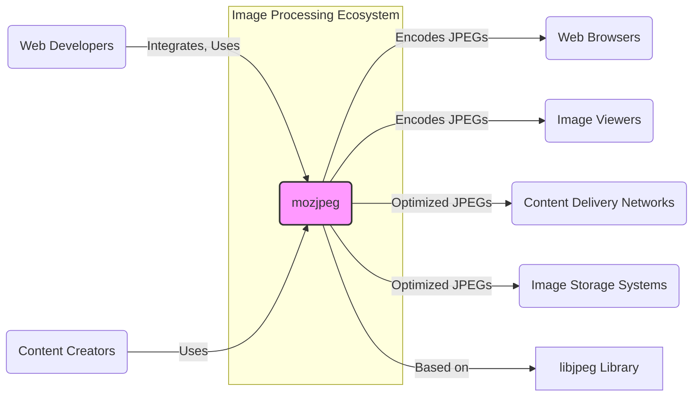
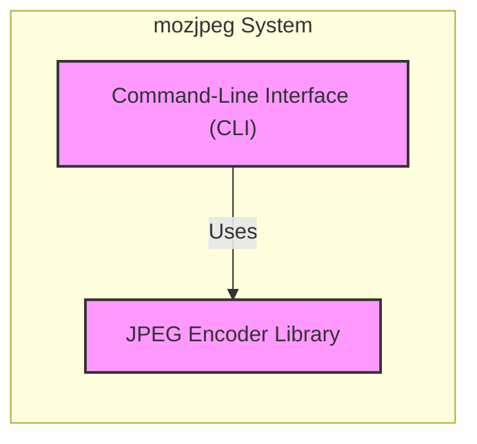

# BUSINESS POSTURE

- Business Priorities and Goals:
  - Priority 1: Optimize JPEG encoding to reduce file size without significant loss of quality.
  - Priority 2: Maintain compatibility with existing JPEG standards and decoders.
  - Priority 3: Provide a performant and efficient JPEG encoding solution.
  - Priority 4: Offer mozjpeg as an open-source and freely available tool.
- Business Risks:
  - Risk 1: Introduction of bugs or vulnerabilities in the optimization process that could lead to corrupted images or security issues in applications using mozjpeg.
  - Risk 2: Performance regressions in new versions that could negatively impact user experience.
  - Risk 3: Lack of adoption if the tool is not easy to use or integrate into existing workflows.
  - Risk 4: Dependency on community contributions and maintenance, which can be unpredictable.

# SECURITY POSTURE

- Existing Security Controls:
  - security control: Code is publicly available on GitHub for review and scrutiny. (Implemented: GitHub Repository)
  - security control: Bug reports and issues are tracked publicly on GitHub. (Implemented: GitHub Issues)
  - accepted risk: Reliance on community contributions for security vulnerability identification and patching.
  - accepted risk: Lack of formal security testing or dedicated security team for the project.
- Recommended Security Controls:
  - security control: Implement automated Static Application Security Testing (SAST) in the CI/CD pipeline to identify potential code-level vulnerabilities.
  - security control: Integrate dependency scanning to identify and manage vulnerabilities in third-party libraries used by mozjpeg.
  - security control: Establish a process for handling security vulnerability reports, including a dedicated security contact and a defined response timeline.
  - security control: Encourage and facilitate security audits of the codebase by external security experts.
- Security Requirements:
  - Authentication: Not applicable for mozjpeg as a library/tool itself. Authentication might be relevant for systems that integrate mozjpeg and require user access control.
  - Authorization: Not applicable for mozjpeg as a library/tool itself. Authorization might be relevant for systems that integrate mozjpeg and need to control access to image processing functionalities.
  - Input Validation: Critical. mozjpeg must robustly handle various image formats and inputs to prevent vulnerabilities like buffer overflows, denial-of-service, or arbitrary code execution through maliciously crafted images. Input validation should be implemented at the image decoding stage.
  - Cryptography: JPEG format itself does not inherently involve strong cryptography for encoding. However, if mozjpeg is used in contexts requiring secure image handling (e.g., watermarking, secure transmission), integration with cryptographic libraries might be necessary in the applications using mozjpeg, but not within mozjpeg core itself.

# DESIGN

- C4 CONTEXT



  - C4 Context Elements:
    - - Name: mozjpeg
      - Type: Software System
      - Description: Optimized JPEG encoder library and command-line tools, aiming for high quality and small file sizes.
      - Responsibilities:
        - Encoding images into optimized JPEG format.
        - Providing command-line tools for JPEG optimization.
        - Maintaining compatibility with JPEG standards.
      - Security controls:
        - Input validation to handle potentially malicious image inputs.
        - Memory safety practices in code to prevent buffer overflows and related vulnerabilities.
    - - Name: Web Developers
      - Type: User
      - Description: Developers who integrate mozjpeg into their web development workflows and applications to optimize images for websites.
      - Responsibilities:
        - Integrate mozjpeg into build processes or server-side applications.
        - Utilize mozjpeg command-line tools for image optimization.
        - Ensure proper usage of mozjpeg API to avoid misuse.
      - Security controls:
        - Secure development practices in their own applications that use mozjpeg.
        - Regular updates of mozjpeg library to benefit from security patches.
    - - Name: Content Creators
      - Type: User
      - Description: Individuals or teams who create and optimize images for various purposes, using mozjpeg to reduce file sizes for sharing or publishing.
      - Responsibilities:
        - Use mozjpeg command-line tools or integrated applications to optimize images.
        - Understand the quality vs. file size trade-offs when using mozjpeg.
      - Security controls:
        - Use trusted sources for mozjpeg binaries or build from source to avoid supply chain risks.
    - - Name: Web Browsers
      - Type: Software System
      - Description: Applications used to view web pages and display images, including JPEGs encoded by mozjpeg.
      - Responsibilities:
        - Decoding and rendering JPEG images.
        - Protecting users from malicious content embedded in images.
      - Security controls:
        - Robust JPEG decoding libraries to handle potentially malformed or malicious JPEGs.
        - Sandboxing and other browser security features to mitigate risks from compromised image rendering.
    - - Name: Image Viewers
      - Type: Software System
      - Description: Standalone applications used to view images, including JPEGs encoded by mozjpeg.
      - Responsibilities:
        - Decoding and rendering JPEG images.
        - Providing image viewing functionalities.
      - Security controls:
        - Secure JPEG decoding libraries to prevent vulnerabilities from malicious JPEGs.
    - - Name: Content Delivery Networks (CDNs)
      - Type: Software System
      - Description: Networks of servers that deliver web content, including images, to users with high availability and performance.
      - Responsibilities:
        - Caching and delivering optimized JPEG images to end-users.
        - Ensuring fast and reliable image delivery.
      - Security controls:
        - Secure CDN infrastructure to protect against data breaches and service disruptions.
        - Content integrity checks to ensure images are delivered without modification.
    - - Name: Image Storage Systems
      - Type: Software System
      - Description: Systems used to store image files, including optimized JPEGs produced by mozjpeg.
      - Responsibilities:
        - Securely storing image files.
        - Providing access to stored images.
      - Security controls:
        - Access control mechanisms to restrict access to stored images.
        - Data encryption to protect images at rest.
    - - Name: libjpeg Library
      - Type: Software System
      - Description: The baseline JPEG library upon which mozjpeg is built and optimized.
      - Responsibilities:
        - Providing core JPEG encoding and decoding functionalities.
      - Security controls:
        - Security vulnerabilities in libjpeg can potentially affect mozjpeg. Mozjpeg needs to track and incorporate security patches from upstream libjpeg.

- C4 CONTAINER



  - C4 Container Elements:
    - - Name: Command-Line Interface (CLI)
      - Type: Container - Executable Application
      - Description: Provides command-line tools for users to directly encode and optimize JPEG images using mozjpeg.
      - Responsibilities:
        - Exposing mozjpeg functionalities through command-line arguments.
        - Handling user input and file I/O.
        - Invoking the JPEG Encoder Library to perform encoding.
      - Security controls:
        - Input validation of command-line arguments and file paths to prevent command injection or path traversal vulnerabilities.
        - Secure handling of file permissions and access.
    - - Name: JPEG Encoder Library
      - Type: Container - Library
      - Description: The core library containing the optimized JPEG encoding algorithms and functionalities of mozjpeg.
      - Responsibilities:
        - Implementing efficient and high-quality JPEG encoding.
        - Providing API for other applications to integrate mozjpeg functionalities.
        - Handling image data processing and memory management.
      - Security controls:
        - Robust input validation of image data to prevent vulnerabilities like buffer overflows, integer overflows, and format string bugs.
        - Memory safety practices to avoid memory leaks and dangling pointers.
        - Regular security audits and code reviews to identify and fix potential vulnerabilities.

- DEPLOYMENT

```mermaid
flowchart LR
    subgraph "Deployment Environment"
        subgraph "Build Server"
            deployment_build_server["Build Server"]
        end
        subgraph "User Machine"
            deployment_user_machine["User Machine"]
        end
        subgraph "Web Server"
            deployment_web_server["Web Server"]
        end
    end

    deployment_build_server -- "Builds Binaries" --> deployment_user_machine
    deployment_build_server -- "Builds Library" --> deployment_web_server
    deployment_user_machine -- "Runs CLI Tools" --> "mozjpeg CLI"
    deployment_web_server -- "Integrates Library" --> "mozjpeg Library"

    style deployment_build_server fill:#f9f,stroke:#333,stroke-width:2px
    style deployment_user_machine fill:#f9f,stroke:#333,stroke-width:2px
    style deployment_web_server fill:#f9f,stroke:#333,stroke-width:2px
```

  - Deployment Elements:
    - - Name: Build Server
      - Type: Infrastructure - Server
      - Description: Server environment used to compile and build mozjpeg from source code into distributable binaries and libraries. Could be developer's machine, CI/CD system, or dedicated build infrastructure.
      - Responsibilities:
        - Compiling source code.
        - Running automated tests.
        - Creating release artifacts (binaries, libraries, packages).
      - Security controls:
        - Secure build environment to prevent malware injection or supply chain attacks.
        - Access control to build server and build artifacts.
        - Integrity checks of build tools and dependencies.
    - - Name: User Machine
      - Type: Infrastructure - Desktop/Laptop
      - Description: User's personal computer where they download and use mozjpeg command-line tools for local image optimization.
      - Responsibilities:
        - Running mozjpeg CLI tools.
        - Managing local image files.
      - Security controls:
        - User's responsibility to download mozjpeg from trusted sources.
        - Operating system and endpoint security measures on user machine.
    - - Name: Web Server
      - Type: Infrastructure - Server
      - Description: Server environment hosting web applications that integrate the mozjpeg library to optimize images on the server-side before serving them to users.
      - Responsibilities:
        - Running web applications.
        - Integrating and using mozjpeg library for image processing.
        - Serving optimized images to web clients.
      - Security controls:
        - Secure web server configuration and hardening.
        - Secure application code that integrates mozjpeg.
        - Regular security updates and patching of web server and application dependencies.

- BUILD

```mermaid
flowchart LR
    developer["Developer"] --> source_code_repo["Source Code Repository (GitHub)"]
    source_code_repo -- "Code Changes" --> ci_system["CI System (GitHub Actions)"]
    ci_system -- "Build & Test" --> build_artifacts["Build Artifacts (Binaries, Libraries)"]
    build_artifacts -- "Publish" --> distribution_channels["Distribution Channels (GitHub Releases, Package Managers)"]

    style developer fill:#f9f,stroke:#333,stroke-width:2px
    style source_code_repo fill:#f9f,stroke:#333,stroke-width:2px
    style ci_system fill:#f9f,stroke:#333,stroke-width:2px
    style build_artifacts fill:#f9f,stroke:#333,stroke-width:2px
    style distribution_channels fill:#f9f,stroke:#333,stroke-width:2px
```



  - BUILD Elements:
    - - Name: Developer
      - Type: Actor - Human
      - Description: Software developers who contribute code to the mozjpeg project.
      - Responsibilities:
        - Writing and committing code changes.
        - Participating in code reviews.
        - Addressing bug reports and security vulnerabilities.
      - Security controls:
        - Secure coding practices.
        - Code review process to identify potential security issues.
        - Security awareness training.
    - - Name: Source Code Repository (GitHub)
      - Type: System - Version Control
      - Description: GitHub repository hosting the mozjpeg source code, commit history, and collaboration features.
      - Responsibilities:
        - Storing and managing source code.
        - Tracking code changes and versions.
        - Facilitating collaboration among developers.
      - Security controls:
        - Access control to the repository.
        - Audit logging of repository activities.
        - Branch protection and code review requirements for sensitive branches.
    - - Name: CI System (GitHub Actions)
      - Type: System - Automation
      - Description: GitHub Actions used for continuous integration and continuous delivery (CI/CD) of mozjpeg.
      - Responsibilities:
        - Automating the build process.
        - Running automated tests (unit tests, integration tests).
        - Performing static analysis and security checks (recommended).
        - Building release artifacts.
      - Security controls:
        - Secure configuration of CI/CD pipelines.
        - Use of trusted build environments and dependencies.
        - Integration of SAST and dependency scanning tools in the pipeline (recommended).
    - - Name: Build Artifacts (Binaries, Libraries)
      - Type: Data - Software Packages
      - Description: Compiled binaries and libraries of mozjpeg produced by the build process.
      - Responsibilities:
        - Representing the distributable form of mozjpeg.
        - Being used by end-users and integrated into other systems.
      - Security controls:
        - Integrity checks (e.g., checksums, signatures) to ensure artifacts are not tampered with.
        - Secure storage of build artifacts before distribution.
    - - Name: Distribution Channels (GitHub Releases, Package Managers)
      - Type: System - Distribution
      - Description: Mechanisms used to distribute mozjpeg binaries and libraries to end-users, such as GitHub Releases, package managers (e.g., apt, yum, npm).
      - Responsibilities:
        - Making mozjpeg available to users.
        - Providing versioning and update mechanisms.
      - Security controls:
        - Secure distribution channels to prevent malware distribution.
        - Signing of releases to verify authenticity and integrity.
        - HTTPS for download channels to protect against man-in-the-middle attacks.

# RISK ASSESSMENT

- Critical Business Processes:
  - For mozjpeg project itself: Maintaining the integrity and availability of the mozjpeg software and its distribution channels.
  - For users of mozjpeg: Ensuring efficient and reliable image optimization for web performance, content delivery, and storage efficiency.
- Data to Protect and Sensitivity:
  - Source code: Publicly available, but integrity is important to prevent malicious modifications. Sensitivity: Low (public). Integrity: High.
  - Build artifacts (binaries, libraries): Publicly distributed. Integrity is crucial to prevent supply chain attacks. Sensitivity: Low (public). Integrity: High.
  - User images processed by mozjpeg: Sensitivity depends on the context of image usage. Could range from low (public images) to high (sensitive personal or confidential images). Integrity and confidentiality might be important depending on the use case.

# QUESTIONS & ASSUMPTIONS

- Questions:
  - What is the risk appetite of the organizations and individuals using mozjpeg? (Assumption: Varies widely, from startups to large enterprises)
  - Are there specific regulatory compliance requirements for systems using mozjpeg? (Assumption: Depends on the application domain, e.g., HIPAA, GDPR if processing images with personal data)
  - What are the typical deployment environments for mozjpeg? (Assumption: Diverse, including cloud environments, on-premise servers, and local user machines)
  - Is there a dedicated security team or individual responsible for mozjpeg security? (Assumption: Primarily relies on community contributions and Mozilla's general security practices, no dedicated team solely for mozjpeg)
- Assumptions:
  - mozjpeg is primarily used to optimize images for web performance and storage efficiency.
  - Security is important for mozjpeg, but performance and compatibility are also key priorities.
  - Users of mozjpeg are responsible for integrating it securely into their own systems and applications.
  - The open-source nature of mozjpeg allows for community scrutiny and contribution to security.