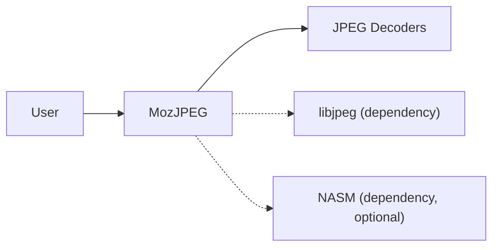
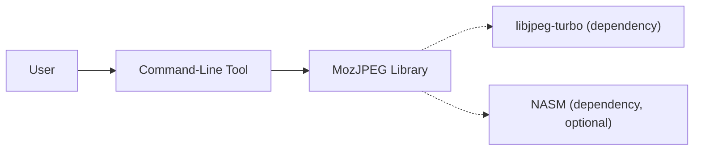
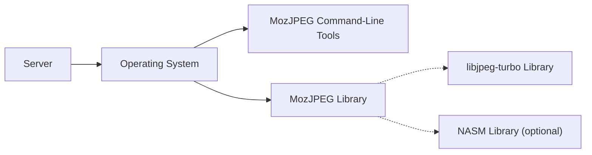
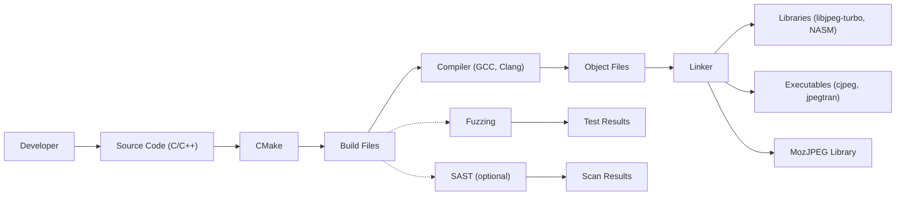

# Project Design Document: MozJPEG

## BUSINESS POSTURE

MozJPEG is a production-ready JPEG encoder that aims to improve compression while maintaining compatibility with the vast majority of deployed decoders. It's developed by Mozilla, an organization known for its commitment to a free and open web. The project is likely targeted towards web developers, content delivery networks (CDNs), and image processing services looking to reduce bandwidth costs and improve website loading times.

Priorities:

*   Reduce the size of JPEG images without sacrificing significant visual quality.
*   Maintain high compatibility with existing JPEG decoders.
*   Provide a stable and reliable encoder for production use.
*   Open source and freely available.

Goals:

*   Improve website performance by reducing image file sizes.
*   Lower bandwidth costs for website operators and users.
*   Contribute to a faster and more efficient web.

Business Risks:

*   Compatibility issues with certain JPEG decoders, leading to broken images on some platforms or devices.
*   Performance regressions compared to other JPEG encoders in specific use cases.
*   Security vulnerabilities in the encoder that could be exploited to compromise systems.
*   Lack of adoption due to perceived complexity or insufficient performance gains.

## SECURITY POSTURE

Existing Security Controls:

*   security control: The project is open-source, allowing for community review and contributions to identify and fix security issues. (Described in the GitHub repository)
*   security control: Fuzz testing is mentioned in the README, indicating an effort to identify potential vulnerabilities through automated testing. (Described in the GitHub repository)
*   security control: The project uses a build system (CMake) that can be configured to enable compiler security flags. (Described in the build instructions)
*   security control: The project appears to be actively maintained, suggesting that security patches are likely to be released promptly. (Described in the GitHub repository commit history)

Accepted Risks:

*   accepted risk: The project is written in C, a language known for memory safety issues. While mitigation efforts are likely in place, the inherent risks of C remain.
*   accepted risk: The project relies on external libraries (e.g., libjpeg), which may have their own security vulnerabilities.

Recommended Security Controls:

*   security control: Integrate static analysis tools (SAST) into the build process to identify potential vulnerabilities early in the development lifecycle.
*   security control: Implement regular dynamic analysis (DAST) using fuzzing techniques, potentially leveraging tools like OSS-Fuzz.
*   security control: Establish a clear vulnerability disclosure and response process.
*   security control: Conduct regular security audits and code reviews.
*   security control: Consider using memory-safe wrappers or libraries where possible to mitigate the risks associated with C.
*   security control: Implement a Software Bill of Materials (SBOM) to track dependencies and their associated vulnerabilities.

Security Requirements:

*   Authentication: Not applicable, as MozJPEG is a library/command-line tool, not a service requiring authentication.
*   Authorization: Not applicable, as MozJPEG operates on local files and doesn't involve user roles or permissions.
*   Input Validation:
    *   The encoder must properly handle malformed or corrupted JPEG input, preventing crashes or vulnerabilities.
    *   The encoder should validate parameters and options to prevent unexpected behavior or security issues.
*   Cryptography: Not directly applicable, as MozJPEG's primary function is image compression, not encryption. However, if the library interacts with any cryptographic functions (e.g., for digital signatures), those interactions must be secure.
*   Memory Management:
    *   The encoder must handle memory allocation and deallocation securely, preventing memory leaks, buffer overflows, and other memory-related vulnerabilities.

## DESIGN

MozJPEG is a library and command-line tool for encoding JPEG images. It takes existing JPEG files or other image formats as input and produces optimized JPEG files as output. It achieves improved compression by using advanced techniques like trellis quantization and improved Huffman coding.

### C4 CONTEXT

*   User:
    *   Name: User
    *   Type: Person
    *   Description: A person who uses MozJPEG to compress images. This could be a web developer, a system administrator, or any individual using the command-line tool or integrating the library into their application.
    *   Responsibilities: Provides input images, configures encoding parameters, and uses the output images.
    *   Security controls: Not directly applicable, as the user interacts with MozJPEG indirectly.
*   MozJPEG:
    *   Name: MozJPEG
    *   Type: Software System
    *   Description: The JPEG encoder that improves compression while maintaining compatibility.
    *   Responsibilities: Encodes JPEG images, optimizes compression parameters, and produces optimized JPEG files.
    *   Security controls: Input validation, fuzz testing, secure build process.
*   JPEG Decoders:
    *   Name: JPEG Decoders
    *   Type: Software System
    *   Description: Existing JPEG decoders that will be used to decode the images produced by MozJPEG.
    *   Responsibilities: Decode JPEG images.
    *   Security controls: Not directly controlled by MozJPEG, but compatibility is a key consideration.
*   libjpeg:
    *   Name: libjpeg
    *   Type: Library
    *   Description: A widely used library for reading and writing JPEG files. MozJPEG is based on libjpeg-turbo, which itself is a fork of libjpeg.
    *   Responsibilities: Provides low-level JPEG encoding and decoding functionality.
    *   Security controls: Relies on the security of the libjpeg-turbo library.
*   NASM:
    *   Name: NASM
    *   Type: Library
    *   Description: An assembler used for optimized SIMD code (optional dependency).
    *   Responsibilities: Provides optimized assembly code for certain operations.
    *   Security controls: Relies on the security of the NASM assembler and the generated code.

### C4 CONTAINER

*   Command-Line Tool:
    *   Name: Command-Line Tool
    *   Type: Application
    *   Description: The command-line interface (e.g., `cjpeg`, `jpegtran`) provided by MozJPEG for users to interact with the encoder.
    *   Responsibilities: Parses command-line arguments, reads input files, calls the MozJPEG library to perform encoding, and writes output files.
    *   Security controls: Input validation of command-line arguments and file paths.
*   MozJPEG Library:
    *   Name: MozJPEG Library
    *   Type: Library
    *   Description: The core library containing the JPEG encoding logic.
    *   Responsibilities: Implements the JPEG encoding algorithm, optimizes compression parameters, and interacts with libjpeg-turbo.
    *   Security controls: Input validation, memory safety measures, fuzz testing.
*   libjpeg-turbo:
    *   Name: libjpeg-turbo
    *   Type: Library
    *   Description: A high-performance fork of libjpeg that uses SIMD instructions for acceleration.
    *   Responsibilities: Provides low-level JPEG encoding and decoding functionality.
    *   Security controls: Relies on the security of the libjpeg-turbo library.
*   NASM:
    *   Name: NASM
    *   Type: Library
    *   Description: An assembler used for optimized SIMD code (optional dependency).
    *   Responsibilities: Provides optimized assembly code for certain operations.
    *   Security controls: Relies on the security of the NASM assembler and the generated code.

### DEPLOYMENT

MozJPEG can be deployed in several ways:

1.  **System-wide installation:** Users can compile and install MozJPEG from source, making the command-line tools and library available system-wide.
2.  **Application-specific bundling:** Developers can link the MozJPEG library directly into their applications, distributing it as part of their software package.
3.  **Containerization:** MozJPEG can be packaged within a Docker container for isolated and reproducible deployments.

Chosen deployment solution (System-wide installation):

* Server
    * Name: Server
    * Type: Server
    * Description: Physical or virtual server.
    * Responsibilities: Host for OS and MozJPEG.
    * Security controls: OS hardening, firewall, intrusion detection system.
* Operating System
    * Name: Operating System
    * Type: Operating System
    * Description: The operating system on which MozJPEG is installed (e.g., Linux, macOS, Windows).
    * Responsibilities: Provides the runtime environment for MozJPEG.
    * Security controls: Regular security updates, secure configuration.
* MozJPEG Command-Line Tools
    * Name: MozJPEG Command-Line Tools
    * Type: Application
    * Description: Executables like cjpeg and jpegtran.
    * Responsibilities: Provide command line interface to compress images.
    * Security controls: Input validation.
* MozJPEG Library
    * Name: MozJPEG Library
    * Type: Library
    * Description: Shared library that can be used by other applications.
    * Responsibilities: Provide API to compress images.
    * Security controls: Input validation, memory safety.
* libjpeg-turbo Library
    * Name: libjpeg-turbo Library
    * Type: Library
    * Description: Shared library for JPEG encoding/decoding.
    * Responsibilities: Provide low-level JPEG operations.
    * Security controls: Relies on the security of libjpeg-turbo.
* NASM Library (optional)
    * Name: NASM Library
    * Type: Library
    * Description: Assembler library for SIMD optimizations.
    * Responsibilities: Provide optimized assembly code.
    * Security controls: Relies on the security of NASM.

### BUILD

The MozJPEG build process uses CMake. The process typically involves the following steps:

1.  **Source Code:** Developers write and modify the C and C++ source code.
2.  **CMake:** CMake is used to configure the build process, generating build files for the target platform.
3.  **Compilation:** The C and C++ code is compiled using a compiler (e.g., GCC, Clang).
4.  **Linking:** The compiled object files are linked together with necessary libraries (libjpeg-turbo, and optionally NASM) to create the final executables and library.
5.  **Testing:** Automated tests (including fuzzing) are run to verify the functionality and security of the encoder.
6.  **Artifacts:** The build process produces the command-line tools (cjpeg, jpegtran, etc.) and the MozJPEG library.

Security Controls in Build Process:

*   security control: Compiler security flags (e.g., stack protection, buffer overflow detection) should be enabled during compilation.
*   security control: Static analysis (SAST) tools can be integrated into the build process to identify potential vulnerabilities in the source code.
*   security control: Fuzzing is used to test the encoder with a wide range of inputs, helping to discover unexpected behavior and vulnerabilities.
*   security control: Dependency management: The build process should clearly define and manage dependencies (libjpeg-turbo, NASM) to ensure that known vulnerable versions are not used.

## RISK ASSESSMENT

*   Critical Business Processes:
    *   Image delivery for websites and applications.
    *   Efficient use of bandwidth and storage resources.

*   Data:
    *   Image data (JPEG files): The primary data being processed.
    *   Sensitivity: Varies depending on the content of the images. Images can range from public and non-sensitive to private and highly confidential. MozJPEG itself doesn't inherently handle the sensitivity classification; it's the responsibility of the user or system integrating MozJPEG to manage the data appropriately. The encoder should be treated as a potential attack vector, regardless of the image content.

## QUESTIONS & ASSUMPTIONS

*   Questions:
    *   What specific compiler flags are currently used in the build process?
    *   What is the current coverage of fuzz testing, and are there plans to expand it?
    *   Are there any known compatibility issues with specific JPEG decoders?
    *   What is the process for reporting and addressing security vulnerabilities?
    *   Is there a Software Bill of Materials (SBOM) available for MozJPEG?

*   Assumptions:
    *   BUSINESS POSTURE: The primary users of MozJPEG are technically proficient and understand the implications of using a command-line tool or integrating a library.
    *   SECURITY POSTURE: The project maintainers are responsive to security concerns and actively address reported vulnerabilities.
    *   DESIGN: The build process is automated and reproducible. The dependencies (libjpeg-turbo, NASM) are regularly updated to their latest stable versions.