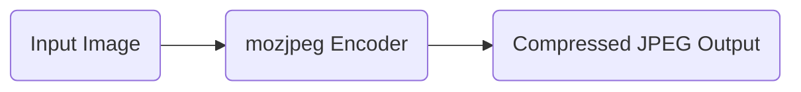
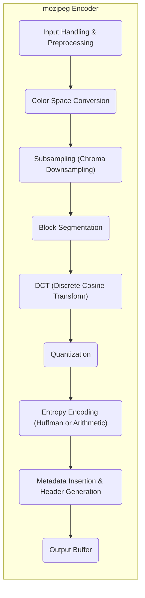
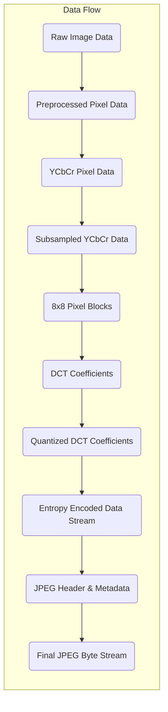

# Project Design Document: mozjpeg

**Version:** 1.1
**Date:** October 26, 2023
**Author:** AI Software Architect

## 1. Introduction

This document provides an enhanced and detailed design overview of the mozjpeg project, a highly regarded and widely used improved JPEG encoder developed by Mozilla. This document aims to provide a comprehensive and clear understanding of the system's architecture, individual components, and the flow of data through the encoding process. This detailed information is crucial for subsequent threat modeling activities, enabling a thorough assessment of potential security vulnerabilities.

## 2. Goals and Objectives

The fundamental goals driving the development of the mozjpeg project are:

*   **Superior Compression Efficiency:** To achieve significantly smaller file sizes compared to the baseline libjpeg implementation while meticulously preserving or even enhancing the perceived visual quality of the compressed image.
*   **Strict JPEG Standard Compliance:** To maintain full compatibility with the ISO/IEC 10918-1 standard for JPEG encoding, ensuring that images encoded with mozjpeg can be seamlessly decoded by any standard-compliant JPEG decoder.
*   **Optimized Performance:** To provide efficient encoding performance, balancing compression effectiveness with reasonable processing time, making it suitable for a wide range of applications.
*   **Commitment to Open Source:** To remain an open-source project under a permissive license, fostering community contributions, promoting transparency in its implementation, and ensuring its accessibility to all.

## 3. System Architecture

The mozjpeg project manifests primarily as both a command-line utility and a linkable library, both designed for the efficient encoding of JPEG images. The core functionality centers around the transformation of an input image into a highly compressed JPEG output.

### 3.1. High-Level Architecture

*   **"Input Image"**: Represents the source image intended for compression. While mozjpeg can handle various input formats, it internally operates on uncompressed image data, often in formats like raw RGB or YCbCr.
*   **"mozjpeg Encoder"**: This is the central processing unit of the project, encompassing the complex sequence of algorithms and transformations necessary for JPEG encoding. It orchestrates the various sub-components to achieve optimal compression.
*   **"Compressed JPEG Output"**: The final result of the encoding process – a JPEG file designed to be significantly smaller than the original input image while maintaining an acceptable level of visual fidelity.

### 3.2. Component-Level Architecture

The internal workings of the mozjpeg encoder can be dissected into several distinct but interconnected components, each responsible for a specific stage of the encoding pipeline:

*   **"Input Handling & Preprocessing"**:
    *   Responsible for the initial intake of the input image data, including reading the file from disk or memory.
    *   Performs preliminary parsing of the image format and may involve converting the input data into a standardized internal representation suitable for further processing.
    *   Executes initial validation checks on the input data to ensure its integrity and adherence to expected formats.
*   **"Color Space Conversion"**:
    *   Transforms the image's color representation from its original format (e.g., RGB) into a color space more suitable for JPEG compression, typically YCbCr. This separation of luminance (Y) and chrominance (Cb and Cr) components allows for more efficient compression by exploiting human visual perception.
*   **"Subsampling (Chroma Downsampling)"**:
    *   Reduces the spatial resolution of the chrominance (Cb and Cr) components. This is a lossy but often visually imperceptible step, as the human eye is less sensitive to fine details in color compared to luminance. Common subsampling ratios include 4:2:0, 4:2:2, and 4:4:4.
*   **"Block Segmentation"**:
    *   Divides the image into smaller, non-overlapping blocks of pixels, typically 8x8. These blocks are the fundamental units for the subsequent DCT operation.
*   **"DCT (Discrete Cosine Transform)"**:
    *   Applies the Discrete Cosine Transform to each 8x8 block. This mathematical transformation converts the spatial representation of the image data into a frequency domain representation. The DCT concentrates the image's energy into a few low-frequency coefficients, making it easier to discard less important high-frequency information.
*   **"Quantization"**:
    *   This is the primary lossy compression step in JPEG. It reduces the precision of the DCT coefficients by dividing them by quantization values and rounding the results. The quantization table, which varies for different frequency components, controls the trade-off between compression ratio and image quality. Finer quantization (smaller values) preserves more detail but results in larger files.
*   **"Entropy Encoding (Huffman or Arithmetic)"**:
    *   Encodes the quantized DCT coefficients and other necessary data (like quantization tables) using lossless entropy encoding techniques.
    *   **Huffman coding** is the default method, assigning shorter codes to more frequent symbols.
    *   **Arithmetic coding** is an optional, more complex method that can achieve slightly better compression.
*   **"Metadata Insertion & Header Generation"**:
    *   Constructs the JPEG file header, which contains crucial metadata about the image, including its dimensions, color space, compression parameters (like quantization tables), and other relevant information. This header ensures that JPEG decoders can correctly interpret the compressed data.
*   **"Output Buffer"**:
    *   Assembles the encoded data stream, including the compressed DCT coefficients and the JPEG header, into the final JPEG file format. This buffer is then written to the output file or stream.

## 4. Data Flow

The journey of image data through the mozjpeg encoder follows a well-defined sequence, mirroring the component structure:

*   **"Raw Image Data"**: The initial, unprocessed image data as input to the encoder.
*   **"Preprocessed Pixel Data"**: The image data after initial handling, potential format conversions, and basic validation.
*   **"YCbCr Pixel Data"**: The image data transformed into the YCbCr color space, separating luminance and chrominance components.
*   **"Subsampled YCbCr Data"**: The chrominance components (Cb and Cr) have their spatial resolution reduced.
*   **"8x8 Pixel Blocks"**: The image is divided into discrete 8x8 pixel blocks for DCT processing.
*   **"DCT Coefficients"**: The frequency domain representation of each 8x8 block after applying the Discrete Cosine Transform.
*   **"Quantized DCT Coefficients"**: The DCT coefficients after the quantization process, having reduced precision.
*   **"Entropy Encoded Data Stream"**: The compressed representation of the quantized coefficients and other data, achieved through Huffman or arithmetic coding.
*   **"JPEG Header & Metadata"**: The structured information containing image properties and compression settings.
*   **"Final JPEG Byte Stream"**: The complete and compressed JPEG file, ready for storage or transmission.

## 5. Key Components

This section provides a more detailed look at some of the critical source files and modules within the mozjpeg codebase:

*   **`jpegenc.c`**: This is the primary entry point for the command-line interface of the mozjpeg encoder. It handles parsing command-line arguments provided by the user, manages input and output operations (reading the source image and writing the compressed JPEG), and orchestrates the overall encoding process by calling the appropriate functions from other modules.
*   **`jccoef.c`**: This module contains the core logic for the JPEG encoding process. It implements the main encoding pipeline, including calls to functions for DCT, quantization, and entropy coding. It manages the flow of data through these critical stages.
*   **`jcdctmgr.c`**: This module is specifically responsible for managing the Discrete Cosine Transform (DCT) operations. It likely contains the implementation of the DCT algorithm itself and handles the application of the DCT to the individual 8x8 pixel blocks.
*   **`jcparam.c`**: This module deals with the management of encoding parameters and settings. It handles the interpretation of user-specified options (e.g., quality level, subsampling settings) and configures the encoder accordingly. It also likely manages the selection and application of quantization tables.
*   **`jchuff.c` / `jcarith.c`**: These modules implement the entropy encoding algorithms. `jchuff.c` contains the implementation of Huffman coding, the default entropy encoding method in JPEG. `jcarith.c` provides the implementation for arithmetic coding, an optional alternative that can offer slightly better compression.
*   **`jquant1.c` / `jquant2.c`**: These modules likely implement different quantization strategies or provide functions for generating and applying quantization tables. They play a crucial role in controlling the trade-off between compression and image quality.
*   **`cdjpeg.c`**: While mozjpeg primarily focuses on encoding, this module contains utility functions that are often shared with JPEG decoding operations. It might include functions for reading and writing basic JPEG structures or handling common file format elements.
*   **`jdatadst.c`**: This module manages the destination for the compressed JPEG data. It handles the buffering and writing of the encoded data stream to the output file or memory location.
*   **`jerror.c`**: This module is responsible for handling error reporting and management within the mozjpeg library. It provides mechanisms for detecting errors during the encoding process and reporting them to the user or calling application.

## 6. Security Considerations

This section outlines potential security considerations relevant to the mozjpeg project, providing a foundation for subsequent in-depth threat modeling.

*   **Input Validation Vulnerabilities:**
    *   **Malformed Image Headers:**  Improper parsing of malformed or maliciously crafted JPEG or other input image headers could lead to buffer overflows if header fields specify unexpectedly large values for image dimensions or other parameters.
    *   **Invalid Pixel Data:**  Failure to adequately validate pixel data could lead to issues if the data contains unexpected patterns or values that cause errors during processing, potentially leading to crashes or unexpected behavior.
    *   **File Format Exploits:**  Vulnerabilities could arise from the way mozjpeg handles different image file formats during the initial input processing stage.
*   **Memory Management Issues (Buffer Overflows):**
    *   **DCT Coefficient Buffers:**  Potential for overflows in buffers used to store DCT coefficients, especially when handling images with very large dimensions.
    *   **Quantization Table Handling:**  Improper handling of quantization tables, particularly if custom tables are allowed, could lead to out-of-bounds writes if table sizes are not validated.
    *   **Entropy Encoding Buffers:**  Buffers used during Huffman or arithmetic coding could be vulnerable to overflows if the input data leads to unexpectedly large encoded output.
*   **Integer Overflow/Underflow:**
    *   **Dimension Calculations:** Calculations involving image width, height, or block counts could potentially lead to integer overflows or underflows, resulting in incorrect memory allocations or processing logic.
    *   **Quantization Factor Handling:**  Manipulating quantization factors without proper bounds checking could lead to unexpected behavior or vulnerabilities.
*   **Denial of Service (DoS) Attacks:**
    *   **Resource Exhaustion:** Processing extremely large or highly complex images could consume excessive CPU time or memory, potentially leading to denial of service.
    *   **Algorithmic Complexity Exploits:**  Maliciously crafted input images could be designed to trigger worst-case scenarios in certain algorithms (e.g., during entropy encoding), leading to excessive processing time.
*   **Supply Chain Vulnerabilities:**
    *   **Dependency on System Libraries:**  Vulnerabilities in underlying system libraries (e.g., `libc`) that mozjpeg depends on could indirectly affect its security.
    *   **Compromised Build Environment:**  If the build environment used to compile mozjpeg is compromised, malicious code could be injected into the resulting binaries.
*   **Information Leakage:**
    *   **Metadata Exposure:** While primarily a compression tool, there might be potential for unintended leakage of information through the inclusion of specific metadata in the JPEG header.
    *   **Error Messages:** Verbose error messages could potentially reveal information about the system or internal workings that could be useful to an attacker.
*   **Configuration and Default Settings:**
    *   Insecure default configuration settings could weaken the security posture if users are not aware of the implications.

## 7. Dependencies

mozjpeg relies on standard C libraries for its core functionality and may optionally utilize platform-specific optimizations. Key dependencies include:

*   **Standard C Library (`libc`):** Provides essential functions for memory allocation (`malloc`, `free`), input/output operations (`fopen`, `fread`, `fwrite`), and other fundamental system calls.
*   **Operating System APIs:** May utilize operating system-specific APIs for tasks such as file system access or threading (though mozjpeg is primarily single-threaded).

## 8. Deployment Considerations

mozjpeg is commonly deployed in the following ways:

*   **Command-Line Tool:**  Distributed as an executable that users can directly invoke from the command line or within scripts to compress individual or batches of images. This is a common use case for developers and system administrators.
*   **Linkable Library:** Provided as a library (e.g., a `.so` file on Linux or a `.dylib` file on macOS) that can be linked into other software applications requiring JPEG encoding capabilities. This allows developers to integrate mozjpeg's efficient compression directly into their programs.

## 9. Future Considerations

*   **Advanced Compression Techniques:** Exploration and potential integration of newer or more advanced JPEG compression techniques or extensions.
*   **Improved Performance and Parallelism:** Continued efforts to optimize encoding speed and potentially introduce multi-threading or other forms of parallelism to leverage multi-core processors.
*   **Enhanced Security Hardening:** Ongoing analysis and mitigation of potential security vulnerabilities through code reviews, static analysis, and fuzzing.
*   **Broader Format Support:**  Consideration of expanding support for a wider range of input image formats.

This enhanced design document provides a more in-depth understanding of the mozjpeg project's architecture, components, and data flow. This detailed information serves as a robust foundation for conducting a comprehensive threat model to proactively identify and address potential security risks.
