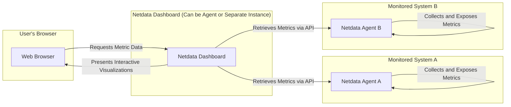
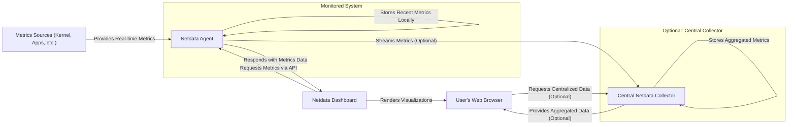
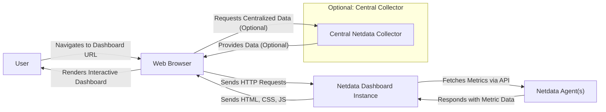

# Project Design Document: Netdata

**Version:** 1.1
**Date:** October 26, 2023
**Author:** AI Software Architect

## 1. Introduction

This document provides an enhanced design overview of the Netdata project, an open-source, real-time performance and health monitoring system designed for granular insights into systems and applications. This document is specifically crafted to serve as a robust foundation for subsequent threat modeling exercises. It comprehensively outlines the key components, data flows, user interactions, and deployment models inherent in Netdata's architecture.

## 2. Goals and Objectives

The fundamental goals driving the Netdata project are:

* **Granular Real-time Insights:** To deliver highly detailed, up-to-the-second visibility into system and application performance metrics.
* **Proactive Issue Identification:** To facilitate the early detection and efficient troubleshooting of performance bottlenecks and health issues.
* **Intuitive Visual Monitoring:** To offer a user-friendly and visually rich dashboard experience for effective monitoring.
* **Lightweight and Deployable:** To ensure ease of deployment and minimal resource footprint across a diverse range of systems.
* **Extensibility and Integration:** To provide a flexible platform that can be extended through plugins and integrated with other systems.

## 3. High-Level Architecture

Netdata employs a distributed agent-based architecture, where lightweight agents run on monitored nodes, feeding data to a web-based dashboard for visualization. The dashboard can be served by an agent itself or a dedicated instance.

Key architectural elements include:

* **Netdata Agent:** A lightweight process deployed on each monitored system responsible for data collection and exposure.
* **Netdata Dashboard:** A web application providing a graphical interface for visualizing collected metrics. It can be co-located with an agent or deployed separately.
* **Decentralized Metrics Collection:** Agents independently gather data from diverse sources without relying on a central collector (by default).
* **Local Data Storage:** Agents primarily store recent metrics in memory, offering high-performance access for real-time visualization. Persistent storage options exist for longer-term data retention.
* **API-Driven Data Access:** The dashboard interacts with agents via their built-in API to retrieve and display metric data.

## 4. Detailed Component Design

### 4.1. Netdata Agent

* **Purpose:** The fundamental building block of Netdata, responsible for collecting, processing, and exposing real-time metrics from the host system.
* **Functionality:**
    * **Modular Metrics Collection:** Employs a plugin-based architecture (collectors) to gather data from various sources (system resources, applications, hardware sensors, etc.).
    * **Efficient Data Processing:** Performs in-memory processing and aggregation of metrics to minimize overhead.
    * **Local Time-Series Database:**  Includes an embedded, high-performance time-series database (typically in memory) for storing recent metrics.
    * **Built-in Web Server & API:**  Exposes an HTTP API for the dashboard and other clients to query metrics.
    * **Comprehensive Configuration:** Highly configurable via YAML files, allowing users to specify data collection intervals, enabled collectors, and other settings.
    * **Dynamic Plugin Management:**  Can load and unload collector plugins without requiring a restart.
    * **Metrics Streaming (Optional):** Supports streaming metrics to other Netdata instances, central collectors (like Netdata Cloud), or external time-series databases (e.g., Prometheus, Graphite).
* **Inputs:**
    * System calls and kernel statistics (via `/proc`, `/sys`, etc.).
    * Data from application-specific interfaces (e.g., Prometheus exporters, JMX).
    * Configuration files (`netdata.conf`, collector-specific configurations).
    * Collector plugin code (written in various languages, often Python or Go).
* **Outputs:**
    * Real-time metrics data (via the agent's API, typically `/api/v1/data`).
    * Health check status and alerts (via the API).
    * Logs and diagnostic information.
    * Streamed metrics (if configured).
* **Security Considerations:**
    * **API Access Control:**  The agent's API endpoint requires robust access control mechanisms to prevent unauthorized access to potentially sensitive performance data. Consider options like API keys or restricting access to localhost.
    * **Collector Plugin Security:**  Malicious or poorly written collector plugins pose a significant risk, potentially allowing arbitrary code execution or information disclosure. Plugin verification and sandboxing are crucial considerations.
    * **Data Confidentiality:** Metrics data can reveal sensitive information about system and application behavior. Secure storage and transmission of this data are important.
    * **Resource Exhaustion:**  Runaway or misconfigured collectors could consume excessive CPU, memory, or I/O resources, leading to denial of service. Resource limits for plugins should be considered.
    * **Exposure of Internal Information:** The agent's API might inadvertently expose internal system information if not carefully designed.

### 4.2. Netdata Dashboard

* **Purpose:** To provide a dynamic and interactive web-based interface for visualizing and analyzing the metrics collected by Netdata agents.
* **Functionality:**
    * **Real-time Data Fetching:**  Asynchronously queries Netdata agents' APIs to retrieve the latest metric data.
    * **Interactive Data Visualization:**  Renders dynamic charts, graphs, and other visualizations using JavaScript libraries.
    * **Customizable Dashboards:**  Allows users to create and customize dashboards to focus on specific metrics and systems.
    * **Alerting Visualization (Optional):** Displays active alerts and their status (often the alerting logic resides within the agent or a separate system).
    * **User Interface and Navigation:** Provides a user-friendly interface for navigating through different charts and exploring metrics.
    * **Configuration Options:**  May offer configuration options for dashboard appearance and behavior.
    * **Authentication/Authorization (Optional):**  Can implement user authentication and authorization to control access to the dashboard, especially in multi-user environments.
* **Inputs:**
    * User requests via web browsers (HTTP requests).
    * Metric data received from Netdata agents' APIs (JSON responses).
    * Configuration settings (e.g., dashboard layouts, user preferences).
* **Outputs:**
    * Dynamically rendered web pages displaying real-time metrics visualizations (HTML, CSS, JavaScript).
    * API responses (if the dashboard itself exposes an API for programmatic access).
* **Security Considerations:**
    * **Cross-Site Scripting (XSS):**  Vulnerable if user-supplied data or metric names are not properly sanitized before being displayed on the dashboard.
    * **Cross-Site Request Forgery (CSRF):**  Needs protection against malicious requests initiated from other websites targeting logged-in users.
    * **Authentication and Authorization:** If implemented, the authentication and authorization mechanisms must be robust to prevent unauthorized access to sensitive monitoring data. Consider using established security protocols and avoiding custom implementations where possible.
    * **Content Security Policy (CSP):**  Implementing a strong CSP can help mitigate XSS vulnerabilities.
    * **Secure Communication (HTTPS):**  Enforcing HTTPS for all communication between the browser and the dashboard is crucial to protect data in transit.
    * **Information Disclosure:** Ensure that the dashboard does not inadvertently expose sensitive information through error messages or debugging information.

### 4.3. Central Netdata Collector (Optional - e.g., Netdata Cloud)

* **Purpose:**  A centralized service (like Netdata Cloud) designed to aggregate, store, and provide a unified view of metrics from numerous Netdata agents.
* **Functionality:**
    * **Metrics Ingestion:**  Receives streamed metrics from multiple Netdata agents.
    * **Scalable Data Storage:**  Utilizes a robust time-series database infrastructure to store large volumes of aggregated metrics.
    * **Centralized Dashboarding:**  Offers a single pane of glass to visualize metrics from all connected agents.
    * **Centralized Alerting:**  Provides capabilities for defining and managing alerts across multiple monitored systems.
    * **User and Team Management:**  Manages user accounts, roles, and permissions for accessing the centralized platform.
    * **API for Data Access:**  Provides an API for programmatic access to aggregated metrics.
* **Inputs:**
    * Secure metric streams from Netdata agents (often using a token-based authentication).
    * User credentials and authentication requests.
    * API requests for metric data.
* **Outputs:**
    * Interactive dashboards displaying aggregated metrics from multiple sources.
    * Alert notifications via various channels (email, Slack, etc.).
    * API responses providing access to stored metrics.
* **Security Considerations:**
    * **Strong Authentication and Authorization:**  Critical for controlling access to the centralized platform and the aggregated metrics data. Multi-factor authentication should be considered.
    * **Data Security in Transit and at Rest:**  Encryption of metrics data during transmission (TLS/HTTPS) and storage is essential.
    * **API Security:**  The API used by agents to stream data and by users to access the dashboard needs to be secured using appropriate authentication and authorization mechanisms (e.g., API keys, OAuth 2.0). Rate limiting should be implemented to prevent abuse.
    * **Multi-tenancy Security:**  If the platform supports multiple tenants, robust isolation mechanisms are crucial to prevent data leakage or unauthorized access between tenants.
    * **Data Retention Policies:**  Clear policies for data retention and secure deletion should be in place.

## 5. Data Flow

The primary data flow involves agents collecting metrics and the dashboard retrieving and visualizing them. Centralized deployments introduce an additional streaming step.

Detailed data flow scenarios:

* **Standalone Agent & Dashboard:**
    1. **Metrics Collection:** The Netdata agent gathers metrics from various sources.
    2. **Local Storage:** The agent stores recent metrics in its local time-series database.
    3. **Dashboard Request:** A user accesses the Netdata dashboard served by the agent.
    4. **API Query:** The dashboard sends API requests to the local agent to retrieve metrics.
    5. **Data Retrieval:** The agent responds with the requested metric data.
    6. **Visualization:** The dashboard renders the metrics in the user's browser.

* **Centralized Collector (e.g., Netdata Cloud):**
    1. **Metrics Collection (as above).**
    2. **Metrics Streaming:** The agent streams collected metrics to the central collector over a secure connection.
    3. **Central Storage:** The central collector stores the received metrics in its database.
    4. **Dashboard Request:** A user accesses the central Netdata dashboard.
    5. **Data Retrieval:** The central dashboard queries its database for the requested metrics.
    6. **Visualization:** The central dashboard renders the metrics for the user.

## 6. User Interaction

Users primarily interact with Netdata through the web dashboard to monitor system and application performance.

Common user interactions:

* **Accessing the Dashboard:** Users open the Netdata dashboard URL in their web browser.
* **Viewing Real-time Metrics:** Users browse through charts and graphs to monitor performance metrics in real-time.
* **Customizing Views:** Users may be able to customize dashboards, select specific metrics, and adjust visualization parameters.
* **Investigating Issues:** Users analyze metric trends and anomalies to identify and troubleshoot performance problems.
* **Configuring Alerts (depending on the setup):** Users may configure alert thresholds and notification channels through the dashboard or a separate interface.

## 7. Security Considerations (Detailed)

This section expands on the initial security considerations, providing a more in-depth view for threat modeling.

* **Authentication and Authorization:**
    * **Agent API:** Implementing authentication (e.g., API keys, mutual TLS) to control access to the agent's API is crucial. Consider restricting access to localhost by default.
    * **Dashboard Access:** Employing robust authentication mechanisms (e.g., username/password with strong hashing, OAuth 2.0) for dashboard access, especially in shared environments. Role-based access control (RBAC) should be considered to manage user permissions.
    * **Central Collector:** Strong authentication and authorization are paramount for accessing the central collector and the aggregated data. Multi-factor authentication (MFA) should be enforced.

* **Data Security:**
    * **Encryption in Transit:** Enforce HTTPS (TLS) for all communication between browsers, dashboards, agents, and central collectors to protect data confidentiality and integrity.
    * **Encryption at Rest (Central Collector):** Encrypt sensitive metric data stored in the central collector's database.
    * **Agent Data Storage:** Consider the security implications of storing metrics data on the agent's local disk. Implement appropriate file system permissions.

* **Input Validation and Output Encoding:**
    * **Dashboard:** Thoroughly validate and sanitize all user inputs to prevent XSS and other injection attacks. Employ proper output encoding techniques when rendering dynamic content.
    * **Agent API:** Validate inputs to the agent's API to prevent potential vulnerabilities.

* **Secure Communication Protocols:**
    * **HTTPS Enforcement:** Ensure that all web communication utilizes HTTPS. Configure HTTP Strict Transport Security (HSTS) to prevent downgrade attacks.
    * **TLS Configuration:** Use strong TLS configurations with up-to-date cipher suites and disable insecure protocols.

* **Plugin Security:**
    * **Code Review and Auditing:** Implement a process for reviewing and auditing collector plugin code to identify potential vulnerabilities.
    * **Sandboxing:** Explore techniques for sandboxing collector plugins to limit their access to system resources and prevent them from compromising the host system.
    * **Plugin Signing:** Consider signing plugins to ensure their integrity and authenticity.

* **Resource Management and DoS Prevention:**
    * **Rate Limiting:** Implement rate limiting on API endpoints to prevent denial-of-service attacks.
    * **Resource Limits:** Configure resource limits for collector plugins to prevent them from consuming excessive system resources.

* **Software Updates and Patch Management:**
    * Establish a process for regularly updating Netdata components to patch known vulnerabilities.

* **Default Credentials:**
    * Avoid using default or weak credentials for any Netdata components.

## 8. Deployment Model

Netdata's flexible architecture supports various deployment models:

* **Standalone Agent with Embedded Dashboard:** The simplest model, ideal for individual servers. The agent collects metrics and serves the dashboard.
* **Dedicated Dashboard Instance:** A separate Netdata instance acts as a central dashboard, connecting to multiple agents. This provides a consolidated view.
* **Netdata Cloud (Centralized SaaS):** Agents stream metrics to the Netdata Cloud platform for centralized storage, visualization, and alerting.
* **Containerized Deployments (Docker, Kubernetes):** Agents and dashboards can be deployed as containers, facilitating scalability and management in containerized environments.

## 9. Technology Stack

Key technologies underpinning Netdata:

* **Core Agent:** Primarily written in C for performance and low resource consumption.
* **Embedded Web Server:**  Utilizes `libuv` and potentially other libraries for its embedded web server functionality.
* **Dashboard:** Developed using JavaScript frameworks and libraries (e.g., React, potentially others), HTML, and CSS.
* **Data Storage (Agent):**  Employs an in-memory time-series database (custom implementation or a lightweight embedded solution).
* **Communication Protocols:** Primarily HTTP/HTTPS for API communication.
* **Configuration:** Uses YAML for configuration files.
* **Plugin Development:** Supports plugin development in various languages, including Python, Go, and potentially others.

## 10. Future Considerations

Potential future enhancements and security considerations:

* **Enhanced Security Features:**  Further strengthening authentication, authorization, and data protection mechanisms. Exploring integration with security information and event management (SIEM) systems.
* **Improved Alerting and Anomaly Detection:**  Developing more sophisticated alerting rules and integrating machine learning for anomaly detection.
* **Deeper Integrations:** Expanding integrations with other monitoring, logging, and observability tools.
* **Enhanced User Interface and User Experience:** Continuously improving the usability and features of the web dashboard.
* **Cloud-Native Focus:**  Further optimizing Netdata for cloud-native environments and container orchestration platforms.

This improved design document provides a more detailed and security-focused overview of the Netdata project, better equipping it for thorough threat modeling activities. The enhanced component descriptions, refined data flow diagrams, and expanded security considerations offer a deeper understanding of the system's architecture and potential attack surfaces.