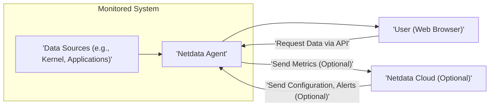
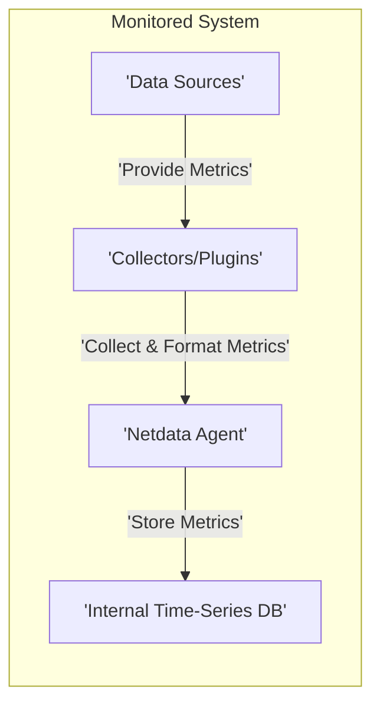
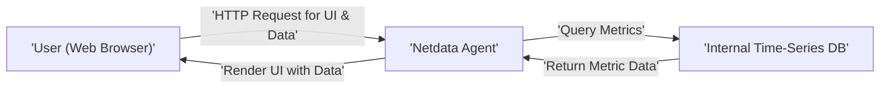
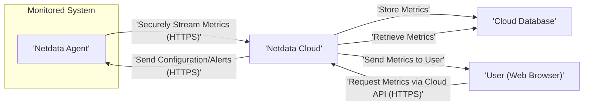

# Project Design Document: Netdata

**Version:** 1.1
**Date:** October 26, 2023
**Author:** AI Software Architect

## 1. Introduction

This document provides a detailed design overview of the Netdata monitoring system. It aims to describe the system's architecture, key components, data flow, and interactions. This document will serve as the foundation for subsequent threat modeling activities.

### 1.1. Purpose

The primary purpose of this document is to provide a comprehensive technical description of Netdata for security analysis and threat modeling. It outlines the system's structure and behavior to facilitate the identification of potential vulnerabilities and security risks. This document aims to be a single source of truth for understanding the system's design from a security perspective.

### 1.2. Scope

This document covers the core components of the Netdata system, including the Netdata Agent, its plugins and collectors, the optional Netdata Cloud, and the user interface. It focuses on the functional aspects relevant to security considerations, including data handling, communication protocols, and access control. Out-of-scope are specific implementation details within the collectors or the Netdata Cloud backend infrastructure.

### 1.3. Target Audience

This document is intended for security engineers, architects, developers, and anyone involved in the security assessment and threat modeling of the Netdata project. It assumes a basic understanding of software architecture and security principles.

## 2. System Overview

Netdata is a distributed, real-time performance and health monitoring system for systems and applications. It excels at collecting high-resolution metrics in real-time, visualizing them through an interactive web interface, and enabling alerting on anomalies and performance degradation. The core of Netdata is the agent, which runs on individual systems and autonomously collects data. Optionally, agents can connect to Netdata Cloud for centralized monitoring, management, and collaboration.

## 3. System Architecture

The Netdata architecture is designed for scalability and resilience, with a focus on local, autonomous operation while offering optional centralized capabilities.

### 3.1. High-Level Architecture Diagram

### 3.2. Component Description

*   **Netdata Agent:** The foundational component, deployed on each monitored host. Key responsibilities include:
    *   **Metric Collection:** Gathering granular metrics from diverse data sources using plugins and collectors.
    *   **Local Storage:** Storing collected metrics in an efficient, in-memory time-series database.
    *   **Web Interface Serving:** Hosting and serving the interactive web-based user interface for real-time visualization.
    *   **API Provision:** Providing a RESTful API for accessing collected metrics and agent status.
    *   **Optional Cloud Streaming:**  Transmitting metrics to Netdata Cloud for centralized aggregation and analysis.
    *   **Optional Cloud Configuration Reception:** Receiving configuration updates and alert definitions from Netdata Cloud.
*   **Data Sources:** The origins of the performance and health metrics. These can be:
    *   **Operating System Kernel:** Providing core system metrics like CPU usage, memory consumption, disk I/O, and network statistics.
    *   **Applications:** Exposing internal metrics through various mechanisms (e.g., Prometheus exporters, internal APIs, log files).
    *   **Hardware Sensors:** Providing data from hardware monitoring components.
    *   **External Plugins and Collectors:** Extending Netdata's capabilities to monitor specific applications or services.
*   **Netdata Cloud (Optional):** A centralized, cloud-hosted platform offering enhanced features:
    *   **Centralized Metric Aggregation:**  Aggregating and storing metrics from multiple Netdata Agents.
    *   **Global View and Dashboards:** Providing a unified view of the infrastructure's performance and health.
    *   **Remote Agent Management:** Enabling configuration and management of agents from a central location.
    *   **Centralized Alerting:** Defining and managing alerts across multiple monitored systems.
    *   **User Collaboration:** Facilitating team collaboration on monitoring and troubleshooting.
*   **User Interface:** A dynamic, client-side web application served by the Netdata Agent:
    *   **Real-time Visualization:** Displaying metrics in interactive charts and graphs.
    *   **Customizable Dashboards:** Allowing users to create personalized views of their monitoring data.
    *   **Alerting Interface:** Presenting active alerts and their status.
    *   **Agent Configuration (Limited):** Providing some local configuration options.

## 4. Data Flow

Understanding the movement of data within Netdata is critical for identifying potential security vulnerabilities.

### 4.1. Metric Collection

*   Data Sources generate raw performance and health metrics.
*   Collectors and Plugins, managed by the Netdata Agent, interact with these Data Sources using specific protocols or methods (e.g., reading `/proc` files, querying APIs).
*   Collectors format and normalize the raw data into a consistent metric format.
*   The Netdata Agent stores these processed metrics in its internal, in-memory time-series database.

### 4.2. Local User Access

*   A user accesses the Netdata Agent's web interface by navigating to the Agent's IP address and port (default: 19999) in their web browser.
*   The browser sends HTTP requests to the Netdata Agent for the user interface files (HTML, CSS, JavaScript) and for metric data via API calls.
*   The Netdata Agent receives these requests and queries its internal time-series database for the requested metrics.
*   The Agent then sends the metric data back to the browser, where the JavaScript application renders the visualizations.

### 4.3. Cloud Integration (Optional)

*   When configured, the Netdata Agent establishes a secure (HTTPS) connection to Netdata Cloud.
*   The Agent streams collected metrics to Netdata Cloud over this secure channel.
*   Netdata Cloud stores these metrics in its backend database infrastructure.
*   Users can access and visualize metrics from multiple agents by logging into the Netdata Cloud web interface. Their browsers communicate with Netdata Cloud via HTTPS.
*   Netdata Cloud can send configuration updates and alert definitions to connected agents, also over the secure HTTPS connection.

## 5. Key Components and Interactions

A deeper dive into the core components and their interactions reveals important aspects for security analysis.

*   **Netdata Agent Core:**
    *   **Process Management:** Manages the lifecycle and execution of collectors and plugins.
    *   **API Server:** Implements the RESTful API endpoints for data retrieval and agent control.
    *   **Web Server (Embedded):** Serves the static files for the user interface and handles API requests.
    *   **Data Streaming Client:**  Handles the secure transmission of metrics to Netdata Cloud.
    *   **Configuration Management:** Loads and applies configuration settings from local files and optionally from Netdata Cloud.
    *   **Alerting Engine:** Evaluates alert conditions based on collected metrics.
*   **Collectors and Plugins:**
    *   **Data Acquisition:** Interact directly with data sources using various methods (system calls, file reads, API calls, network requests).
    *   **Data Transformation:**  Normalize and format raw data into Netdata's metric format.
    *   **Resource Utilization:** Consume system resources (CPU, memory, I/O) during data collection.
    *   **Security Context:** Run with the privileges of the Netdata Agent process.
*   **Internal Time-Series Database (TSDB):**
    *   **In-Memory Storage:** Primarily stores metrics in RAM for high-speed access.
    *   **Ring Buffer Structure:**  Overwrites older data as new data arrives, maintaining a fixed-size window of recent metrics.
    *   **Optional Disk Persistence:** Can be configured to persist metrics to disk for longer retention.
*   **Web Server (Embedded):**
    *   **Static File Serving:** Delivers the HTML, CSS, JavaScript, and other assets for the user interface.
    *   **API Endpoint Handling:** Routes API requests to the appropriate handlers within the Netdata Agent core.
    *   **No Authentication by Default (Local Access):** Typically relies on the security of the host system for local access.
*   **Netdata Cloud Backend:**
    *   **Authentication and Authorization:** Manages user accounts and permissions for accessing cloud features.
    *   **Metric Ingestion and Storage:** Receives, processes, and stores metrics from connected agents in a scalable database.
    *   **API Gateway:** Provides a secure entry point for accessing cloud functionalities.
    *   **Agent Management Service:** Handles registration, configuration, and control of connected agents.
    *   **Alerting Service:** Processes and manages alerts defined in the cloud.
*   **Netdata Cloud Frontend:**
    *   **User Authentication:** Securely authenticates users accessing the cloud platform.
    *   **Data Visualization:** Renders interactive dashboards and charts using data retrieved from the backend.
    *   **Agent Management Interface:** Provides tools for managing connected agents.
    *   **Alert Configuration Interface:** Allows users to define and manage alert rules.

## 6. Security Considerations

This section expands on the initial security thoughts, providing more specific considerations for threat modeling.

*   **Netdata Agent Exposure and Access Control:**
    *   **Unauthenticated Local Access:** By default, the agent's web interface and API are accessible without authentication on the local host. This relies on the host's security.
    *   **Remote Access:** Enabling remote access to the agent's interface significantly increases the attack surface and requires careful consideration of authentication and authorization mechanisms.
    *   **API Security:** The API endpoints could be targeted for unauthorized data access or manipulation if not properly secured.
    *   **Cross-Site Scripting (XSS):** Vulnerabilities in the web interface could allow attackers to inject malicious scripts.
    *   **Cross-Site Request Forgery (CSRF):**  Lack of CSRF protection could allow attackers to perform actions on behalf of authenticated users.
*   **Data Security and Privacy:**
    *   **Sensitive Data in Metrics:** Collected metrics may contain sensitive information (e.g., application-specific data, internal network details).
    *   **Encryption in Transit:** Communication with Netdata Cloud must be encrypted (HTTPS) to protect data confidentiality and integrity.
    *   **Data at Rest (Optional Persistence):** If disk persistence is enabled, the stored metrics need to be protected against unauthorized access.
    *   **Data Retention Policies:**  Considerations for how long metrics are stored and how they are securely disposed of.
*   **Plugin and Collector Security:**
    *   **Malicious Plugins:**  The plugin architecture introduces the risk of malicious or poorly written plugins that could compromise the agent or the host system.
    *   **Resource Exhaustion:**  Faulty plugins could consume excessive resources, leading to denial-of-service.
    *   **Code Injection:** Vulnerabilities in plugin execution could allow for code injection.
    *   **Supply Chain Security:**  Ensuring the integrity and security of third-party plugins.
*   **Netdata Cloud Communication Security:**
    *   **Mutual Authentication:**  Verifying the identity of both the agent and the cloud service.
    *   **Secure Key Management:**  Protecting the keys used for authentication and encryption.
    *   **Man-in-the-Middle Attacks:**  Ensuring the communication channel cannot be intercepted and manipulated.
*   **Configuration Security:**
    *   **Sensitive Information in Configuration:** Configuration files may contain sensitive information (e.g., API keys, credentials).
    *   **Unauthorized Configuration Changes:**  Protecting configuration files from unauthorized modification.
    *   **Secure Distribution of Configuration:**  Ensuring secure delivery of configuration updates from Netdata Cloud.
*   **Software Supply Chain Security:**
    *   **Dependency Vulnerabilities:**  Regularly scanning and updating dependencies to address known vulnerabilities.
    *   **Code Signing:**  Verifying the integrity and authenticity of the Netdata software.

## 7. Deployment Considerations

Deployment choices impact the security posture of Netdata.

*   **Agent Deployment Models:**
    *   **Bare Metal/Virtual Machines:** Requires careful management of host security.
    *   **Containers (Docker, Kubernetes):**  Leverages container security features for isolation.
    *   **Orchestration Platforms:** Integration with orchestration platforms can introduce new security considerations.
*   **Network Segmentation:** Isolating monitored systems and the Netdata Agents within secure network segments.
*   **Firewall Configuration:** Restricting access to the agent's web interface and API based on the deployment requirements.
*   **Secure Defaults:**  Ensuring that default configurations are secure and minimize the attack surface.

## 8. Future Considerations

Anticipating future developments helps in proactively addressing potential security implications.

*   **Enhanced Authentication and Authorization:** Implementing more robust authentication and authorization mechanisms for local agent access.
*   **Improved Plugin Sandboxing:**  Strengthening the isolation of plugins to limit the impact of potential vulnerabilities.
*   **Advanced Data Encryption Options:** Providing more granular control over data encryption at rest and in transit.
*   **Integration with Security Information and Event Management (SIEM) Systems:**  Enabling the forwarding of security-relevant events to centralized security monitoring platforms.
*   **Support for Security Auditing and Logging:**  Providing comprehensive audit logs for security-related actions within the Netdata Agent.

This document provides a comprehensive design overview of the Netdata system, focusing on aspects relevant to security. This information will be crucial for conducting thorough threat modeling and implementing appropriate security measures.