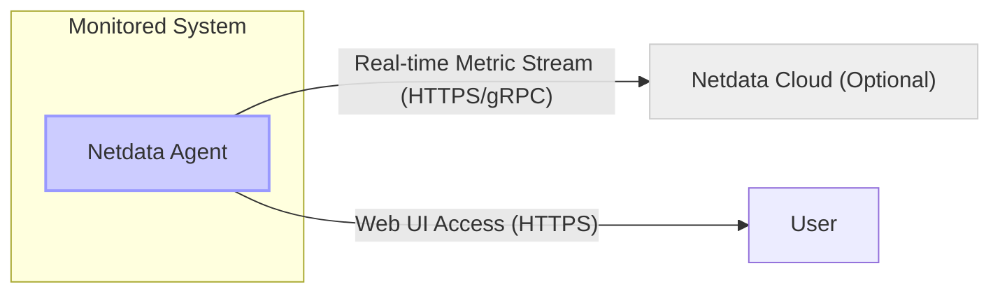
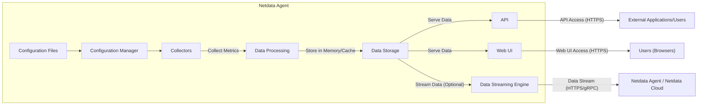

# Project Design Document: Netdata

**Project Name:** Netdata Real-time Performance Monitoring

**Project Repository:** [https://github.com/netdata/netdata](https://github.com/netdata/netdata)

**Document Version:** 1.1
**Date:** 2023-10-27
**Author:** AI Cloud & Security Architect

## 1. Introduction

This document provides a detailed design overview of the Netdata project, a real-time performance monitoring system. This document is intended to serve as a foundation for threat modeling and security analysis of the Netdata platform. It outlines the system's architecture, components, data flow, and key technologies. This document will be used to identify potential security vulnerabilities and design appropriate mitigations. It is targeted towards security engineers, developers, and operations teams involved in deploying and managing Netdata.

## 2. Project Overview

Netdata is a highly performant, open-source, real-time performance and health monitoring system for systems and applications. It collects thousands of metrics per second from systems, hardware, containers, and applications with zero configuration. Netdata is designed to be lightweight, installable on virtually any system, and provide granular, real-time insights into system behavior.  Netdata aims to be a comprehensive monitoring solution suitable for individual servers, containerized environments, and large-scale infrastructure.

**Target Users:**

*   System Administrators
*   DevOps Engineers
*   Developers
*   Security Engineers
*   SREs (Site Reliability Engineers)

**Key Use Cases:**

*   Real-time system performance monitoring and troubleshooting.
*   Application performance monitoring.
*   Capacity planning and resource optimization.
*   Anomaly detection and alerting.
*   Security monitoring (observing system behavior for potential threats).
*   Embedded systems and IoT device monitoring.

**Key Features:**

*   **Real-time Monitoring:** Provides second-by-second data collection and visualization, ensuring immediate insights into system changes.
*   **Comprehensive Metrics:** Collects a wide range of system and application metrics, including CPU, memory, disk I/O, network, processes, and application-specific data.
*   **Low Overhead:** Designed for minimal resource consumption, suitable for production environments without significant performance impact.
*   **Extensible:** Supports plugins and collectors for various data sources, allowing monitoring of diverse technologies and applications.
*   **Web-based UI:** Offers a rich, interactive dashboard accessible via web browsers for intuitive data visualization and exploration.
*   **Alerting:** Provides sophisticated alerting capabilities based on metric thresholds and anomaly detection, enabling proactive issue resolution.
*   **Distributed Architecture:** Supports standalone agents, parent-child agent setups, and integration with a cloud-based central monitoring solution for scalability and centralized management.
*   **Configuration-less Operation:**  Designed to work out-of-the-box with minimal to zero configuration for most common use cases.

## 3. System Architecture

Netdata employs a distributed architecture consisting primarily of **Netdata Agents** and optionally **Netdata Cloud**. Agents are designed to be autonomous and function independently, while Netdata Cloud provides centralized aggregation and management capabilities.

**3.1. High-Level Architecture Diagram**

**3.2. Component Breakdown**

The Netdata system can be broken down into the following key components:

*   **3.2.1. Netdata Agent:**
    *   This is the core component of Netdata, deployed on each system to be monitored. It is designed to be self-contained and highly efficient.
    *   **Functionality:**
        *   **Configuration Loading:** Reads configuration from files (e.g., `netdata.conf`, collector configurations) to define data collection, alerting, and other agent behaviors.
        *   **Data Collection:** Collects metrics from various sources (system kernel, applications, hardware sensors, etc.) using modular collectors. Collectors are dynamically loaded and executed.
        *   **Data Processing:** Processes, aggregates, and potentially transforms collected metrics. This includes calculations, normalization, and data reduction.
        *   **Data Storage (In-Memory & Disk Caching):** Stores recent metrics in memory for ultra-fast real-time access and visualization. Optionally utilizes disk-based caching (using memory-mapped files - `mmap`) for longer data retention and persistence across agent restarts.
        *   **Embedded Web Server:** Embeds a lightweight web server (e.g., `libmicrohttpd`) to serve the real-time dashboard (Web UI), API endpoints, and static assets.
        *   **API:** Provides a RESTful HTTP API for programmatic access to collected metrics, agent configuration, and health status.
        *   **Data Streaming (Optional):** Can stream metrics in real-time to parent Netdata Agents (for hierarchical setups) or to Netdata Cloud using protocols like HTTPS or gRPC.
        *   **Alerting Engine:** Evaluates alert configurations against collected metrics based on defined thresholds and conditions. Triggers notifications via various channels (e.g., email, webhooks, notification services).
    *   **Sub-components:**
        *   **Collectors:** Dynamically loaded modules written in C, Python, Go, and other languages. Each collector is responsible for gathering data from a specific source (e.g., `cpu`, `memory`, `disk`, `nginx`, `mysql`). Collectors are configured via separate configuration files.
        *   **Web UI:**  A single-page application (SPA) written in JavaScript, HTML, and CSS, providing the real-time dashboard. It interacts with the Agent's API to fetch and visualize metrics.
        *   **Embedded Web Server:**  A lightweight web server (`libmicrohttpd`) handling HTTP requests for the Web UI, API, and data streaming.
        *   **Alerting Engine:**  A rule-based engine that processes alert configurations defined in configuration files and evaluates conditions against real-time metrics.
        *   **Data Streaming Engine:**  Manages the streaming of metrics to configured destinations (parent agents or Netdata Cloud), handling data serialization and transmission protocols.
        *   **Configuration Manager:**  Parses and manages agent configuration from files, providing configuration parameters to other components.
        *   **Data Storage Engine:** Manages in-memory and disk-based storage of metrics, optimizing for real-time read and write performance.

*   **3.2.2. Netdata Cloud (Optional):**
    *   A centralized, cloud-hosted platform for managing, visualizing, and analyzing data from multiple Netdata Agents. It provides a unified monitoring experience across distributed infrastructure.
    *   **Functionality:**
        *   **Centralized Dashboard:** Provides a unified, customizable dashboard view of metrics aggregated from multiple connected agents. Allows users to monitor the health and performance of their entire infrastructure from a single pane of glass.
        *   **Data Aggregation and Storage:** Receives, aggregates, and stores metrics streamed from connected agents in a scalable time-series database. Provides long-term data retention and historical analysis capabilities.
        *   **User Management and Authentication:** Manages user accounts, roles, and permissions for accessing the Netdata Cloud platform. Implements authentication and authorization mechanisms to secure access.
        *   **Alert Management:** Centralized alert configuration and management across all connected agents. Allows users to define alerts in Netdata Cloud and apply them to groups of agents.
        *   **Long-Term Data Storage & Historical Analysis:** Provides significantly longer retention of historical metrics compared to individual agents, enabling trend analysis, capacity planning, and historical troubleshooting.
        *   **Collaboration Features:** Enables sharing dashboards, alerts, and monitoring data with teams, facilitating collaboration and incident response.
        *   **Machine Learning & Anomaly Detection (Advanced Features):** May incorporate machine learning algorithms for advanced anomaly detection and predictive analytics on aggregated metrics.
    *   **Components (Conceptual - Cloud Infrastructure):**
        *   **Load Balancers:** Distribute incoming data streams from Netdata Agents across ingestion service instances for scalability and high availability.
        *   **Ingestion Service:** A scalable service responsible for receiving, validating, and processing data streams from Netdata Agents. May utilize message queues for buffering and asynchronous processing.
        *   **Message Queue (e.g., Kafka, RabbitMQ):**  Buffers incoming metric data, ensuring reliable data ingestion and decoupling ingestion service from data storage.
        *   **Data Storage:** Scalable time-series database cluster (e.g., Prometheus, TimescaleDB, ClickHouse, or a custom solution optimized for time-series data) for storing aggregated metrics.
        *   **API Gateway:** Provides a secure and managed API endpoint for accessing data, managing users, and interacting with Netdata Cloud services. Handles authentication, authorization, and rate limiting.
        *   **Web Application:** Frontend application (SPA) for user interface, dashboard visualization, alert management, and platform administration.
        *   **Authentication and Authorization Service:**  Manages user authentication (e.g., using OAuth 2.0, OpenID Connect) and authorization, controlling access to Netdata Cloud resources and data.
        *   **Alerting Service:** Processes and manages alerts defined in Netdata Cloud, evaluating conditions against aggregated metrics and triggering notifications.
        *   **Notification Service:** Handles sending alerts via various channels (email, Slack, PagerDuty, etc.).

## 4. Data Flow

**4.1. Data Flow within a Netdata Agent**

**4.2. Data Flow with Netdata Cloud**

```mermaid
graph LR
    subgraph "Monitored System 1"
        A1["Netdata Agent 1"]
    end
    subgraph "Monitored System 2"
        A2["Netdata Agent 2"]
    end
    subgraph "Netdata Cloud"
        B["Load Balancer"] --> C["Ingestion Service"]
        C --> D["Message Queue"]
        D --> E["Data Storage"]
        E --> F["API Gateway"]
        F --> G["Web Application"]
        F --> H["Alerting Service"]
        H --> I["Notification Service"]
    end
    A1 -->|"Data Stream (HTTPS/gRPC)"| B
    A2 -->|"Data Stream (HTTPS/gRPC)"| B
    G -->|"Web UI Access (HTTPS)"| J["Users (Browsers)"]
    F -->|"API Access (HTTPS)"| K["External Applications/Users"]
    I -->|"Alert Notifications"| L["Notification Channels (Email, Slack, etc.)"]

    style A1 fill:#ccf,stroke:#99f,stroke-width:2px
    style A2 fill:#ccf,stroke:#99f,stroke-width:2px
    style B fill:#eee,stroke:#ccc,stroke-width:1px
    style C fill:#eee,stroke:#ccc,stroke-width:1px
    style D fill:#eee,stroke:#ccc,stroke-width:1px
    style E fill:#eee,stroke:#ccc,stroke-width:1px
    style F fill:#eee,stroke:#ccc,stroke-width:1px
    style G fill:#eee,stroke:#ccc,stroke-width:1px
    style H fill:#eee,stroke:#ccc,stroke-width:1px
    style I fill:#eee,stroke:#ccc,stroke-width:1px
```

## 5. Technology Stack

*   **Core Agent:**
    *   **Programming Languages:** C (primary - core agent, collectors), Python, Go (for collectors, utilities, and potentially newer collectors).
    *   **Web Server:** `libmicrohttpd` (embedded, lightweight HTTP server).
    *   **Data Storage:** In-memory (primary - circular buffers), optionally disk-based caching (memory-mapped files - `mmap`).
    *   **Web UI Framework:** JavaScript, HTML, CSS, potentially utilizing modern JavaScript frameworks/libraries for UI components and management. Specific framework usage may evolve across Netdata versions.
    *   **API:** RESTful HTTP API (JSON format for data exchange).
    *   **Inter-process Communication (IPC):**  Various mechanisms depending on collectors and plugins, including pipes, sockets, shared memory.
    *   **Configuration Language:**  Custom configuration file format (similar to INI files).

*   **Netdata Cloud:**
    *   **Backend Programming Languages:**  Likely Go (for performance-critical services), Python (for supporting services, scripting, and potentially some backend logic), or similar modern backend languages.
    *   **Message Queue:**  Managed message queue service (e.g., Kafka, RabbitMQ, cloud provider offerings like AWS SQS, GCP Pub/Sub, Azure Service Bus).
    *   **Database:** Time-series database cluster. Examples include:
        *   **Open Source:** Prometheus, TimescaleDB, ClickHouse, InfluxDB.
        *   **Cloud Provider Managed:** AWS Timestream, GCP Cloud Monitoring, Azure Monitor.
        *   The specific database choice may depend on scalability requirements, cost considerations, and managed service preferences.
    *   **Frontend Framework:** Modern JavaScript framework (e.g., React, Angular, Vue.js) for a rich and interactive user experience.
    *   **API:** RESTful HTTP API (JSON) for communication between frontend, backend services, and external integrations.
    *   **Authentication and Authorization:**  OAuth 2.0, OpenID Connect, or similar industry-standard authentication and authorization protocols.
    *   **Cloud Infrastructure:**  Major cloud providers (AWS, GCP, Azure) or potentially a hybrid/private cloud setup, leveraging cloud services like compute instances, managed databases, load balancers, and networking infrastructure.

## 6. Deployment Model

Netdata Agents are designed for flexible deployment across various environments.

*   **Standalone Agent:**  The most common deployment. Agent installed directly on a physical server, virtual machine (VM), container, or embedded device.  Data is primarily visualized locally via the agent's embedded Web UI. Suitable for monitoring individual systems.
*   **Parent-Child Agent Setup (Hierarchical Monitoring):** Agents can be configured in a parent-child hierarchy. Child agents stream aggregated metrics to a designated parent agent. The parent agent then aggregates and visualizes data from multiple child agents. Useful for monitoring network segments, clusters, or geographically distributed systems.
*   **Agent Streaming to Netdata Cloud (Centralized Monitoring):** Agents are configured to stream metrics to the centralized Netdata Cloud platform. Provides a unified view of metrics from all connected agents, long-term data storage, and centralized management capabilities. Ideal for large-scale infrastructure monitoring and team collaboration.
*   **Containerized Agent Deployment:** Agents are deployed as Docker containers or other container runtime environments. Can monitor the host system and/or other containers running on the same host. Well-suited for containerized application monitoring and microservices architectures.
*   **Embedded Agent Deployment:** Netdata's lightweight footprint makes it suitable for embedding in various devices and systems with limited resources, including IoT devices, network appliances, and edge computing devices. Enables real-time monitoring of resource-constrained environments.
*   **Agent Deployment via Configuration Management:** Agents can be deployed and managed at scale using configuration management tools like Ansible, Puppet, Chef, or SaltStack, ensuring consistent configuration and automated deployments across large infrastructures.

## 7. Security Considerations (Detailed)

This section expands on the initial security considerations, providing more specific examples and potential threats. A comprehensive threat model will be developed in a separate document based on this design document.

*   **7.1. Agent Security:**
    *   **Data Confidentiality and Integrity:**
        *   **Threat:** Exposure of sensitive metrics data (e.g., application secrets in memory dumps, database query patterns, user activity) if access control is weak or data is transmitted insecurely. Data tampering leading to inaccurate monitoring and potentially masking security incidents.
        *   **Mitigation:** Implement strong access control to the Agent's Web UI and API (e.g., authentication, authorization, listening only on localhost by default). Use HTTPS for Web UI and API access. Encrypt data streams if streaming to parent agents or Netdata Cloud (HTTPS/gRPC). Consider data masking or sanitization for sensitive metrics if necessary.
    *   **Access Control to Agent UI and API:**
        *   **Threat:** Unauthorized access to the Agent's Web UI and API, allowing attackers to view sensitive system metrics, potentially gain insights into vulnerabilities, or even manipulate agent configuration if API access is not properly secured.
        *   **Mitigation:** Implement authentication for Web UI and API access (e.g., username/password, API keys). Implement authorization to control access based on user roles or permissions. Configure the agent to listen on localhost by default and use a reverse proxy (e.g., Nginx, Apache) for external access with proper security configurations.
    *   **Collector Security:**
        *   **Threat:** Malicious or vulnerable collectors could be exploited to gain unauthorized access to the monitored system, execute arbitrary code, or cause denial of service. Input validation vulnerabilities in collectors could be exploited.
        *   **Mitigation:** Implement input validation and sanitization within collectors to prevent injection attacks. Regularly review and audit collector code for security vulnerabilities. Implement sandboxing or isolation for collectors to limit the impact of potential vulnerabilities. Use signed collectors from trusted sources if available.
    *   **Agent Software Vulnerabilities:**
        *   **Threat:** Exploitation of vulnerabilities in the Netdata Agent software itself (e.g., buffer overflows, memory corruption, remote code execution).
        *   **Mitigation:** Regularly update Netdata Agents to the latest versions to patch known vulnerabilities. Implement vulnerability scanning and penetration testing of Netdata Agent deployments. Follow secure coding practices during agent development.
    *   **Resource Exhaustion (DoS):**
        *   **Threat:** Denial-of-service attacks targeting the agent's resource consumption (CPU, memory, disk I/O) could impact system performance and availability.
        *   **Mitigation:** Implement rate limiting for API requests. Configure resource limits for the Netdata Agent process. Monitor agent resource consumption and set up alerts for abnormal behavior.
    *   **Local Privilege Escalation:**
        *   **Threat:** Vulnerabilities in the agent installation process, file permissions, or agent code could be exploited for local privilege escalation on the monitored system.
        *   **Mitigation:** Follow least privilege principles during agent installation and operation. Regularly audit file permissions and agent configurations. Avoid running the agent with unnecessary elevated privileges.
    *   **Input Validation:**
        *   **Threat:** Lack of proper input validation in various agent components (collectors, API endpoints, configuration parsing) could lead to injection attacks (e.g., command injection, SQL injection if collectors interact with databases), buffer overflows, or other vulnerabilities.
        *   **Mitigation:** Implement robust input validation and sanitization for all external inputs and data processed by the agent. Use secure coding practices to prevent injection vulnerabilities.

*   **7.2. Netdata Cloud Security:**
    *   **Data Security in Transit and at Rest:**
        *   **Threat:** Data interception during transmission between agents and Netdata Cloud. Data breaches exposing stored metrics data in the cloud.
        *   **Mitigation:** Enforce HTTPS/TLS for all communication between agents and Netdata Cloud. Encrypt data at rest in the cloud storage using strong encryption algorithms. Implement robust key management practices.
    *   **Authentication and Authorization:**
        *   **Threat:** Unauthorized access to Netdata Cloud platform, allowing attackers to view monitoring data, modify configurations, or potentially disrupt monitoring services.
        *   **Mitigation:** Implement strong authentication mechanisms (e.g., multi-factor authentication, strong password policies). Implement role-based access control (RBAC) to restrict access based on user roles and permissions. Regularly review and audit user access.
    *   **Cloud Infrastructure Security:**
        *   **Threat:** Security vulnerabilities in the underlying cloud infrastructure (AWS, GCP, Azure) or misconfigurations leading to data breaches or service disruptions.
        *   **Mitigation:** Follow cloud provider security best practices. Implement security hardening of cloud infrastructure components. Regularly audit cloud configurations and security settings. Utilize cloud provider security services (e.g., security groups, firewalls, intrusion detection).
    *   **Data Privacy and Compliance:**
        *   **Threat:** Violation of data privacy regulations (e.g., GDPR, CCPA) if sensitive personal data is collected or processed without proper consent or security measures.
        *   **Mitigation:** Implement data minimization principles, collecting only necessary metrics. Anonymize or pseudonymize sensitive data where possible. Implement data retention policies compliant with regulations. Provide users with control over their data and data processing. Ensure compliance with relevant privacy regulations.
    *   **Multi-tenancy Security (if applicable):**
        *   **Threat:** Data leakage or cross-tenant attacks in a multi-tenant Netdata Cloud environment if tenant isolation is not properly implemented.
        *   **Mitigation:** Implement strong tenant isolation at all layers (network, compute, storage, application). Regularly audit tenant isolation mechanisms. Perform penetration testing to verify tenant isolation.
    *   **API Security:**
        *   **Threat:** Exploitation of vulnerabilities in the Netdata Cloud API (e.g., injection attacks, broken authentication, rate limiting bypass, data exposure).
        *   **Mitigation:** Follow secure API development practices (OWASP API Security Top 10). Implement input validation, output encoding, and proper error handling. Implement authentication and authorization for all API endpoints. Implement rate limiting and API request throttling to prevent abuse. Regularly audit and penetration test the API.
    *   **DDoS Protection:**
        *   **Threat:** Distributed Denial of Service (DDoS) attacks targeting Netdata Cloud infrastructure, potentially disrupting monitoring services and impacting availability.
        *   **Mitigation:** Implement DDoS mitigation measures at the network and application layers (e.g., using cloud provider DDoS protection services, rate limiting, traffic filtering).

*   **7.3. Communication Security:**
    *   **Agent to Agent/Cloud Communication:**
        *   **Threat:** Man-in-the-middle attacks intercepting data streams between agents or between agents and Netdata Cloud if communication is not encrypted.
        *   **Mitigation:** Enforce HTTPS/TLS for all communication channels. Use gRPC with TLS for data streaming where applicable. Implement certificate management for secure communication.
    *   **Web UI Access Security:**
        *   **Threat:** Session hijacking, credential theft, or cross-site scripting (XSS) attacks if Web UI access is not secured with HTTPS.
        *   **Mitigation:** Enforce HTTPS for all Web UI access. Implement secure session management practices. Implement protection against XSS vulnerabilities in the Web UI code. Set secure HTTP headers (e.g., HSTS, X-Frame-Options, Content-Security-Policy).

This detailed design document provides a more comprehensive understanding of the Netdata project and its security considerations. This will be crucial for developing a robust threat model and implementing appropriate security controls to protect the Netdata platform and the systems it monitors. Further threat modeling exercises should be conducted to identify and prioritize specific threats and vulnerabilities based on this design.