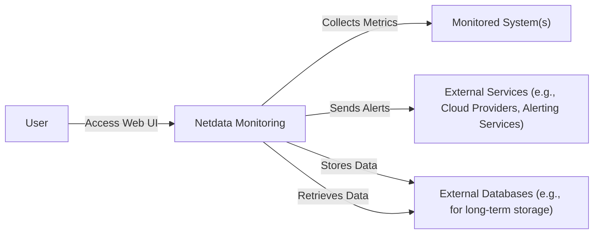
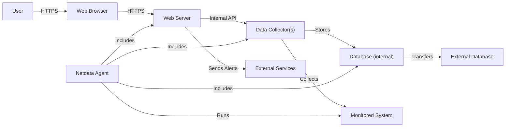
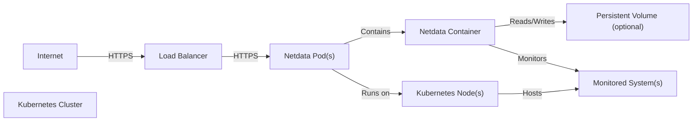
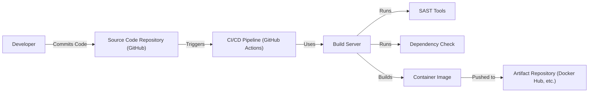

# BUSINESS POSTURE

Business Priorities and Goals:

*   Provide real-time, high-fidelity system, application, and service monitoring.
*   Offer an intuitive and interactive user interface for visualizing and analyzing performance data.
*   Be easily deployable and require minimal configuration.
*   Support a wide range of systems and applications out-of-the-box.
*   Be open-source and community-driven.
*   Minimize resource consumption (CPU, memory, disk I/O).
*   Provide a distributed architecture for scalability and high availability.

Most Important Business Risks:

*   Data breaches or unauthorized access to sensitive system and application metrics.
*   Denial-of-service attacks impacting the availability of the monitoring service.
*   Injection attacks exploiting vulnerabilities in the web interface or data processing pipeline.
*   Compromise of the Netdata agent leading to unauthorized control over monitored systems.
*   Supply chain attacks targeting the Netdata build and distribution process.
*   Reputational damage due to security incidents or data privacy violations.

# SECURITY POSTURE

Existing Security Controls:

*   security control: Role-Based Access Control (RBAC) for web dashboard access (configurable).
*   security control: Data encryption in transit using TLS (configurable).
*   security control: Regular security audits and penetration testing (mentioned on website and in community discussions).
*   security control: Secure communication between parent and child nodes using TLS (configurable).
*   security control: Support for external authentication providers (e.g., through reverse proxies).
*   security control: Built-in web server with limited functionality to reduce attack surface.
*   security control: Use of memory-safe languages (primarily C, with some components in other languages).
*   security control: Community involvement in identifying and reporting security vulnerabilities.

Accepted Risks:

*   accepted risk: Default configuration may not be fully secure (requires user configuration for optimal security).
*   accepted risk: Reliance on third-party libraries and dependencies (potential for supply chain vulnerabilities).
*   accepted risk: Potential for vulnerabilities in custom plugins and integrations.
*   accepted risk: Exposure of monitoring data to users with network access to the Netdata web interface (mitigated by RBAC and TLS).

Recommended Security Controls:

*   security control: Implement mandatory authentication for all web dashboard access, even for read-only views.
*   security control: Enforce strong password policies and multi-factor authentication (MFA).
*   security control: Provide detailed security hardening guides and best practices documentation.
*   security control: Implement regular vulnerability scanning and automated security testing in the CI/CD pipeline.
*   security control: Introduce a Software Bill of Materials (SBOM) for all releases to improve supply chain security.
*   security control: Implement Content Security Policy (CSP) and other web security headers to mitigate XSS and other web-based attacks.
*   security control: Provide options for data encryption at rest.
*   security control: Implement anomaly detection and alerting for suspicious activity.

Security Requirements:

*   Authentication:
    *   All users accessing the web dashboard must be authenticated.
    *   Support for strong authentication mechanisms, including MFA.
    *   Integration with existing identity providers (e.g., LDAP, Active Directory, OAuth 2.0).
*   Authorization:
    *   Fine-grained access control to restrict access to specific metrics and features based on user roles.
    *   Ability to define custom roles and permissions.
*   Input Validation:
    *   All user inputs, including those from plugins and external sources, must be validated and sanitized to prevent injection attacks.
    *   Strict validation of data types and formats.
*   Cryptography:
    *   Use of strong, industry-standard cryptographic algorithms for data encryption in transit and at rest (where applicable).
    *   Secure key management practices.
    *   Regular review and update of cryptographic libraries and configurations.

# DESIGN

## C4 CONTEXT

Element Descriptions:

*   Element:
    *   Name: User
    *   Type: Person
    *   Description: A person who interacts with the Netdata monitoring system through the web dashboard.
    *   Responsibilities: View real-time and historical metrics, configure alerts, manage Netdata settings.
    *   Security controls: Authentication, Authorization (RBAC).

*   Element:
    *   Name: Netdata Monitoring
    *   Type: Software System
    *   Description: The Netdata monitoring system itself, including the agent, web server, and data storage.
    *   Responsibilities: Collect metrics, process data, provide web interface, send alerts, store data.
    *   Security controls: TLS encryption, input validation, secure communication protocols, access controls.

*   Element:
    *   Name: Monitored System(s)
    *   Type: Software System
    *   Description: The systems and applications being monitored by Netdata (e.g., servers, containers, databases, web servers).
    *   Responsibilities: Run applications, provide services, generate performance metrics.
    *   Security controls: System-level security controls (e.g., firewalls, intrusion detection systems), application-specific security measures.

*   Element:
    *   Name: External Services (e.g., Cloud Providers, Alerting Services)
    *   Type: Software System
    *   Description: External services that Netdata integrates with, such as cloud providers for infrastructure monitoring and alerting services for notifications.
    *   Responsibilities: Provide cloud infrastructure, send alerts and notifications.
    *   Security controls: API keys, authentication tokens, secure communication protocols.

*   Element:
    *   Name: External Databases (e.g., for long-term storage)
    *   Type: Software System
    *   Description: External databases used for long-term storage of Netdata metrics (optional).
    *   Responsibilities: Store historical performance data.
    *   Security controls: Database security controls (e.g., authentication, authorization, encryption), network security.

## C4 CONTAINER

Element Descriptions:

*   Element:
    *   Name: User
    *   Type: Person
    *   Description: A person interacting with the system.
    *   Responsibilities: Viewing dashboards, configuring settings.
    *   Security controls: Authentication, Authorization.

*   Element:
    *   Name: Web Browser
    *   Type: Software
    *   Description: Standard web browser.
    *   Responsibilities: Rendering the Netdata UI.
    *   Security controls: Browser security settings, TLS.

*   Element:
    *   Name: Netdata Agent
    *   Type: Application
    *   Description: The core Netdata agent process.
    *   Responsibilities: Orchestrates data collection, web server, and database.
    *   Security controls: Secure configuration, regular updates.

*   Element:
    *   Name: Web Server
    *   Type: Application
    *   Description: Built-in web server serving the Netdata dashboard.
    *   Responsibilities: Handling HTTP requests, serving static assets, providing API endpoints.
    *   Security controls: TLS encryption, access controls, input validation, web application firewall (optional).

*   Element:
    *   Name: Data Collector(s)
    *   Type: Application Component
    *   Description: Modules responsible for collecting metrics from various sources.
    *   Responsibilities: Collect data from system, applications, and services.
    *   Security controls: Input validation, secure communication with monitored resources.

*   Element:
    *   Name: Database (internal)
    *   Type: Database
    *   Description: Internal database for storing short-term, high-resolution metrics.
    *   Responsibilities: Store and retrieve recent performance data.
    *   Security controls: Access controls, data validation.

*   Element:
    *   Name: External Database
    *   Type: Database
    *   Description: Optional external database for long-term data storage.
    *   Responsibilities: Store historical data.
    *   Security controls: Database security controls, network security.

*   Element:
    *   Name: External Services
    *   Type: Software System
    *   Description: External services like alerting platforms.
    *   Responsibilities: Sending notifications.
    *   Security controls: API keys, secure communication.

*   Element:
    *   Name: Monitored System
    *   Type: Software System
    *   Description: The system being monitored.
    *   Responsibilities: Running applications and services.
    *   Security controls: System-level security.

## DEPLOYMENT

Possible Deployment Solutions:

1.  Bare-metal/VM installation (traditional package installation).
2.  Containerized deployment (Docker, Kubernetes).
3.  Cloud-specific deployments (e.g., using cloud provider's monitoring tools or marketplace images).

Chosen Solution (Containerized Deployment - Kubernetes):

Element Descriptions:

*   Element:
    *   Name: Internet
    *   Type: Network
    *   Description: The public internet.
    *   Responsibilities: Provides external access.
    *   Security controls: Firewall, intrusion detection/prevention systems.

*   Element:
    *   Name: Load Balancer
    *   Type: Network Appliance/Service
    *   Description: Distributes incoming traffic across multiple Netdata pods.
    *   Responsibilities: Load balancing, SSL termination (optional).
    *   Security controls: TLS configuration, access control lists.

*   Element:
    *   Name: Kubernetes Cluster
    *   Type: Container Orchestration Platform
    *   Description: Manages the deployment and scaling of Netdata pods.
    *   Responsibilities: Resource management, scheduling, service discovery.
    *   Security controls: Kubernetes RBAC, network policies, pod security policies.

*   Element:
    *   Name: Netdata Pod(s)
    *   Type: Kubernetes Pod
    *   Description: One or more instances of the Netdata agent running within the cluster.
    *   Responsibilities: Running the Netdata container.
    *   Security controls: Pod security context, resource limits.

*   Element:
    *   Name: Netdata Container
    *   Type: Container
    *   Description: The Netdata application running inside a container.
    *   Responsibilities: Collecting and serving metrics.
    *   Security controls: Container image security, minimal privileges.

*   Element:
    *   Name: Persistent Volume (optional)
    *   Type: Storage
    *   Description: Persistent storage for Netdata data (if long-term storage is desired within the cluster).
    *   Responsibilities: Data persistence.
    *   Security controls: Storage encryption, access controls.

*   Element:
    *   Name: Kubernetes Node(s)
    *   Type: Virtual Machine/Physical Server
    *   Description: The worker nodes in the Kubernetes cluster.
    *   Responsibilities: Running pods.
    *   Security controls: Node-level security hardening.

*   Element:
    *   Name: Monitored System(s)
    *   Type: Software System/Hardware
    *   Description: Systems and applications monitored by Netdata. Could be within the same Kubernetes cluster or external.
    *   Responsibilities: Running applications and services.
    *   Security controls: System and application-level security.

## BUILD

Build Process Description:

1.  Developers commit code changes to the source code repository (GitHub).
2.  The CI/CD pipeline (GitHub Actions) is triggered by code commits or pull requests.
3.  The build server within the CI/CD pipeline checks out the code.
4.  Static Application Security Testing (SAST) tools are executed to analyze the code for potential vulnerabilities.
5.  Dependency checks are performed to identify known vulnerabilities in third-party libraries.
6.  The Netdata application is built, and a container image is created.
7.  The container image is pushed to a container registry (e.g., Docker Hub).

Security Controls:

*   security control: Use of GitHub Actions for automated builds and testing.
*   security control: Integration of SAST tools (e.g., CodeQL, SonarQube) into the CI/CD pipeline.
*   security control: Dependency scanning to identify and mitigate vulnerabilities in third-party libraries (e.g., using Dependabot or similar tools).
*   security control: Use of signed commits and releases.
*   security control: Container image scanning for vulnerabilities before pushing to the registry.
*   security control: Regular updates to build tools and dependencies.

# RISK ASSESSMENT

Critical Business Processes:

*   Real-time system and application monitoring.
*   Alerting and notification for critical events.
*   Data visualization and analysis.

Data Sensitivity:

*   System metrics (CPU usage, memory usage, disk I/O, network traffic): Potentially sensitive, could reveal information about system configuration and workload.
*   Application metrics (request rates, error rates, response times): Potentially sensitive, could reveal information about application performance and usage patterns.
*   User data (usernames, IP addresses): Sensitive, requires protection under privacy regulations (e.g., GDPR).
*   Configuration data (API keys, passwords): Highly sensitive, requires strong protection.

# QUESTIONS & ASSUMPTIONS

Questions:

*   What are the specific compliance requirements (e.g., GDPR, HIPAA, PCI DSS) that apply to the Netdata deployment?
*   What is the expected scale of the deployment (number of monitored systems, data volume, user concurrency)?
*   What are the existing security policies and procedures within the organization?
*   What is the level of access granted to different user roles?
*   Are there any specific threat models or attack scenarios that are of particular concern?
*   What external services are integrated with Netdata, and what are the security implications of these integrations?
*   What is the process for handling security incidents and vulnerabilities?
*   How is long-term data retention and archiving handled?
*   What are the specific requirements for data encryption at rest?

Assumptions:

*   BUSINESS POSTURE: The organization prioritizes the availability and reliability of the monitoring system.
*   BUSINESS POSTURE: The organization has a moderate risk appetite, balancing security with usability and ease of deployment.
*   SECURITY POSTURE: The organization has basic security controls in place (e.g., firewalls, intrusion detection systems).
*   SECURITY POSTURE: The Netdata deployment will be configured to use TLS for all network communication.
*   SECURITY POSTURE: Users will be responsible for securing their own credentials.
*   DESIGN: The default deployment will be containerized using Kubernetes.
*   DESIGN: The internal database will be used for short-term data storage, and an external database (optional) will be used for long-term storage.
*   DESIGN: The CI/CD pipeline will include basic security checks (SAST, dependency scanning).