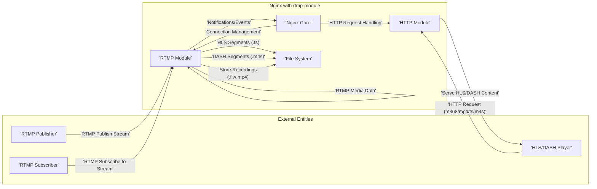

# Project Design Document: nginx-rtmp-module

**Version:** 1.1
**Date:** October 26, 2023
**Author:** AI Software Architect

## 1. Introduction

This document provides an enhanced and detailed design overview of the `nginx-rtmp-module` project, an open-source module for the Nginx web server enabling RTMP/HLS/DASH streaming functionalities. This revised document is specifically tailored to facilitate comprehensive threat modeling and security analysis. It clearly articulates the module's architecture, key components, data flows, and critical security considerations. This document serves as a vital resource for security teams, developers, and anyone involved in assessing or securing deployments utilizing this module.

## 2. Goals

* Deliver a refined and more comprehensive architectural overview of the `nginx-rtmp-module`.
* Clearly identify and describe the interactions between key components.
* Provide a detailed explanation of data flow within the module for various streaming scenarios.
* Emphasize and categorize potential security concerns to streamline threat modeling efforts.
* Serve as an authoritative and up-to-date reference for development, security auditing, and operational teams.

## 3. Scope

This document encompasses the core functionalities of the `nginx-rtmp-module`, including:

* Ingesting and publishing Real-Time Messaging Protocol (RTMP) streams.
* Relaying RTMP streams to other servers.
* Transmuxing RTMP streams into HTTP Live Streaming (HLS) and Dynamic Adaptive Streaming over HTTP (DASH) formats.
* Implementing basic authentication and authorization controls for stream access.
* Recording incoming streams to persistent storage.

This document explicitly excludes:

* Detailed configuration specifics of the base Nginx web server.
* Security considerations at the host operating system level.
* Security aspects of the underlying network infrastructure.
* Granular, line-by-line code-level vulnerability analysis.

## 4. Architectural Overview

The `nginx-rtmp-module` functions as an integral module within the Nginx web server environment. It leverages Nginx's non-blocking, event-driven architecture to manage a high volume of concurrent streaming connections efficiently.

### 4.1. High-Level Architecture

### 4.2. Key Components

* **Nginx Core:** The foundational web server responsible for managing network connections, routing requests to appropriate handlers (modules), and overall process management.
* **RTMP Module:** The central component providing RTMP protocol handling, stream lifecycle management (publish, play, stop), and relaying capabilities.
* **HTTP Module:** Nginx's built-in module utilized to serve HTTP-based streaming formats, including HLS manifest files (`.m3u8`), DASH manifest files (`.mpd`), and media segments (`.ts`, `.m4s`).
* **File System:**  Persistent storage used for saving HLS/DASH media segments, manifest files, and recorded stream files (typically `.flv` or `.mp4`).

### 4.3. Data Flow

The following details the typical data flow for various streaming scenarios:

* **RTMP Stream Publishing:**
    1. An RTMP publisher application (e.g., OBS Studio, FFmpeg) initiates a TCP connection to the Nginx server on the designated RTMP port (default: 1935).
    2. The Nginx Core accepts the connection and delegates it to the RTMP Module.
    3. The RTMP Module performs the RTMP handshake with the publisher.
    4. The publisher sends metadata (e.g., stream name) and encoded audio/video data packets.
    5. The RTMP Module receives, processes, and buffers the incoming stream data in memory.

* **RTMP Stream Subscription:**
    1. An RTMP subscriber application (e.g., a media player) establishes a TCP connection to the Nginx server on the RTMP port.
    2. The Nginx Core accepts the connection and hands it off to the RTMP Module.
    3. The RTMP Module completes the RTMP handshake and identifies the stream requested by the subscriber.
    4. The RTMP Module retrieves the buffered stream data from memory and transmits it to the subscriber.

* **HLS/DASH Stream Delivery:**
    1. An RTMP stream is actively being published to the RTMP Module.
    2. The RTMP Module, if configured for HLS/DASH, segments the incoming RTMP stream into smaller, fixed-duration chunks.
    3. These chunks are encoded and saved as individual media files (`.ts` for HLS, `.m4s` for DASH) on the file system.
    4. The RTMP Module also generates and updates playlist/manifest files (`.m3u8` for HLS, `.mpd` for DASH) that list the available media segments.
    5. An HLS/DASH compatible player sends an HTTP request to the Nginx server for the playlist file.
    6. The Nginx Core routes this request to the HTTP Module.
    7. The HTTP Module retrieves and serves the requested playlist file from the file system.
    8. The player parses the playlist and subsequently sends HTTP requests for individual media segment files.
    9. The HTTP Module retrieves and serves the requested segment files from the file system.

* **RTMP Stream Relaying:**
    1. An Nginx server with the RTMP Module is configured to relay a stream from an external RTMP server.
    2. The RTMP Module initiates an outbound RTMP connection to the specified upstream server.
    3. The module subscribes to the designated stream on the upstream server.
    4. The module receives the stream data from the upstream server.
    5. The module can then serve this relayed stream to local subscribers or further relay it to other downstream servers.

## 5. Detailed Design

### 5.1. RTMP Module Core Functionality

The RTMP Module manages the intricacies of the RTMP protocol:

* **Connection Management:** Handles the establishment, maintenance, and termination of both inbound and outbound RTMP connections.
* **Handshake Implementation:** Executes the RTMP handshake sequence to establish a valid RTMP session.
* **Message Parsing and Handling:**  Parses incoming RTMP messages (e.g., `publish`, `play`, `audio`, `video`, `metadata`) and triggers corresponding actions.
* **Stream Lifecycle Management:** Tracks the state of active streams, associated publishers, and subscribers.
* **Data Buffering and Delivery:**  Temporarily stores incoming stream data for efficient distribution to multiple subscribers and for HLS/DASH segmentation.
* **Relay Logic Execution:** Implements the logic for subscribing to streams on upstream servers and publishing them to downstream clients or servers.
* **Authentication and Authorization Enforcement:**  Provides mechanisms to control which clients are permitted to publish or subscribe to specific streams.

### 5.2. HLS/DASH Processing Pipeline

The module's HLS/DASH functionality involves the following steps:

* **Segmentation:** Dividing the continuous RTMP stream into discrete, fixed-duration media segments.
* **Encoding (if necessary):** Potentially re-encoding the segments into the required codecs and formats for HLS/DASH compatibility (though often the RTMP stream is already in a suitable format).
* **Manifest Generation and Update:** Creating and dynamically updating `.m3u8` (HLS) and `.mpd` (DASH) playlist files that list the available media segments and their properties.
* **File System Operations:** Writing the generated media segment files and manifest files to the designated storage location on the file system.
* **Segment Cleanup and Rotation:** Managing the lifecycle of segment files, typically deleting older segments based on configured parameters to limit storage usage.

### 5.3. Configuration Directives

The behavior of the `nginx-rtmp-module` is controlled through directives within the Nginx configuration file (`nginx.conf`). Key configuration blocks and directives include:

* **`rtmp { ... }` block:**  The top-level block defining global RTMP server settings.
    * **`server { ... }` block:** Defines individual RTMP server instances, allowing for multiple listening ports and distinct application configurations.
        * **`listen <port> [interface];`:** Specifies the IP address and port the RTMP server listens on.
        * **`application <name> { ... }` block:** Defines specific applications within the RTMP server, providing granular control over stream access, HLS/DASH output, and recording options.
            * **`live on|off;`:** Enables or disables live streaming for the application.
            * **`record all|off|manual;`:** Configures automatic or manual stream recording.
            * **`record_path <path>;`:** Specifies the directory where recorded streams are saved.
            * **`record_suffix <format>;`:** Defines the filename suffix for recorded files.
            * **`hls on|off;`:** Enables or disables HLS output for the application.
            * **`hls_path <path>;`:** Specifies the directory for storing HLS segments and playlists.
            * **`hls_fragment <duration>;`:** Sets the duration of individual HLS segments.
            * **`hls_playlist_length <count>;`:**  Determines the number of segments kept in the HLS playlist.
            * **`dash on|off;`:** Enables or disables DASH output for the application.
            * **`dash_path <path>;`:** Specifies the directory for storing DASH segments and manifests.
            * **`allow publish <cidr>|all;`:**  Specifies IP address ranges permitted to publish streams to this application.
            * **`deny publish <cidr>|all;`:** Specifies IP address ranges denied from publishing streams.
            * **`allow play <cidr>|all;`:** Specifies IP address ranges permitted to subscribe to/play streams from this application.
            * **`deny play <cidr>|all;`:** Specifies IP address ranges denied from subscribing/playing streams.
            * **`push <rtmp_url>;`:** Configures relaying published streams to another RTMP server.
            * **`pull <rtmp_url>;`:** Configures pulling a stream from another RTMP server.
            * **`on_publish <url>;`:**  Specifies a URL to be called (HTTP POST) when a stream is published.
            * **`on_play <url>;`:** Specifies a URL to be called when a client starts playing a stream.
            * **`on_record_done <url>;`:** Specifies a URL to be called when stream recording is completed.
            * **`exec <command> [arguments];`:** Executes an external command upon certain events.
            * **`drop_idle_publisher <interval>;`:**  Disconnects idle publishers after a specified interval.

## 6. Security Considerations

This section outlines potential security vulnerabilities and concerns associated with the `nginx-rtmp-module`, categorized for clarity:

* **RTMP Protocol Specific Vulnerabilities:**
    * **Lack of Mandatory Encryption:** Standard RTMP connections are unencrypted, making them susceptible to eavesdropping and interception of stream content and potentially credentials.
    * **Denial of Service (DoS):**  The protocol can be vulnerable to DoS attacks by flooding the server with connection requests or malformed messages.

* **Authentication and Authorization Weaknesses:**
    * **Basic IP-Based Access Control:** Relying solely on IP address-based restrictions can be easily bypassed or spoofed.
    * **Lack of Strong Authentication Mechanisms:** The module primarily offers basic allow/deny rules, lacking more robust authentication methods like token-based authentication or integration with identity providers.
    * **Configuration Errors:** Misconfigured `allow` and `deny` directives can inadvertently expose streams or grant unauthorized access.

* **Input Validation and Data Handling:**
    * **Insufficient RTMP Message Validation:**  Lack of proper validation of incoming RTMP messages could lead to unexpected behavior or vulnerabilities.
    * **Metadata Injection:** Malicious publishers might inject harmful metadata into the stream, potentially affecting viewers or downstream systems.

* **HLS/DASH Security Concerns:**
    * **Unsecured Segment Storage:** If HLS/DASH segment directories are not properly protected, unauthorized access to stream content is possible.
    * **Lack of Encryption for HLS/DASH:** Without HTTPS, the transmission of manifest files and media segments is vulnerable to interception.

* **Callback and External Interaction Risks:**
    * **Server-Side Request Forgery (SSRF):**  If the URLs specified in `on_publish`, `on_play`, or `on_record_done` directives are attacker-controlled or vulnerable, it can lead to SSRF attacks.
    * **Insecure Handling of Callback Responses:** The module might not adequately handle unexpected or malicious responses from callback URLs.

* **File System Security:**
    * **Inadequate Permissions:** Incorrect file system permissions on HLS/DASH segment directories or recorded files can lead to unauthorized access, modification, or deletion.

* **Relaying Vulnerabilities:**
    * **Exposure to Upstream/Downstream Vulnerabilities:** When relaying streams, the server becomes a potential conduit for vulnerabilities present in upstream or downstream servers.

* **Process Execution Risks:**
    * **`exec` Directive Security:**  Improperly configured `exec` directives can introduce significant security risks if external commands are executed with elevated privileges or with untrusted input.

## 7. Deployment Considerations

Secure deployment of the `nginx-rtmp-module` requires careful planning and configuration:

* **Network Segmentation:** Isolate the RTMP server within a dedicated network segment to limit the impact of potential breaches.
* **Firewall Configuration:** Implement strict firewall rules to restrict access to the RTMP port (default 1935) and HTTP ports (80/443) to only authorized sources.
* **Regular Security Updates:**  Maintain up-to-date versions of Nginx and the `nginx-rtmp-module` to patch known vulnerabilities.
* **Secure Configuration Practices:** Adhere to security best practices when configuring Nginx and the RTMP module, including strong authentication rules and limiting unnecessary features.
* **HTTPS for HLS/DASH:**  Always enable HTTPS (TLS/SSL) for serving HLS and DASH content to encrypt communication and prevent eavesdropping.
* **Input Validation and Sanitization (Upstream):** While the module itself might have limited input validation, ensure that applications publishing to the server sanitize their input.
* **Monitoring and Logging:** Implement comprehensive logging and monitoring to detect suspicious activity and potential security incidents.
* **Principle of Least Privilege:** Run the Nginx process with the minimum necessary privileges.

## 8. Future Considerations

Potential future enhancements and changes that could impact the security landscape include:

* **Native Support for RTMPS:** Implementing direct support for the secure RTMP protocol (RTMPS) with TLS encryption.
* **Advanced Authentication and Authorization:** Integrating with more sophisticated authentication mechanisms like token-based authentication (JWT) or OAuth 2.0.
* **Role-Based Access Control (RBAC):** Implementing more granular access control based on user roles or permissions.
* **Improved Input Validation and Sanitization:** Enhancing the module's ability to validate and sanitize incoming RTMP messages and metadata.
* **Rate Limiting and Connection Throttling:** Implementing mechanisms to mitigate DoS attacks by limiting connection rates and resource consumption.
* **Enhanced Logging and Auditing:** Providing more detailed and configurable logging capabilities for security auditing.
* **Integration with Web Application Firewalls (WAFs):** Exploring integration points with WAFs to provide an additional layer of security.

This enhanced document provides a more robust and detailed understanding of the `nginx-rtmp-module` architecture, specifically tailored for effective threat modeling. The categorized security considerations and deployment recommendations offer a solid foundation for identifying potential vulnerabilities and implementing appropriate security measures.