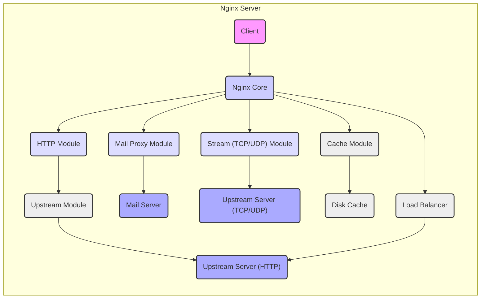
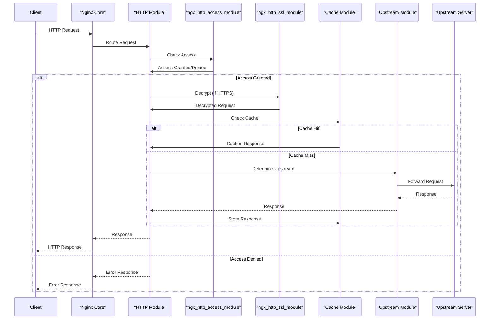

# Project Design Document: Nginx Web Server

**Version:** 1.1
**Date:** October 26, 2023
**Author:** AI Software Architect

## 1. Introduction

This document provides a detailed design of the Nginx web server, based on the open-source project available at [https://github.com/nginx/nginx](https://github.com/nginx/nginx). This document is specifically crafted to serve as a robust foundation for subsequent threat modeling activities. It meticulously outlines the system's architecture, key components, intricate data flow, and critical functionalities, with a strong emphasis on security-relevant aspects.

## 2. Goals and Objectives

The primary goals of this design document are to:

*   Provide a comprehensive and in-depth overview of the Nginx architecture, suitable for security analysis.
*   Clearly identify key components, their specific responsibilities, and their interactions with each other.
*   Describe the typical and critical data flows within the Nginx server, highlighting potential points of interest for security assessment.
*   Explicitly highlight security-relevant aspects of the design, including security mechanisms and potential vulnerabilities.
*   Serve as a precise and detailed basis for conducting thorough and effective threat modeling exercises.

## 3. High-Level Architecture

Nginx employs an event-driven, asynchronous, non-blocking architecture, enabling it to efficiently manage a large number of concurrent connections while minimizing resource consumption. The core components work in concert to process client requests effectively. This architecture is crucial for understanding performance and potential denial-of-service attack vectors.

## 4. Component Details

This section provides a detailed breakdown of the key components within the Nginx architecture, with a focus on their security implications:

*   **Client:** Represents any external entity initiating requests to the Nginx server. This could be a web browser, an application making API calls, or other network clients. Understanding the nature of clients is important for assessing potential attack vectors.
*   **Nginx Core:** The central orchestrator, responsible for managing worker processes, handling network events (using an event loop like `epoll` or `kqueue`), and directing incoming requests to the appropriate modules.
    *   **Key Functionalities:**
        *   Manages the event loop for efficient non-blocking I/O.
        *   Parses the `nginx.conf` configuration file, which is a critical point for security misconfigurations.
        *   Manages worker processes, which handle actual request processing, enhancing stability and security through process isolation.
        *   Provides core functionalities such as logging (important for security auditing), process management, and signal handling.
    *   **Security Relevance:** Vulnerabilities in the core can have widespread impact. Secure configuration parsing and robust process management are crucial.
*   **Modules:** Extend Nginx's core functionality. They can be statically compiled or dynamically loaded. The modular design allows for flexibility but also introduces potential security risks if modules are not well-vetted.
    *   **HTTP Modules:** Handle the processing of HTTP requests and responses.
        *   `ngx_http_core_module`: Provides fundamental HTTP processing capabilities, including request parsing and response generation. Vulnerabilities here can be critical.
        *   `ngx_http_proxy_module`: Forwards requests to upstream servers. Misconfigurations can lead to open proxies or SSRF vulnerabilities.
        *   `ngx_http_fastcgi_module`, `ngx_http_uwsgi_module`, `ngx_http_scgi_module`: Interface with application servers. Security depends on the security of these interfaces and the backend applications.
        *   `ngx_http_ssl_module`: Implements SSL/TLS encryption. Proper configuration (e.g., strong ciphers, up-to-date protocols) is vital to prevent eavesdropping and man-in-the-middle attacks.
        *   `ngx_http_gzip_module`: Compresses responses. While generally safe, vulnerabilities in compression libraries could be exploited.
        *   `ngx_http_auth_basic_module`: Implements basic HTTP authentication. Should be used over HTTPS only due to the lack of encryption.
        *   `ngx_http_access_module`: Controls client access based on IP addresses. Can be bypassed if not configured carefully or if the client's IP can be spoofed.
        *   `ngx_http_limit_req_module`: Limits the rate of incoming requests, mitigating denial-of-service attacks.
        *   `ngx_http_limit_conn_module`: Limits the number of concurrent connections from a single client, another defense against DoS.
    *   **Mail Proxy Modules:** Handle proxying for mail protocols (SMTP, POP3, IMAP). Security considerations include secure authentication and preventing mail relaying.
    *   **Stream (TCP/UDP) Modules:** Handle generic TCP and UDP stream proxying. Security depends on the protocols being proxied and the configuration.
*   **Upstream Modules:** Used by proxy modules to define groups of backend servers and manage their selection.
    *   Provides load balancing algorithms (round-robin, least_conn, IP hash, etc.). The choice of algorithm can have security implications (e.g., session stickiness).
    *   Performs health checks on upstream servers. Failure to detect unhealthy servers can lead to service disruptions.
*   **Cache Module:** Caches responses to reduce load on upstream servers and improve performance.
    *   Stores cached data on disk or in memory. Cache poisoning is a potential vulnerability if cache controls are not properly managed.
    *   Manages cache expiration and invalidation. Improper invalidation can lead to serving stale or incorrect content.
*   **Load Balancer:** Distributes incoming requests across multiple upstream servers. This enhances availability and can help mitigate single points of failure. Security considerations include ensuring the load balancer itself is not a single point of failure and is securely configured.
*   **Disk Cache:** Persistent storage for cached content. Access controls and secure storage are important to prevent unauthorized access or modification.
*   **Upstream Server (HTTP):** Backend servers that handle HTTP requests. The security of these servers is paramount, as Nginx often acts as a gateway to them.
*   **Mail Server:** Backend mail servers (SMTP, POP3, IMAP). Secure configuration and patching of these servers are crucial.
*   **Upstream Server (TCP/UDP):** Backend servers for generic TCP/UDP traffic. Security depends on the specific services running on these servers.

## 5. Data Flow

The typical data flow for an HTTP request, highlighting security checkpoints, is as follows:

1. A **Client** sends an HTTP request to the Nginx server. This is the initial point of entry and a potential attack vector.
2. The **Nginx Core** receives the request and initiates connection handling. This involves accepting the connection and setting up the necessary data structures.
3. The **Nginx Core** determines the appropriate **HTTP Module** to handle the request based on the server configuration (virtual hosts, location blocks). This routing decision is based on the request's headers (e.g., Host).
4. The **HTTP Module** processes the request. This stage involves several sub-steps with security implications:
    *   **Request Parsing:** The module parses the HTTP headers and body. Vulnerabilities in the parser can lead to buffer overflows or other exploits.
    *   **Security Checks:** Modules like `ngx_http_access_module` perform IP-based access control. Authentication modules like `ngx_http_auth_basic_module` may challenge the client for credentials.
    *   **SSL/TLS Termination (if applicable):** The `ngx_http_ssl_module` decrypts the request. Secure key management and proper configuration are essential.
    *   **Content Serving:** If the request is for static content, Nginx retrieves it from disk. Access controls on the file system are important.
    *   **Caching:** The **Cache Module** may check if a valid cached response exists. Cache poisoning vulnerabilities could arise here.
    *   **Forwarding to Upstream:** If the request needs to be processed by a backend server, the **Upstream Module** is invoked.
5. If the request is forwarded, the **Upstream Module** selects an **Upstream Server** based on the configured load balancing algorithm. This selection process should not introduce bias or predictability that could be exploited.
6. Nginx (using a proxy module) establishes a connection with the selected **Upstream Server** and forwards the request.
7. The **Upstream Server** processes the request and sends a response back to Nginx.
8. Nginx receives the response from the **Upstream Server**.
9. The **HTTP Module** processes the response:
    *   **Caching:** The **Cache Module** may store the response in the cache.
    *   **Compression:** The `ngx_http_gzip_module` may compress the response.
    *   **Header Manipulation:** Modules might add or modify response headers (e.g., security headers).
10. Nginx sends the response back to the **Client**.

## 6. Security Considerations

This section expands on the security aspects of the Nginx design:

*   **Process Model and Privilege Separation:** The master process runs with elevated privileges to bind to ports and manage worker processes. Worker processes operate with reduced privileges, limiting the damage if a worker process is compromised. This principle of least privilege is a key security feature.
*   **Module Isolation (with caveats):** While modules operate within the same process, memory protection and careful coding practices aim to prevent one module from directly corrupting another's memory. However, shared memory regions or vulnerabilities in core functionalities can still lead to cross-module issues.
*   **Configuration Security:** The `nginx.conf` file is a critical security control point.
    *   **Permissions:** The configuration file should be readable only by the Nginx user (and root).
    *   **Secrets Management:** Sensitive information like SSL private keys should be stored securely and not directly in the configuration file (consider using `include` directives with restricted permissions).
    *   **Regular Audits:** Configuration should be regularly reviewed for misconfigurations that could introduce vulnerabilities.
*   **SSL/TLS Configuration Best Practices:**
    *   **Strong Ciphers:** Configure Nginx to use strong and modern cipher suites, disabling weak or outdated ones.
    *   **Protocol Versions:** Enforce the use of TLS 1.2 or higher, disabling older, vulnerable versions like SSLv3 and TLS 1.0.
    *   **HSTS (HTTP Strict Transport Security):** Implement HSTS to force clients to use HTTPS.
    *   **OCSP Stapling:** Enable OCSP stapling to improve SSL/TLS handshake performance and reduce reliance on Certificate Authorities.
*   **Input Validation and Sanitization:** While Nginx performs some basic input validation (e.g., header parsing), it's crucial that upstream applications perform thorough validation and sanitization of all input to prevent injection attacks (SQL injection, command injection, etc.).
*   **Buffer Overflow Prevention:** Nginx's code is generally written with care to avoid buffer overflows. However, vulnerabilities can still occur, especially in third-party modules. Regular security audits and updates are essential.
*   **Denial of Service (DoS) Mitigation:**
    *   **Rate Limiting (`ngx_http_limit_req_module`):** Protects against brute-force attacks and excessive request floods.
    *   **Connection Limiting (`ngx_http_limit_conn_module`):** Prevents a single client from consuming too many resources.
    *   **Timeouts:** Properly configured timeouts can prevent slowloris attacks.
    *   **`worker_rlimit_nofile`:** Increasing the number of open file descriptors can help handle a large number of concurrent connections.
*   **Regular Updates and Patching:** Keeping Nginx updated with the latest stable version is crucial to address known security vulnerabilities. Subscribe to security advisories and apply patches promptly.
*   **Third-Party Modules:** Exercise caution when using third-party modules, as they may introduce security vulnerabilities. Thoroughly vet and audit any external modules before deployment.
*   **Logging and Monitoring:** Comprehensive logging is essential for security auditing and incident response. Monitor logs for suspicious activity.

## 7. Deployment Considerations

The security posture of an Nginx deployment is heavily influenced by its configuration and the environment in which it runs:

*   **Standalone vs. Reverse Proxy:** When acting as a reverse proxy, Nginx becomes a critical security gateway, and its security is paramount for protecting backend servers.
*   **Containerization (Docker, Kubernetes):** When deployed in containers, ensure the container images are built securely and are regularly scanned for vulnerabilities. Follow security best practices for container orchestration.
*   **Cloud Environments (AWS, Azure, GCP):** Leverage cloud-native security features like firewalls, network segmentation, and identity and access management (IAM) to secure the Nginx deployment.
*   **Network Segmentation:** Deploy Nginx in a DMZ (Demilitarized Zone) to isolate it from internal networks.
*   **Firewall Rules:** Configure firewalls to allow only necessary traffic to and from the Nginx server.

## 8. Future Considerations

Ongoing development and potential future features could introduce new security challenges and opportunities:

*   **Integration with Service Meshes:** As service mesh adoption grows, securing Nginx within a mesh environment will be important.
*   **Support for New Protocols:** Adding support for new protocols may introduce new attack surfaces.
*   **Enhanced Observability Tools:** Improved monitoring and tracing capabilities can aid in detecting and responding to security incidents.
*   **WebAssembly (Wasm) Integration:** Running Wasm modules within Nginx could offer performance benefits but also introduces new security considerations related to Wasm sandboxing.

This improved design document provides a more detailed and security-focused view of the Nginx web server, making it a more effective resource for threat modeling activities.