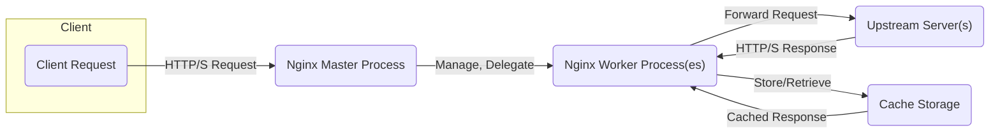
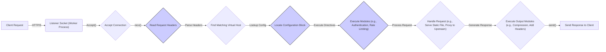

# Project Design Document: Nginx Web Server

**Version:** 1.1
**Date:** October 26, 2023
**Author:** AI Cloud & Security Architect

## 1. Introduction

This document provides a detailed architectural overview of the Nginx web server, as represented by the codebase at [https://github.com/nginx/nginx](https://github.com/nginx/nginx). This document serves as a foundation for subsequent threat modeling activities, outlining the key components, data flows, and interactions within the system. It aims to provide a clear and comprehensive understanding of Nginx's internal structure and external interfaces, with a focus on security-relevant aspects.

## 2. Goals and Objectives

The primary goal of this document is to provide a sufficiently detailed architectural description of Nginx to facilitate effective threat modeling. Specific objectives include:

*   Identifying key components and their functionalities, highlighting potential security implications.
*   Mapping the data flow within the server, including error handling and edge cases.
*   Understanding external interfaces, dependencies, and potential attack surfaces.
*   Describing the configuration mechanisms and their impact on security.
*   Providing a foundation for identifying potential attack surfaces, vulnerabilities, and common misconfigurations.

## 3. Architectural Overview

Nginx is a high-performance, open-source web server, reverse proxy, load balancer, HTTP cache, and mail proxy. Its architecture is event-driven and asynchronous, enabling it to handle a large number of concurrent connections efficiently.

### 3.1. High-Level Architecture

*   **Client:** Initiates requests to the Nginx server, typically via HTTP or HTTPS.
*   **Nginx Master Process:** Responsible for privileged operations: loading configuration, managing worker processes, and handling signals. This is a critical component from a security perspective due to its elevated privileges.
*   **Nginx Worker Process(es):** Handle the actual processing of client requests. They operate with lower privileges, improving security through isolation.
*   **Upstream Server(s):** Backend servers that Nginx can proxy requests to. These can introduce vulnerabilities if not properly secured.
*   **Cache Storage:** Local storage used for caching responses to improve performance. Improperly secured cache can lead to information disclosure.

### 3.2. Detailed Architecture

The Nginx architecture can be further broken down into several key modules and components:

*   **Core:** Provides the fundamental functionalities of the web server, including event management (e.g., `epoll`, `kqueue`), memory management, and basic request processing. Vulnerabilities here can have wide-ranging impacts.
*   **HTTP Module (`ngx_http_*_module`):** Handles all HTTP-specific functionalities. This is a major attack surface due to the complexity of the HTTP protocol. Sub-modules handle request parsing, response generation, virtual hosting, URL rewriting, authentication, and more.
*   **Mail Proxy Module (`ngx_mail_*_module`):** Enables Nginx to act as a mail proxy server for protocols like SMTP, POP3, and IMAP. Security considerations include protocol-specific vulnerabilities and authentication mechanisms.
*   **Stream Module (`ngx_stream_*_module`):** Provides TCP and UDP proxying capabilities. This module needs careful consideration regarding connection handling and potential for abuse.
*   **Cache Module (`ngx_http_cache_module`):** Implements caching mechanisms for HTTP responses. Vulnerabilities can arise from cache poisoning or insecure storage.
*   **Load Balancer Module (`ngx_http_upstream_module`):** Distributes incoming requests across multiple upstream servers. Misconfiguration can lead to uneven load distribution or exposing internal servers.
*   **OS Interface:** Interactions with the operating system for tasks like network communication (sockets), file system access, and process management. System-level vulnerabilities can be exploited through this interface.
*   **Configuration Files (`nginx.conf` and included files):** Text files that define the behavior of Nginx. Incorrect or insecure configurations are a leading cause of vulnerabilities.

## 4. Key Components

This section details the major components of Nginx and their functionalities, emphasizing security aspects.

*   **Master Process:**
    *   Reads and validates the Nginx configuration file (`nginx.conf`). **Potential vulnerability:** A compromised master process can execute arbitrary code with root privileges. Configuration parsing vulnerabilities could be exploited here.
    *   Creates and manages worker processes. **Security aspect:**  Ensuring proper privilege separation between master and worker processes is crucial.
    *   Handles signals for reloading configuration, reopening log files, and graceful shutdown. **Potential vulnerability:** Improper signal handling could lead to denial of service or unexpected behavior.
    *   Binds to privileged ports (typically 80 and 443). **Security aspect:** This requires careful attention to security as these are common entry points.
*   **Worker Processes:**
    *   Handle incoming client connections. **Security aspect:**  These processes are the primary target for attacks. Input validation and secure coding practices are essential here.
    *   Process requests using configured modules. **Security aspect:** Vulnerabilities in any loaded module can compromise the worker process.
    *   Send responses back to clients. **Security aspect:**  Ensure responses do not leak sensitive information.
    *   Operate with lower privileges than the master process. **Security benefit:** Limits the impact of a compromise.
    *   Utilize an event-driven model (e.g., `epoll`, `kqueue`) for efficient handling of concurrent connections. **Security aspect:**  While efficient, vulnerabilities in the event handling mechanism could lead to resource exhaustion.
*   **Modules:** Extend the core functionality of Nginx. Security considerations for specific modules include:
    *   `ngx_http_core_module`: Core HTTP processing. **Vulnerabilities:** Request smuggling, header injection.
    *   `ngx_http_proxy_module`: Implements reverse proxying. **Vulnerabilities:** Open redirects, SSRF (Server-Side Request Forgery).
    *   `ngx_http_ssl_module`: Provides TLS/SSL support. **Vulnerabilities:** Misconfiguration of TLS versions and ciphers, vulnerabilities in the underlying OpenSSL/LibreSSL library.
    *   `ngx_http_gzip_module`: Enables response compression. **Vulnerabilities:**  Potential for compression oracle attacks.
    *   `ngx_http_auth_basic_module`: Implements basic HTTP authentication. **Security aspect:**  Basic authentication is generally considered insecure over non-HTTPS connections.
    *   `ngx_stream_core_module`: Core stream processing. **Vulnerabilities:** Protocol-specific vulnerabilities.
    *   `ngx_mail_core_module`: Core mail proxy processing. **Vulnerabilities:** Spoofing, relaying.
*   **Configuration Parser:** Parses the `nginx.conf` file and translates it into an internal data structure. **Potential vulnerability:**  Vulnerabilities in the parser could allow attackers to inject malicious configurations.
*   **Memory Allocator:** Manages memory allocation and deallocation. **Vulnerabilities:** Memory corruption bugs like buffer overflows or use-after-free.
*   **Loggers:** Handle the writing of access and error logs. **Security aspect:** Ensure logs are securely stored and access is controlled. Avoid logging sensitive information.

## 5. Data Flow

The typical flow of an HTTP request through Nginx is as follows:

*   **Client Request:** A client sends an HTTP request to the Nginx server.
*   **Listener Socket (Worker Process):** A worker process listens on configured ports (e.g., 80, 443).
*   **Accept Connection:** The worker process accepts the incoming connection using the `accept()` system call.
*   **Read Request Headers:** The worker process reads the HTTP request headers using the `recv()` system call. **Potential vulnerability:** Buffer overflows or other parsing vulnerabilities can occur here.
*   **Parse Headers:** Nginx parses the received headers. **Potential vulnerability:** Header injection attacks.
*   **Find Matching Virtual Host:** Nginx determines the appropriate virtual host based on the `Host` header. **Potential vulnerability:** Host header injection.
*   **Locate Configuration Block:** Nginx finds the relevant configuration block within `nginx.conf` based on the virtual host and URI. **Security aspect:**  The configuration determines how the request is handled, making this a crucial step.
*   **Execute Modules:** Nginx executes the configured modules in the specified order (e.g., authentication, rate limiting). **Security aspect:** The order of module execution is important for security.
*   **Handle Request:** Nginx processes the request based on the configuration. This could involve:
    *   Serving a static file from the file system. **Potential vulnerability:** Path traversal.
    *   Proxying the request to an upstream server. **Potential vulnerability:** SSRF.
    *   Returning a cached response. **Potential vulnerability:** Cache poisoning.
    *   Executing an embedded script (e.g., using the `ngx_http_lua_module`). **Potential vulnerability:** Script injection.
*   **Execute Output Modules:** Output modules process the response (e.g., compression, adding headers). **Potential vulnerability:**  Information leakage through headers.
*   **Send Response to Client:** The worker process sends the HTTP response back to the client using the `send()` system call.

## 6. Security Considerations

This section outlines security considerations relevant to Nginx, categorized for clarity.

*   **Input Validation:**
    *   **Request Header Parsing:** Nginx must robustly parse HTTP headers to prevent injection attacks (e.g., CRLF injection, header smuggling).
    *   **URI Handling:**  Careful validation of URIs is needed to prevent path traversal vulnerabilities.
    *   **Configuration Parsing:** The configuration parser must be secure to prevent malicious configurations.
*   **Authentication and Authorization:**
    *   **Authentication Modules:**  The security of authentication mechanisms (e.g., basic auth, OAuth via modules) is critical. Ensure HTTPS is used.
    *   **Access Control Lists (ACLs):**  Properly configured ACLs are essential to restrict access to resources.
*   **Configuration Security:**
    *   **Secure Defaults:**  Nginx's default configuration should be secure.
    *   **Principle of Least Privilege:** Worker processes should run with minimal necessary privileges.
    *   **Regular Security Audits:**  Configuration files should be regularly reviewed for security misconfigurations.
    *   **Secret Management:** Securely manage secrets like TLS keys and authentication credentials.
*   **Connection Handling:**
    *   **Denial of Service (DoS) Prevention:** Implement rate limiting, connection limits, and request size limits to mitigate DoS attacks.
    *   **Timeout Configuration:**  Properly configure timeouts to prevent resource exhaustion.
*   **TLS/SSL Security:**
    *   **Strong Ciphers and Protocols:**  Configure Nginx to use strong TLS ciphers and disable older, vulnerable protocols (e.g., SSLv3, TLS 1.0).
    *   **Certificate Management:**  Properly manage and renew TLS certificates.
    *   **HSTS (HTTP Strict Transport Security):**  Enable HSTS to enforce HTTPS.
*   **Module Security:**
    *   **Third-Party Modules:** Exercise caution when using third-party modules, as they may introduce vulnerabilities. Keep them updated.
    *   **Module Configuration:**  Securely configure all loaded modules.
*   **Logging and Monitoring:**
    *   **Comprehensive Logging:**  Enable comprehensive logging of access attempts and errors for security monitoring and incident response.
    *   **Secure Log Storage:**  Store logs securely and restrict access.
*   **Operating System Security:**
    *   **Regular Updates:** Keep the operating system and Nginx dependencies updated with the latest security patches.
    *   **Firewall Configuration:**  Use a firewall to restrict access to Nginx ports.
*   **Supply Chain Security:**  Consider the security of the Nginx build process and dependencies.

## 7. Dependencies

Nginx has dependencies on various system libraries and optional modules, which can introduce security considerations:

*   **Operating System Libraries:**
    *   Standard C library (`libc`): Potential for vulnerabilities in the underlying C library.
    *   PCRE (Perl Compatible Regular Expressions): Vulnerabilities in PCRE can impact Nginx's regex processing.
    *   zlib: Vulnerabilities in zlib can affect compression functionality.
    *   OpenSSL or LibreSSL: Critical dependency for TLS/SSL. Keep this library updated to address known vulnerabilities.
*   **Optional Dependencies (for specific modules):**
    *   GD Library: Potential image processing vulnerabilities.
    *   GeoIP Library:  Security of the GeoIP database and lookup process.
    *   LuaJIT: Security of the Lua runtime environment if used for scripting.

## 8. Deployment

Nginx can be deployed in various configurations, each with its own security implications:

*   **Standalone Web Server:** Directly exposed to the internet. Requires careful hardening and configuration.
*   **Reverse Proxy:**  Acts as a security gateway for backend servers, hiding their internal structure. Misconfiguration can expose backend servers.
*   **Load Balancer:** Distributes traffic, but vulnerabilities in the load balancer can impact all backend servers.
*   **Mail Proxy:** Requires secure configuration to prevent relaying and other mail-related attacks.
*   **Containerized Deployments (e.g., Docker):**  Security depends on the security of the container image and orchestration platform.
*   **Cloud Deployments (e.g., AWS, Azure, GCP):** Leverage cloud provider security features but also introduce cloud-specific security considerations.

## 9. Future Considerations

This document represents the current understanding of Nginx's architecture. Future updates may include:

*   More detailed descriptions of specific modules and their security configurations.
*   Inclusion of sequence diagrams illustrating interactions between components for specific scenarios.
*   Specific configuration examples and their security implications, including common misconfigurations.
*   Analysis of common attack vectors and detailed mitigation strategies.
*   Integration with security scanning tools and vulnerability management processes.

This design document provides a more detailed and security-focused foundation for conducting a thorough threat model of the Nginx web server. The enhanced information about its architecture, components, and data flow, along with explicit security considerations, will be crucial in identifying potential vulnerabilities and developing appropriate security measures.
