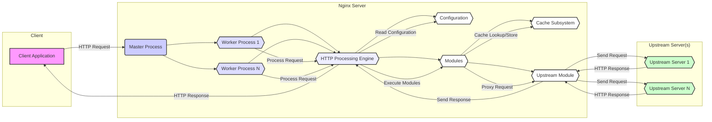
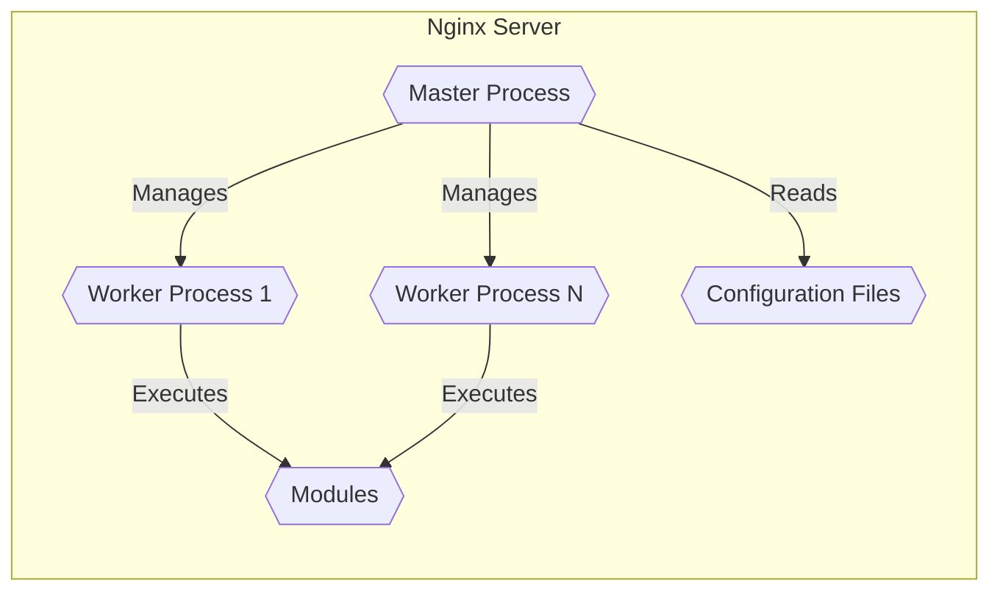

# Project Design Document: Nginx

**Version:** 1.1
**Date:** October 26, 2023
**Author:** AI Software Architect

## 1. Introduction

This document provides an enhanced and detailed design overview of the Nginx web server and reverse proxy project, based on the codebase available at [https://github.com/nginx/nginx](https://github.com/nginx/nginx). This document is specifically crafted to serve as a robust foundation for subsequent threat modeling activities, ensuring a comprehensive understanding of the system's architecture, individual components, and the intricate flow of data within it. This detailed understanding is crucial for identifying potential vulnerabilities and attack vectors.

## 2. Goals and Scope

The primary goal of this document is to provide a clear, accurate, and sufficiently detailed articulation of the Nginx design. This will empower security professionals to conduct effective threat identification and develop appropriate mitigation strategies. The scope of this document encompasses the core functionalities of Nginx, including its roles as a web server, reverse proxy, load balancer, and mail proxy. It focuses on the internal architectural components, the step-by-step data flow during request processing, and the key interactions Nginx has with external systems. This document aims to cover the fundamental aspects relevant to security analysis, without delving into highly specific implementation details of individual modules.

## 3. High-Level Overview

Nginx stands as a high-performance, open-source powerhouse in the realm of web servers and reverse proxy servers. Renowned for its exceptional stability, a rich and versatile feature set, a straightforward and manageable configuration system, and remarkably low resource consumption, Nginx is a cornerstone of modern web infrastructure. Its event-driven, asynchronous architecture is a key factor in its ability to handle a massive number of concurrent connections with impressive efficiency, making it suitable for high-traffic environments.

At its core, Nginx operates with a master process overseeing a collection of worker processes. The master process is responsible for critical tasks such as loading and validating the often complex Nginx configuration file (`nginx.conf`) and managing the lifecycle of the worker processes, including their initiation, termination, and restarts. Conversely, the worker processes are the workhorses, diligently handling incoming client requests. This separation of concerns, coupled with the non-blocking I/O operations within the worker processes, is a significant contributor to Nginx's renowned performance and scalability.

## 4. Component Design

Nginx's architecture is modular and can be dissected into several critical components, each with specific responsibilities:

*   **Master Process:**
    *   Primary responsibility is to load and rigorously validate the Nginx configuration file (`nginx.conf`) for syntax and logical errors.
    *   Manages the pool of worker processes, overseeing their creation, termination, and restarts as needed (e.g., during configuration reloads).
    *   Listens on the ports specified in the configuration, awaiting incoming client connection requests.
    *   Executes privileged operations if configured to do so, typically during startup to bind to privileged ports.
    *   Handles system signals, such as `SIGHUP` for configuration reloads and `SIGUSR1` for log reopening, ensuring smooth operation and maintenance.

*   **Worker Processes:**
    *   The core of request processing; each worker process is responsible for handling the actual client requests.
    *   Operate independently of each other, enhancing stability, and utilize a non-blocking I/O model for efficiency.
    *   Distribute incoming connections among themselves, often using a shared "accept" mutex or a similar mechanism to prevent race conditions.
    *   Execute the configured modules in a pipeline to process each request, applying various functionalities.

*   **Configuration Files (`nginx.conf`):**
    *   The central nervous system of Nginx, defining its entire behavior, including server blocks (virtual hosts), location blocks (URL-based routing), upstream server definitions, and module-specific settings.
    *   Employs a hierarchical structure, using directives within blocks to organize configuration options.
    *   Parsed and interpreted by the master process during startup and configuration reload events.

*   **Modules:**
    *   The building blocks of Nginx's extensibility, allowing for a wide range of functionalities.
    *   Categorized as either core modules (compiled directly into the Nginx binary) or dynamic modules (loaded at runtime, offering flexibility).
    *   Examples of module functionalities include:
        *   HTTP protocol handling (request parsing, response generation, header manipulation).
        *   SSL/TLS termination (handling secure connections).
        *   Caching mechanisms (storing and serving frequently accessed content).
        *   Load balancing algorithms (distributing traffic across multiple backend servers).
        *   Authentication and authorization mechanisms (controlling access to resources).
        *   URL rewriting and redirection rules.
        *   Serving static content directly from the file system.
        *   Mail proxying for SMTP, POP3, and IMAP protocols.

*   **Core HTTP Processing Engine:**
    *   The foundational component responsible for the fundamental aspects of handling HTTP requests and responses.
    *   Performs the crucial task of parsing incoming HTTP headers and request bodies.
    *   Manages the state of HTTP connections, including keep-alive connections.
    *   Implements the core features of the HTTP protocol according to standards.

*   **Event Loop:**
    *   The heart of the worker process's non-blocking I/O model, enabling high concurrency.
    *   Continuously monitors multiple file descriptors (representing network sockets and other resources) for relevant events, such as data being available for reading or a socket being ready for writing.
    *   Dispatches these events to the appropriate handlers for processing, avoiding blocking the main execution thread.

*   **Memory Management:**
    *   Nginx employs sophisticated and efficient memory management strategies to minimize overhead and maximize performance.
    *   Utilizes memory pools and slab allocators for allocating and managing memory, reducing fragmentation and improving speed.

*   **Cache Subsystem:**
    *   Provides the capability to cache both static and dynamically generated content, significantly improving performance and reducing load on backend servers.
    *   Offers configurable cache levels (e.g., in-memory, on-disk) and customizable cache policies (e.g., expiration, invalidation).

*   **Upstream Module:**
    *   Manages connections to backend servers, often referred to as upstream servers, when Nginx acts as a reverse proxy or load balancer.
    *   Implements various load balancing algorithms, such as round-robin, least connections, and IP hash, to distribute traffic effectively.
    *   Performs health checks on upstream servers to detect failures and route traffic accordingly, ensuring high availability.

*   **Mail Proxy Modules:**
    *   Enable Nginx to function as a proxy server for email protocols like SMTP, POP3, and IMAP.
    *   Provide features such as authentication proxying and support for SSL/TLS encryption for secure mail traffic.

## 5. Data Flow

The typical data flow for an HTTP request as it traverses through Nginx can be broken down into the following steps:

1. A client application initiates an HTTP request, sending it to the configured IP address and port where Nginx is listening.
2. The master process, constantly listening on the designated port(s), accepts the incoming connection request.
3. The master process then delegates the newly accepted connection to one of the available worker processes. The selection process is typically handled by the operating system's connection distribution mechanisms.
4. The selected worker process accepts the connection and begins the process of receiving data from the client.
5. The worker process reads the incoming HTTP request headers and, if present, the request body.
6. Based on the directives defined in the `nginx.conf` file, specifically within server blocks and location blocks, Nginx determines how to handle the incoming request. This involves matching the request's hostname and URI against the configured rules.
7. If the request is for static content (e.g., images, CSS, JavaScript files), the worker process retrieves the requested file directly from the file system and constructs the HTTP response.
8. If the request requires proxying to a backend server, the worker process utilizes the upstream module to establish a connection with one of the configured upstream servers.
9. The worker process forwards the client's request to the selected upstream server.
10. The upstream server processes the request and generates an HTTP response, sending it back to the Nginx worker process.
11. The worker process may optionally cache the received response based on the configured caching rules.
12. The worker process constructs the final HTTP response and sends it back to the originating client application.
13. Depending on the HTTP headers (e.g., `Connection: keep-alive`), the connection may be kept open for subsequent requests or closed.

## 6. Key Interactions

Nginx engages in crucial interactions with various external entities to fulfill its functions:

*   **Clients:** Initiate communication by sending HTTP requests to Nginx, expecting responses based on the requested resources or proxied services.
*   **Upstream Servers:** Backend servers that Nginx forwards requests to when acting as a reverse proxy or load balancer. These servers process the actual application logic or serve the origin content.
*   **File System:** Nginx relies heavily on the file system for several operations: reading its configuration files (`nginx.conf`), serving static content directly to clients, and potentially utilizing disk space for caching purposes.
*   **Operating System:** Nginx depends on the underlying operating system for fundamental services, including networking operations (socket creation, listening, accepting connections), file input/output operations, and process management (forking, signal handling).
*   **DNS Servers:** When configured to proxy requests to upstream servers using hostnames, Nginx queries DNS servers to resolve these hostnames to IP addresses.
*   **Certificate Authorities (CAs):** For establishing secure HTTPS connections, Nginx interacts with CAs (either directly or indirectly through administrators) to obtain and validate SSL/TLS certificates, ensuring the authenticity and encryption of communication.
*   **Logging Systems:** Nginx generates access logs (recording client requests) and error logs (recording internal issues), which are typically written to the file system. These logs can also be directed to external logging services for centralized management and analysis.
*   **Monitoring Systems:** External systems designed for monitoring application performance and health often interact with Nginx to collect metrics related to request rates, error counts, resource utilization, and other relevant data points.

## 7. Security Considerations (Preliminary)

Based on the design and functionalities of Nginx, several key security considerations emerge:

*   **Configuration Vulnerabilities:**  A significant attack surface lies in the `nginx.conf` file. Misconfigurations, such as overly permissive access rules, exposure of internal server details, or incorrect handling of sensitive headers, can lead to serious vulnerabilities.
*   **Module Vulnerabilities:**  Both core and third-party modules can contain bugs or security flaws. Vulnerabilities in these modules could be exploited to gain unauthorized access, cause denial of service, or execute arbitrary code. Regularly updating Nginx and its modules is crucial.
*   **Buffer Overflows:**  Although less common in modern versions, potential vulnerabilities in the request parsing logic or within specific modules could lead to buffer overflows if input data exceeds expected boundaries.
*   **Denial of Service (DoS):** Nginx, like any internet-facing service, is susceptible to various DoS attacks. This includes:
    *   **Slowloris attacks:** Exploiting the keep-alive mechanism to exhaust server resources.
    *   **SYN floods:** Overwhelming the server with connection requests.
    *   **HTTP request smuggling:** Crafting malicious requests that are interpreted differently by Nginx and backend servers.
*   **SSL/TLS Vulnerabilities:**  Improper configuration of SSL/TLS settings, the use of outdated protocols or ciphers, or vulnerabilities in the underlying OpenSSL library can compromise the security of encrypted connections.
*   **File System Access:**  Incorrect file permissions or vulnerabilities allowing path traversal could enable attackers to access sensitive files served by Nginx or even the configuration files themselves.
*   **Upstream Server Security:**  The security posture of the upstream servers is paramount. If upstream servers are compromised, Nginx, acting as a gateway, could inadvertently facilitate attacks or expose sensitive data.
*   **Logging Security:**  Access to log files should be restricted, as they can contain sensitive information. Additionally, care must be taken to prevent log injection attacks, where malicious data is inserted into logs.
*   **Privilege Escalation:**  While Nginx typically runs worker processes with reduced privileges, vulnerabilities in the master process or misconfigurations could potentially lead to privilege escalation.
*   **Supply Chain Security:**  The security of dependencies, including third-party modules and libraries used during the build process, needs careful consideration to prevent the introduction of malicious code.

## 8. Diagrams

### 8.1. High-Level Component Diagram

### 8.2. Request Processing Flow

```mermaid
graph LR
    A{{"Client Request"}} --> B{{"Master Process (Accept)"}};
    B --> C{{"Worker Process (Handle)"}};
    C --> D{{"Parse Request"}};
    D --> E{{"Route Request (Configuration)"}};
    E --> F{{"Handle Static Content"}};
    E --> G{{"Proxy to Upstream"}};
    F --> H{{"Send Response"}};
    G --> I{{"Upstream Server"}};
    I --> J{{"Receive Response"}};
    J --> H;
    H --> K{{"Client Response"}};
    style A fill:#ccf,stroke:#333,stroke-width:2px
    style B fill:#ddf,stroke:#333,stroke-width:2px
    style C fill:#eef,stroke:#333,stroke-width:2px
    style D fill:#fff,stroke:#333,stroke-width:2px
    style E fill:#fff,stroke:#333,stroke-width:2px
    style F fill:#fff,stroke:#333,stroke-width:2px
    style G fill:#fff,stroke:#333,stroke-width:2px
    style H fill:#fff,stroke:#333,stroke-width:2px
    style I fill:#cfc,stroke:#333,stroke-width:2px
    style J fill:#fff,stroke:#333,stroke-width:2px
    style K fill:#ccf,stroke:#333,stroke-width:2px
```

## 9. Conclusion

This enhanced document provides a more in-depth and comprehensive understanding of the Nginx project's architecture, its constituent components, and the intricate flow of requests. It serves as a significantly improved foundation for conducting thorough threat modeling activities. By detailing the various aspects of Nginx's design, this document facilitates the systematic identification and analysis of potential vulnerabilities and attack vectors. The information presented here will be crucial for developing effective security strategies and mitigation measures to protect systems utilizing Nginx. Further detailed analysis, particularly focusing on specific modules and configuration options relevant to a given deployment, will be a necessary next step in a comprehensive security assessment.