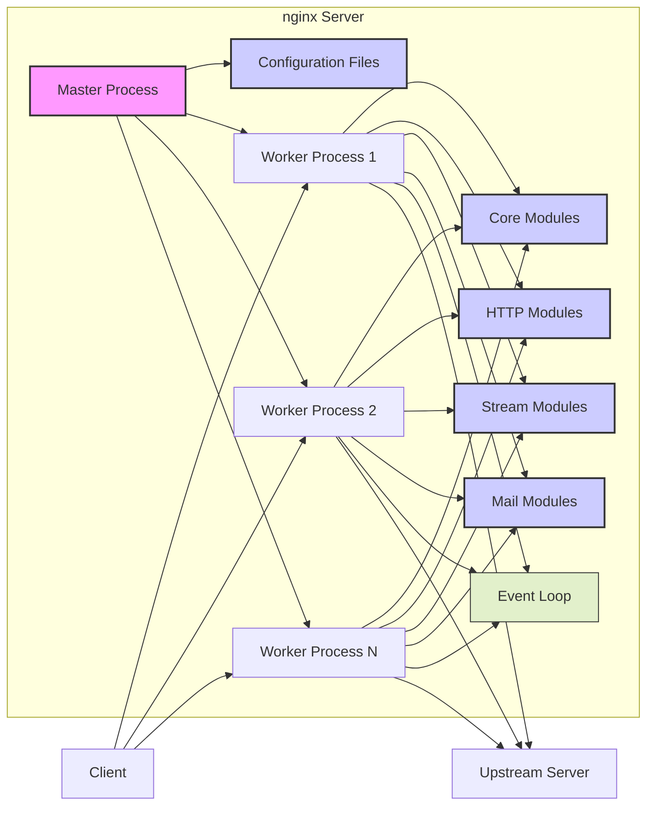
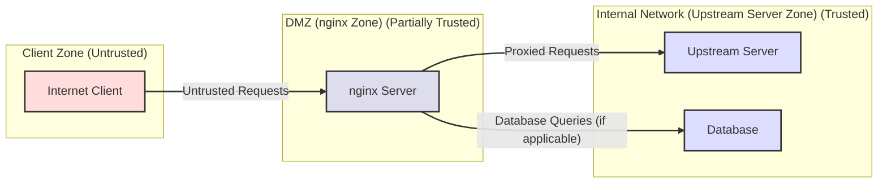

# Project Design Document: nginx for Threat Modeling (Improved)

**Project Name:** nginx

**Project Repository:** [https://github.com/nginx/nginx](https://github.com/nginx/nginx)

**Document Version:** 1.1

**Date:** 2023-10-27

**Author:** AI Software Architect

## 1. Introduction

This document provides an enhanced and more detailed design overview of the nginx web server project, specifically tailored for threat modeling activities. Building upon the previous version, this document further elaborates on the architecture, components, data flow, and external interfaces of nginx to facilitate a more comprehensive identification and analysis of potential security vulnerabilities. This document serves as a robust foundation for subsequent threat modeling exercises, security assessments, and penetration testing.

## 2. Project Overview

nginx (pronounced "engine-x") is a high-performance, open-source web server, reverse proxy, load balancer, mail proxy, and HTTP cache. It excels in stability, feature richness, configuration simplicity, and minimal resource consumption. nginx's event-driven, asynchronous architecture enables it to handle a massive number of concurrent connections efficiently. Its versatility makes it a popular choice for serving static and dynamic content, load balancing, reverse proxying, and functioning as an API gateway in modern web infrastructures.

## 3. Architectural Overview

nginx employs a master-worker process model, a core design principle for its performance and reliability. The architecture is composed of the following key components, working in concert:

*   **Master Process:** The central control unit, responsible for privileged operations and worker process management.
*   **Worker Processes:** The workhorses of nginx, handling client requests and executing modules.
*   **Core Modules:** Fundamental modules providing essential functionalities for nginx's operation.
*   **Modules (HTTP, Stream, Mail, etc.):** Extend nginx's capabilities to support diverse protocols and features.
*   **Configuration Files:** Define nginx's behavior and policies, driving its functionality.

The following Mermaid diagram illustrates the high-level architecture with more detail:

## 4. Component Details

### 4.1. Master Process

*   **Functionality:**
    *   **Configuration Loading and Parsing:** Reads and meticulously parses nginx configuration files (`nginx.conf` and included files), validating syntax and directives.
    *   **Process Management:**  Orchestrates worker processes, handling their lifecycle: starting, stopping, restarting, and graceful reloads.
    *   **Privilege Management:** Operates initially with elevated privileges (typically root) to bind to privileged ports (e.g., 80, 443) and then strategically drops privileges before spawning worker processes, enhancing security.
    *   **Signal Handling:**  Responds to system signals for critical operations like configuration reloading (`HUP`), log rotation (`USR1`), and graceful shutdown (`QUIT`, `TERM`).

*   **Security Relevance:**
    *   **Configuration Parsing Vulnerabilities:**  Exploitable bugs in the configuration parser could be triggered by maliciously crafted configuration files, potentially leading to crashes or unexpected behavior. *Example: Buffer overflows in parser logic.*
    *   **Privilege Escalation:**  A compromise of the master process, due to vulnerabilities, could grant an attacker root-level privileges, allowing complete system control. *Example: Exploiting a race condition during privilege dropping.*
    *   **Signal Handling Issues:**  Improper signal handling could be abused to cause denial of service (DoS) or induce unpredictable states in nginx. *Example: Sending a flood of reload signals to exhaust resources.*
    *   **Configuration Injection:** If configuration files are dynamically generated based on external input without proper sanitization, configuration injection vulnerabilities can arise. *Example: Injecting malicious directives via a web interface managing nginx configuration.*

### 4.2. Worker Processes

*   **Functionality:**
    *   **Request Handling:**  Accept and manage incoming client connections, processing requests concurrently and efficiently.
    *   **Module Execution:**  Execute configured modules to fulfill requests, including serving static files, proxying to upstream servers, managing SSL/TLS encryption, and more.
    *   **Event Loop:**  Leverage an event-driven mechanism (e.g., `epoll`, `kqueue`) to handle a massive number of concurrent connections non-blockingly, maximizing performance.
    *   **Logging:**  Generate detailed access logs (recording client requests) and error logs (capturing internal issues) based on configured logging directives.

*   **Security Relevance:**
    *   **Request Processing Vulnerabilities:**  Flaws in request parsing or module execution can lead to critical vulnerabilities. *Examples: Buffer overflows in HTTP header parsing, Cross-Site Scripting (XSS) if dynamically generated content isn't sanitized, SQL Injection if modules interact with databases without proper input validation.*
    *   **Module Vulnerabilities:**  Security weaknesses in individual modules can be exploited if those modules are enabled and utilized in the configuration. *Example: Vulnerabilities in a third-party module for image processing.*
    *   **Resource Exhaustion:**  Worker processes are targets for denial-of-service (DoS) attacks aimed at depleting server resources (CPU, memory, connections), rendering the service unavailable. *Example: Slowloris attacks exhausting connection resources.*
    *   **Privilege Dropping:** Worker processes operate with significantly reduced privileges compared to the master process, limiting the impact of potential compromises. *Example: Running as a `www-data` user instead of root.*
    *   **File System Access Control:** Incorrectly configured worker processes might have excessive file system permissions, potentially leading to unauthorized access or modification of files. *Example: Worker process able to write to sensitive directories.*

### 4.3. Core Modules

*   **Functionality:**
    *   **HTTP Core:** Provides the foundational framework for HTTP protocol processing, encompassing request parsing, response construction, and header management.
    *   **Event Modules:** Implement the core event-driven architecture, efficiently managing network events, connection multiplexing, and asynchronous operations.
    *   **Configuration Modules:** Handle the parsing and interpretation of configuration directives, translating configuration into operational behavior.
    *   **Log Modules:** Manage logging functionalities, controlling log formats, destinations, and rotation policies.

*   **Security Relevance:**
    *   **Fundamental Vulnerabilities:**  Bugs within core modules can have widespread and severe consequences, as they underpin nginx's fundamental operations. *Example: A vulnerability in the HTTP core parsing logic affecting all HTTP requests.*
    *   **HTTP Protocol Vulnerabilities:**  Robustness against inherent HTTP protocol vulnerabilities is paramount. *Examples: Request smuggling, HTTP header injection, response splitting.*
    *   **Event Handling Vulnerabilities:**  Flaws in event handling mechanisms could lead to race conditions or denial-of-service scenarios. *Example: An issue in epoll implementation causing resource leaks under heavy load.*

### 4.4. Modules (HTTP, Stream, Mail, etc.)

*   **Functionality:**
    *   **HTTP Modules (e.g., `ngx_http_static_module`, `ngx_http_proxy_module`, `ngx_http_ssl_module`, `ngx_http_auth_basic_module`, `ngx_http_limit_req_module`):** Offer HTTP-specific features: serving static content, reverse proxying, load balancing, SSL/TLS termination, caching, authentication, rate limiting, and more.
    *   **Stream Modules (e.g., `ngx_stream_proxy_module`, `ngx_stream_ssl_module`):** Enable proxying and SSL/TLS termination for raw TCP and UDP streams, extending nginx's capabilities beyond HTTP.
    *   **Mail Modules (e.g., `ngx_mail_pop3_module`, `ngx_mail_imap_module`, `ngx_mail_smtp_module`):** Provide mail proxy functionalities for POP3, IMAP, and SMTP protocols, enabling nginx to act as a mail proxy server.

*   **Security Relevance:**
    *   **Module-Specific Vulnerabilities:** Each module introduces a unique attack surface and potential vulnerabilities related to its specific functionality. *Examples:*
        *   `ngx_http_proxy_module`: Vulnerabilities in handling upstream server responses, request forwarding logic, or cache poisoning.
        *   `ngx_http_ssl_module`: Weak SSL/TLS configurations, vulnerabilities in SSL/TLS handshake implementation, or certificate validation issues.
        *   `ngx_http_static_module`: Directory traversal vulnerabilities if file path validation is insufficient, or information disclosure by serving unintended files.
        *   `ngx_http_auth_basic_module`: Brute-force attacks against basic authentication if not combined with rate limiting or other protection mechanisms.
        *   `ngx_http_limit_req_module`: Bypass vulnerabilities in rate limiting logic, or misconfiguration leading to ineffective rate limiting.
    *   **Configuration Complexity and Misconfiguration:**  The vast array of modules and their configuration options increases the risk of misconfigurations, leading to security gaps. *Example: Incorrectly configured access control rules allowing unauthorized access.*
    *   **Third-Party Modules:** Using third-party modules introduces additional risk, as their security posture might not be as rigorously vetted as core nginx modules. *Example: A vulnerability in a less-maintained third-party module.*

### 4.5. Configuration Files

*   **Functionality:**
    *   **`nginx.conf`:** The primary configuration file, setting global parameters and including other configuration files for modularity.
    *   **Included Configuration Files:** Facilitate organized configuration management, allowing separation of concerns and easier maintenance.
    *   **Directives:** Configure every aspect of nginx's behavior, from listening ports and server blocks to location blocks, module parameters, and security settings.

*   **Security Relevance:**
    *   **Configuration Errors (Misconfigurations):**  Misconfigurations are a leading cause of security vulnerabilities in nginx deployments. *Examples:*
        *   Exposing sensitive information in default error pages (e.g., internal paths, software versions).
        *   Incorrect access control settings (e.g., allowing public access to admin interfaces).
        *   Weak or outdated SSL/TLS configurations (e.g., using insecure cipher suites).
        *   Open recursive resolvers if configured as a DNS proxy, susceptible to amplification attacks.
        *   Directory traversal vulnerabilities due to improperly configured `root` or `alias` directives, allowing access to files outside the intended web root.
        *   Cross-site scripting (XSS) vulnerabilities due to incorrect `add_header` directives or lack of proper content security policies.
    *   **Configuration Injection:**  If configuration files are dynamically generated or influenced by external input without proper sanitization, configuration injection vulnerabilities become a serious threat. *Example: An attacker injecting malicious directives into a configuration file via a vulnerable web management interface.*
    *   **Insecure File Permissions:**  Incorrect file permissions on configuration files can allow unauthorized users to read or modify the configuration, leading to compromise. *Example: World-readable configuration files exposing sensitive information like database credentials.*

## 5. Data Flow

The typical data flow for an HTTP request in nginx, with more detail in module processing, is as follows:

```mermaid
graph LR
    A["Client Request"] --> B["Worker Process Listener"];
    B --> C["Connection Establishment"];
    C --> D["Request Parsing (HTTP Core)"];
    D --> E["Configuration Lookup (Server Block, Location)"];
    E --> F["Module Processing"];
    subgraph "Module Processing Details"
        F --> F1["Authentication Modules (e.g., auth_basic)"];
        F1 --> F2["SSL/TLS Termination (ngx_http_ssl_module)"];
        F2 --> F3["Caching Modules (e.g., proxy_cache)"];
        F3 --> F4["Proxy Modules (ngx_http_proxy_module) OR Static File Modules (ngx_http_static_module)"];
        F4 --> F5["Content Generation Modules (e.g., fastcgi_pass, uwsgi_pass)"];
    end
    F5 --> G["Response Generation"];
    G --> H["Response to Client"];
    H --> I["Logging"];

    style B fill:#e2f0cb,stroke:#333,stroke-width:1px
    style C fill:#e2f0cb,stroke:#333,stroke-width:1px
    style D fill:#e2f0cb,stroke:#333,stroke-width:1px
    style E fill:#e2f0cb,stroke:#333,stroke-width:1px
    style F fill:#e2f0cb,stroke:#333,stroke-width:1px
    style G fill:#e2f0cb,stroke:#333,stroke-width:1px
    style H fill:#e2f0cb,stroke:#333,stroke-width:1px
    style I fill:#e2f0cb,stroke:#333,stroke-width:1px
    style F1 fill:#f0d7e2,stroke:#333,stroke-width:1px
    style F2 fill:#f0d7e2,stroke:#333,stroke-width:1px
    style F3 fill:#f0d7e2,stroke:#333,stroke-width:1px
    style F4 fill:#f0d7e2,stroke:#333,stroke-width:1px
    style F5 fill:#f0d7e2,stroke:#333,stroke-width:1px
```

**Detailed Data Flow Steps (Expanded Module Processing):**

1.  **Client Request:** A client initiates an HTTP request to nginx.
2.  **Worker Process Listener:** A worker process accepts the incoming connection on a configured port.
3.  **Connection Establishment:** TCP connection is established, and TLS handshake occurs for HTTPS.
4.  **Request Parsing (HTTP Core):** The HTTP core module parses the request.
5.  **Configuration Lookup (Server Block, Location):** nginx determines the relevant configuration blocks.
6.  **Module Processing (Detailed):**
    *   **Authentication Modules:** Modules like `ngx_http_auth_basic_module` perform authentication checks.
    *   **SSL/TLS Termination:** `ngx_http_ssl_module` handles decryption if HTTPS.
    *   **Caching Modules:** `ngx_http_proxy_cache_module` checks for cached responses.
    *   **Proxy or Static File Modules:** `ngx_http_proxy_module` forwards requests to upstream servers, or `ngx_http_static_module` serves static files.
    *   **Content Generation Modules:** Modules like `ngx_http_fastcgi_module` or `ngx_http_uwsgi_module` pass requests to application servers.
7.  **Response Generation:** Modules generate the HTTP response.
8.  **Response to Client:** The worker process sends the response.
9.  **Logging:** Access and error logs are recorded.

**Security Relevance of Data Flow:**

*   **Input Validation Points:** Request parsing (step 4) remains a critical input validation point.
*   **Configuration-Driven Behavior:** Configuration lookup (step 5) and module processing (step 6) are highly dependent on configuration, emphasizing the importance of secure configuration.
*   **Module Interaction:** Secure interaction between modules (step 6) is crucial.
*   **Output Sanitization:** Response generation (step 7) must include output sanitization to prevent XSS.
*   **Authentication and Authorization Flow:** The data flow highlights the authentication and authorization points, crucial for access control.
*   **Caching Layer:** The caching layer introduces potential cache poisoning vulnerabilities if not implemented securely.

## 6. External Interfaces

nginx interacts with a range of external entities:

*   **Clients (Web Browsers, APIs, Mobile Apps, etc.):**
    *   **Protocol:** HTTP/HTTPS, TCP/UDP (Stream modules), SMTP/POP3/IMAP (Mail modules).
    *   **Data Format:** HTTP requests/responses, TCP/UDP streams, Mail protocols.
    *   **Security Relevance:** Clients are the primary attack vector. Malicious clients can send crafted requests to exploit vulnerabilities. *Example: A client sending a very long URL to trigger a buffer overflow.*

*   **Upstream Servers (Application Servers, Backend Services, Databases, Caching Systems, etc.):**
    *   **Protocol:** HTTP/HTTPS, FastCGI, uWSGI, SCGI, Memcached, TCP/UDP (Stream proxy), database protocols (e.g., MySQL, PostgreSQL).
    *   **Data Format:** Protocol-specific data formats.
    *   **Security Relevance:** nginx proxies to upstream servers. Vulnerabilities in upstream communication or handling upstream responses can be exploited. Compromised upstream servers can also attack nginx and clients. *Example: An upstream server returning malicious headers that are not properly sanitized by nginx, leading to XSS.*

*   **File System:**
    *   **Configuration Files:** Reading `nginx.conf` and included files.
    *   **Static Content:** Serving static files from configured directories.
    *   **Log Files:** Writing access and error logs.
    *   **SSL/TLS Certificates and Keys:** Reading certificate and key files.
    *   **Security Relevance:** File system access must be strictly controlled. *Examples: Directory traversal, information disclosure, log injection.*

*   **Operating System:**
    *   **System Calls:** Network operations, file system access, process management.
    *   **Network Interfaces:** Binding to interfaces, listening for connections.
    *   **DNS Resolver:** Resolving domain names.
    *   **Security Relevance:** OS vulnerabilities can impact nginx. OS hardening and patching are essential. *Example: Exploiting a kernel vulnerability to gain root access via nginx.*

*   **DNS Servers:**
    *   **Protocol:** DNS (UDP/TCP port 53).
    *   **Data Format:** DNS queries and responses.
    *   **Security Relevance:** DNS spoofing or poisoning can impact nginx's behavior. *Example: DNS poisoning leading nginx to connect to a malicious upstream server.*

## 7. Security Considerations (Categorized by CIA Triad)

*   **Confidentiality:**
    *   **SSL/TLS Configuration:** Weak SSL/TLS configurations can lead to eavesdropping and data interception.
    *   **Information Disclosure:** Misconfigurations can expose sensitive information in error pages, logs, or static files.
    *   **Access Control:** Inadequate access control can allow unauthorized access to sensitive resources or administrative interfaces.
    *   **Log Security:** Logs might contain sensitive data and need to be protected from unauthorized access.

*   **Integrity:**
    *   **Input Validation:** Lack of input validation can lead to injection attacks (SQL, command, header).
    *   **Configuration Injection:** Vulnerabilities allowing modification of nginx configuration can compromise integrity.
    *   **Cache Poisoning:**  Vulnerabilities in caching mechanisms can lead to serving corrupted or malicious content.
    *   **File System Integrity:** Unauthorized modification of static files or configuration files can compromise integrity.

*   **Availability:**
    *   **Denial of Service (DoS):** Vulnerable to various DoS attacks at different layers (network, application).
    *   **Resource Exhaustion:**  Memory leaks, CPU exhaustion due to inefficient processing or attacks.
    *   **Configuration Errors:** Misconfigurations can lead to service instability or crashes.
    *   **Signal Handling Issues:** Improper signal handling can cause unexpected shutdowns or restarts.

## 8. Deployment Scenarios and Security Implications (Expanded)

*   **Web Server (Serving Static/Dynamic Content):**
    *   **Security Implications:**
        *   **Static Content Vulnerabilities:** Serving vulnerable static files (e.g., outdated JavaScript libraries with known XSS vulnerabilities).
        *   **XSS in Dynamic Content:**  Vulnerabilities in backend applications generating dynamic content served through nginx, leading to XSS.
        *   **Directory Traversal:** Misconfigured `root` or `alias` directives allowing access to files outside the intended web root.
        *   **Information Disclosure:** Exposing server version, internal paths, or other sensitive information in error pages or headers.

*   **Reverse Proxy (Front-ending Application Servers):**
    *   **Security Implications:**
        *   **Upstream Server Vulnerabilities Exposure:**  Exposing vulnerabilities in backend application servers through nginx if not properly secured.
        *   **Request Smuggling:**  Vulnerabilities allowing attackers to smuggle requests to backend servers, bypassing nginx security controls.
        *   **Header Injection:**  Vulnerabilities allowing attackers to inject malicious headers into requests forwarded to backend servers.
        *   **Session Hijacking:**  If not properly configured, session cookies or tokens might be exposed or vulnerable to hijacking.
        *   **Open Proxy Misconfiguration:**  Accidentally configuring nginx as an open proxy, allowing it to be abused for malicious purposes.

*   **Load Balancer (Distributing Traffic):**
    *   **Security Implications:**
        *   **DoS Attacks Targeting Load Balancer:**  DoS attacks aimed at overwhelming the load balancer itself, disrupting service for all backend servers.
        *   **Misconfiguration Leading to Uneven Load Distribution:**  Incorrect load balancing algorithms or configurations leading to overload on some backend servers and underutilization of others, potentially causing service degradation.
        *   **Session Persistence Issues:**  Incorrectly configured session persistence leading to session loss or inconsistent user experience.

*   **API Gateway (Managing API Traffic):**
    *   **Security Implications:**
        *   **API Authentication and Authorization Bypass:**  Vulnerabilities in API gateway authentication or authorization mechanisms allowing unauthorized access to APIs.
        *   **Injection Attacks Targeting Backend APIs:**  Passing through injection attacks to backend APIs if input validation is insufficient at the gateway level.
        *   **Data Leakage Through API Responses:**  Exposing sensitive data in API responses if not properly filtered or masked at the gateway.
        *   **Rate Limiting Bypass:**  Bypassing API rate limiting mechanisms, allowing abuse and potential DoS of backend APIs.

*   **Caching Server (Caching Static Content):**
    *   **Security Implications:**
        *   **Cache Poisoning:**  Attacks that inject malicious content into the cache, which is then served to legitimate users.
        *   **Serving Stale or Incorrect Content:**  Cache invalidation issues leading to serving outdated or incorrect content.
        *   **Information Disclosure Through Cached Data:**  Accidentally caching sensitive data that should not be cached, leading to information disclosure.

## 9. Trust Zones and Boundaries

For threat modeling, defining trust zones and boundaries is crucial:

*   **Client Zone (Untrusted):** The internet or external networks where clients reside. This zone is considered untrusted, and all input from this zone should be treated as potentially malicious.
    *   **Boundary:** Network perimeter firewall, nginx itself (as the first point of contact).

*   **DMZ (nginx Zone) (Partially Trusted):** The zone where nginx servers are deployed. This zone is partially trusted as it's exposed to the Client Zone but should be hardened and monitored.
    *   **Boundary:** Firewall separating DMZ from Client Zone, Firewall separating DMZ from Internal Network.

*   **Internal Network (Upstream Server Zone) (Trusted):** The zone where backend application servers, databases, and other internal services reside. This zone is considered more trusted than the DMZ and Client Zone, but still requires security measures.
    *   **Boundary:** Firewall separating Internal Network from DMZ.

## 10. Attack Surface

The attack surface of nginx includes:

*   **HTTP Request Handling:** Parsing HTTP requests, headers, methods, URIs, bodies. Vulnerabilities here can lead to various injection attacks, buffer overflows, and DoS.
*   **Configuration Files:** `nginx.conf` and included files. Misconfigurations or configuration injection can lead to severe vulnerabilities.
*   **Modules:** Core modules and third-party modules. Module vulnerabilities can be exploited if modules are enabled.
*   **Upstream Connections:** Communication with upstream servers. Vulnerabilities in handling upstream responses or proxying logic.
*   **File System Access:** Serving static files, accessing configuration files, writing logs. Directory traversal, information disclosure, log injection.
*   **SSL/TLS Implementation:** SSL/TLS handshake, certificate validation, cipher suite negotiation. Weak SSL/TLS configurations or implementation flaws.
*   **Process Management:** Master-worker process model. Vulnerabilities in process management or privilege separation.
*   **Logging System:** Log generation and handling. Log injection vulnerabilities.
*   **DNS Resolution:** DNS lookups for upstream servers. DNS spoofing or poisoning attacks.

This improved design document provides a more detailed and structured foundation for threat modeling nginx. It elaborates on components, data flow, security considerations, deployment scenarios, trust zones, and attack surface, enabling a more comprehensive and effective threat modeling process.