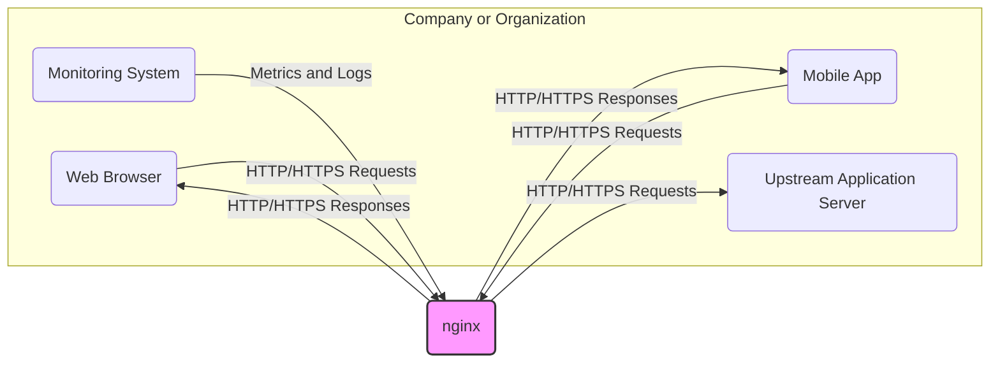
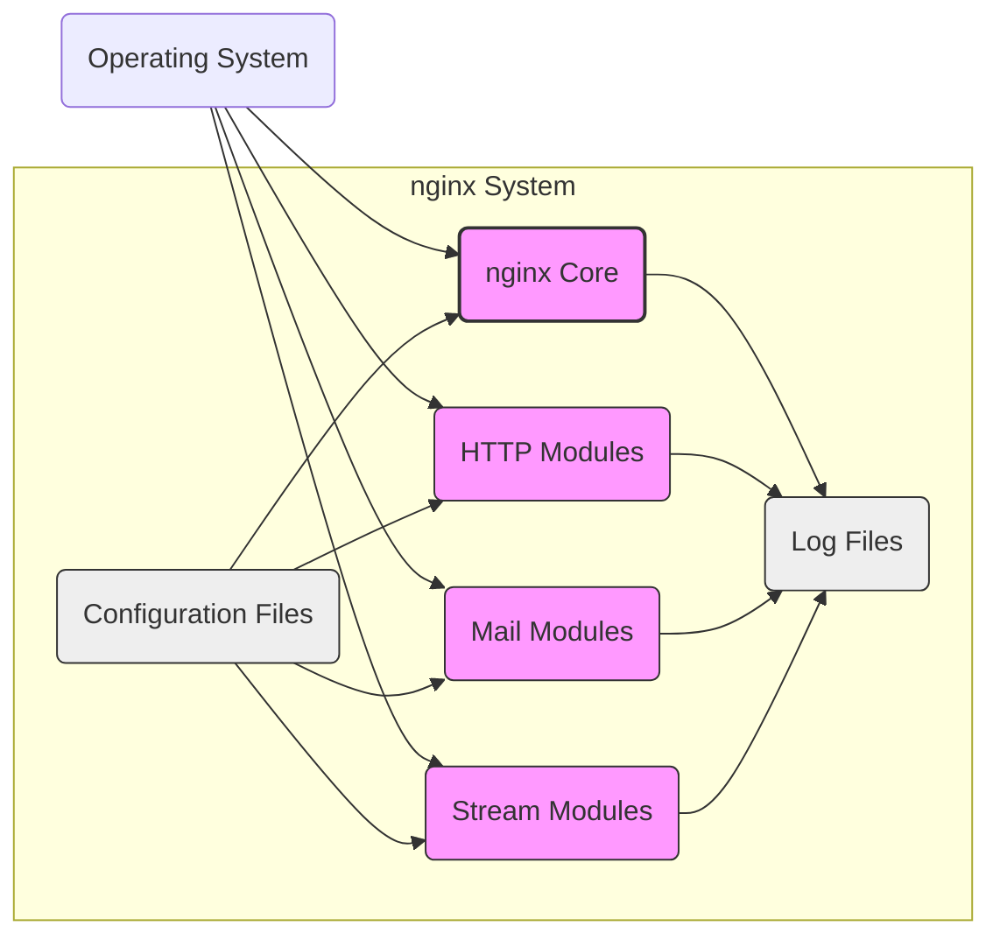
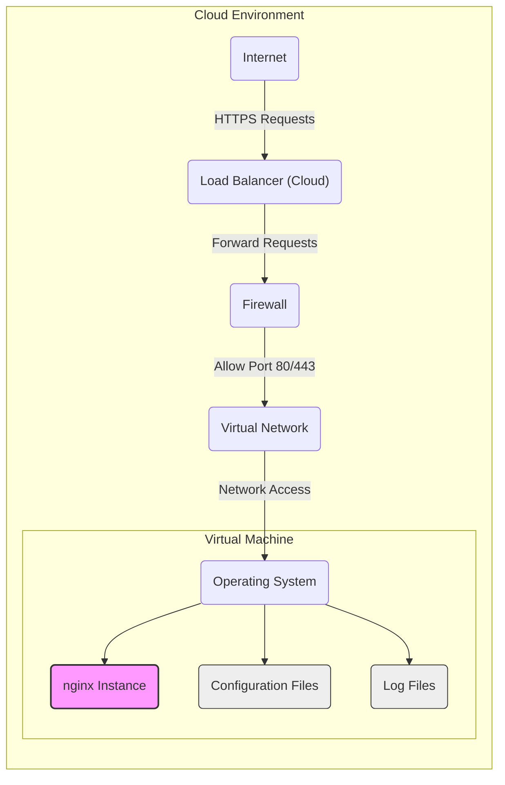

# BUSINESS POSTURE

- Business Priorities and Goals:
  - Provide a reliable and high-performance web server and reverse proxy solution.
  - Enable efficient content delivery and application acceleration.
  - Offer a flexible and extensible platform for various network services.
  - Maintain a strong open-source community and ecosystem.
- Business Risks:
  - Service disruption due to security vulnerabilities or misconfigurations.
  - Data breaches through compromised web applications or server infrastructure.
  - Reputational damage from security incidents or performance issues.
  - Loss of user trust and adoption due to security concerns.

# SECURITY POSTURE

- Existing Security Controls:
  - security control: Open Source Code - publicly available source code allows for community review and vulnerability discovery. (Implemented: GitHub Repository)
  - security control: Regular Security Updates - active development and maintenance with regular releases addressing identified vulnerabilities. (Implemented: nginx.org, GitHub Releases)
  - security control: Configuration Flexibility - extensive configuration options to harden security posture, such as access control lists, TLS/SSL settings, and rate limiting. (Implemented: nginx configuration files)
  - security control: Module Ecosystem - availability of security-focused modules for features like web application firewall (WAF) and intrusion detection/prevention systems (IDS/IPS). (Implemented: nginx modules, 3rd party modules)
- Accepted Risks:
  - accepted risk: Vulnerabilities in Third-Party Modules - security of external modules is dependent on their developers and may introduce vulnerabilities.
  - accepted risk: Misconfiguration by Users - improper configuration can lead to security weaknesses, such as open ports or insecure TLS settings.
  - accepted risk: Zero-Day Vulnerabilities - like all software, nginx is susceptible to undiscovered vulnerabilities.
- Recommended Security Controls:
  - security control: Automated Security Scanning - implement automated vulnerability scanning of nginx binaries and configurations in deployment pipelines.
  - security control: Security Configuration Baselines - define and enforce secure configuration baselines for nginx deployments across the organization.
  - security control: Web Application Firewall (WAF) Integration - deploy a WAF in front of nginx to protect against common web application attacks.
  - security control: Intrusion Detection/Prevention System (IDS/IPS) - implement network-based IDS/IPS to monitor and block malicious traffic targeting nginx.
- Security Requirements:
  - Authentication:
    - Requirement: Implement authentication mechanisms for administrative interfaces, such as the status page or any potential management APIs (if implemented via modules).
    - Requirement: Secure authentication credentials and practices, such as strong passwords or certificate-based authentication.
  - Authorization:
    - Requirement: Enforce authorization policies to control access to resources and functionalities based on user roles or permissions.
    - Requirement: Implement least privilege principle for access control, granting only necessary permissions.
  - Input Validation:
    - Requirement: Validate all incoming HTTP requests to prevent injection attacks (e.g., SQL injection, command injection, cross-site scripting).
    - Requirement: Sanitize user-provided data before processing or logging to mitigate potential vulnerabilities.
  - Cryptography:
    - Requirement: Enforce HTTPS for all sensitive communications to protect data in transit.
    - Requirement: Use strong cryptographic algorithms and protocols for TLS/SSL configuration.
    - Requirement: Properly manage and secure TLS/SSL certificates and private keys.

# DESIGN

## C4 CONTEXT

- Context Diagram Elements:
  - - Name: Web Browser
    - Type: Person/System
    - Description: User accessing web applications or websites through a web browser.
    - Responsibilities: Initiates HTTP/HTTPS requests to access web resources. Renders web pages and applications received from nginx.
    - Security controls: Browser-based security features (e.g., Content Security Policy, Same-Origin Policy), user authentication within web applications.
  - - Name: Mobile App
    - Type: Person/System
    - Description: Mobile application accessing backend services through APIs exposed via nginx.
    - Responsibilities: Initiates HTTP/HTTPS requests to backend APIs. Processes and displays data received from nginx.
    - Security controls: Application-level security features (e.g., API keys, OAuth), mobile platform security controls.
  - - Name: Upstream Application Server
    - Type: System
    - Description: Backend application server(s) that process requests proxied by nginx.
    - Responsibilities: Handles application logic and data processing. Responds to requests from nginx with application data.
    - Security controls: Application-level security controls (e.g., input validation, authorization), server hardening, network segmentation.
  - - Name: Monitoring System
    - Type: System
    - Description: System used to monitor the health, performance, and security of nginx.
    - Responsibilities: Collects metrics and logs from nginx. Provides alerts and dashboards for monitoring and analysis.
    - Security controls: Secure access to monitoring data, secure communication channels, access control for monitoring system.
  - - Name: nginx
    - Type: Software System
    - Description: High-performance web server, reverse proxy, and load balancer.
    - Responsibilities: Receives and processes incoming HTTP/HTTPS requests. Serves static content. Proxies requests to upstream application servers. Provides load balancing and caching. Logs access and error information.
    - Security controls: Access control lists, TLS/SSL encryption, input validation (via modules), rate limiting, security-focused configuration options.

## C4 CONTAINER

- Container Diagram Elements:
  - - Name: nginx Core
    - Type: Container - Process
    - Description: The core nginx process responsible for request processing, event handling, and process management.
    - Responsibilities: Manages worker processes, handles network connections, parses configuration, routes requests to appropriate modules.
    - Security controls: Process isolation, user and group permissions, resource limits, security-focused compilation flags.
  - - Name: HTTP Modules
    - Type: Container - Library/Module
    - Description: Collection of modules providing HTTP-related functionalities, such as serving static content, handling HTTP protocols, reverse proxying, load balancing, and security features (e.g., TLS/SSL, access control).
    - Responsibilities: Implements HTTP protocol handling, content serving, proxying logic, load balancing algorithms, and security features.
    - Security controls: Input validation within modules, secure coding practices, module-specific security configurations.
  - - Name: Mail Modules
    - Type: Container - Library/Module
    - Description: Modules for handling mail proxying (SMTP, POP3, IMAP).
    - Responsibilities: Implements mail proxy protocols, handles mail traffic.
    - Security controls: Protocol-specific security controls, TLS/SSL for mail traffic, authentication mechanisms.
  - - Name: Stream Modules
    - Type: Container - Library/Module
    - Description: Modules for handling generic TCP/UDP stream proxying.
    - Responsibilities: Implements TCP/UDP stream proxying, handles non-HTTP traffic.
    - Security controls: Protocol-specific security controls, access control for stream proxying.
  - - Name: Configuration Files
    - Type: Container - Data Store
    - Description: Text files containing nginx configuration directives.
    - Responsibilities: Defines nginx behavior, including server blocks, locations, modules, and security settings.
    - Security controls: File system permissions to restrict access, secure storage of configuration files, configuration validation.
  - - Name: Log Files
    - Type: Container - Data Store
    - Description: Files storing access logs, error logs, and other nginx logs.
    - Responsibilities: Records events and activities for monitoring, auditing, and security analysis.
    - Security controls: Log rotation and retention policies, secure storage of log files, access control for log files, log sanitization (to avoid logging sensitive data).

## DEPLOYMENT

Deployment Option: Cloud Virtual Machine (VM)

- Deployment Diagram Elements:
  - - Name: Operating System
    - Type: Infrastructure - Software
    - Description: The operating system running on the virtual machine (e.g., Linux).
    - Responsibilities: Provides the foundation for running nginx, manages system resources, and enforces OS-level security controls.
    - Security controls: OS hardening, regular patching, access control, security monitoring.
  - - Name: nginx Instance
    - Type: Infrastructure - Software Instance
    - Description: Running instance of the nginx software.
    - Responsibilities: Serves web content, proxies requests, load balances traffic as configured.
    - Security controls: nginx security configurations, process isolation, resource limits.
  - - Name: Configuration Files
    - Type: Infrastructure - Data
    - Description: nginx configuration files stored on the VM.
    - Responsibilities: Defines nginx behavior and security settings.
    - Security controls: File system permissions, secure storage, configuration management.
  - - Name: Log Files
    - Type: Infrastructure - Data
    - Description: nginx log files stored on the VM.
    - Responsibilities: Records access and error information for monitoring and security analysis.
    - Security controls: Log rotation, secure storage, access control.
  - - Name: Virtual Network
    - Type: Infrastructure - Network
    - Description: Cloud provider's virtual network isolating the VM.
    - Responsibilities: Provides network connectivity and isolation for the VM.
    - Security controls: Network segmentation, network access control lists (NACLs).
  - - Name: Firewall
    - Type: Infrastructure - Security Device
    - Description: Cloud provider's firewall service controlling network traffic to the VM.
    - Responsibilities: Filters network traffic based on defined rules, allowing only necessary ports and protocols.
    - Security controls: Firewall rules to restrict inbound and outbound traffic, intrusion detection/prevention (depending on firewall capabilities).
  - - Name: Load Balancer (Cloud)
    - Type: Infrastructure - Load Balancer
    - Description: Cloud provider's load balancer distributing traffic across multiple nginx instances (if scaled horizontally).
    - Responsibilities: Distributes incoming traffic, provides high availability and scalability.
    - Security controls: TLS/SSL termination, load balancing algorithms, health checks, DDoS protection (depending on cloud provider).
  - - Name: Internet
    - Type: Environment
    - Description: Public internet from where users access nginx.
    - Responsibilities: Source of user traffic.
    - Security controls: N/A - external environment.

## BUILD

```mermaid
flowchart LR
    A("Developer") -- "Code Changes" --> B("Version Control System (GitHub)")
    B -- "Webhook Trigger" --> C("CI/CD System (GitHub Actions)")
    C -- "Checkout Code" --> D("Build Environment")
    D -- "Compile & Build" --> E("Build Artifacts (Binaries)")
    D -- "SAST & Security Scanners" --> C
    E -- "Publish Artifacts" --> F("Artifact Repository")
    style E fill:#f9f,stroke:#333,stroke-width:2px
    style F fill:#eee,stroke:#333,stroke-width:1px
```

- Build Process Elements:
  - - Name: Developer
    - Type: Person
    - Description: Software developer contributing code to the nginx project.
    - Responsibilities: Writes code, performs local testing, commits code changes to the version control system.
    - Security controls: Secure development environment, code review, security awareness training.
  - - Name: Version Control System (GitHub)
    - Type: Tool - Software Repository
    - Description: GitHub repository hosting the nginx source code.
    - Responsibilities: Stores and manages source code, tracks changes, facilitates collaboration.
    - Security controls: Access control, branch protection, audit logging, vulnerability scanning of dependencies (GitHub Dependabot).
  - - Name: CI/CD System (GitHub Actions)
    - Type: Tool - Automation
    - Description: GitHub Actions used for automated build, test, and deployment pipelines.
    - Responsibilities: Automates build process, runs tests, performs security scans, publishes build artifacts.
    - Security controls: Secure pipeline configuration, access control for workflows, secret management, audit logging.
  - - Name: Build Environment
    - Type: Environment - Compute
    - Description: Environment where the nginx software is compiled and built (e.g., virtual machine, container).
    - Responsibilities: Provides necessary tools and dependencies for building nginx. Executes build scripts and commands.
    - Security controls: Secure build environment, hardened OS, access control, regular patching, isolated environment.
  - - Name: Build Artifacts (Binaries)
    - Type: Artifact - Software
    - Description: Compiled nginx binaries and related files.
    - Responsibilities: Deployable software packages.
    - Security controls: Integrity checks (e.g., checksums, signatures), vulnerability scanning of build artifacts.
  - - Name: Artifact Repository
    - Type: Tool - Storage
    - Description: Repository for storing and managing build artifacts (e.g., GitHub Releases, package repositories).
    - Responsibilities: Securely stores and distributes build artifacts.
    - Security controls: Access control, secure storage, integrity checks, versioning.
  - - Name: SAST & Security Scanners
    - Type: Tool - Security
    - Description: Static Application Security Testing (SAST) tools and other security scanners integrated into the CI/CD pipeline.
    - Responsibilities: Automatically analyze source code and build artifacts for potential security vulnerabilities.
    - Security controls: Tool configuration, vulnerability reporting, integration with CI/CD pipeline.

# RISK ASSESSMENT

- Critical Business Processes:
  - Serving web content to users.
  - Proxying requests to backend application servers.
  - Load balancing traffic across multiple servers.
  - Ensuring website and application availability and performance.
- Data to Protect:
  - Configuration data: nginx configuration files contain sensitive information like TLS/SSL keys, upstream server addresses, and access control rules. Sensitivity: High.
  - Log data: Access logs and error logs may contain user IP addresses, requested URLs, and potentially sensitive application data. Sensitivity: Medium to High (depending on logging configuration and regulations).
  - Cached content: If caching is enabled, nginx may store cached copies of web content, which could include sensitive data. Sensitivity: Medium to High (depending on cached content).

# QUESTIONS & ASSUMPTIONS

- Questions:
  - What is the specific use case for nginx in this context (e.g., public-facing web server, internal reverse proxy, API gateway)?
  - What are the specific security requirements and compliance standards that need to be met?
  - What is the organization's risk appetite and security maturity level?
  - Are there any specific third-party modules or integrations that are planned to be used with nginx?
  - What is the expected scale and performance requirements for the nginx deployment?
- Assumptions:
  - General-purpose web server and reverse proxy use case.
  - Moderate security sensitivity for data handled by nginx.
  - Deployment in a cloud virtual machine environment.
  - Standard open-source build process using GitHub Actions.
  - Focus on common security best practices for web servers and reverse proxies.