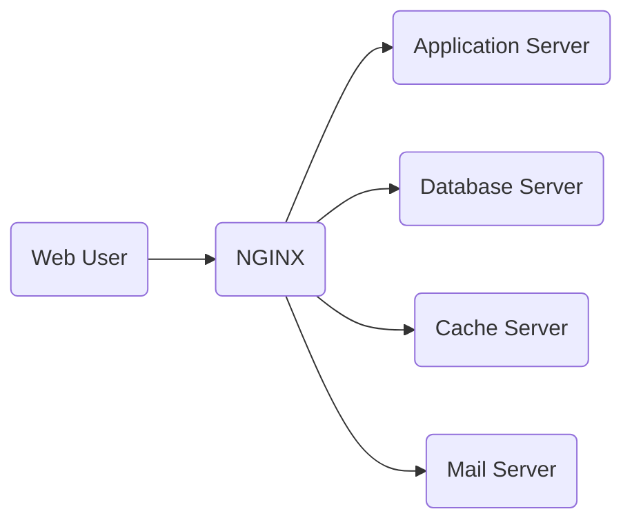
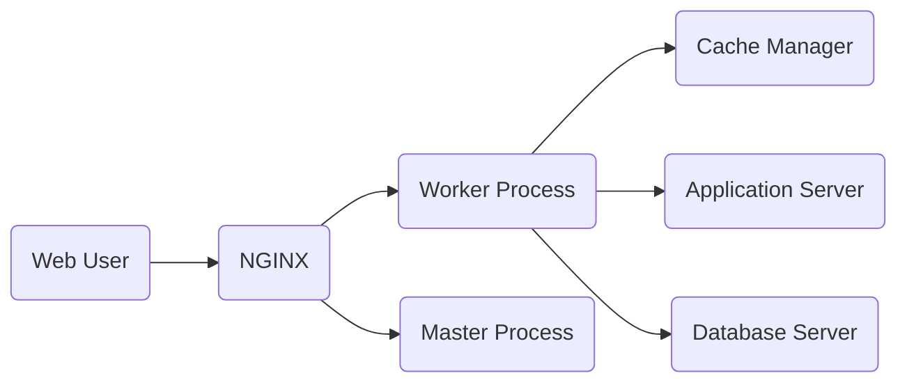
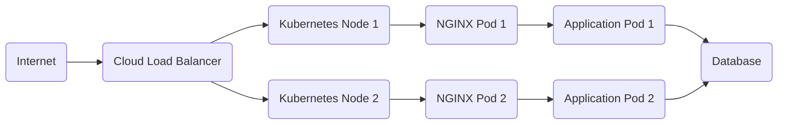
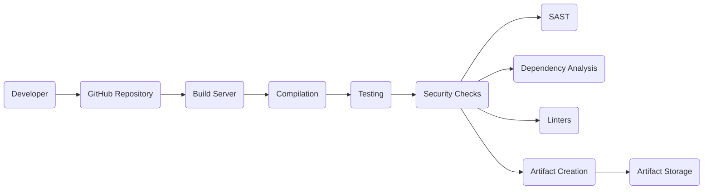

# BUSINESS POSTURE

NGINX is a widely-used, open-source, high-performance HTTP server, reverse proxy, load balancer, mail proxy, and HTTP cache. It's known for its stability, rich feature set, simple configuration, and low resource consumption. Given its widespread use in production environments across various industries, the business posture centers around reliability, performance, and security.

Business Priorities and Goals:

*   Provide a stable and reliable web server and reverse proxy solution.
*   Ensure high performance and efficient resource utilization.
*   Maintain a secure environment for web applications and services.
*   Offer a flexible and extensible platform through modules.
*   Support a wide range of operating systems and platforms.
*   Maintain an active and supportive open-source community.
*   Provide commercial offerings (NGINX Plus) with additional features and support.

Business Risks:

*   Service disruption due to software vulnerabilities or misconfiguration, leading to downtime for websites and applications.
*   Performance degradation impacting user experience and potentially causing revenue loss.
*   Security breaches allowing unauthorized access to sensitive data or system compromise.
*   Reputational damage due to security incidents or prolonged outages.
*   Inability to scale to meet increasing traffic demands.
*   Compatibility issues with new operating systems or platforms.
*   Loss of community support or developer interest.

# SECURITY POSTURE

Existing Security Controls (based on the repository and general knowledge of NGINX):

*   security control: Access Control Lists (ACLs): NGINX allows configuration of access restrictions based on IP addresses and other parameters. Implemented in configuration files.
*   security control: SSL/TLS Termination: NGINX can handle SSL/TLS encryption and decryption, protecting data in transit. Implemented in configuration files using SSL/TLS certificates.
*   security control: HTTP/2 and HTTP/3 Support: NGINX supports modern HTTP protocols, which include security enhancements. Implemented in the core and through modules.
*   security control: Rate Limiting: NGINX can limit the number of requests from a single client, mitigating DoS attacks. Implemented in configuration files.
*   security control: Web Application Firewall (WAF) capabilities (primarily in NGINX Plus and through modules like ModSecurity): Protection against common web attacks (SQL injection, XSS, etc.). Implemented through modules and configuration.
*   security control: Regular Security Updates: The NGINX team releases updates to address vulnerabilities. Implemented through package managers or manual updates.
*   security control: Secure Configuration Defaults: NGINX generally ships with secure default configurations, minimizing the attack surface. Implemented in default configuration files.
*   security control: Support for various authentication mechanisms: Basic Auth, client certificate authentication, etc. Implemented in configuration files and through modules.
*   security control: Sandboxing (through system-level mechanisms like seccomp, AppArmor, or SELinux): Limiting the impact of potential exploits. Implemented at the operating system level, configured separately from NGINX.
*   security control: Code Audits and Static Analysis: The NGINX codebase undergoes regular security reviews. Implemented during the development process.

Accepted Risks:

*   accepted risk: Misconfiguration: NGINX is highly configurable, and incorrect configurations can introduce security vulnerabilities. This is mitigated by documentation, best practices, and community support.
*   accepted risk: Zero-day vulnerabilities: Like any software, NGINX may be susceptible to unknown vulnerabilities. This is mitigated by rapid response to disclosed vulnerabilities and regular security updates.
*   accepted risk: DDoS attacks: While NGINX has features to mitigate DDoS attacks, sufficiently large attacks can still overwhelm resources. This is mitigated by using external DDoS protection services and scaling infrastructure.
*   accepted risk: Supply chain attacks: Compromise of third-party modules or dependencies. Mitigated by using trusted sources and verifying module integrity.

Recommended Security Controls:

*   Implement a robust Web Application Firewall (WAF) solution, either through NGINX Plus or a well-maintained module like ModSecurity.
*   Regularly conduct penetration testing and vulnerability scanning to identify and address potential weaknesses.
*   Implement comprehensive logging and monitoring to detect and respond to security incidents.
*   Enforce the principle of least privilege for NGINX worker processes.
*   Implement a Content Security Policy (CSP) to mitigate XSS attacks.
*   Use HTTP Strict Transport Security (HSTS) to enforce HTTPS connections.

Security Requirements:

*   Authentication:
    *   Support for strong authentication mechanisms, including multi-factor authentication (MFA) where applicable (e.g., for administrative interfaces).
    *   Secure storage of credentials (e.g., using hashing and salting).
    *   Protection against brute-force attacks.
*   Authorization:
    *   Fine-grained access control to resources based on user roles and permissions.
    *   Enforcement of the principle of least privilege.
*   Input Validation:
    *   Strict validation of all input data, including headers, query parameters, and request bodies.
    *   Protection against common web attacks (SQL injection, XSS, command injection, etc.).
*   Cryptography:
    *   Use of strong, up-to-date cryptographic algorithms and protocols (e.g., TLS 1.3).
    *   Secure management of cryptographic keys.
    *   Protection of data at rest (if applicable).

# DESIGN

## C4 CONTEXT

Element Descriptions:

*   Element:
    *   Name: Web User
    *   Type: Person
    *   Description: A user accessing web content served by NGINX.
    *   Responsibilities: Initiates HTTP requests to access web pages, applications, or APIs.
    *   Security controls: Browser security settings, antivirus software, firewall.

*   Element:
    *   Name: NGINX
    *   Type: Software System
    *   Description: The NGINX web server and reverse proxy.
    *   Responsibilities: Handles incoming HTTP requests, serves static content, proxies requests to backend servers, load balances traffic, caches content, and handles SSL/TLS termination.
    *   Security controls: Access control lists, SSL/TLS configuration, rate limiting, WAF (with modules or NGINX Plus), authentication mechanisms.

*   Element:
    *   Name: Application Server
    *   Type: Software System
    *   Description: A backend server that processes dynamic content requests.
    *   Responsibilities: Executes application logic, interacts with databases, and generates dynamic responses.
    *   Security controls: Application-level security controls, input validation, authentication, authorization.

*   Element:
    *   Name: Database Server
    *   Type: Software System
    *   Description: A server that stores and manages data used by the application.
    *   Responsibilities: Stores, retrieves, updates, and deletes data.
    *   Security controls: Database access controls, encryption at rest, encryption in transit, auditing.

*   Element:
    *   Name: Cache Server
    *   Type: Software System
    *   Description: A server that stores frequently accessed data to improve performance.
    *   Responsibilities: Caches data from backend servers, serves cached content to NGINX.
    *   Security controls: Access controls, cache invalidation mechanisms.

*   Element:
    *   Name: Mail Server
    *   Type: Software System
    *   Description: A server that handles email sending and receiving (when NGINX is used as a mail proxy).
    *   Responsibilities: Processes email messages, interacts with other mail servers.
    *   Security controls: Email security protocols (SPF, DKIM, DMARC), spam filtering, antivirus scanning.

## C4 CONTAINER

Element Descriptions:

*   Element:
    *   Name: Web User
    *   Type: Person
    *   Description: A user accessing web content served by NGINX.
    *   Responsibilities: Initiates HTTP requests to access web pages, applications, or APIs.
    *   Security controls: Browser security settings, antivirus software, firewall.

*   Element:
    *   Name: NGINX
    *   Type: Software System
    *   Description: The NGINX web server and reverse proxy.
    *   Responsibilities: Handles incoming HTTP requests, serves static content, proxies requests to backend servers, load balances traffic, caches content, and handles SSL/TLS termination.
    *   Security controls: Access control lists, SSL/TLS configuration, rate limiting, WAF (with modules or NGINX Plus), authentication mechanisms.

*   Element:
    *   Name: Master Process
    *   Type: Container
    *   Description: The main NGINX process that manages worker processes.
    *   Responsibilities: Reads configuration, manages worker processes, handles signals.
    *   Security controls: Runs with limited privileges, strict resource limits.

*   Element:
    *   Name: Worker Process
    *   Type: Container
    *   Description: Processes that handle actual client requests.
    *   Responsibilities: Handles HTTP requests, interacts with backend servers, serves content.
    *   Security controls: Runs with limited privileges, sandboxing (seccomp, AppArmor, SELinux), access control lists, rate limiting.

*   Element:
    *   Name: Cache Manager
    *   Type: Container
    *   Description: Manages the cache (if caching is enabled).
    *   Responsibilities: Stores and retrieves cached content, manages cache expiration.
    *   Security controls: Access controls, secure storage of cached data.

*   Element:
    *   Name: Application Server
    *   Type: Software System
    *   Description: A backend server that processes dynamic content requests.
    *   Responsibilities: Executes application logic, interacts with databases, and generates dynamic responses.
    *   Security controls: Application-level security controls, input validation, authentication, authorization.

*   Element:
    *   Name: Database Server
    *   Type: Software System
    *   Description: A server that stores and manages data used by the application.
    *   Responsibilities: Stores, retrieves, updates, and deletes data.
    *   Security controls: Database access controls, encryption at rest, encryption in transit, auditing.

## DEPLOYMENT

Possible Deployment Solutions:

1.  Bare Metal: NGINX installed directly on physical servers.
2.  Virtual Machines: NGINX installed within virtual machines (e.g., VMware, KVM, Hyper-V).
3.  Containers: NGINX deployed as a container (e.g., Docker) within a container orchestration platform (e.g., Kubernetes, Docker Swarm).
4.  Cloud Provider: NGINX deployed using cloud provider services (e.g., AWS EC2, Azure VMs, Google Compute Engine).

Chosen Solution (Containers with Kubernetes):

Element Descriptions:

*   Element:
    *   Name: Internet
    *   Type: External Entity
    *   Description: The public internet.
    *   Responsibilities: Source of client requests.
    *   Security controls: Network firewalls, intrusion detection/prevention systems.

*   Element:
    *   Name: Cloud Load Balancer
    *   Type: Infrastructure
    *   Description: A load balancer provided by the cloud provider (e.g., AWS ELB, Azure Load Balancer, Google Cloud Load Balancer).
    *   Responsibilities: Distributes incoming traffic across multiple Kubernetes nodes.
    *   Security controls: DDoS protection, SSL/TLS termination, health checks.

*   Element:
    *   Name: Kubernetes Node 1, Kubernetes Node 2
    *   Type: Infrastructure
    *   Description: Worker nodes in the Kubernetes cluster.
    *   Responsibilities: Run containerized applications.
    *   Security controls: Node-level security hardening, network policies, resource limits.

*   Element:
    *   Name: NGINX Pod 1, NGINX Pod 2
    *   Type: Container
    *   Description: Kubernetes Pods running the NGINX container.
    *   Responsibilities: Handle incoming requests, proxy to application pods.
    *   Security controls: Container image security scanning, network policies, resource limits, NGINX security configuration.

*   Element:
    *   Name: Application Pod 1, Application Pod 2
    *   Type: Container
    *   Description: Kubernetes Pods running the application containers.
    *   Responsibilities: Process application logic.
    *   Security controls: Container image security scanning, application-level security controls.

*   Element:
    *   Name: Database
    *   Type: External System/Infrastructure
    *   Description: The database used by the application. Could be a managed database service or a separate deployment.
    *   Responsibilities: Store and manage application data.
    *   Security controls: Database access controls, encryption at rest, encryption in transit.

## BUILD

The NGINX build process typically involves compiling the source code and creating executable binaries.  While the provided repository doesn't include a specific CI/CD pipeline definition (like a .github/workflows directory), the general process and security considerations are outlined below.

Build Process:

1.  Developer: A developer writes or modifies NGINX source code.
2.  Source Code Repository (GitHub): Code changes are pushed to the GitHub repository.
3.  Build Server (e.g., Jenkins, GitLab CI, or a dedicated build machine): A build server pulls the latest code from the repository.
4.  Compilation: The build server compiles the NGINX source code using a compiler (e.g., GCC, Clang) and build tools (e.g., make).
5.  Testing: Automated tests (unit tests, integration tests) are executed to verify the functionality and stability of the build.
6.  Security Checks:
    *   Static Analysis Security Testing (SAST): Tools like Coverity, SonarQube, or custom scripts analyze the source code for potential vulnerabilities.
    *   Dependency Analysis: Tools check for known vulnerabilities in third-party libraries and dependencies.
    *   Linters: Code linters (e.g., shellcheck for shell scripts) enforce coding standards and identify potential errors.
7.  Artifact Creation: If all tests and checks pass, the build server creates executable binaries and potentially packages them (e.g., .deb, .rpm).
8.  Artifact Storage: The build artifacts are stored in a repository (e.g., a package repository, artifact registry).

Security Controls in Build Process:

*   security control: Secure Coding Practices: Developers follow secure coding guidelines to minimize vulnerabilities.
*   security control: Code Reviews: Code changes are reviewed by other developers to identify potential issues.
*   security control: SAST: Static analysis tools scan the source code for vulnerabilities.
*   security control: Dependency Analysis: Tools check for known vulnerabilities in dependencies.
*   security control: Build Automation: The build process is automated to ensure consistency and repeatability.
*   security control: Least Privilege: Build servers and processes run with minimal necessary privileges.
*   security control: Signed Builds: Build artifacts can be digitally signed to ensure their integrity and authenticity.

# RISK ASSESSMENT

Critical Business Processes:

*   Serving web content and applications: NGINX is critical for delivering websites and applications to users.
*   Load balancing and traffic management: NGINX ensures high availability and performance by distributing traffic across multiple servers.
*   Reverse proxying: NGINX acts as a gateway to backend applications, providing security and performance benefits.
*   Caching: NGINX improves performance by caching frequently accessed content.

Data Sensitivity:

*   User Data (if applicable): Depending on the application, NGINX may handle user data, including personal information, authentication credentials, and session data. Sensitivity: High.
*   Configuration Data: NGINX configuration files contain sensitive information, such as SSL/TLS certificates, access control rules, and backend server addresses. Sensitivity: High.
*   Cached Data: Cached content may include sensitive data, depending on the application. Sensitivity: Varies, potentially high.
*   Logs: NGINX logs may contain sensitive information, such as IP addresses, user agents, and request details. Sensitivity: Medium to High.

# QUESTIONS & ASSUMPTIONS

Questions:

*   What specific modules are being used or considered for use with NGINX? This impacts the security posture and potential attack surface.
*   What is the specific operating system and platform where NGINX will be deployed? This affects security hardening and configuration.
*   What are the specific performance requirements and expected traffic volume? This influences scaling and resource allocation.
*   Are there any existing security policies or compliance requirements (e.g., PCI DSS, HIPAA) that need to be considered?
*   What is the process for managing and updating NGINX configurations?
*   What is the monitoring and logging strategy for NGINX?
*   What is the incident response plan in case of a security breach or service disruption?

Assumptions:

*   BUSINESS POSTURE: The organization prioritizes stability, performance, and security for its web infrastructure.
*   SECURITY POSTURE: The organization has a basic understanding of security best practices and is willing to implement necessary controls.
*   DESIGN: NGINX will be deployed in a containerized environment using Kubernetes. A basic, common setup is assumed. The application being served is a standard web application.
*   BUILD: A standard build process is used, with compilation from source.