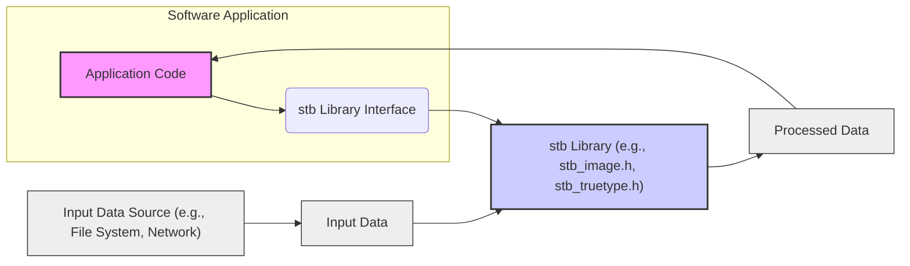
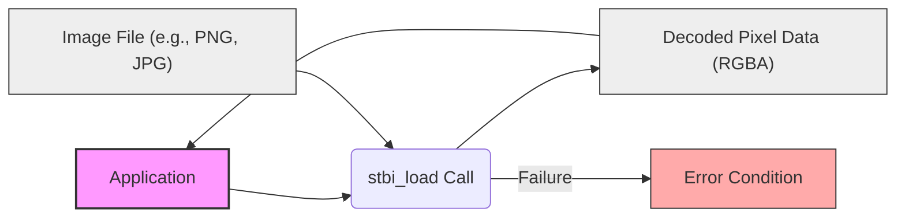
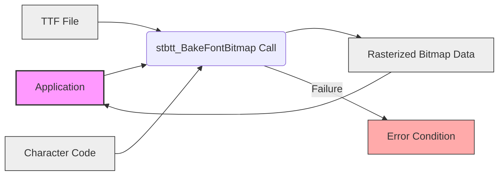

# Project Design Document: stb Library Integration

**Version:** 1.1
**Date:** October 26, 2023
**Author:** AI Software Architect

## 1. Introduction

This document details the design for integrating libraries from the `stb` collection (available at [https://github.com/nothings/stb](https://github.com/nothings/stb)) into a software project. The primary goal is to provide a clear architectural and data flow description to facilitate subsequent threat modeling. `stb` offers single-file, public domain libraries for various tasks, particularly in media processing and utilities. This document outlines the general integration principles applicable to any `stb` component, using image loading (`stb_image.h`) and true type font rasterization (`stb_truetype.h`) as illustrative examples.

## 2. Goals and Objectives

This design document aims to:

*   Clearly and concisely describe the architectural integration of `stb` libraries.
*   Illustrate the data flow involved when using `stb` functionalities.
*   Identify key components and their interactions relevant for security analysis and threat modeling.
*   Serve as the foundational document for conducting threat modeling on systems utilizing `stb`.

## 3. Scope

This document focuses specifically on how `stb` libraries are incorporated into a software project. The scope includes:

*   The general architectural pattern for integrating `stb`.
*   Data flow during typical `stb` operations (e.g., loading images, rasterizing fonts).
*   Interfaces and interactions between the application and the `stb` library.

This document explicitly excludes:

*   The internal implementation details of the `stb` libraries themselves.
*   Detailed specifics of every individual `stb` library.
*   The overall design of the encompassing software project beyond its interaction with `stb`.
*   The actual threat model itself, which will be documented separately.

## 4. System Architecture

`stb` libraries are typically integrated through direct inclusion of their single header file into the consuming application's source code.

The following diagram illustrates this architecture:

**Components:**

*   **Software Application:** The main program utilizing functionalities provided by `stb` libraries.
*   **stb Library Interface:** The specific points in the application's code where the `stb` header file is included and its functions are called. This acts as the bridge between the application and the library.
*   **stb Library:** One or more of the single-file header libraries from the `stb` collection (e.g., `stb_image.h`, `stb_truetype.h`).
*   **Input Data Source:** The origin of the data to be processed by the `stb` library. Examples include:
    *   Local file system
    *   Network connections
    *   In-memory data structures
*   **Input Data:** The raw data provided to the `stb` library for processing (e.g., image files, font files).
*   **Processed Data:** The output generated by the `stb` library after processing the input data (e.g., pixel data, glyph bitmaps). This data is then consumed by the application.

**Interaction Flow:**

1. The **Software Application** requires a specific function from an `stb` library.
2. The application includes the relevant `stb` header file at the **stb Library Interface**.
3. The application retrieves **Input Data** from an **Input Data Source**.
4. The application passes the **Input Data** to the appropriate `stb` library function.
5. The `stb` library processes the **Input Data**.
6. The `stb` library returns **Processed Data** to the application.
7. The **Software Application** utilizes the **Processed Data**.

## 5. Data Flow

Let's examine the data flow with the examples of image loading and font rasterization.

### 5.1. Image Loading (using `stb_image.h`)

**Data Flow Steps:**

*   The **Application** initiates image loading by calling a function from `stb_image.h`, such as `stbi_load`.
*   The **Image File** (e.g., from the file system or network) is provided as input to `stbi_load`.
*   `stbi_load` attempts to decode the image data.
*   On successful decoding, it returns **Decoded Pixel Data** (typically an array of RGBA pixel values).
*   The **Application** receives and uses the **Decoded Pixel Data**.
*   If decoding fails (e.g., invalid format, corrupted data), an **Error Condition** occurs, and `stbi_load` might return a null pointer or an error indicator.

### 5.2. True Type Font Rasterization (using `stb_truetype.h`)

**Data Flow Steps:**

*   The **Application** starts font rasterization by calling a function from `stb_truetype.h`, like `stbtt_BakeFontBitmap`.
*   The **TTF File** (True Type Font file) is provided as input.
*   The specific **Character Code** to be rasterized is also provided.
*   `stbtt_BakeFontBitmap` rasterizes the specified character into a bitmap.
*   The function returns **Rasterized Bitmap Data** representing the glyph.
*   The **Application** receives and uses the **Rasterized Bitmap Data**.
*   If rasterization fails, an **Error Condition** is triggered.

## 6. Security Considerations

Integrating external libraries like `stb` introduces potential security considerations that are crucial for threat modeling:

*   **Input Validation Vulnerabilities:** `stb` libraries parse various file formats. Insufficient validation of input files can lead to:
    *   Buffer overflows: If input data exceeds expected boundaries, it can overwrite adjacent memory.
    *   Integer overflows: When calculating memory sizes or offsets based on input data, overflows can lead to unexpected behavior and potential vulnerabilities.
    *   Denial of Service (DoS):  Processing maliciously crafted, oversized, or deeply nested input files can consume excessive resources, leading to application unavailability.
*   **Memory Management Issues:**  `stb` libraries allocate memory for processing. Improper memory management can result in:
    *   Memory leaks: Failure to deallocate memory after use, potentially leading to resource exhaustion over time.
    *   Use-after-free vulnerabilities: Accessing memory that has already been freed, leading to crashes or exploitable conditions.
*   **Supply Chain Risks:** While `stb` is generally trusted, verifying the integrity of the downloaded source code is essential to prevent the use of compromised versions containing malicious code.
*   **Error Handling Negligence:**  The application's handling of errors returned by `stb` functions is critical. Ignoring errors can mask underlying issues and lead to unpredictable behavior or security breaches.
*   **Incorrect Configuration and Usage:**  Misconfiguring or incorrectly using `stb` functions, such as providing incorrect buffer sizes to output functions, can introduce vulnerabilities.

## 7. Assumptions and Dependencies

*   It is assumed that developers integrating `stb` possess a basic understanding of memory management principles in C/C++.
*   The integration model assumes the direct inclusion of the `stb` library's single header file, as per its intended design.
*   The application's functionality depends on the correct compilation and linking of the C/C++ code, including the `stb` header.
*   The overall system security relies on secure coding practices within the application itself, beyond the specific usage of `stb`.

## 8. Future Considerations

*   This design document can be further refined to provide more specific details for individual `stb` libraries, detailing their unique data flow and potential vulnerabilities.
*   Analysis of integration with different programming languages (through wrappers or bindings) could be addressed in separate design documents.
*   Detailed descriptions of specific use cases within the software application can provide further context for understanding `stb` usage and potential risks.

This document provides a comprehensive overview of `stb` library integration, offering a solid foundation for identifying potential threats and vulnerabilities during the subsequent threat modeling process.
