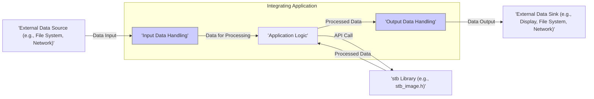
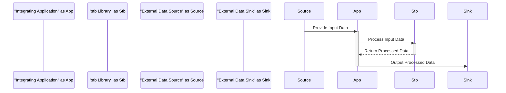

# Project Design Document: stb Libraries Integration

**Version:** 1.1
**Date:** October 26, 2023
**Author:** Gemini (AI Language Model)

## 1. Introduction

This document provides a detailed design overview of a project that integrates one or more libraries from the `stb` collection (https://github.com/nothings/stb). The purpose of this document is to clearly define the architecture, components, and data flow of the integration, which will serve as the foundation for subsequent threat modeling activities. This document focuses on the general principles of integrating `stb` libraries, illustrating concepts with examples where beneficial. The specific library used will significantly influence the finer implementation details and potential vulnerabilities.

## 2. Goals

*   Clearly define the architecture of a system integrating `stb` libraries.
*   Identify key components and their interactions, emphasizing security-relevant boundaries.
*   Describe the data flow within the integrated system, highlighting potential points of manipulation or interception.
*   Provide sufficient detail for effective threat modeling, enabling the identification of potential vulnerabilities and attack vectors.
*   Highlight potential security considerations based on the design, offering initial mitigation strategies.

## 3. Project Overview

The `stb` collection offers single-file, public domain libraries for various tasks, primarily in graphics, audio, and general utilities. This design document considers a scenario where an application (the "Integrating Application") utilizes one or more `stb` libraries to perform specific functions. For instance, the application might use `stb_image.h` to load and decode image files. The core architecture revolves around the interaction between the Integrating Application and the chosen `stb` library.

## 4. System Architecture

The system architecture centers on the Integrating Application and the selected `stb` library, emphasizing the flow of data and control.

### 4.1. Components

*   **Integrating Application:** The main software application utilizing the `stb` library.
    *   **Application Logic:** The core functionality, determining when and how to use the `stb` library. This includes business rules, user interface interactions, and overall program flow.
    *   **Input Data Handling:** Responsible for securely retrieving and preparing data for the `stb` library. This involves sanitization, validation, and potentially format conversion. This is a critical point for security.
    *   **Output Data Handling:** Responsible for securely receiving and processing the output from the `stb` library. This might involve further processing, sanitization before display or storage, and error handling. This is another critical point for security.
*   **stb Library:** The specific `stb` library being used (e.g., `'stb_image.h'` for image loading/decoding, `'stb_vorbis.c'` for Ogg Vorbis decoding'). This component performs the core task.
*   **External Data Source:** The origin of the data processed by the `stb` library. Examples:
    *   File system (reading image files, audio files).
    *   Network (receiving image data, audio streams).
    *   In-memory buffers (potentially from other parts of the application or other libraries).
*   **External Data Sink:** The destination of the processed data. Examples:
    *   Display (rendering images).
    *   Audio output devices.
    *   File system (saving processed images, audio).
    *   Network (sending processed data).

## 5. Data Flow

The data flow involves the Integrating Application providing input to the `stb` library and processing the output. Security considerations arise at each stage.

### 5.1. Detailed Data Flow Steps

1. **Data Acquisition:** The Integrating Application retrieves data from an External Data Source. This step requires careful consideration of data integrity and origin.
    *   Example: Reading an image file from disk.
2. **Input Validation and Sanitization:** The Integrating Application *should* validate and sanitize the input data before passing it to the `stb` library. This is crucial to prevent vulnerabilities.
    *   Example: Checking the file extension and size before attempting to decode an image.
3. **`stb` Library Invocation:** The Integrating Application calls a function within the `stb` library, passing the input data (or a pointer) and parameters.
    *   Example: Calling `stbi_load()` with the file path.
4. **`stb` Library Processing:** The `stb` library processes the input data according to its function. Potential vulnerabilities within the `stb` library itself are a concern here.
    *   Example: Decoding the image data into a pixel array.
5. **Output Generation:** The `stb` library generates the processed output data.
    *   Example: Returning a pointer to the decoded pixel data, width, height, and number of channels.
6. **Output Validation and Sanitization:** The Integrating Application *should* validate and sanitize the output data received from the `stb` library before further use.
    *   Example: Checking if the returned pointer is valid and if the dimensions are within expected limits.
7. **Output Handling:** The Integrating Application processes the output data.
    *   Example: Preparing the pixel data for rendering on the screen.
8. **Data Output:** The Integrating Application sends the processed data to an External Data Sink. This step requires consideration of how the data is transmitted or stored.
    *   Example: Sending the pixel data to the graphics card for display.

## 6. External Interfaces

The Integrating Application interacts with the `stb` library through its C/C++ API.

*   **`stb` Library API:** The functions provided by the chosen `stb` library.
    *   Example for `'stb_image.h'`: `stbi_load()`, `stbi_image_free()`, `stbi_info()`.
    *   Example for `'stb_vorbis.c'`: `stb_vorbis_open_filename()`, `stb_vorbis_get_samples_float()`, `stb_vorbis_close()`.
*   **External Data Source Interfaces:** The mechanisms used to retrieve data.
    *   File system APIs (e.g., `fopen()`, `fread()`, `fclose()`). Security considerations include file access permissions and handling of potentially malicious files.
    *   Network APIs (e.g., sockets, HTTP clients). Security considerations include secure communication protocols (HTTPS), input validation of received data, and protection against network attacks.
    *   Memory access (pointers). Security considerations include ensuring the memory is valid and accessible, and preventing access to sensitive data.
*   **External Data Sink Interfaces:** The mechanisms used to send data.
    *   Graphics APIs (e.g., OpenGL, DirectX). Security considerations include preventing buffer overflows when passing data to the graphics API.
    *   Audio APIs (e.g., OpenAL, system audio libraries). Security considerations include preventing buffer overflows and ensuring proper audio format handling.
    *   File system APIs (e.g., `fopen()`, `fwrite()`, `fclose()`). Security considerations include file write permissions and preventing the creation or modification of sensitive files.
    *   Network APIs (e.g., sockets, HTTP servers). Security considerations include secure communication protocols and preventing the transmission of sensitive data without proper encryption.

## 7. Security Considerations

Integrating `stb` libraries introduces several security considerations that must be addressed during threat modeling:

*   **Buffer Overflows:**  A primary concern, especially when handling untrusted input data. Malformed or excessively large input could cause `stb` library functions to write beyond allocated buffers.
    *   *Mitigation:* Thorough input validation and sanitization before passing data to `stb` functions. Consider using size limits and format checks.
*   **Integer Overflows:** Calculations within `stb` libraries related to image dimensions, audio sample counts, etc., could overflow, leading to unexpected behavior, incorrect memory allocation, or buffer overflows.
    *   *Mitigation:*  Validate input dimensions and sizes against reasonable limits. Be aware of potential integer overflow issues in the specific `stb` library being used.
*   **Denial of Service (DoS):** Processing extremely large or specially crafted input data could consume excessive resources (CPU, memory), potentially crashing the application or making it unresponsive.
    *   *Mitigation:* Implement resource limits and timeouts for processing. Consider techniques like input data size limits and early rejection of suspicious data.
*   **Input Validation Vulnerabilities:** If the Integrating Application fails to properly validate input data before passing it to the `stb` library, it becomes vulnerable to issues within the `stb` library.
    *   *Mitigation:* Implement robust input validation checks, including format validation, range checks, and sanitization of potentially malicious characters.
*   **Memory Management Errors:** Incorrect memory management by the Integrating Application when dealing with data used by or returned from `stb` libraries can lead to memory leaks, dangling pointers, or double frees, potentially exploitable vulnerabilities.
    *   *Mitigation:* Follow strict memory management practices. Ensure that memory allocated for `stb` library input and output is properly freed when no longer needed. Use tools like Valgrind to detect memory errors.
*   **Path Traversal (if applicable):** If the `stb` library is used to load files based on user-provided paths, insufficient sanitization could allow attackers to access files outside the intended directory.
    *   *Mitigation:*  Sanitize file paths to prevent ".." sequences or absolute paths that could lead to unauthorized file access.
*   **Supply Chain Security:** While `stb` libraries are single-file, ensure the source of the `stb` library is trusted and hasn't been tampered with.
    *   *Mitigation:* Download `stb` libraries from the official repository or trusted sources. Verify checksums if available.

## 8. Assumptions and Constraints

*   The Integrating Application is primarily developed in C or C++, given the nature of `stb` libraries.
*   The Integrating Application is responsible for the initial validation and sanitization of input data before passing it to the `stb` library.
*   The Integrating Application manages the memory allocated for data used by and returned from the `stb` library.
*   The security of the integration heavily relies on the secure implementation practices within the Integrating Application.
*   This design document provides a general framework; specific security considerations will vary depending on the chosen `stb` library and its intended use.

## 9. Future Considerations

*   **Specific `stb` Library Threat Modeling:** Conduct detailed threat modeling sessions focusing on the specific `stb` libraries being integrated (e.g., a dedicated threat model for the `stb_image.h` integration).
*   **Error Handling and Security:**  Thoroughly analyze error handling within the Integrating Application when interacting with `stb` libraries. Ensure that error conditions are handled securely and don't expose sensitive information or create exploitable states.
*   **Configuration Security:** If the Integrating Application allows for any configuration related to the `stb` library (e.g., image decoding options), ensure these configurations are handled securely and cannot be manipulated by malicious actors.
*   **Deployment Environment:** Consider the security implications of the deployment environment. For example, if the application runs with elevated privileges, vulnerabilities in the `stb` library integration could have more severe consequences.
*   **Regular Updates:** Keep the `stb` libraries updated to benefit from any bug fixes or security patches released by the maintainers (although `stb` is generally stable, potential issues might be discovered).

This improved design document provides a more detailed and security-focused overview of integrating `stb` libraries. It emphasizes critical security considerations and provides initial mitigation strategies, serving as a valuable resource for subsequent threat modeling activities.