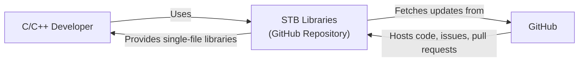
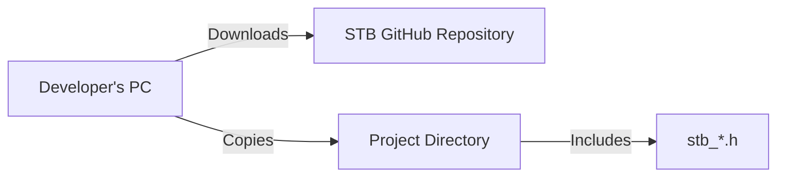
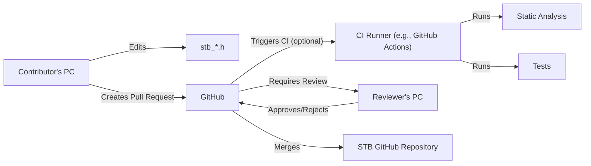

Okay, let's create a design document for the stb single-header libraries repository.

# BUSINESS POSTURE

Business Priorities and Goals:

*   Provide a collection of high-quality, single-file libraries for C/C++ developers.
*   Minimize external dependencies for ease of integration into various projects.
*   Offer well-documented and easy-to-use APIs.
*   Maintain a permissive licensing model (public domain) to encourage widespread adoption.
*   Ensure code correctness and reliability through testing.

Most Important Business Risks:

*   Malicious code injection: Given the public domain nature and contribution model, the biggest risk is the intentional or unintentional introduction of malicious code into one of the libraries. This could compromise any project using the affected library.
*   Undiscovered vulnerabilities: Bugs or vulnerabilities in the libraries could lead to exploits in applications that use them.
*   Lack of maintenance: If the project is abandoned or poorly maintained, existing bugs may not be fixed, and the libraries may become incompatible with newer compilers or systems.
*   Reputational damage: If a widely used library from this repository is found to have a severe vulnerability, it could damage the reputation of the project and its contributors.

# SECURITY POSTURE

Existing Security Controls:

*   security control: Code Review: While not explicitly stated, the GitHub repository model implies some level of informal code review by contributors and users.
*   security control: Testing: The presence of example code and some mentions of testing in individual library headers suggest that some level of testing is performed.
*   security control: Public Domain Dedication: The use of a public domain dedication (like unlicense) removes many legal restrictions, but also implies a "use at your own risk" approach.
*   security control: Static Analysis: Some libraries might be using static analysis tools, but it's not consistent or enforced across the repository.

Accepted Risks:

*   accepted risk: Limited Formal Security Process: The project lacks a formal, documented security process, including vulnerability reporting and response procedures.
*   accepted risk: Dependence on Community Vigilance: The security of the libraries largely relies on the vigilance of the community to identify and report issues.
*   accepted risk: No Warranty: The public domain dedication explicitly disclaims any warranty, meaning there's no legal recourse for users if a library causes harm.

Recommended Security Controls:

*   security control: Formal Code Review Process: Establish a clear, documented code review process for all contributions, requiring at least one independent reviewer.
*   security control: Static Analysis Integration: Integrate static analysis tools (e.g., clang-tidy, Cppcheck) into a continuous integration (CI) pipeline to automatically check for potential issues.
*   security control: Fuzz Testing: Implement fuzz testing for libraries that handle complex input or perform critical operations (e.g., image parsing, data compression).
*   security control: Vulnerability Disclosure Policy: Create a clear policy for reporting security vulnerabilities, including a designated contact point and expected response times.
*   security control: Security Best Practices Documentation: Provide documentation outlining security best practices for contributors, including guidelines for writing secure code and avoiding common vulnerabilities.

Security Requirements:

*   Authentication: Not directly applicable, as the repository itself doesn't handle authentication. However, individual libraries (if they were to implement network functionality, for example) should use strong authentication mechanisms where appropriate.
*   Authorization: Not directly applicable at the repository level. Individual libraries should implement appropriate authorization checks if they manage access to resources.
*   Input Validation: All libraries that accept external input MUST perform thorough input validation to prevent vulnerabilities like buffer overflows, format string bugs, and injection attacks. This is CRITICAL for the security of any application using these libraries.
*   Cryptography: If any library implements cryptographic functionality, it MUST use well-vetted, industry-standard algorithms and libraries. Avoid rolling custom cryptography. Key management should be carefully considered.
*   Error Handling: Libraries should handle errors gracefully and provide informative error messages or codes to the calling application. Avoid exposing sensitive information in error messages.

# DESIGN

## C4 CONTEXT

C4 Context Element Descriptions:

*   Element: User
    *   Name: C/C++ Developer
    *   Type: Person
    *   Description: A software developer who uses the stb single-file libraries in their C/C++ projects.
    *   Responsibilities: Integrates stb libraries into their projects, reports bugs, and potentially contributes to the stb project.
    *   Security controls: N/A (External entity)

*   Element: STB
    *   Name: STB Libraries (GitHub Repository)
    *   Type: Software System
    *   Description: A collection of single-file libraries for C/C++ developers, hosted on GitHub.
    *   Responsibilities: Provides easy-to-use, well-documented, and reliable single-file libraries.
    *   Security controls: Code Review (informal), Testing (limited), Public Domain Dedication.

*   Element: GitHub
    *   Name: GitHub
    *   Type: External System
    *   Description: A web-based platform for hosting and managing Git repositories.
    *   Responsibilities: Hosts the stb repository, manages issues, pull requests, and provides version control.
    *   Security controls: GitHub's internal security controls (not directly controlled by the stb project).

## C4 CONTAINER

Since the project is a collection of independent single-file libraries, the container diagram is essentially the same as the context diagram. Each library can be considered a separate "container," but they don't interact with each other within the repository.

C4 Container Element Descriptions:

*   Element: User
    *   Name: C/C++ Developer
    *   Type: Person
    *   Description: A software developer who uses the stb single-file libraries in their C/C++ projects.
    *   Responsibilities: Integrates stb libraries into their projects, reports bugs, and potentially contributes to the stb project.
    *   Security controls: N/A (External entity)

*   Element: STB
    *   Name: STB Libraries (GitHub Repository)
    *   Type: Software System
    *   Description: A collection of single-file libraries for C/C++ developers, hosted on GitHub.
    *   Responsibilities: Provides easy-to-use, well-documented, and reliable single-file libraries.
    *   Security controls: Code Review (informal), Testing (limited), Public Domain Dedication.

*   Element: GitHub
    *   Name: GitHub
    *   Type: External System
    *   Description: A web-based platform for hosting and managing Git repositories.
    *   Responsibilities: Hosts the stb repository, manages issues, pull requests, and provides version control.
    *   Security controls: GitHub's internal security controls (not directly controlled by the stb project).

## DEPLOYMENT

Deployment Solutions:

1.  Manual Copy: Users manually download the desired header file(s) and include them in their project.
2.  Git Submodule/Subtree: Users add the stb repository as a submodule or subtree within their own Git repository.
3.  Package Manager: Users use a C/C++ package manager (e.g., vcpkg, Conan) to manage the stb libraries as dependencies.  This is the *preferred* method, but requires community maintenance of package manifests.

Chosen Solution (Manual Copy - most common for single-file libraries):

Deployment Element Descriptions:

*   Element: DeveloperPC
    *   Name: Developer's PC
    *   Type: Device
    *   Description: The developer's local machine.
    *   Responsibilities: Downloads the library files, integrates them into the project.
    *   Security controls: Developer's local security practices.

*   Element: STBRepo
    *   Name: STB GitHub Repository
    *   Type: Repository
    *   Description: The remote GitHub repository containing the stb libraries.
    *   Responsibilities: Stores the library files, provides access for download.
    *   Security controls: GitHub's security controls.

*   Element: ProjectDir
    *   Name: Project Directory
    *   Type: Directory
    *   Description: The directory of the project that will use the stb library.
    *   Responsibilities: Contains the project's source code, including the included stb header file.
    *   Security controls: Developer's local security practices, project-specific security measures.

*   Element: HeaderFile
    *   Name: stb\_\*.h
    *   Type: File
    *   Description: A single-file header library from the stb repository (e.g., stb_image.h).
    *   Responsibilities: Provides the functionality of the specific stb library.
    *   Security controls: Input validation (within the library code), any security measures implemented within the specific library.

## BUILD

Build Process:

The stb libraries are designed to be single-header files, so there isn't a traditional "build" process in the sense of compiling and linking.  The "build" is effectively just the developer including the header file in their project. However, we can consider the process of creating and updating the libraries themselves.

Build Element Description:
* Element: ContributorPC
    *   Name: Contributor's PC
    *   Type: Device
    *   Description: The local machine of a contributor to the stb project.
    *   Responsibilities: Edits the library files, creates pull requests.
    *   Security controls: Contributor's local security practices.
* Element: HeaderFile
    *   Name: stb\_\*.h
    *   Type: File
    *   Description: A single-file header library from the stb repository (e.g., stb_image.h).
    *   Responsibilities: Provides the functionality of the specific stb library.
    *   Security controls: Input validation (within the library code), any security measures implemented within the specific library.
* Element: GitHub
    *   Name: GitHub
    *   Type: External System
    *   Description: A web-based platform for hosting and managing Git repositories.
    *   Responsibilities: Hosts the stb repository, manages issues, pull requests, and provides version control.
    *   Security controls: GitHub's internal security controls (not directly controlled by the stb project).
* Element: CIRunner
    *   Name: CI Runner (e.g., GitHub Actions)
    *   Type: Server
    *   Description: A server that runs automated builds and tests.
    *   Responsibilities: Executes static analysis and tests on the code.
    *   Security controls: CI system's security controls, configuration of the CI pipeline.
* Element: StaticAnalysis
    *   Name: Static Analysis
    *   Type: Tool
    *   Description: Tools like clang-tidy or Cppcheck that analyze the code for potential errors and vulnerabilities.
    *   Responsibilities: Identifies potential code quality and security issues.
    *   Security controls: Configuration of the static analysis tool.
* Element: Tests
    *   Name: Tests
    *   Type: Code
    *   Description: Code that tests the functionality of the libraries.
    *   Responsibilities: Verifies that the libraries function as expected.
    *   Security controls: Test coverage, quality of test cases.
* Element: ReviewerPC
    *   Name: Reviewer's PC
    *   Type: Device
    *   Description: The local machine of a code reviewer.
    *   Responsibilities: Reviews pull requests, approves or rejects changes.
    *   Security controls: Reviewer's local security practices.
* Element: STBRepo
    *   Name: STB GitHub Repository
    *   Type: Repository
    *   Description: The remote GitHub repository containing the stb libraries.
    *   Responsibilities: Stores the library files, provides access for download.
    *   Security controls: GitHub's security controls.

Security Controls in Build Process:

*   security control: Code Review (as described above).
*   security control: Static Analysis (if implemented in a CI pipeline).
*   security control: Testing (as described above).

# RISK ASSESSMENT

Critical Business Processes:

*   Providing reliable and easy-to-use libraries: The core function of the project is to provide developers with useful tools.
*   Maintaining a positive reputation: The project's reputation is crucial for attracting users and contributors.

Data to Protect:

*   Source Code (Sensitivity: Medium): The source code of the libraries is publicly available, but its integrity is critical. Malicious modifications could have widespread impact.
*   Contributor Information (Sensitivity: Low): Contributor names and email addresses may be publicly visible through Git history.
*   Issue and Pull Request Data (Sensitivity: Low): Discussions and code changes in issues and pull requests are generally public.

# QUESTIONS & ASSUMPTIONS

Questions:

*   Are there any specific security concerns or incidents that have occurred in the past with the stb libraries?
*   What is the current level of testing for each library? Are there any automated tests?
*   Is there any existing documentation on coding guidelines or best practices for contributors?
*   What is the process for handling bug reports and feature requests?
*   Are there any plans to adopt a more formal security process in the future?

Assumptions:

*   BUSINESS POSTURE: The project prioritizes ease of use and widespread adoption over strict security controls.
*   BUSINESS POSTURE: The project relies heavily on the community for identifying and reporting issues.
*   SECURITY POSTURE: There is no formal vulnerability reporting process.
*   SECURITY POSTURE: There is no dedicated security team or individual responsible for security.
*   DESIGN: The libraries are designed to be independent and do not have complex interactions with each other.
*   DESIGN: Users are responsible for securely integrating the libraries into their own projects.
*   DESIGN: The primary deployment method is manual copying of header files.
*   DESIGN: There is no formal build system or CI/CD pipeline in place, although individual contributors may use their own.